# Components of A Coding Agent

**Source**: `raw/components-of-a-coding-agent/full-article.md` (366 KB), `raw/components-of-a-coding-agent/full-article.md` (markdown view)  
**URL**: https://magazine.sebastianraschka.com/p/components-of-a-coding-agent  
**Ingested**: 2026-06-07  
**Tags**: #summary

## Summary

Sebastian Raschka's April 2026 *Ahead of AI* article is a pedagogical reference on how **coding agents** and **coding harnesses** work in practice. Raschka separates three layers that users often conflate: the raw [[Large Language Models|LLM]], a [[Reasoning Models|reasoning model]] (an LLM trained or prompted to spend more inference-time compute on intermediate traces), and an **agent**—a control loop that repeatedly calls a model with tools, memory, and environment feedback. A **coding harness** is the task-specific scaffold around that loop for software engineering: repo context, structured tools, execution, permissions, prompt packaging, and session continuity.

The article argues that much of the perceived gap between frontier models in chat UIs versus products like [[Claude Code]] or Codex CLI is harness engineering, not raw model capability alone. Raschka illustrates six intertwined components using his open-source [Mini Coding Agent](https://github.com/rasbt/mini-coding-agent): (1) **live repo context** gathered before work begins; (2) **prompt shape and cache reuse** via a stable prefix (instructions, tool schemas, workspace summary) plus volatile session state; (3) **structured tools** with validation, path sandboxing, and optional user approval; (4) **context reduction** through clipping, deduplication of repeated file reads, and transcript compression; (5) **structured session memory** split into a full resumable transcript and a smaller working-memory layer; and (6) **bounded subagent delegation** for parallel side tasks without uncontrolled recursion or file contention.

The piece complements [[Continually Improving Our Agent Harness]] from Cursor: where Cursor emphasizes production evals, per-model customization, and reliability monitoring, Raschka offers a from-scratch mental model and minimal Python reference implementation. He also contrasts coding harnesses with **OpenClaw**, a broader local agent platform where coding is one workload among many. Raschka speculates that dropping a strong open-weight model into a comparable harness could narrow gaps with proprietary stacks—while noting vendor-specific post-training (e.g., GPT-5.3 vs GPT-5.3-Codex) still matters.

## Key Claims

- LLM, reasoning model, agent, agent harness, and coding harness are distinct concepts; conflating them obscures why coding products outperform the same models in plain chat.
- Coding work is only partly next-token generation; repo navigation, search, diff application, test execution, and error inspection require a surrounding system.
- A good coding harness can make both reasoning and non-reasoning models feel substantially stronger by managing context quality—not just model choice.
- **Live repo context** (git branch/status, `AGENTS.md`, layout) should be collected as stable workspace facts before the agent acts on underspecified instructions like "fix the tests."
- **Prompt-cache reuse** separates a stable prefix (instructions, tools, workspace summary) from per-turn volatile state (recent transcript, short-term memory, latest user request).
- **Structured tools** with schema validation, approval gates, and workspace path checks trade model freedom for reliability and safety.
- **Context bloat** in coding agents comes from repeated file reads, verbose tool outputs, and logs; clipping, deduplication, and transcript compression are core harness responsibilities—often more impactful than marginal model upgrades ([[Context Rot]]).
- **Session memory** should distinguish a durable full transcript (resumption) from working memory (task continuity) and a compact transcript view (prompt reconstruction).
- **Subagents** need inherited context but tight boundaries (read-only, depth limits, task scoping); Claude Code and Codex differ in default sandbox inheritance.
- OpenClaw overlaps on instruction files and session compaction but optimizes for long-lived multi-channel agents rather than repo-centric terminal coding.

## Figures

| Figure | Caption | Page |
|--------|---------|------|
| 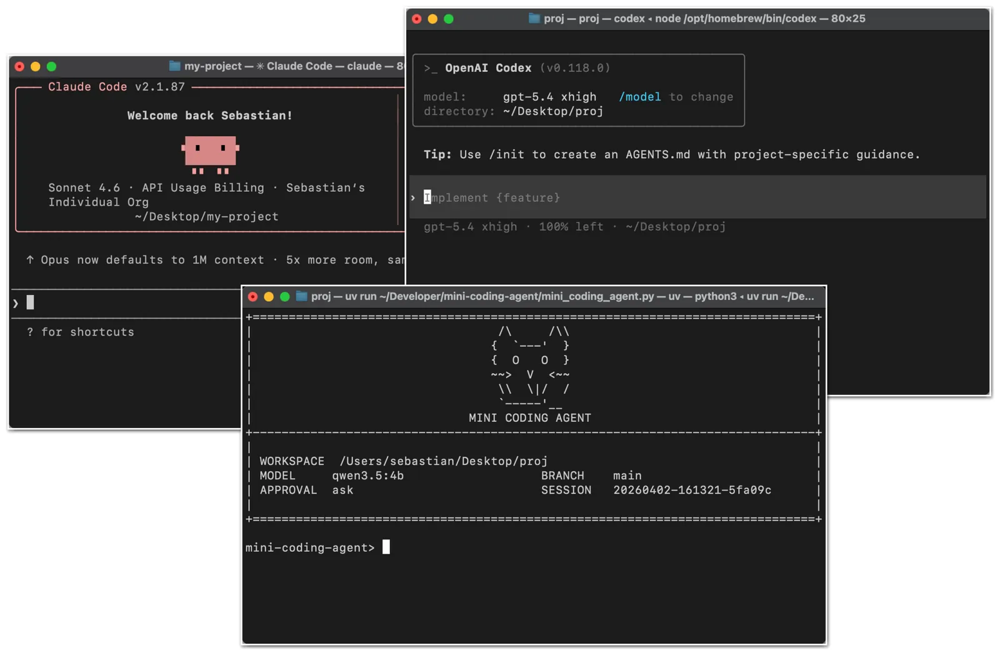 | Claude Code CLI, Codex CLI, and Mini Coding Agent | — |
| 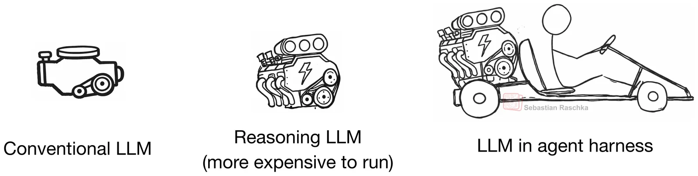 | Relationship between conventional LLM, reasoning LLM, and agent harness | — |
| 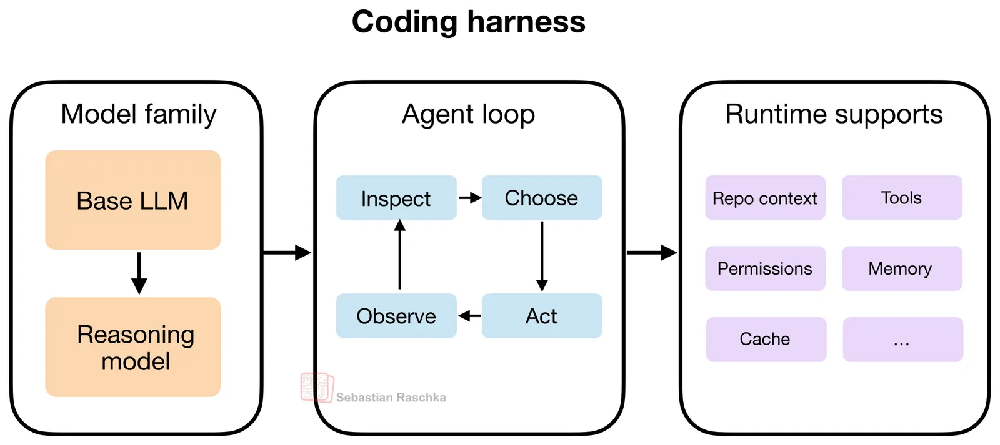 | Coding harness layers: model family, agent loop (observe/inspect/choose/act), runtime supports | — |
| 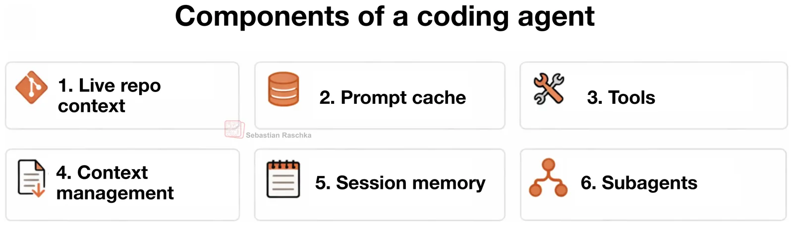 | Six main harness features discussed in the article | — |
| 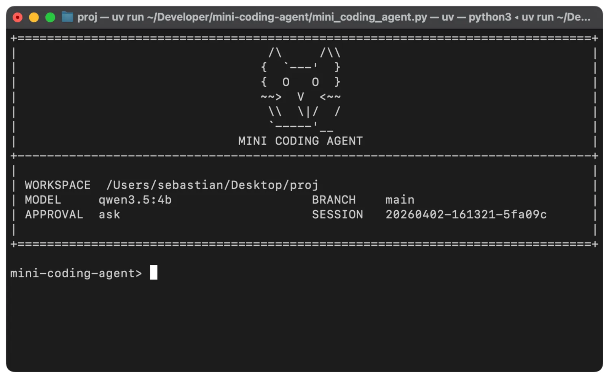 | Minimal from-scratch Mini Coding Agent (pure Python) | — |
| 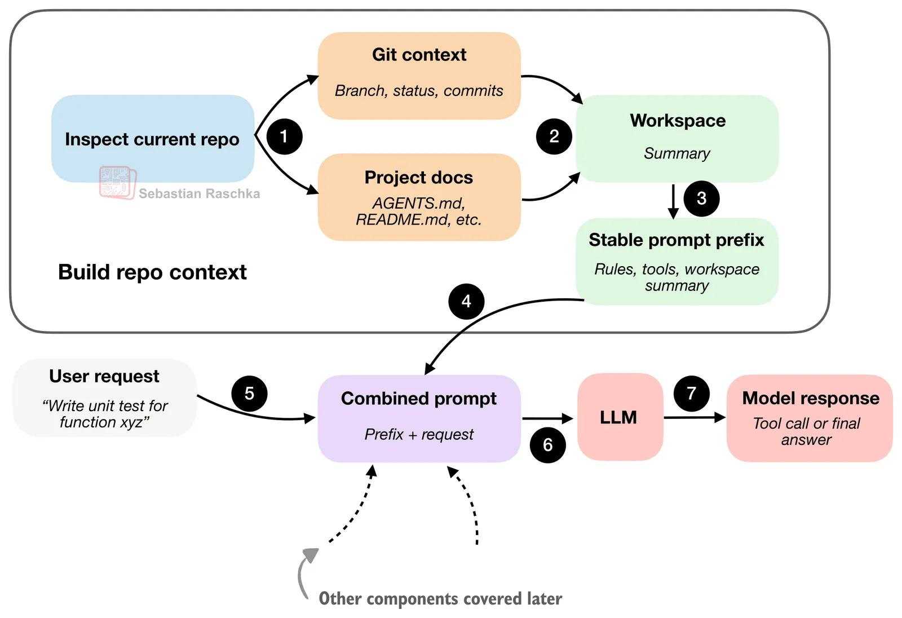 | Workspace summary combined with user request for repo context | — |
| 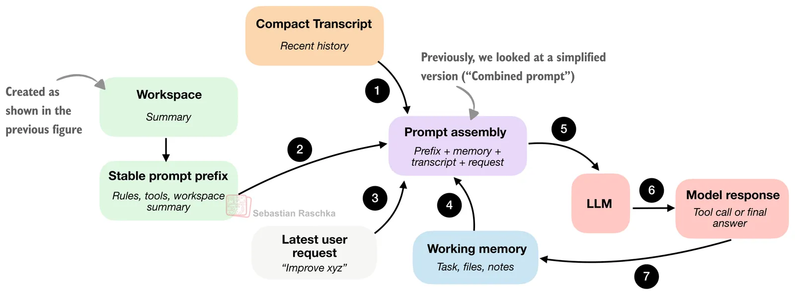 | Stable prompt prefix plus changing session state fed to the model | — |
| 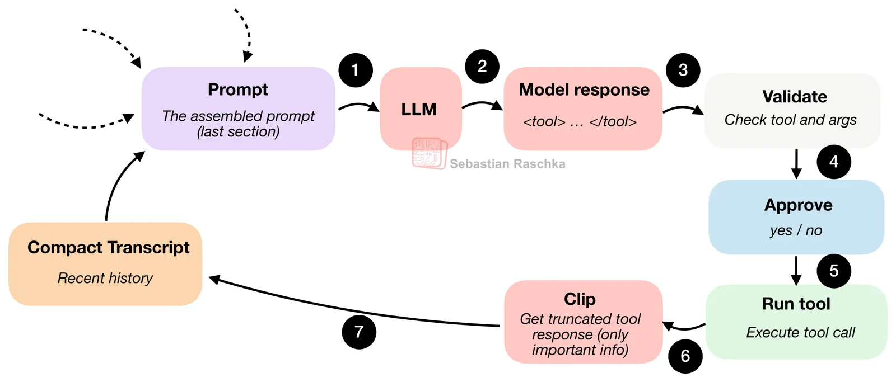 | Structured tool loop: emit → validate → approve → execute → bounded feedback | — |
| 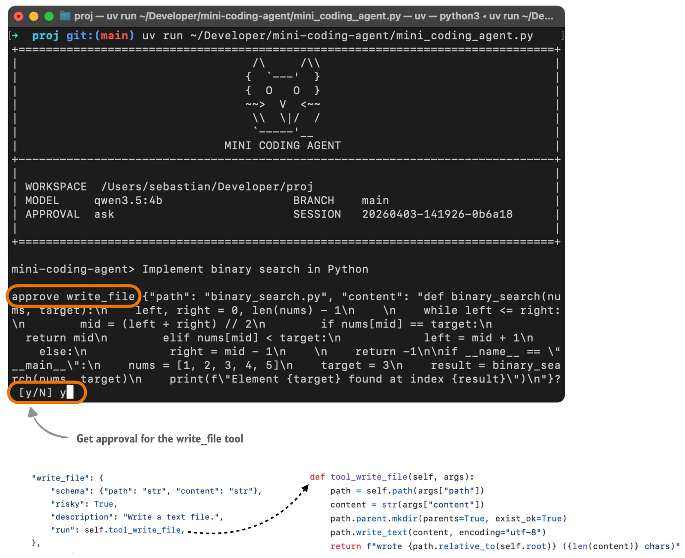 | Tool-call approval prompt in Mini Coding Agent | — |
| 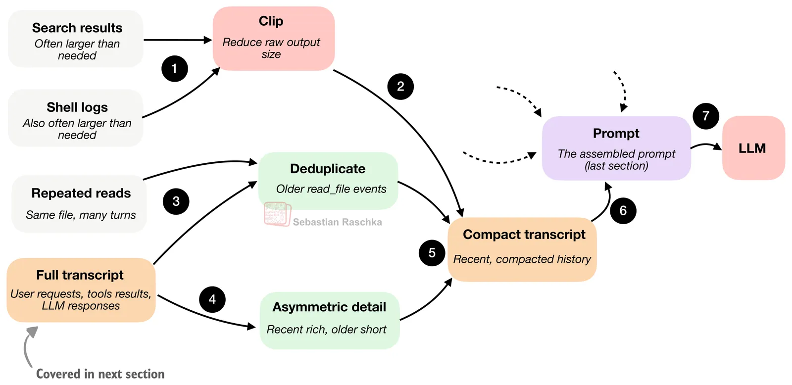 | Context compaction: clip outputs, deduplicate reads, compress transcript | — |
| 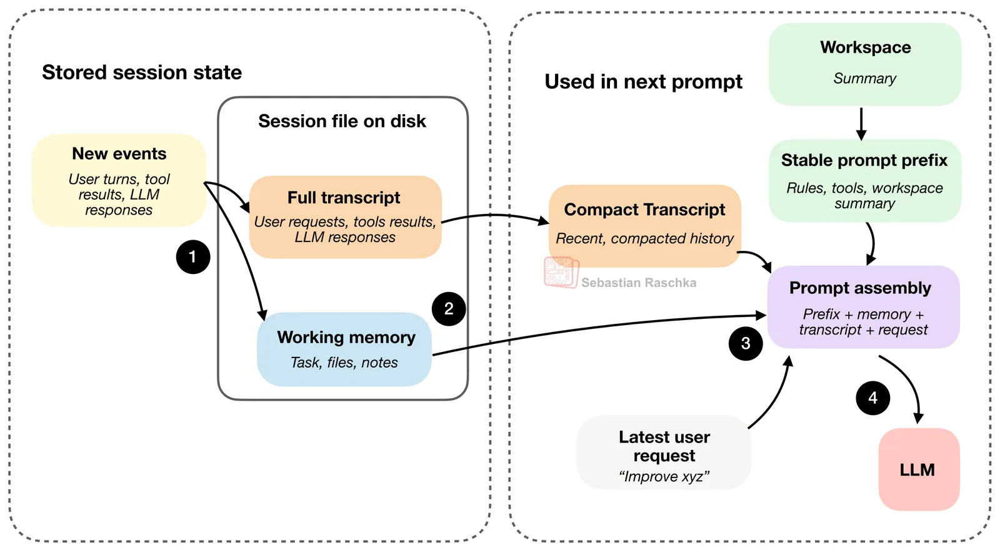 | Full transcript vs working memory stored as JSON session files | — |
| 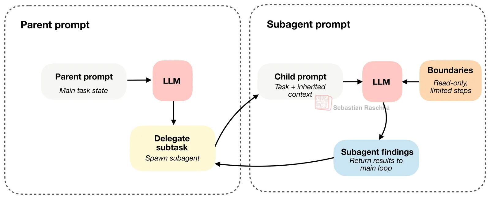 | Bounded subagent with inherited but constrained context | — |
|  | Summary of six coding-harness components | — |

The engine-vs-harness distinction is central to the article's framing:

## Entities

- [[Sebastian Raschka]] — author; ML educator and creator of the Mini Coding Agent reference implementation.
- [[Agent Harness]] — broader scaffold concept; Raschka's "coding harness" is the software-engineering specialization.
- [[Coding Harness]] — task-specific agent harness for repo-centric coding workflows.
- [[Claude Code]] — exemplar terminal coding agent product cited alongside Codex CLI.
- [[Mini Coding Agent]] — Raschka's minimal pure-Python coding agent illustrating all six components.
- [[OpenClaw]] — general local agent platform compared as a non-coding-specialized alternative.
- [[Reasoning Models]] — LLMs with additional inference-time reasoning behavior; distinct from the harness layer.

## Questions & Gaps

- No quantitative benchmarks; claims about harness vs model contribution are illustrative and partly speculative (e.g., GLM-5 in Codex-class harness).
- Subagent section notes synchronous child execution in Mini Coding Agent; production systems (Claude Code, Codex) differ on parallelism and sandbox inheritance details.
- Prompt-cache mechanics are described conceptually; no provider-specific KV-cache or prefix-hash implementation detail.
- Book promotion for *Build a Reasoning Model (From Scratch)* is adjacent content, not part of the harness taxonomy.

## Related

- [[Continually Improving Our Agent Harness]] — production harness engineering from Cursor (evals, per-model prompts, tool reliability).
- [[Agent Harness]] — corpus concept page for the harness layer.
- [[Coding Harness]] — coding-specific harness specialization introduced here.
- [[Dynamic Context]] — related idea of on-demand context retrieval vs static prefix (Cursor's evolution path).
- [[Context Rot]] — motivates clipping and transcript compression in section 4.
- [[Tool Call Reliability]] — production analogue to Mini Coding Agent's validation and approval gates.
- [[Code Models]] — coding models and agent products topic page.
- [[Agentic AI]] — agents, tool use, and orchestration topic page.
- [[Claude Models]] — Claude Code lineage and computer-use capabilities.
