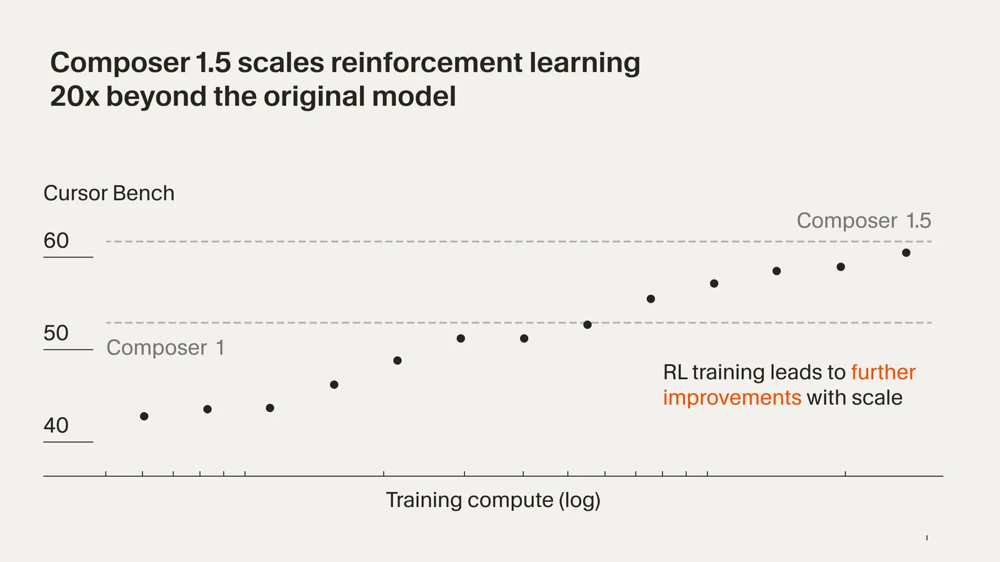
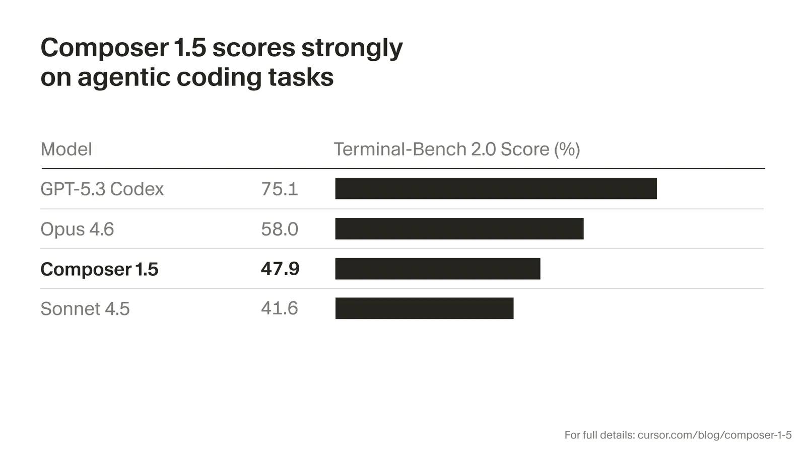

# Introducing Composer 1.5

**Source**: `raw/composer-1-5/full-article.md` (163 KB), `raw/composer-1-5/full-article.md` (markdown view)  
**URL**: https://cursor.com/blog/composer-1-5  
**Ingested**: 2026-05-19  
**Tags**: #summary

## Summary

Cursor's February 2026 research post announces **Composer 1.5**, the second generation of its in-house agentic coding model after [[Composer: Building a fast frontier model with RL|Composer 1]]. The release targets a practical balance between speed and intelligence for daily interactive use. Training scales **reinforcement learning 20× further on the same pretrained base** as Composer 1; Cursor reports that post-training compute for Composer 1.5 **exceeds the compute used to pretrain the base model**. On an internal benchmark of real-world coding problems, the model quickly surpasses Composer 1, with the largest gains on hard tasks—positioning continued RL scaling as a predictable path to coding intelligence.

Composer 1.5 is a **thinking model**: it emits thinking tokens to reason about the user's codebase and plan next steps, and Cursor treats those stages as critical to capability. To preserve interactivity, training calibrates effort—**minimal thinking on easy problems, extended thinking on hard ones** until a satisfactory answer is found. For long-horizon work, Composer 1.5 introduces **[[Self-Summarization]]** trained inside RL: when context fills during training rollouts, the model must produce a useful summary and may chain several summary rounds on difficult examples, preserving accuracy as effective context length varies. [[Papers Explained - Composer 2]] later adopts and extends this mechanism for multi-generation training chains.

Public evaluation in the post focuses on **[[Papers Explained 547 - Terminal-Bench|Terminal-Bench 2.0]]**: Cursor scores Composer 1.5 using the official Harbor harness (2 iterations per model–agent pair, averaged). The footnote notes heterogeneous harnesses for competitor models and max-of-leaderboard vs. in-house reruns for non-Composer entries. Cursor recommends Composer 1.5 over Composer 1 for interactive use and links pricing to a separate usage post.

## Key Claims

- Composer 1.5 improves substantially over Composer 1 on coding ability, especially on challenging tasks.
- Built by scaling RL **20×** on the **same pretrained model** as Composer 1 (not a new base checkpoint in this post).
- Post-training compute for Composer 1.5 **surpasses base-model pretraining compute**.
- Internal real-world coding benchmark: performance climbs quickly past Composer 1 as RL scales; largest gains on hard problems.
- **Thinking model** with thinking tokens for codebase reasoning and planning; thinking stages are critical to intelligence.
- **Adaptive thinking depth**: fast, minimal thinking on easy queries; thinks longer on hard problems until satisfied.
- **Self-summarization** enables continued exploration when context is exhausted; trained via RL by requiring useful summaries at context limits; may recurse on hard training examples.
- Self-summarization maintains accuracy as context length varies.
- RL for coding can be continually scaled with predictable intelligence improvements.
- **Terminal-Bench 2.0** results reported with Harbor (official harness); 2 runs averaged; competitor scores use best of leaderboard vs. Cursor infrastructure reruns.

## Figures

| Figure | Caption | Page |
|--------|---------|------|
|  | Internal coding-ability scaling vs. RL compute (Composer 1 → 1.5) | — |
|  | Composer 1.5 benchmark results on Terminal-Bench 2.0 | — |

Light and dark variants (`fig-N-dark.png`) are in `wiki/assets/composer-1-5/`.

## Entities

- [[Cursor]] — authors; Composer 1.5 recommended for interactive agent use in the product.
- [[Papers Explained 547 - Terminal-Bench]] — public terminal-agent benchmark cited for Composer 1.5 evaluation (Harbor harness).

## Questions & Gaps

- The post cites an internal benchmark but does not name it as [[CursorBench]]; numeric internal scores live in figure assets only.
- No disclosure of base model identity, parameter count, or RL environment details.
- Terminal-Bench numeric scores are figure-only; footnote methodology differs across competitor models.
- Pricing details are deferred to `/blog/increased-agent-usage`, not reproduced here.

## Related

- [[Composer: Building a fast frontier model with RL]] — Composer 1 origin: harness-aligned RL, Cursor Bench introduction, MoE agent model.
- [[Papers Explained - Composer 2]] — next generation; documents CursorBench-3 scores (Composer 1.5 at 44.2%) and reuses self-summarization for long rollouts.
- [[Introducing Composer 2]] — official Mar 2026 launch post with the same benchmark scorecard and product pricing.
- [[Introducing Composer 2.5]] — later Composer generation with scaled RL environments and new training methods.
- [[Self-Summarization]] — RL-trained context compression for long agent trajectories, introduced here.
- [[Agent Harness]] — deployment and training environment for Composer models.
- [[CursorBench]] — internal eval suite; Composer 2 post gives explicit 1 / 1.5 / 2 scores.
- [[Reinforcement Learning Topic]] — RL post-training scaling for coding agents.
- [[Code Models]] — coding-agent models and training topic.
- [[Evaluation and Benchmarks]] — Terminal-Bench and harness-controlled agent evaluation.
