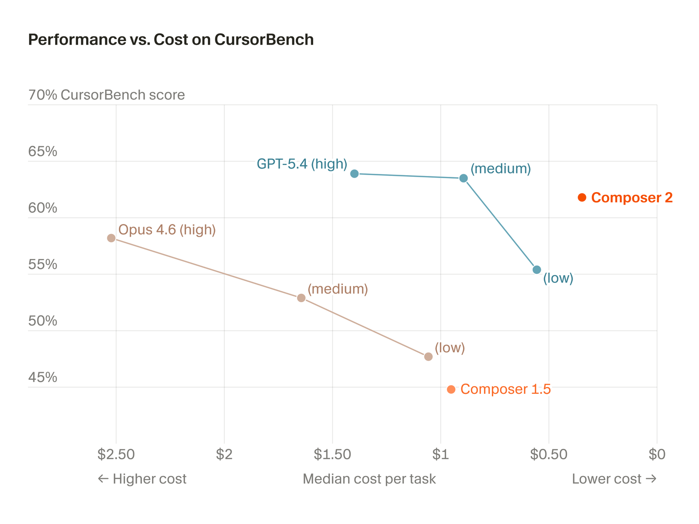
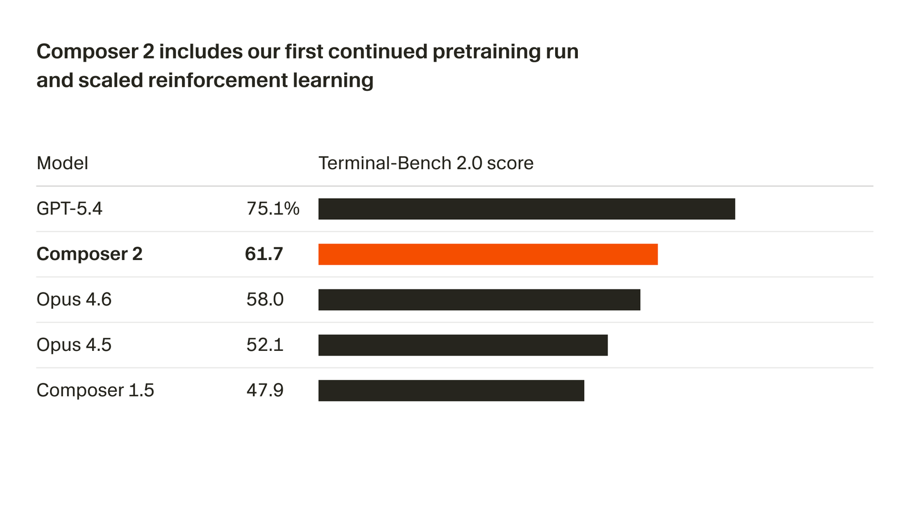
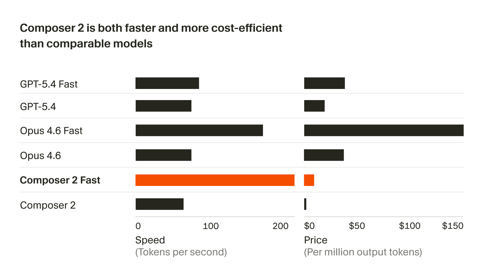

# Introducing Composer 2

**Source**: `raw/composer-2/full-article.html` (177 KB), `raw/composer-2/full-article.md` (markdown view)  
**URL**: https://cursor.com/blog/composer-2  
**Ingested**: 2026-06-06  
**Tags**: #summary

## Summary

Cursor's March 2026 product post announces **Composer 2**, a frontier-level coding agent model positioned as an optimal intelligence–cost combination at **$0.50/M input and $2.50/M output tokens**. The post is the official launch announcement and benchmark scorecard for the Composer lineage; deeper training detail lives in [[Papers Explained - Composer 2]] (Medium technical write-up) and a separate technical report linked from the blog.

Composer 2 delivers large gains over [[Introducing Composer 1.5|Composer 1.5]] and [[Composer: Building a fast frontier model with RL|Composer 1]] on Cursor's internal [[CursorBench]] eval and public agent benchmarks **Terminal-Bench 2.0** and **SWE-bench Multilingual**. Reported scores: Composer 2 at **61.3 / 61.7 / 73.7** vs. Composer 1.5 at **44.2 / 47.9 / 65.9** and Composer 1 at **38.0 / 40.0 / 56.9**. Cursor attributes the jump primarily to its **first continued pretraining run**, which strengthens the base before scaling RL on long-horizon coding tasks requiring **hundreds of agent actions**.

Product-wise, Composer 2 ships with a **fast tier at the same intelligence** ($1.50/M in, $7.50/M out) that Cursor claims beats other fast models on cost; fast is the default. Terminal-Bench scores use the official **Harbor** harness (5 iterations averaged). A companion speed-vs-cost figure compares TPS and pricing across models (March 18, 2026 traffic snapshot, Anthropic token normalization per footnote). [[Introducing Composer 2.5]] later builds on the same Kimi K2.5 base with scaled RL environments and new training methods.

## Key Claims

- Composer 2 is frontier-level at coding and available in Cursor at $0.50/M input, $2.50/M output.
- **CursorBench**: Composer 2 **61.3%** vs. Composer 1.5 **44.2%** vs. Composer 1 **38.0%**.
- **Terminal-Bench 2.0**: Composer 2 **61.7%** vs. 1.5 **47.9%** vs. 1 **40.0%** (Harbor harness, 5 runs averaged).
- **SWE-bench Multilingual**: Composer 2 **73.7%** vs. 1.5 **65.9%** vs. 1 **56.9%**.
- Quality gains come from **continued pretraining** providing a stronger base for RL scaling.
- RL targets **long-horizon coding tasks**; model solves problems requiring hundreds of actions.
- **Fast variant** matches standard intelligence at $1.50/M in, $7.50/M out; lower cost than other fast models per Cursor's March 2026 snapshot; fast is default.
- A technical report on Composer 2 training is linked separately from this announcement post.
- Individual-plan Composer usage sits in a standalone usage pool with generous included usage.

## Figures

| Figure | Caption | Page |
|--------|---------|------|
|  | Composer 2 efficiency and quality on CursorBench (scatter / Pareto) | — |
|  | Composer 2 Terminal-Bench 2.0 results | — |
|  | Fast variant speed and cost vs. other models | — |

Light and dark variants (`fig-N-dark.png`) are in `wiki/assets/composer-2/`.

## Entities

- [[Cursor]] — authors; Composer 2 product launch and pricing.
- [[CursorBench]] — internal benchmark with explicit Composer 1 / 1.5 / 2 score table in this post.
- [[Papers Explained 547 - Terminal-Bench]] — public terminal-agent benchmark cited for evaluation methodology.

## Questions & Gaps

- This announcement post does not name the base model (Kimi K2.5); that detail appears in [[Papers Explained - Composer 2]] and [[Introducing Composer 2.5]].
- Continued pretraining data mix, RL environment design, and compute budget are deferred to the technical report / Medium article.
- CursorBench version naming differs across posts (table here vs. "CursorBench-3" in [[Papers Explained - Composer 2]]); likely the same eval suite at different revisions.
- Speed/cost comparisons are snapshot-specific (March 18, 2026) and may drift with provider capacity.

## Related

- [[Composer: Building a fast frontier model with RL]] — Composer 1 origin: harness-aligned RL, MoE agent model, Cursor Bench introduction.
- [[Introducing Composer 1.5]] — prior generation: 20× RL on same base, adaptive thinking, self-summarization.
- [[Introducing Composer 2.5]] — next generation on same Kimi K2.5 base with targeted textual feedback and scaled synthetic RL.
- [[Papers Explained - Composer 2]] — deeper training write-up: base-model selection, continued pretraining phases, RL recipe, CursorBench methodology.
- [[Continually Improving Our Agent Harness]] — harness engineering Composer models train inside.
- [[Agent Harness]] — deployment and RL training environment.
- [[Reinforcement Learning Topic]] — RL post-training for coding agents.
- [[Code Models]] — coding-agent models topic.
- [[Evaluation and Benchmarks]] — CursorBench, Terminal-Bench, SWE-bench evaluation context.
