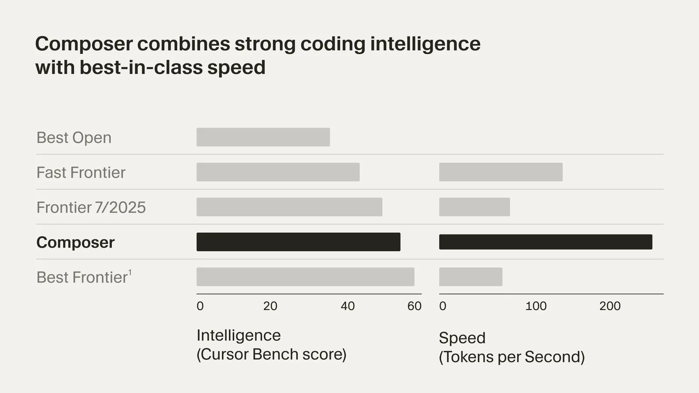
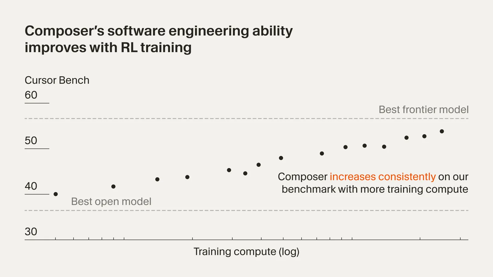
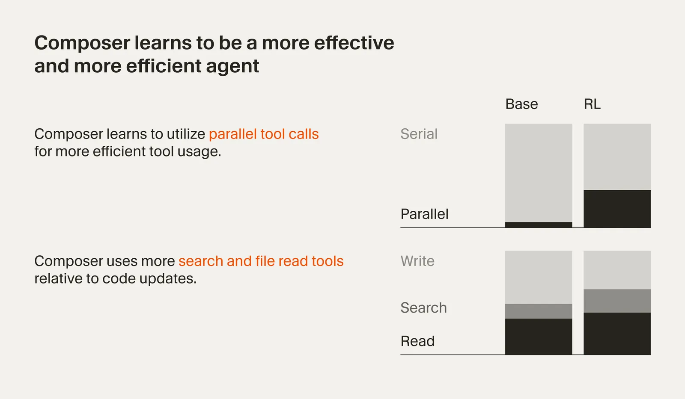

# Composer: Building a fast frontier model with RL

**Source**: `raw/composer/full-article.md` (175 KB), `raw/composer/full-article.md` (markdown view)  
**URL**: https://cursor.com/blog/composer  
**Ingested**: 2026-05-19  
**Tags**: #summary

## Summary

Cursor's October 2025 research post introduces **Composer** (Composer 1), the first in-house agent model built for interactive software engineering in the Cursor product. The model targets frontier-level coding quality at roughly **4× higher generation speed** than comparable models on Cursor's internal harness benchmark. Training gives the model production tools (file read/edit, terminal, semantic search, grep) and RL rewards that emphasize efficient parallel tool use, concise evidence-backed answers, and adherence to existing codebase conventions.

Composer is a **mixture-of-experts (MoE)** model with long-context support, specialized via RL across diverse dev environments. The post introduces **Cursor Bench** (later elaborated as [[CursorBench]]): real agent requests from Cursor engineers plus hand-curated reference solutions, scoring correctness, codebase fit, and engineering practice—not just patch correctness. RL surfaces emergent behaviors (complex search, linter fixes, unit-test writing) without explicit supervision for each.

Systems work is central: **asynchronous RL at scale** on PyTorch + Ray, **MXFP8 MoE kernels** with expert parallelism and hybrid sharded data parallelism (thousands of GPUs, low comms cost, native low-precision inference without post-hoc quantization), and **hundreds of thousands of concurrent sandboxed coding VMs** by extending Background Agents infrastructure so RL training environments match production [[Agent Harness]] tooling. Composer evolved from a faster prototype codenamed **Cheetah**, informed by lessons from **Cursor Tab** (completion model) about keeping developers in flow.

Footnote benchmark classes (Oct 2025): Composer sits below "Best Frontier" (GPT-5, Sonnet 4.5) but competes in the fast-frontier tier (Haiku 4.5, Gemini Flash 2.5 class) and open-weight coders (Qwen Coder, GLM 4.6). Later posts ([[Papers Explained - Composer 2]], [[Introducing Composer 2.5]]) document the Composer lineage on Kimi K2.5 and scaled RL; this page is the origin story for harness-aligned agent training at Cursor.

## Key Claims

- Composer is an agent model for software-engineering intelligence and speed: frontier coding scores at ~4× token throughput vs. similar models (internal harness benchmark, standardized tokenizer).
- Trained on real-world SE tasks in large codebases with production search/edit tools; optimized for high-speed interactive agent use in Cursor.
- **MoE** architecture with long-context generation; RL over diverse dev environments with tool access (files, terminal, semantic search).
- **Cursor Bench** introduced: real internal agent requests + curated optimal solutions; evaluates correctness, abstractions, and SE practices—not narrow public-benchmark proxies.
- RL rewards incentivize efficient tool use, parallelism, concise helpful responses, and evidence-backed claims; emergent skills include search, linter fixes, and unit tests.
- Training stack: custom **PyTorch + Ray** async RL; **MXFP8** MoE kernels + expert parallelism + hybrid sharded data parallelism at thousands of GPUs; MXFP8 enables faster inference without post-training quantization.
- RL tool-calling training uses **hundreds of thousands** of concurrent cloud sandboxes; VM scheduler adapted from **Background Agents** to unify RL and production environments.
- Prototype lineage: **Cheetah** (fast agent prototype) → Composer; motivation from **Cursor Tab** and interactive "smart enough + fast enough" product goals.
- Benchmark footnote (¹): grouped model classes; GPT-5 and Sonnet 4.5 outperform Composer on the reported internal eval.

## Figures

| Figure | Caption | Page |
|--------|---------|------|
|  | Composer benchmark — coding quality vs. generation speed (internal harness) | — |
|  | Cursor Bench evaluation framing | — |
|  | RL specialization — tool-use efficiency and emergent agent behaviors | — |

Light and dark variants (`fig-N-dark.png`) are in `wiki/assets/composer/`.

## Entities

- [[Cursor]] — authors; Composer trained and deployed in the Cursor agent product.
- [[CursorBench]] — internal eval suite first named here as "Cursor Bench."
- [[Agent Harness]] — production tool surface (edit, semantic search, grep, terminal) used for RL and inference.

## Questions & Gaps

- No numeric Cursor Bench scores in text; details live in figure assets and later Composer 2 posts.
- Model size, expert count, base pretraining data, and RL compute budget are not disclosed.
- This post names the model "Composer" (later called Composer 1); see [[Introducing Composer 1.5]] for the next generation on the same base with 20× RL scale.
- MXFP8 kernel design is referenced via an external kernels blog post, not reproduced here.

## Related

- [[Introducing Composer 1.5]] — 20× RL on same base; thinking model with adaptive depth and RL-trained self-summarization.
- [[Introducing Composer 2]] — official launch post with Composer 1 / 1.5 / 2 benchmark table and fast-tier pricing.
- [[Introducing Composer 2.5]] — latest Composer generation; same harness-centric RL philosophy at greater scale.
- [[Papers Explained - Composer 2]] — Composer 2 on Kimi K2.5; CursorBench-3 scores and continued pretraining detail.
- [[Continually Improving Our Agent Harness]] — harness engineering that Composer models are trained inside.
- [[Reinforcement Learning Topic]] — RL post-training for coding agents.
- [[Code Models]] — coding models and agent training topic.
- [[Mixture of Experts]] — MoE architecture class used by Composer.
- [[Synthetic Data]] — later Composer runs scale synthetic RL environments (not in this post).
