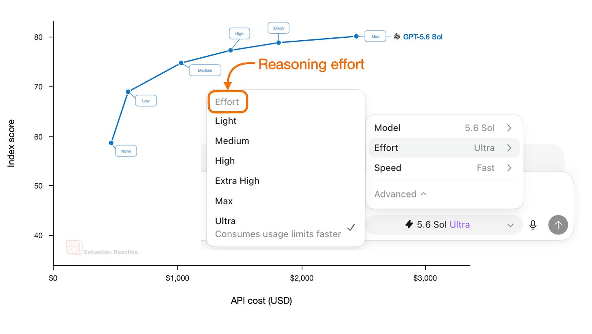
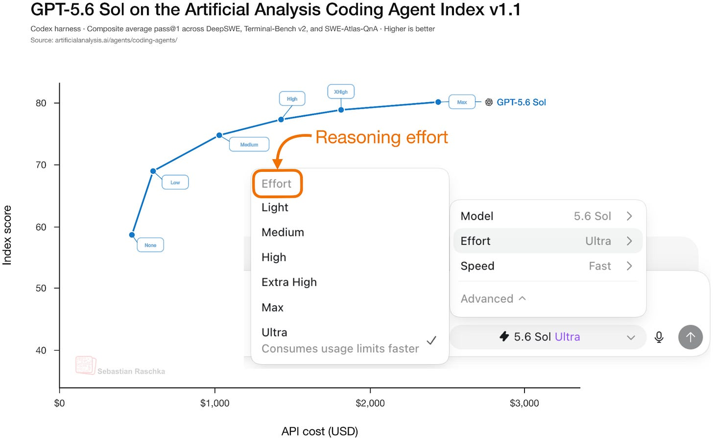
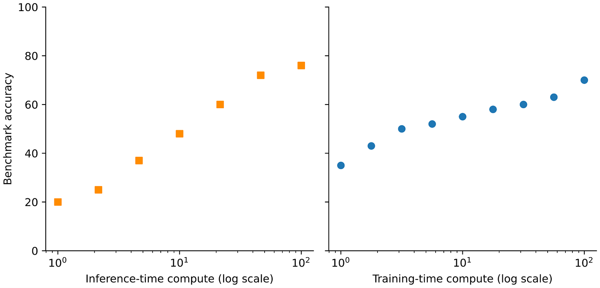
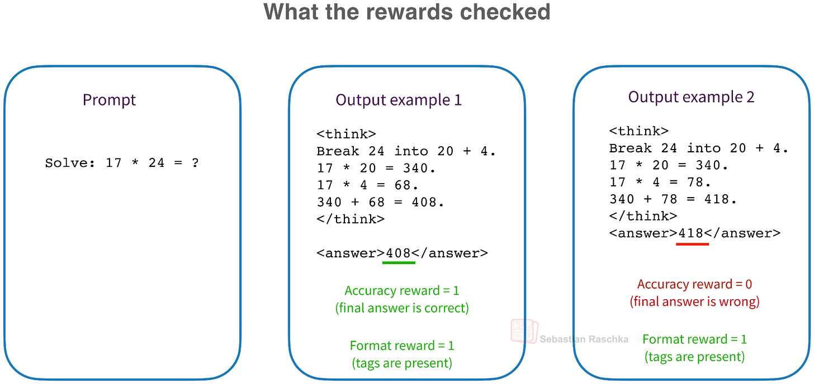
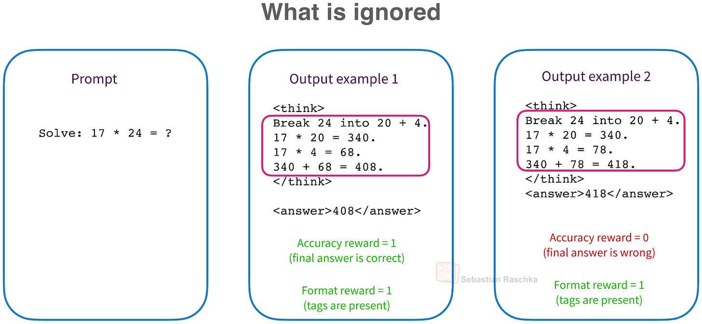
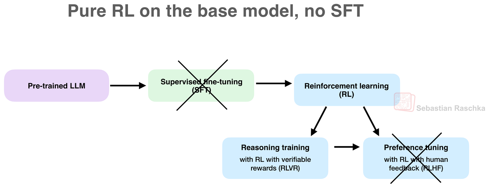
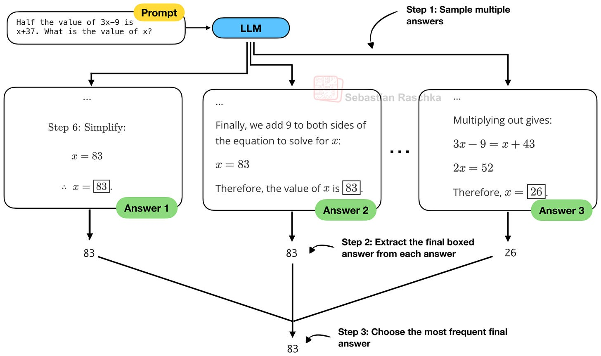
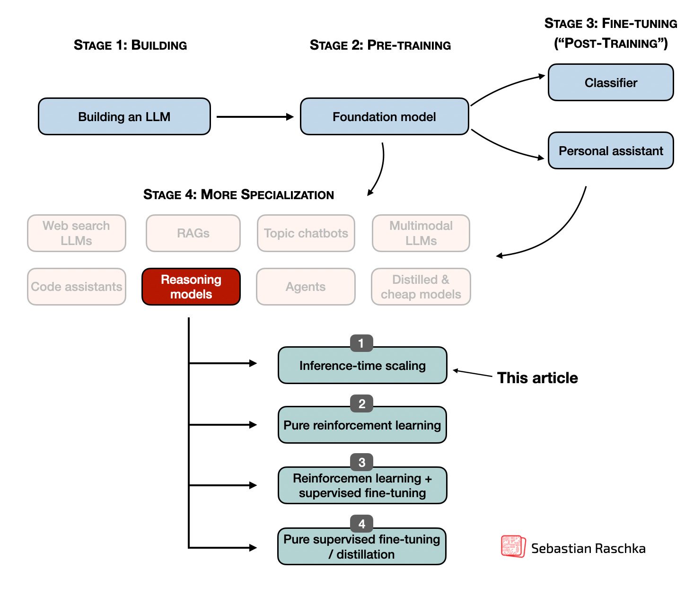
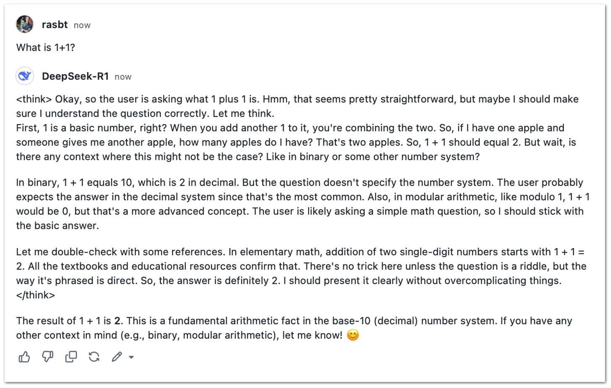

# Controlling Reasoning Effort in LLMs

**Source**: `raw/controlling-reasoning-effort-in-llms/full-article.html`, `raw/controlling-reasoning-effort-in-llms/full-article.md`  
**Ingested**: 2026-07-21  
**Tags**: #summary

## Summary

Sebastian Raschka's July 2026 *Ahead of AI* article explains how modern [[Reasoning Models]] learn multiple **reasoning-effort modes**—low, medium, high, and beyond—inside a single checkpoint. The post sits downstream of [[Reinforcement Learning with Verifiable Rewards]] (RLVR) training: once a model can emit intermediate reasoning traces, the next product question is how to let users trade accuracy for latency and cost.

Raschka separates **training scaling** (bigger models, more RL) from **inference scaling** (more tokens at test time). RLVR already induces a mild form of inference scaling because reasoning models generate longer chains. [[Reasoning Effort]] settings are an explicit knob on top: the ChatGPT/Codex UI maps menu choices to system prompts such as `Reasoning effort: low/medium/high`, as documented for [[Papers Explained 428 - gpt-oss]] and assumed for [[GPT-5.6]].

The article walks through [[Think Tokens]] (`<think></think>` delimiters), binary thinking on/off switches ([[Thinking Mode Fusion]] in Qwen3), and continuous effort values (Inkling by [[Thinking Machines Lab]]). Training recipes fall into two families: **effort-conditioned SFT** (pair effort labels with target trace lengths) and **effort-conditioned RLVR** (vary context windows and per-token length penalties by effort). Section 6 compares six open-weight flagships: DeepSeek V4 (separate effort specialists distilled into one model), [[Papers Explained 580: Nemotron 3 Ultra]] (medium-effort SFT + hard [[Reasoning Budget]]), Kimi K2.5 Toggle (alternating budgeted and unconstrained RL), GLM-5 (turn-level thinking in multi-turn agents), Qwen3 (mode fusion + emergent budget truncation), and Inkling (continuous effort in RL).

The closing prediction: effort will remain an explicit input for now, but agent harnesses and internal routers may increasingly infer the right mode and budget automatically—linking directly to [[Harness Engineering for Self-Improvement]].

## Key Claims

- "Reasoning model" in LLM research means a model that outputs an intermediate reasoning trace, not literal human reasoning.
- RLVR rewards only final-answer correctness and format; the intermediate trace is not directly in the training signal (DeepSeek-R1 finding).
- "Aha moments" (self-correction in the trace) emerge from output-only RLVR without process rewards.
- `<think>` tags are cosmetic delimiters trained via format reward `R_total = R_accuracy + R_format`; they do not create reasoning ability.
- Qwen3's `enable_thinking=False` prefills an empty thinking block as a **hard** switch; `/think` and `/no_think` are softer SFT flags.
- Reasoning effort correlates with generated token count and benchmark accuracy, with diminishing returns at the highest settings.
- Model size (Luna/Terra/Sol) and reasoning effort are **orthogonal scaling axes**; a smaller model at high effort can match a larger model at low effort on some benchmarks.
- DeepSeek V4 trains Non-think, Think High, and Think Max as separate specialists (different context windows and length penalties) then distills into one checkpoint.
- Nemotron 3 Ultra combines learned medium-effort behavior with an external inference-time token budget that can forcibly close the thinking block.
- Kimi K2.5's Toggle alternates budgeted and unconstrained RL phases so the model stays token-efficient without losing test-time scaling ability.
- Automatic effort selection (GPT-5 Auto mode) was removed from the UI; explicit user or harness control remains the norm.

## Figures

| Figure | Caption | Section |
|--------|---------|---------|
|  | GPT-5.6 Sol with multiple reasoning-effort settings | §5 |
|  | Conventional LLM answer vs. reasoning-model trace | §1 |
|  | Training scaling vs. inference scaling | §2 |
|  | Accuracy and format rewards during RLVR | §2.1 |
|  | "Aha moment" self-correction in a reasoning trace | §2.2 |
|  | Self-consistency / majority voting at inference | §2.3 |
|  | Common formatting tokens in reasoning models | §3 |
|  | Qwen3 with `thinking=False` vs `thinking=True` | §4 |
|  | gpt-oss chat template inserts reasoning effort into system message | §5.1 |
|  | Response length and quality vs. reasoning effort (gpt-oss) | §5.1 |
|  | Effort-conditioned RLVR and SFT (illustrative) | §5.2 |
|  | Inkling continuous effort vs. tokens and benchmarks | §5.3 |
|  | Model selection vs. reasoning effort as two scaling axes | §5.4 |
|  | DeepSeek V4 reasoning-effort control overview | §6.1 |
|  | Nemotron 3 Ultra medium-effort and budget-aware training | §6.2 |
|  | Kimi K2.5 Toggle: budgeted vs. unconstrained RL phases | §6.3 |
|  | Comparison of six open-weight effort-training recipes | §6.7 |

## Entities

- [[Sebastian Raschka]] — author; Ahead of AI survey of reasoning-effort training and inference controls.
- [[OpenAI]] — GPT-5.6 effort UI; gpt-oss system-prompt effort labels.
- [[DeepSeek]] — DeepSeek-R1 RLVR lineage; DeepSeek V4 three-mode specialists.
- [[Qwen]] — Qwen3 Thinking Mode Fusion and hard thinking switch.
- [[NVIDIA]] — Nemotron 3 Ultra medium-effort and hard reasoning budgets.
- [[Moonshot AI]] — Kimi K2.5 Toggle token-efficient RL.
- [[Z.ai]] — GLM-5 turn-level and interleaved thinking.
- [[Thinking Machines Lab]] — Inkling continuous effort conditioning in RL.

## Questions & Gaps

- OpenAI does not publish exact GPT-5.6 effort-training details; gpt-oss is the main public evidence.
- DeepSeek V4 does not fully map domain specialists to effort modes in the public report.
- Kimi K3 effort levels are documented at inference time but training details are pending.
- Which effort recipe is best depends on base checkpoint, data, and serving goal; controlled comparisons are unavailable.

## Related

- [[Reasoning Models]] — topic hub for training-time and test-time reasoning.
- [[Reinforcement Learning with Verifiable Rewards]] — core training paradigm behind reasoning traces.
- [[Reasoning Effort]] — concept page on effort labels, SFT, and token-penalty RLVR.
- [[Think Tokens]] — delimiter tokens and format rewards.
- [[Thinking Mode Fusion]] — Qwen3 binary thinking switch.
- [[Reasoning Budget]] — hard truncation and budget-aware SFT.
- [[DeepSeek-V4: A Million-Token Context That Agents Can Actually Use]] — DeepSeek V4 agentic context and effort modes.
- [[Papers Explained 428 - gpt-oss]] — open-weight effort system-prompt control.
- [[GPT-5.6]] — Luna/Terra/Sol family with effort tiers.
- [[Papers Explained 580: Nemotron 3 Ultra]] — Nemotron effort and budget recipe.
- [[Harness Engineering for Self-Improvement]] — future automatic effort routing via harnesses.
- [[On-Policy Distillation]] — DeepSeek V4 distills effort specialists into one checkpoint.
