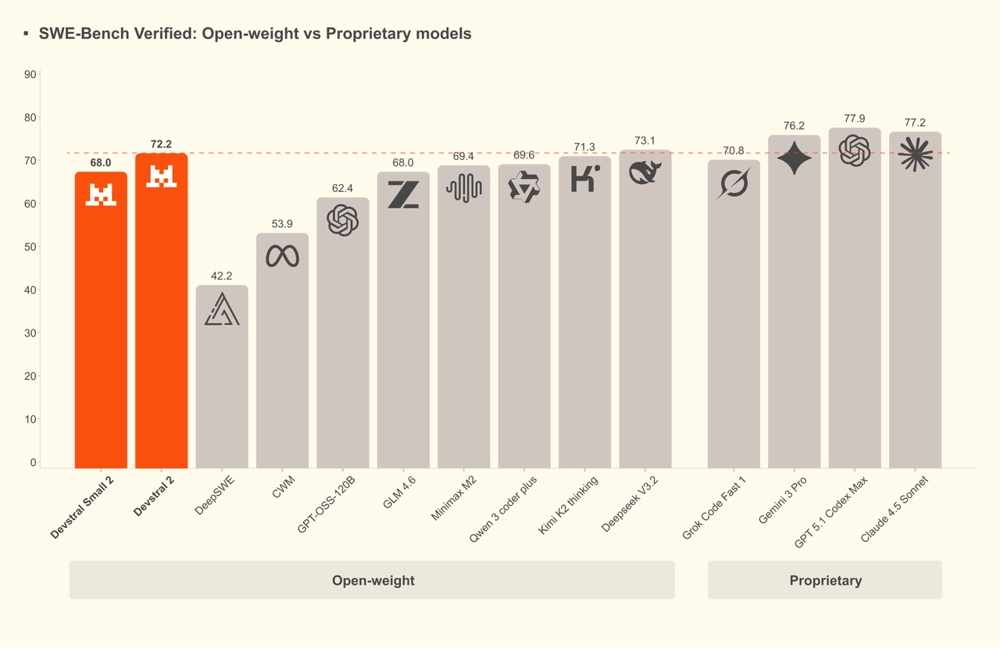
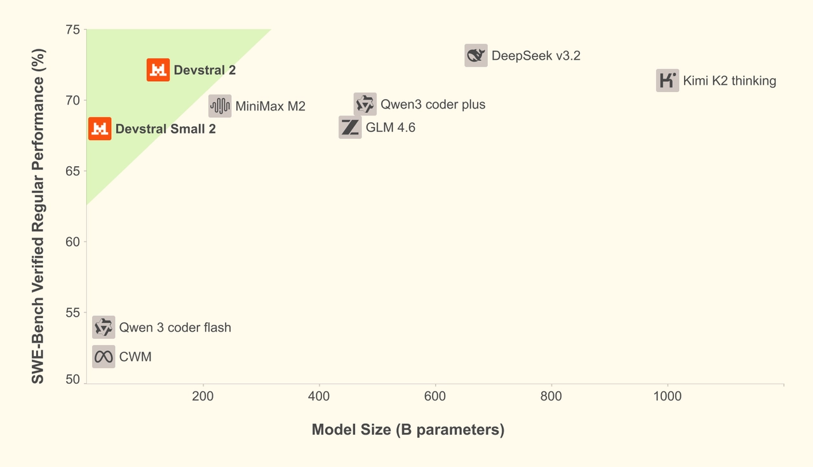
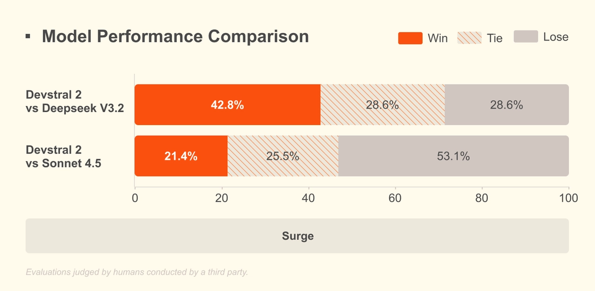

# Introducing: Devstral 2 and Mistral Vibe CLI.

**Source**: `raw/devstral-2-vibe-cli/full-article.html` (222 KB), `raw/devstral-2-vibe-cli/full-article.md` (markdown view)  
**URL**: https://mistral.ai/news/devstral-2-vibe-cli/  
**Ingested**: 2026-06-06  
**Tags**: #summary

## Summary

Mistral AI releases **Devstral 2**, a next-generation open coding model family in two sizes: **Devstral 2** (123B, modified MIT) and **Devstral Small 2** (24B, Apache 2.0). Both support **256K context**. Devstral 2 reaches **72.2% on SWE-bench Verified**—claimed SOTA among open-weight code agents—while Devstral Small 2 scores **68.0%** and targets local deployment on consumer hardware, including multimodal (image) inputs.

The models are positioned as far smaller than competitors (5×/28× smaller than DeepSeek V3.2; 8×/41× smaller than Kimi K2 at 123B/24B) with up to **7× cost efficiency** vs. Claude Sonnet on real-world tasks. Human evals (independent annotator, Cline scaffold) show Devstral 2 beating DeepSeek V3.2 (42.8% win vs. 28.6% loss) but still trailing **Claude Sonnet 4.5**.

Alongside the models, Mistral ships **Mistral Vibe CLI**—an Apache 2.0 open-source terminal coding agent powered by Devstral with project-aware context, `@` file references, shell `!` commands, multi-file orchestration, and Agent Communication Protocol IDE integration (e.g. Zed). Devstral 2 is free on the API during launch; post-free pricing is **$0.40/$2.00** per M tokens (in/out) for 123B and **$0.10/$0.30** for 24B. Deployment: minimum **4× H100** for Devstral 2; Devstral Small 2 runs on single-GPU, consumer RTX, DGX Spark, or CPU-only.

## Key Claims

- Devstral 2 (123B): 72.2% SWE-bench Verified; SOTA open-weight code agent; modified MIT license; 256K context.
- Devstral Small 2 (24B): 68.0% SWE-bench Verified; Apache 2.0; local/consumer deploy; image inputs supported.
- 5×–41× smaller than DeepSeek V3.2 and Kimi K2 at comparable tiers; up to 7× more cost-efficient than Claude Sonnet.
- Human eval vs. DeepSeek V3.2: 42.8% win / 28.6% loss; Claude Sonnet 4.5 still preferred in blind comparison.
- Mistral Vibe CLI: open-source terminal agent with multi-file orchestration, Git-aware context, MCP-compatible tooling.
- API free at launch; partners include Kilo Code and Cline; NVIDIA build.nvidia.com and upcoming NIM support.

## Figures

| Figure | Caption | Page |
|--------|---------|------|
|  | SWE-bench Verified: open-weight vs. proprietary models | — |
|  | SWE-bench Verified performance vs. model size | — |
|  | Human evaluation win/loss rates vs. DeepSeek V3.2 and Claude Sonnet 4.5 | — |

## Entities

- [[Large Language Models]] — 123B and 24B open coding models in the frontier landscape.
- [[Agentic AI]] — SWE-bench agents, Vibe CLI, Cline/Kilo Code integrations.
- [[Model Compression and Efficiency]] — compact models matching larger competitors on code tasks.

## Questions & Gaps

- Modified MIT license terms for Devstral 2 not detailed in the blog; full license text not linked inline.
- Human-eval task breakdown and sample sizes not published; only aggregate win/loss rates shown.
- Fine-tuning recipes and training data mix not specified; blog is release-oriented.

## Related

- [[mixtral-of-experts]] — prior Mistral open-weight release pattern.
- [[mistral-small-4]] — unified small model with Devstral lineage for agentic coding.
- [[Agentic AI]] — coding agents, tool use, and terminal agent scaffolds.
- [[Large Language Models]] — topic hub for open coding model releases.
