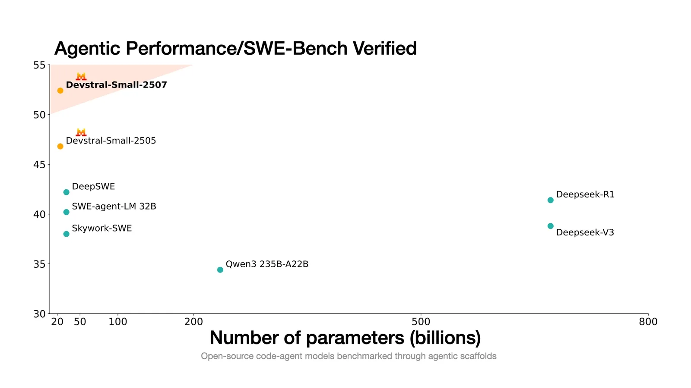
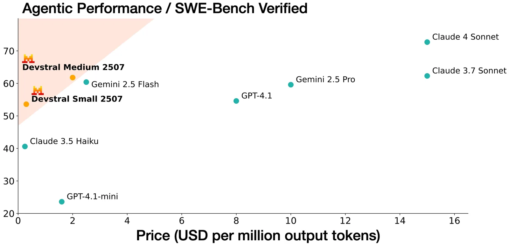

# Upgrading agentic coding capabilities with the new Devstral models

**Source**: `raw/devstral-2507/full-article.md` (215 KB), `raw/devstral-2507/full-article.md` (markdown view)  
**URL**: https://mistral.ai/news/devstral-2507/  
**Ingested**: 2026-06-06  
**Tags**: #summary

## Summary

Mistral AI and **All Hands AI** upgrade the Devstral line with **Devstral Small 1.1** (Apache 2.0) and **Devstral Medium** (API/enterprise). Both emphasize **generalization across prompts and agent scaffolds**—supporting Mistral function calling and XML formats in addition to OpenHands pairing.

**Devstral Small 1.1** (24B, same architecture) reaches **53.6% SWE-Bench Verified**—claimed open-model SOTA without test-time scaling—up from 46.8% on the original Devstral Small. **Devstral Medium** hits **61.6% SWE-Bench Verified**, positioned on a strong cost/performance frontier vs. **Gemini 2.5 Pro** and **GPT 4.1** at ~¼ the price. Medium supports on-prem deploy and custom fine-tuning for enterprises.

API names: **devstral-small-2507** ($0.1/M in, $0.3/M out) and **devstral-medium-2507** ($0.4/M in, $2/M out, Mistral Medium 3 pricing). Small weights on Hugging Face; Medium on Mistral Code for enterprise and finetuning API. Mistral continues open-sourcing accessible models (Small) while offering higher-performance Medium via API.

## Key Claims

- Devstral Small 1.1: 53.6% SWE-Bench Verified; open-model SOTA without test-time scaling.
- Devstral Medium: 61.6% SWE-Bench Verified; beats Gemini 2.5 Pro and GPT 4.1 at ~¼ price (per blog).
- Small 1.1: 24B params, Apache 2.0; better prompt/scaffold generalization; Mistral FC + XML support.
- Medium: API + on-prem + custom finetuning for enterprise tailoring.
- API pricing: devstral-small-2507 at Small 3.1 rates; devstral-medium-2507 at Medium 3 rates.
- Small on Hugging Face; Medium on Mistral Code enterprise and finetuning API.

## Figures

| Figure | Caption | Page |
|--------|---------|------|
|  | Devstral Small 1.1 SWE-Bench Verified and open-model comparison | — |
|  | Devstral Medium cost/performance vs. Gemini 2.5 Pro and GPT 4.1 | — |

## Entities

- [[Agentic AI]] — upgraded SWE-Bench Verified agents with improved scaffold generalization.
- [[Code Models]] — Devstral Small/Medium as agentic layer atop Codestral completion stack.

## Questions & Gaps

- Cost comparison to Gemini/GPT is marketing-level; token pricing and benchmark conditions not fully specified.
- Medium model size and architecture not disclosed in blog text.
- Relationship between devstral-small-2505 and devstral-small-2507 migration path not detailed.

## Related

- [[Devstral]] — original May 2025 Devstral Small launch and OpenHands integration.
- [[Agentic AI]] — coding agents, SWE-Bench Verified, and enterprise agent deployment.
- [[Code Models]] — Mistral coding stack: Codestral completion + Devstral agents.
- [[Announcing Codestral 25.08 and the Complete Mistral Coding Stack for Enterprise]] — enterprise stack integrating Devstral Small 1.1 and Medium.
