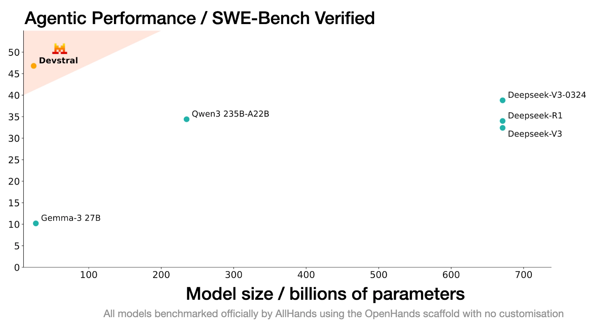

# Devstral

**Source**: `raw/devstral/full-article.md` (217 KB), `raw/devstral/full-article.md` (markdown view)  
**URL**: https://mistral.ai/news/devstral/  
**Ingested**: 2026-06-06  
**Tags**: #summary

## Summary

Mistral AI and **All Hands AI** release **Devstral**, an **agentic LLM for software engineering** trained to solve real GitHub issues via code-agent scaffolds (**OpenHands**, **SWE-Agent**). Released under **Apache 2.0**, Devstral targets whole-repo context, cross-component reasoning, and bug finding—not just atomic completion.

On **SWE-Bench Verified** (500 screened real GitHub issues), Devstral scores **46.8%**, claimed **>6 points above prior open-source SOTA**. Under the same OpenHands scaffold it beats far larger models (DeepSeek-V3-0324 671B, Qwen3 232B-A22B) and surpasses **GPT-4.1-mini by >20%** even when competitors use custom scaffolds. The model runs on a **single RTX 4090** or **Mac with 32 GB RAM** for local, privacy-sensitive enterprise use.

Availability: [Hugging Face](https://huggingface.co/mistralai/Devstral-Small-2505), Ollama, Kaggle, Unsloth, LM Studio; API as **devstral-small-2505** at **$0.1/M input, $0.3/M output** (Mistral Small 3.1 pricing). Enterprise fine-tuning and continued pre-training via Mistral applied AI. Larger agentic coding model teased as coming soon.

## Key Claims

- Agentic coding LLM from Mistral + All Hands AI; Apache 2.0 open weights.
- 46.8% on SWE-Bench Verified; >6% above prior open-source SOTA on that benchmark.
- Under OpenHands scaffold, beats DeepSeek-V3-0324 (671B) and Qwen3 232B-A22B.
- Surpasses GPT-4.1-mini by >20% even vs. models with custom scaffolds.
- Runs locally on RTX 4090 or 32 GB Mac; suited for privacy-sensitive enterprise repos.
- API: devstral-small-2505 at $0.1/M in, $0.3/M out tokens.
- Distributions: Hugging Face, Ollama, Kaggle, Unsloth, LM Studio; enterprise fine-tuning available.

## Figures

| Figure | Caption | Page |
|--------|---------|------|
|  | SWE-Bench Verified scores vs. open and closed models under OpenHands and mixed scaffolds | — |

## Entities

- [[Agentic AI]] — SWE-Bench Verified agent for real GitHub issue resolution via OpenHands.
- [[Code Models]] — agentic code model complementing Codestral completion/FIM models.
- [[Papers Explained - Mistral 7B]] — Mistral open-model lineage extended into software-engineering agents.

## Questions & Gaps

- Exact parameter count not stated in extracted blog text (later posts clarify 24B for Small family).
- Research preview at launch; larger model promised but details sparse in this post.
- SWE-Bench Verified methodology and scaffold configuration details are figure-dependent.

## Related

- [[Agentic AI]] — coding agents, SWE-Bench, and OpenHands scaffolds.
- [[Code Models]] — from autocomplete (Codestral) to repository-scale agentic coding (Devstral).
- [[Codestral]] — Mistral's complementary code completion model family.
