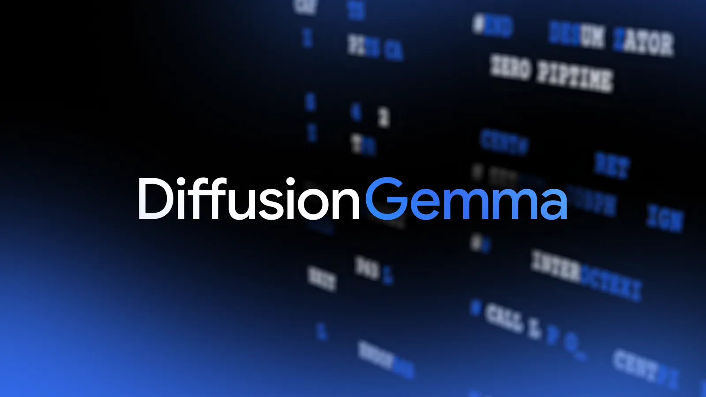
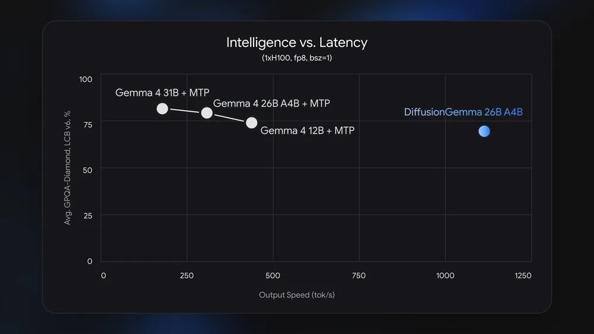
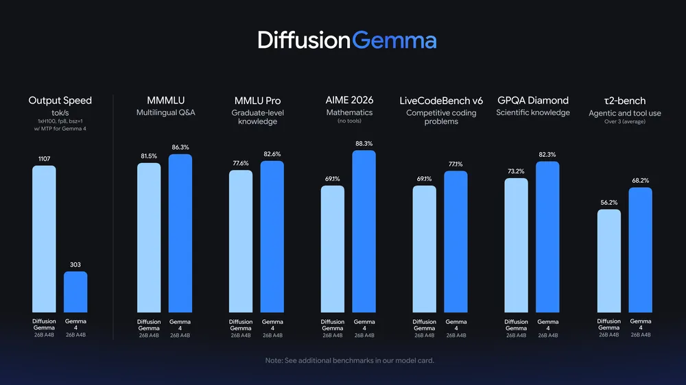
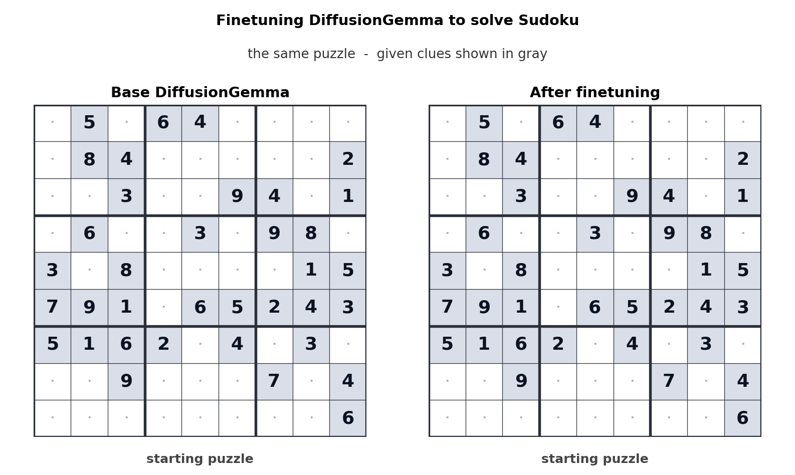
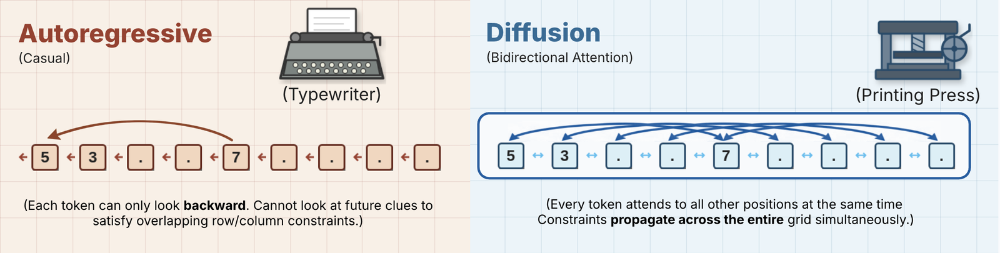
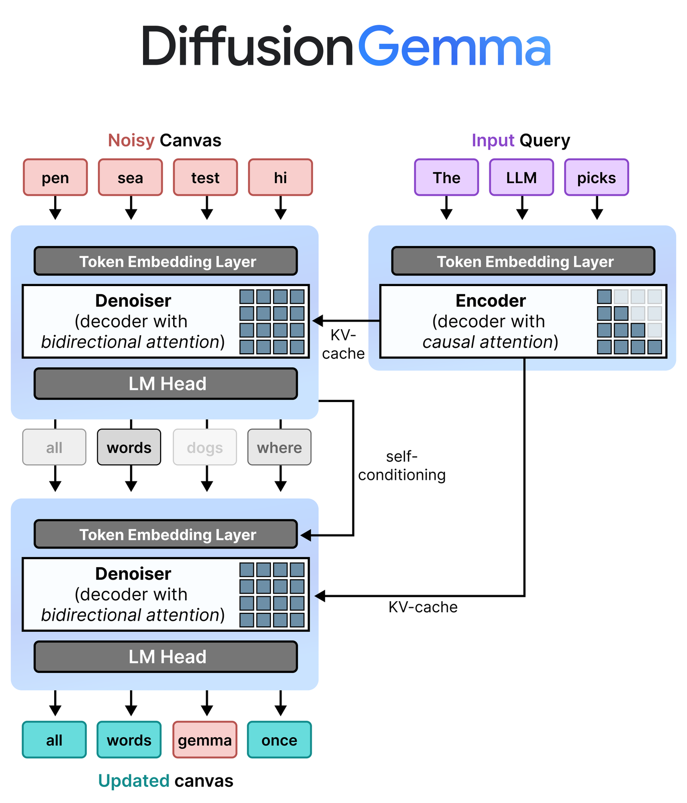
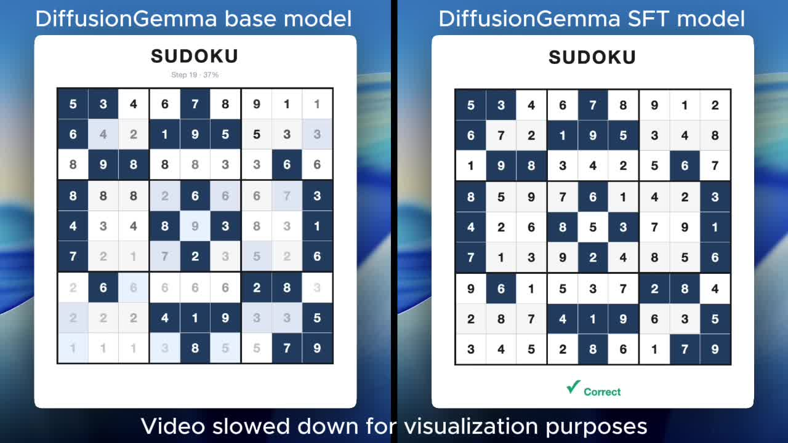

# DiffusionGemma

**Source**: `raw/diffusion-gemma/full-article.html` (385 KB), `raw/diffusion-gemma/full-article.md`; `raw/diffusiongemma-developer-guide/full-article.html` (44 KB), `raw/diffusiongemma-developer-guide/full-article.md`  
**URLs**: https://blog.google/innovation-and-ai/technology/developers-tools/diffusion-gemma-faster-text-generation/ · https://developers.googleblog.com/diffusiongemma-the-developer-guide/  
**Ingested**: 2026-06-11  
**Tags**: #summary

## Summary

On June 10, 2026, Google released **DiffusionGemma** (`google/diffusiongemma-26B-A4B-it`), an experimental open-weight text model that applies diffusion-style parallel decoding to language generation. Built on the [[Gemma 4]] 26B-A4B backbone and Gemini Diffusion research, it is a **26B MoE with 3.8B active parameters** per token, Apache 2.0 licensed, and positioned for speed-critical local workflows—in-line editing, code infilling, rapid iteration, and non-linear text structures—rather than maximum output quality. Google explicitly recommends standard autoregressive Gemma 4 for production quality.

DiffusionGemma shifts the local-inference bottleneck from **memory bandwidth to compute**. Instead of generating one token at a time, it drafts and refines a **256-token canvas** in parallel across multiple denoising passes. On dedicated GPUs Google cites **1000+ tokens per second** on a single H100 and **700+ tokens per second** on an RTX 5090—up to **4× faster** than autoregressive decode in the low-batch regime. Quantized weights fit within **18 GB VRAM** on high-end consumer GPUs. The speed advantage is strongest at **low-to-medium batch sizes on a single accelerator**; at high-QPS cloud serving, autoregressive models batch efficiently and DiffusionGemma's parallel decode can offer diminishing returns or higher serving cost. Apple Silicon unified-memory systems may not see the same speedup because they remain memory-bandwidth-bound during inference.

The developer guide details two core mechanisms. **[[Uniform State Diffusion]]** starts from random placeholder tokens and iteratively refines the full canvas with bidirectional attention; confident tokens lock in and guide adjacent positions, while low-confidence tokens can be re-noised for self-correction. **[[Block Autoregressive Diffusion]]** extends generation beyond 256 tokens: once a block is fully denoised, it is committed to the [[KV Cache]] via causal prefill, then a fresh canvas is initialized for the next block—combining parallel block speed with autoregressive stability for long outputs. Inference alternates **causal prefill** (prompt ingestion and block commit) with **bidirectional denoising** (canvas refinement).

Fine-tuning demonstrates the bidirectional advantage on constrained tasks. The base model solves Sudoku at ~0% success; a simple JAX SFT recipe via Hackable Diffusion raises correctness to **80%** while reducing denoising steps (12 vs 48 for base). Serving is integrated into **vLLM** (with Red Hat), plus MLX, Hugging Face Transformers, and SGLang; NVIDIA optimized NVFP4 kernels for Hopper/Blackwell. llama.cpp support is noted as arriving soon.

## Key Claims

- **DiffusionGemma-26B-A4B-it**: 26B total / 3.8B active MoE; Apache 2.0; built on Gemma 4 backbone + diffusion head; experimental, lower quality than standard Gemma 4.
- Up to **4× faster** token generation on dedicated GPUs vs autoregressive Gemma 4 at low batch; **1000+ tok/s** (H100), **700+ tok/s** (RTX 5090).
- **256-token parallel canvas** per denoising pass; bidirectional attention enables global self-correction and non-sequential tasks (Sudoku, code infilling, inline editing).
- **Uniform State Diffusion** + **Block Autoregressive Diffusion** for variable-length output via KV-cache block commits.
- Quantized deployment within **18 GB VRAM**; consumer RTX 4090/5090 and enterprise Hopper/Blackwell (NVFP4) support.
- Sudoku fine-tune: base ~0% → **80%** success with Hackable Diffusion SFT; early stopping at 12 steps vs 48 for base.
- Best for **local / low-concurrency** inference; high-QPS cloud batching favors autoregressive models.
- Ecosystem: Hugging Face weights, vLLM OpenAI-compatible server, MLX, Transformers, SGLang, Hackable Diffusion / Unsloth / NeMo fine-tuning, Google Model Garden, NVIDIA NIM.

## Figures

| Figure | Caption | Source |
|--------|---------|--------|
|  | DiffusionGemma hero visual | Launch blog |
|  | Intelligence vs latency trade-off chart | Launch blog |
|  | DiffusionGemma benchmark bar chart | Launch blog |
|  | Fine-tuned DiffusionGemma solving Sudoku | Launch blog |
|  | DiffusionGemma developer guide banner | Developer guide |
|  | Sudoku: autoregressive vs DiffusionGemma bidirectional denoising | Developer guide |
|  | Block autoregressive denoising architecture (prefill + denoise) | Developer guide |
|  | Sudoku generation video poster (base vs SFT-tuned) | Developer guide |

## Entities

- [[DiffusionGemma]] — the experimental open model entity (`google/diffusiongemma-26B-A4B-it`).
- [[Google DeepMind]] — research org behind Gemma 4 backbone and Gemini Diffusion lineage.
- [[Gemma 4]] — parent open model family; autoregressive Gemma 4 recommended for production quality.
- [[Text Diffusion LLMs]] — architectural category this release instantiates at open Gemma scale.
- [[Mixture of Experts]] — 26B total / 3.8B active sparse routing.
- [[Uniform State Diffusion]] — parallel canvas denoising with confidence locking and re-noising.
- [[Block Autoregressive Diffusion]] — 256-token block commit + KV-cache extension for long outputs.

## Questions & Gaps

- Launch post shows a marketing benchmark chart without a full public eval table or model-card numbers in the blog itself.
- llama.cpp support is "arriving soon" — not yet available at announcement.
- Quality gap vs autoregressive Gemma 4 is acknowledged but not quantified with head-to-head benchmark tables in these posts.
- Cloud serving economics vs autoregressive models at scale are argued qualitatively, not benchmarked.
- Text-to-3D SVG demo is video-only in the launch post (no static figure extracted).

## Related

- [[Gemma 4]] — same 26B-A4B backbone class; recommended for maximum quality.
- [[Gemma 4 Multi-Token Prediction]] — alternate Gemma 4 inference speedup via speculative autoregressive decoding.
- [[Beyond Standard LLMs]] — Raschka survey of text diffusion LLMs (LLaDA, Gemini Diffusion) and parallel-decoding trade-offs.
- [[Text Diffusion LLMs]] — concept hub for bidirectional denoising text generation.
- [[Model Compression and Efficiency]] — compute-bound parallel decode and 18 GB quantized deployment.
- [[Inference Engineering]] — memory-bandwidth vs compute-bound decode regimes.
- [[Mixture of Experts]] — sparse 26B/3.8B activation pattern.
