# How Diffusion Models Work: The Math from Scratch

**Source**: `raw/diffusion-models/full-article.html` (836 KB), `raw/diffusion-models/full-article.md` (markdown view)  
**URL**: https://theaisummer.com/diffusion-models/  
**Authors**: Sergios Karagiannakos, Nikolas Adaloglou (AI Summer), 2022-09-29  
**Ingested**: 2026-06-06  
**Tags**: #summary

## Summary

This AI Summer tutorial is a from-scratch mathematical walkthrough of **Denoising Diffusion Probabilistic Models (DDPM)** — the generative paradigm behind GLIDE, DALL·E 2, Imagen, and Stable Diffusion. Unlike one-shot GAN sampling, diffusion decomposes image generation into many small **denoising** steps: a forward Markov chain corrupts data with Gaussian noise, and a learned reverse process reconstructs samples starting from pure noise.

The article frames diffusion as a [[Latent Variable Models|latent variable model]] closely related to [[Variational Autoencoders|VAEs]]. Forward steps \(q(x_t \mid x_{t-1}) = \mathcal{N}(\sqrt{1-\beta_t}\,x_{t-1}, \beta_t \mathbf{I})\) are made tractable via the **reparameterization trick**: with \(\bar{\alpha}_t = \prod_{s=1}^t (1-\beta_s)\), any noisy latent satisfies \(x_t = \sqrt{\bar{\alpha}_t}\,x_0 + \sqrt{1-\bar{\alpha}_t}\,\epsilon\). Variance schedules (linear in Ho et al. 2020; **cosine** in Nichol & Dhariwal 2021) control how quickly structure is destroyed.

Training maximizes the [[ELBO]] on the reverse chain \(p_\theta(x_{t-1}\mid x_t)\). The key trick — conditioning on \(x_0\) — makes the posterior \(q(x_{t-1}\mid x_t, x_0)\) analytic, so the network can predict **noise** \(\epsilon_\theta(x_t, t)\) rather than the mean directly. Ho et al.'s simplified objective \(L_{\text{simple}} = \mathbb{E}\|\epsilon - \epsilon_\theta(\cdot)\|^2\) outperforms the full weighted ELBO in practice. Architecture-wise, DDPM uses a symmetric **U-Net** (Wide ResNet blocks, group norm, [[Self-Attention]], sinusoidal timestep embeddings).

Beyond unconditional generation, the post covers **guided diffusion**: classifier guidance (train \(f_\phi(y\mid x_t)\) on noisy images; GLIDE extends this with CLIP embedding dot products for text) and **classifier-free guidance** (Ho & Salimans: drop labels during training; interpolate conditional/unconditional noise at inference — critical for Imagen). For scaling, **cascade diffusion** chains super-resolution models with conditioning augmentation (Gaussian blur), while **[[Latent Diffusion Models]]** (Stable Diffusion) diffuses in a VAE-compressed latent space. The final sections connect DDPM to **score-based generative models** (Song & Ermon: score matching + Langevin dynamics; NCSN multi-scale noise) and unify both under **SDEs** (Song et al. 2021).

This primer complements [[What are Diffusion Models?]] (Lilian Weng's broader survey) with pedagogical step-by-step derivations and AI Summer's generative-learning narrative arc from [[How to Generate Images using Autoencoders]] through VAE theory.

## Key Claims

- Diffusion generation = iterative denoising over \(T\) steps; slower sampling than GANs but more stable refinement.
- Forward process is a Markov chain of Gaussian noise injections parameterized by schedule \(\beta_t\); not related to neural-network forward pass.
- Reparameterization enables one-shot sampling of \(x_t\) from \(x_0\) at any timestep without iterating \(t\) applications of \(q\).
- Linear variance schedule: \(\beta_1 = 10^{-4}\) to \(\beta_T = 0.02\); cosine schedule (Nichol & Dhariwal 2021) yields better latent visualizations.
- As \(T \to \infty\), \(x_T\) approaches isotropic Gaussian; reverse sampling starts from \(\mathcal{N}(0, \mathbf{I})\).
- True reverse \(q(x_{t-1}\mid x_t)\) is intractable; approximate with learned Gaussian \(p_\theta(x_{t-1}\mid x_t)\).
- ELBO splits into reconstruction \(L_0\), prior-matching \(L_T\) (ignored in training), and denoising KL terms \(L_{t-1}\).
- Conditioning on \(x_0\) makes \(q(x_{t-1}\mid x_t, x_0)\) tractable (Sohl-Dickstein et al.).
- Network parameterization: predict noise \(\epsilon_\theta(x_t, t)\); \(L_{\text{simple}}\) drops ELBO weighting and works better (Ho et al. 2020).
- Nichol et al. 2021 extended DDPM to learn covariance \(\Sigma_\theta\) in addition to mean.
- DDPM U-Net: same input/output spatial size; Wide ResNet + group norm + self-attention; sinusoidal \(t\) embedding per residual block.
- Guided diffusion conditions every reverse step on \(y\): \(p_\theta(x_{0:T}\mid y)\).
- Classifier guidance perturbs mean by \(\Sigma_\theta \nabla_{x_t} \log f_\phi(y\mid x_t, t)\); GLIDE uses CLIP image/text embedding dot product for caption steering.
- Classifier-free guidance: single network, random null class during training; \(\hat{\epsilon}_\theta = s\epsilon_\theta(x_t\mid y) + (1-s)\epsilon_\theta(x_t\mid 0)\).
- Imagen relies heavily on classifier-free guidance for text-image alignment.
- Cascade diffusion: sequential models at increasing resolution; **conditioning augmentation** (Gaussian blur) mitigates compounding error.
- Latent diffusion: encoder \(z_t = g(x_t)\), diffuse in latent space, decoder upsamples — Stable Diffusion recipe (Rombach et al.).
- Score-based models learn \(\nabla_x \log p(x)\) via score matching + Langevin dynamics; NCSN adds multi-scale Gaussian perturbations.
- Song et al. 2021 SDE framework unifies DDPM and score-based models; reverse SDE requires estimated score \(s_\theta(x, t)\).

## Figures

| Figure | Caption | Page |
|--------|---------|------|
| 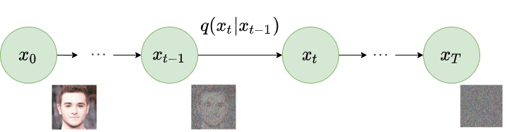 | Forward diffusion Markov chain gradually adding Gaussian noise (Ho et al. 2020) | — |
| 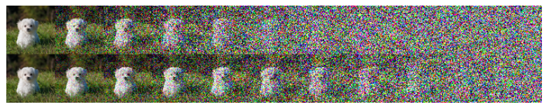 | Latent samples under linear (top) vs cosine (bottom) variance schedules (Nichol & Dhariwal 2021) | — |
| 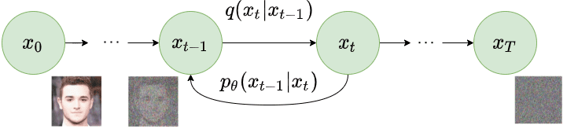 | Reverse diffusion process: denoise from \(x_T\) to \(x_0\) (Ho et al. 2020) | — |
| 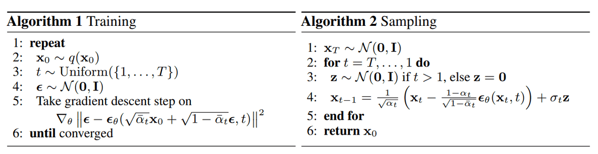 | DDPM training and sampling algorithms (Ho et al. 2020) | — |
| 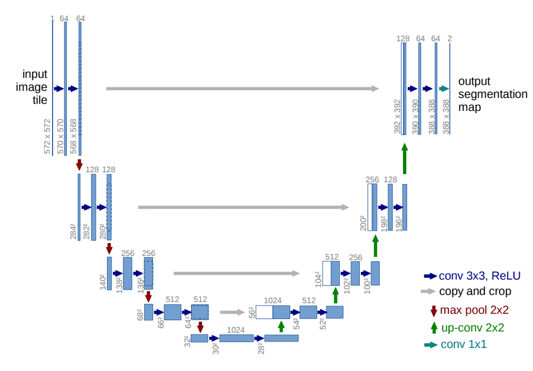 | U-Net architecture with encoder–decoder skip connections (Ronneberger et al.) | — |
| 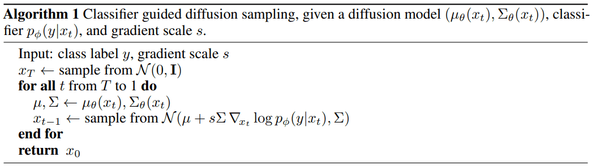 | Classifier-guided diffusion sampling algorithm (Dhariwal & Nichol 2021) | — |
| 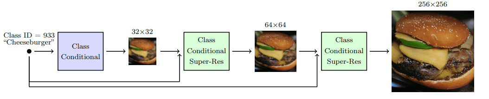 | Cascade diffusion pipeline: sequential super-resolution models (Ho & Saharia et al.) | — |
| 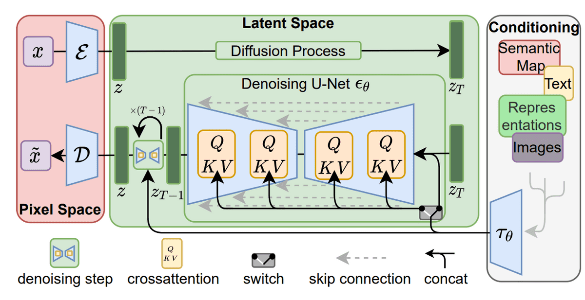 | Latent diffusion: encode → diffuse in latent space → decode (Rombach et al.) | — |
| 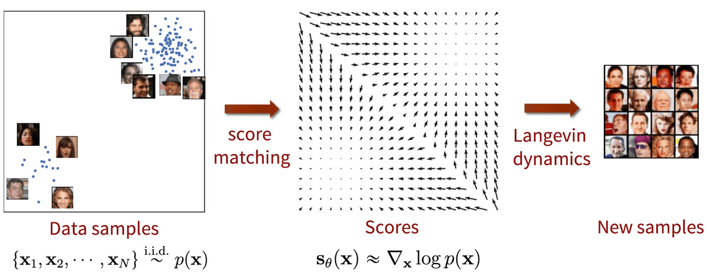 | Score-based generative modeling via score matching + Langevin dynamics (Song & Ermon) | — |
| 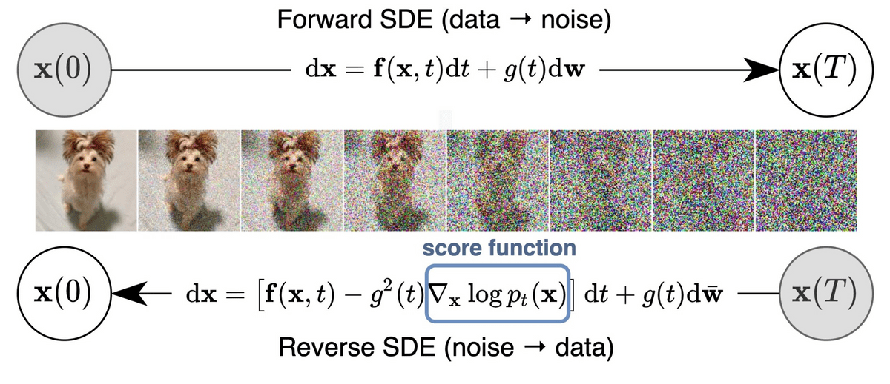 | Score-based generative modeling through SDEs (Song et al. 2021) | — |
| 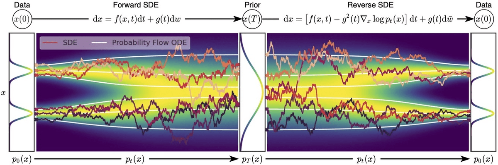 | Overview of score-based generative modeling through SDEs (Song et al. 2021) | — |

The forward process corrupts data with scheduled Gaussian noise over \(T\) Markov steps.

Training predicts noise \(\epsilon_\theta\); sampling iteratively denoises from \(x_T \sim \mathcal{N}(0, \mathbf{I})\).

Stable Diffusion applies diffusion in a compressed latent space rather than pixel space.

## Entities

- [[AI Summer]] — published this DDPM math tutorial (2022).
- [[Sergios Karagiannakos]] — co-author; also wrote autoencoder/VAE primers in this wiki.
- [[Nikolas Adaloglou]] — co-author; AI Summer vision/transformer tutorial author.
- [[Denoising Diffusion Probabilistic Models]] — primary subject; full DDPM formulation.
- [[Latent Diffusion Models]] — Stable Diffusion scaling approach covered in final sections.
- [[Classifier-Free Guidance]] — training-free-ish guidance via conditional/unconditional interpolation.
- [[Variational Autoencoders]] — ELBO training parallel cited throughout.
- [[ELBO]] — evidence lower bound decomposition for diffusion training.
- [[Self-Attention]] — appendix on U-Net self-attention; SAG/PAG manipulate self-attention maps.
- [[What are Diffusion Models?]] — Lilian Weng's complementary master survey (broader, includes DDIM/DiT/Consistency Models).
- [[Score-Based Generative Models]] — score matching, NCSN, and SDE unification section.

## Questions & Gaps

- Article predates DiT, Consistency Models, and flow-matching accelerators covered in [[What are Diffusion Models?]].
- Classifier-free guidance scale notation uses \(s\) here vs \(w\) in other wiki pages — same idea, different symbol.
- Does not include PyTorch implementation (Hugging Face annotated post linked as external resource).
- GLIDE CLIP attribution in text conflates Saharia et al. (Imagen) with Nichol et al. (GLIDE) in one sentence — verify against primary papers when citing.

## Related

- [[What are Diffusion Models?]] — broader Lilian Weng survey with DDIM, CFG details, LDM, DiT, Consistency Models.
- [[How to Generate Images using Autoencoders]] — earlier AI Summer generative primer in the same tutorial series.
- [[The Theory behind Latent Variable Models: Formulating a Variational Autoencoder]] — VAE/ELBO foundations diffusion training parallels.
- [[Denoising Diffusion Probabilistic Models]] — concept page with algorithms and worked examples.
- [[Classifier-Free Guidance]] — detailed CFG derivation and Imagen thresholding notes.
- [[An Overview of Classifier-Free Guidance for Diffusion Models]] — 2024 follow-up deep dive on CFG schedules, thresholding, and spatial guidance.
- [[An Overview of Classifier-Free Diffusion Guidance: Impaired Model Guidance with a Bad Version of Itself (Part 2)]] — 2024 sequel on impaired-model guidance (SAG, PAG, autoguidance).
- [[Latent Diffusion Models]] — perceptual compression + latent denoising architecture.
- [[Denoising Score Matching]] — bridge between score-based and diffusion objectives.
- [[Computer Vision]] — topic hub for image generation content.
