# Exploration Strategies in Deep Reinforcement Learning

**Source**: `raw/exploration-drl/full-article.md` (canonical HTML); `raw/exploration-drl/full-article.md` (markdown view)  
**URL**: https://lilianweng.github.io/posts/2020-06-07-exploration-drl/  
**Author**: Lilian Weng  
**Published**: 2020-06-07 (updated 2020-06-17)  
**Ingested**: 2026-05-22  
**Tags**: #summary

## Summary

Exploration versus exploitation is one of the most fundamental tensions in reinforcement learning. Modern RL algorithms are effective at exploitation once a useful reward signal exists, but exploration in environments with sparse or deceptive rewards remains an open research problem. This post by Lilian Weng provides a comprehensive survey of exploration strategies for deep RL, organized around two hard problems: the **hard-exploration problem** (sparse/deceptive rewards, typified by Montezuma's Revenge) and the **noisy-TV problem** (agents getting trapped by uncontrollable novelty sources that yield persistent but meaningless intrinsic rewards).

The post groups exploration methods into four broad families. **Count-based exploration** approximates visit counts in high-dimensional spaces using density models (pseudo-counts via CTS or PixelCNN) or hashing schemes (SimHash, autoencoder-based hashing), and awards an intrinsic bonus proportional to $N(s)^{-1/2}$. **Prediction-based exploration** rewards the agent for improving its forward-dynamics model: error of a learned predictor $f:(s_t, a_t)\mapsto s_{t+1}$ drives bonuses in ICM, VIME, and disagreement-based methods; the key insight is that feature encoding must isolate agent-controllable factors (via an inverse dynamics model) to avoid the noisy-TV trap.

**Random network distillation (RND)** sidesteps the need for environment-dynamics prediction entirely: a fixed randomly-initialised network defines a prediction target, and the error of a trained predictor against it gives the bonus—novel states are harder to predict because similar states have rarely been encountered. Combining the episodic novelty module from EC with RND as a life-long novelty signal gives NGU, and extending NGU with a meta-controller policy population and a decomposed Q-function yields **Agent57**, the first DRL agent to beat human benchmarks on all 57 Atari games. **Memory-based and direct exploration** methods (Go-Explore, DTSIL, Episodic Curiosity) maintain explicit state memories and reason about reachability rather than prediction error, allowing the agent to return to promising frontier states and avoid the knowledge-fading problem.

The post also covers option frameworks: [[VALOR]] and [[Variational Intrinsic Control (VIC)]] learn latent skill codes that distinguish options by their trajectories, enabling unsupervised discovery of diverse behaviours without a task reward.

## Key Claims

- Classic bandit strategies (ε-greedy, UCB, Thompson sampling) are insufficient for high-dimensional deep RL; entropy bonuses and noise-based methods (NoisyNet, parameter-space noise) serve as lightweight alternatives.
- Count-based bonus $r^i \propto N(s)^{-1/2}$ requires pseudo-counts or hashing to generalise to continuous/image state spaces.
- ICM's inverse-dynamics feature encoder is specifically designed to exclude environment factors that cannot be controlled by the agent, mitigating the noisy-TV problem—but forward-dynamics models remain vulnerable when the agent-uncontrollable factor is dominant.
- Random features are surprisingly competitive with learned features for curiosity-driven learning (Burda et al. 2018 large-scale experiment), but IDF features generalise better in transfer experiments.
- RND works best in a **non-episodic** setting (intrinsic return spreads across episode boundaries) with careful running-statistics normalisation.
- NGU combines a short-term episodic novelty module (IDF embeddings + k-NN kernel in memory) with a long-term RND life-long module; Agent57 extends NGU with a population of policies and a meta-controller UCB bandit.
- Go-Explore requires a resettable deterministic simulator; the follow-up policy-based Go-Explore removes this limitation using a goal-conditioned self-imitation learning policy.
- VALOR and VIC frame skill discovery as maximising mutual information between a latent code and the trajectory, learning diverse options without task rewards.

## Figures

| Figure | Caption |
|--------|---------|
| 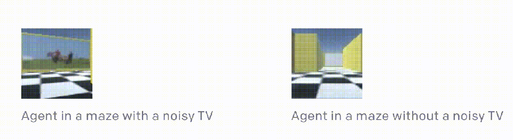 | Agent attracted to noisy TV loses motivation to explore the maze |
| 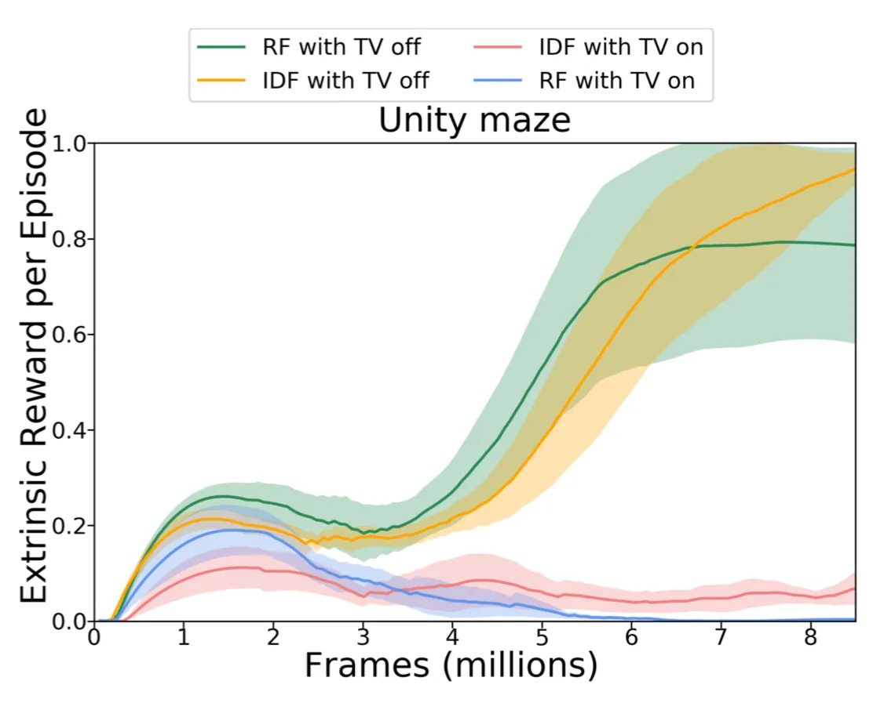 | Extrinsic reward curves with RF vs IDF features, noisy TV on/off |
| 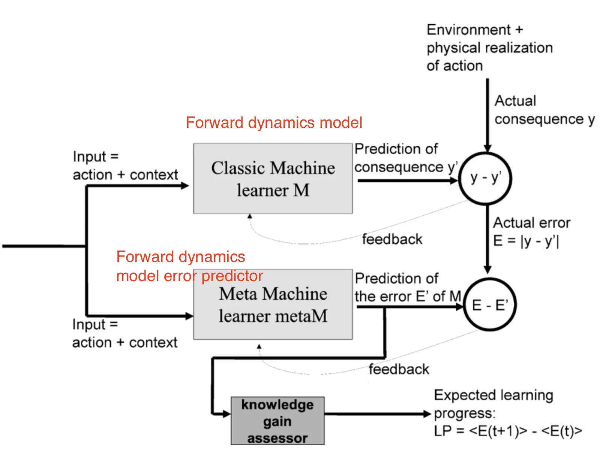 | IAC architecture: prediction error drives intrinsic reward via learning progress |
| 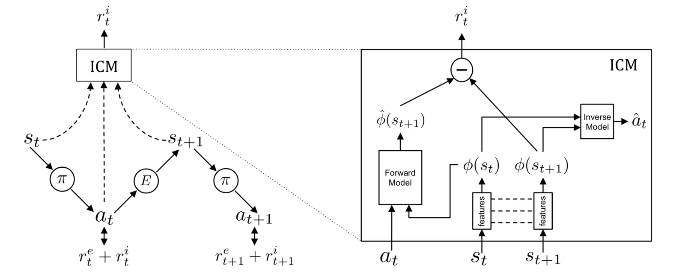 | Intrinsic Curiosity Module: inverse dynamics model + forward prediction error |
| 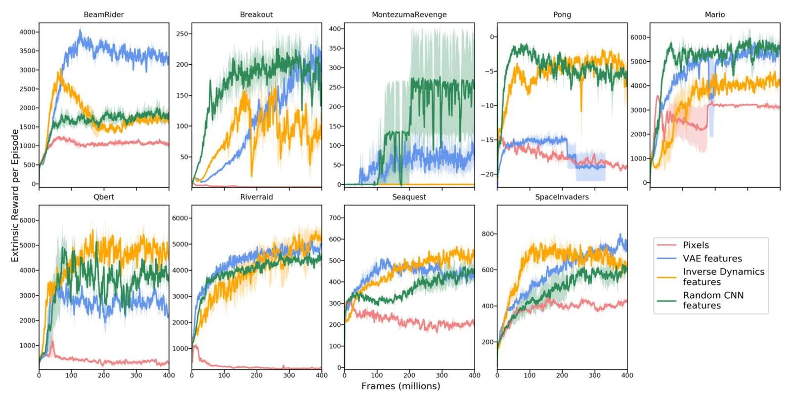 | Mean reward across Atari games under four feature encodings |
| 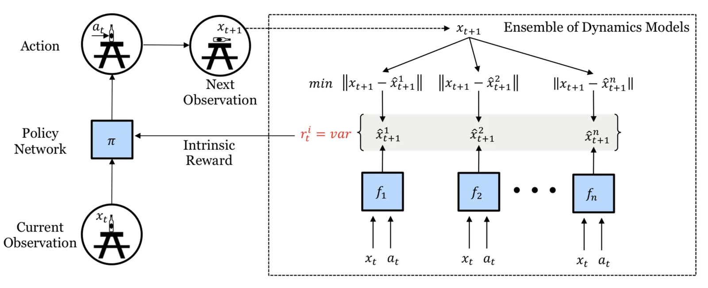 | Ensemble disagreement-based exploration training architecture |
| 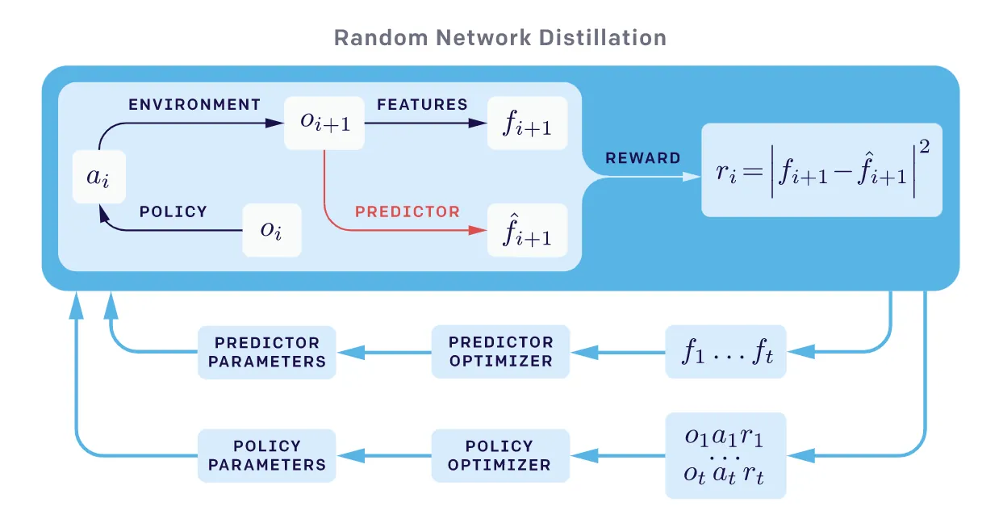 | Random Network Distillation: predictor error against fixed random target |
| 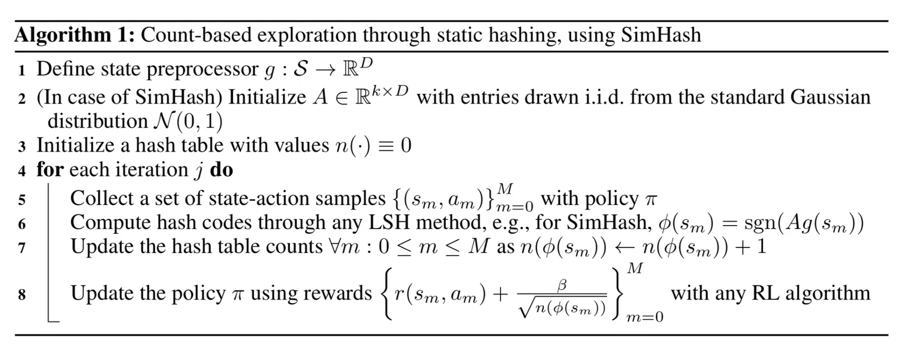 | SimHash + autoencoder for count-based exploration |
| 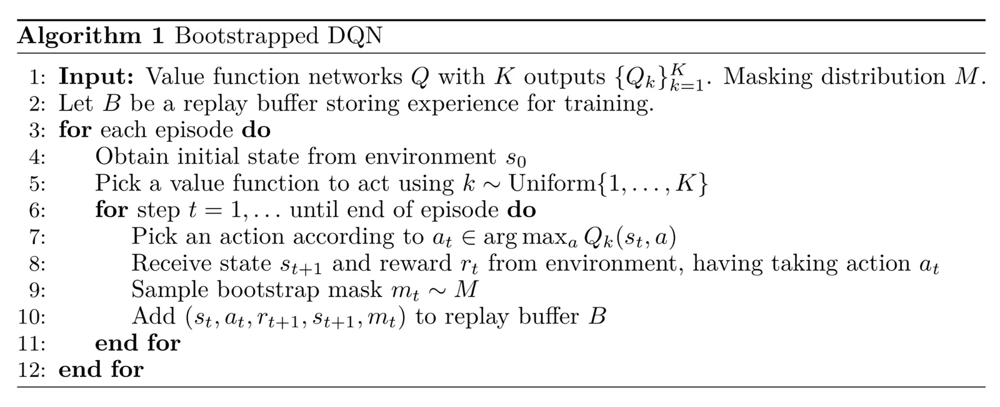 | Bootstrapped DQN algorithm for directed exploration |
| 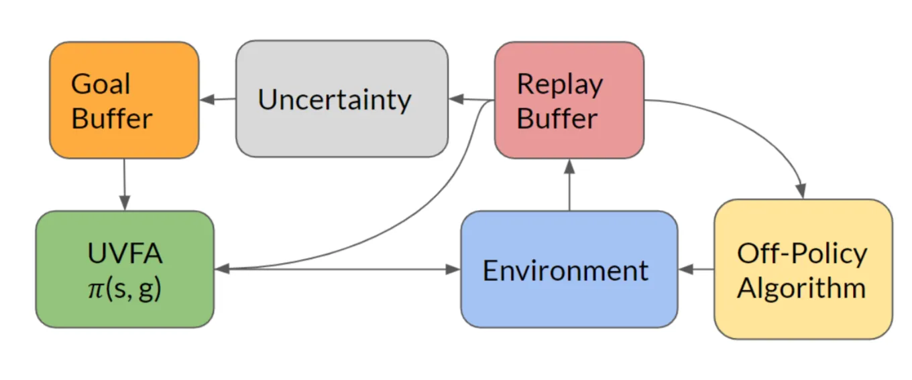 | Directed exploration illustration |
| 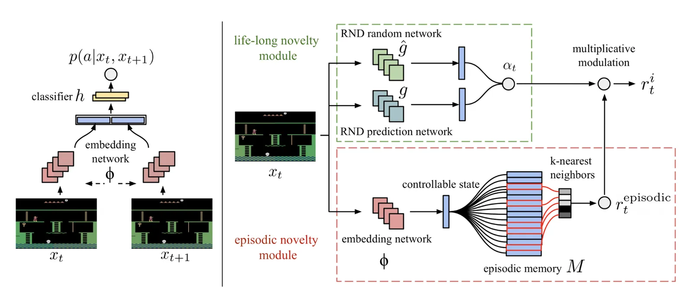 | Never Give Up: episodic novelty module + RND life-long module architecture |
| 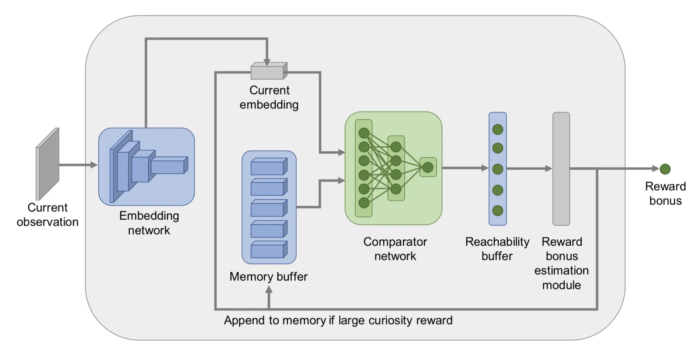 | Episodic Curiosity (EC) module using siamese reachability network |
| 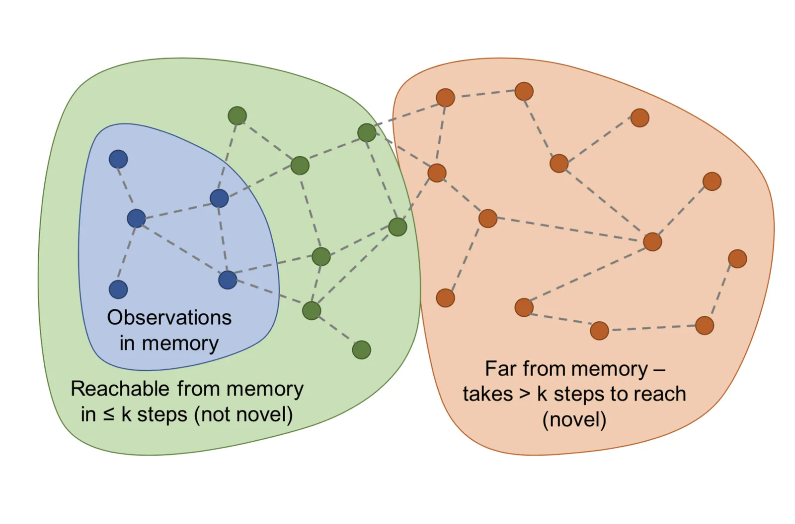 | Graph of states: blue = in memory, green = reachable (not novel), orange = novel |
| 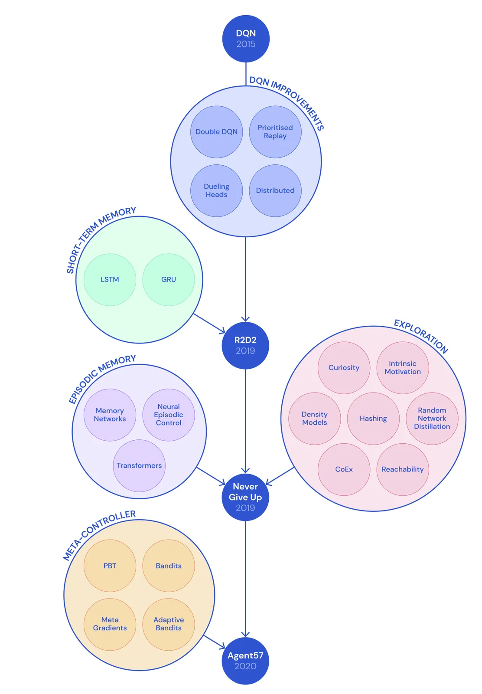 | Timeline from DQN to Agent57; first DRL to beat human benchmark on all 57 Atari games |
| 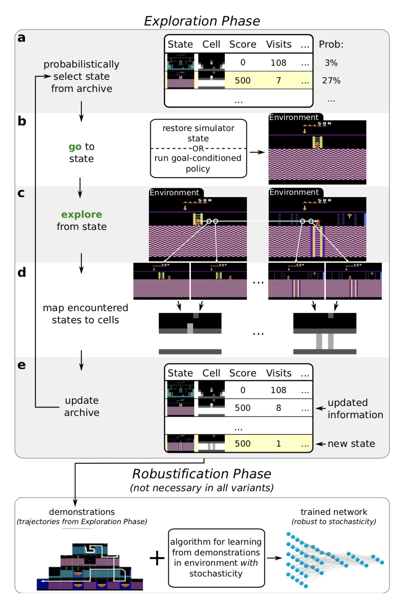 | Policy-based Go-Explore overview: goal-conditioned policy removes need for resettable simulator |
| 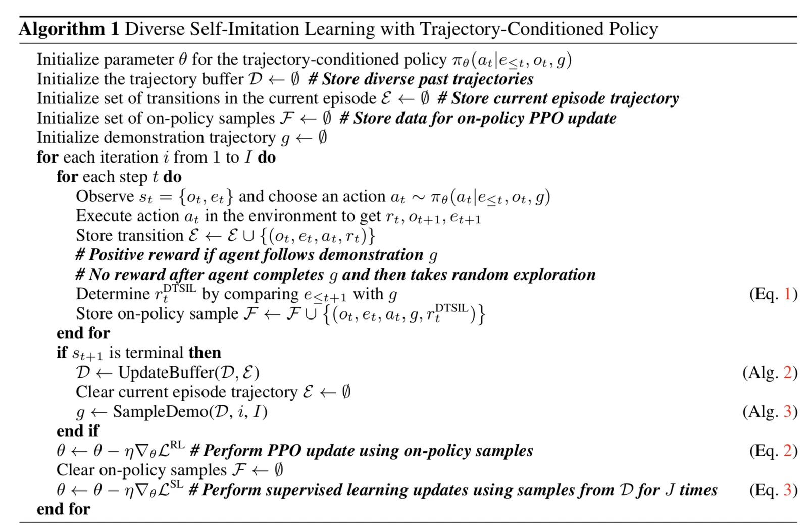 | DTSIL (Diverse Trajectory-conditioned Self-Imitation Learning) algorithm |
| 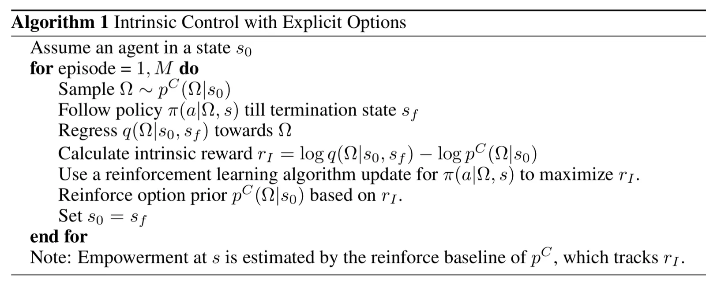 | VIC (Variational Intrinsic Control): latent skill code maximises trajectory MI |
| 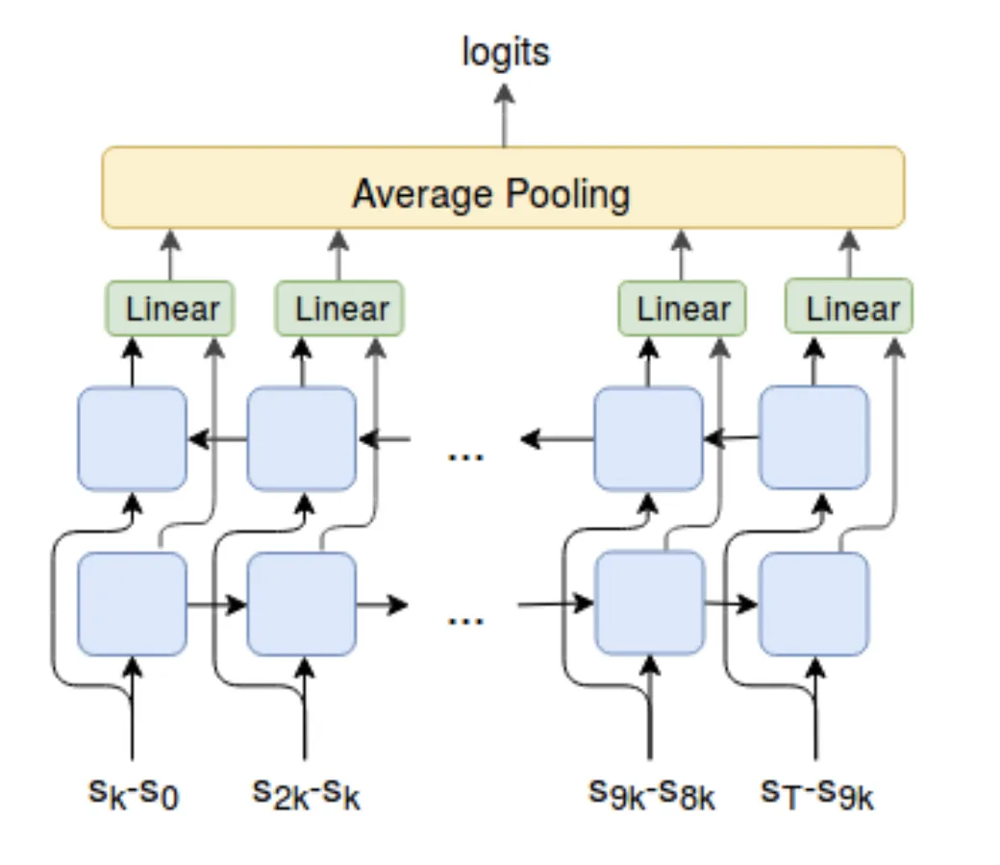 | VALOR decoder predicts skill code from trajectory context |

## Entities

- [[Lilian Weng]] — Author; OpenAI researcher who maintains the Lil'Log blog covering RL, NLP, and deep learning.
- [[Intrinsic Curiosity Module (ICM)]] — Pathak et al. 2017; inverse-dynamics encoder + forward model; key method described here.
- [[Random Network Distillation (RND)]] — Burda et al. 2018; fixed random network as prediction target for exploration bonus.
- [[Never Give Up (NGU)]] — Badia et al. 2020a; combines episodic + life-long novelty.
- [[Agent57]] — Badia et al. 2020b; first DRL agent to outperform humans on all 57 Atari games.
- [[Go-Explore]] — Ecoffet et al. 2019/2020; memory + return-to-state for hard exploration.
- [[Variational Intrinsic Control (VIC)]] — Gregor et al.; option discovery via mutual information.
- [[VALOR]] — Achiam et al.; trajectory-context decoder for option discovery.
- [[Montezuma's Revenge]] — Canonical hard-exploration benchmark Atari game.

## Questions & Gaps

- The noisy-TV problem remains partially unsolved: ICM's inverse-dynamics encoder helps but does not fully eliminate the issue when noise is large.
- RND paper itself notes it cannot handle global exploration requiring long-horizon coordination; NGU uses it as a life-long module despite this caveat.
- The post does not cover more recent work on exploration in language model post-training (e.g., KL-penalty exploration, GRPO diversity).
- Option/skill-discovery methods (VIC, VALOR) are survey-level; practical integration with task-specific RL is not detailed.

## Related

- [[Reinforcement Learning Topic]] — Parent topic page for all RL-related content in the wiki.
- [[Exploration-Exploitation Tradeoff]] — Core concept introduced in Sutton & Barto.
- [[Multi-Armed Bandits]] — Classic setting where exploration strategies originate.
- [[Policy Gradient]] — Many exploration bonuses are added into the policy gradient objective.
- [[GRPO]] — Modern RL optimizer; exploration via entropy/diversity is relevant to reasoning model training.
- [[Reinforcement Learning: An Introduction]] — Textbook covering classic exploration foundations.
- [[Curriculum for Reinforcement Learning]] — Companion Weng post on curriculum design for RL; skill-based curriculum (CARML) and self-play (asymmetric self-play) overlap with exploration themes here.
