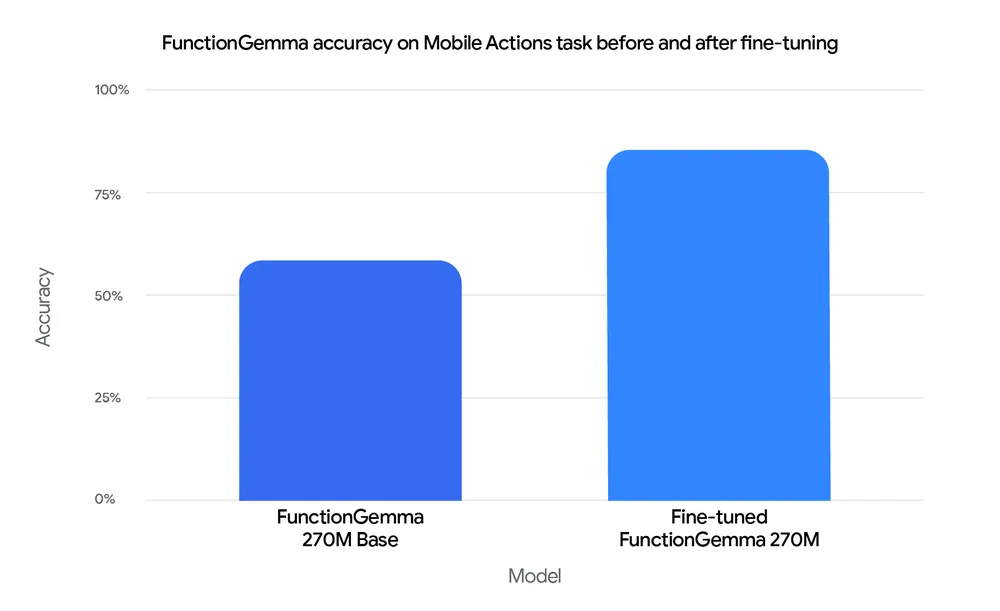

# FunctionGemma

**Source**: `raw/functiongemma/full-article.html` (373 KB)  
**URL**: https://blog.google/innovation-and-ai/technology/developers-tools/functiongemma/  
**Published**: Dec 18, 2025  
**Ingested**: 2026-06-06  
**Tags**: #summary

## Summary

Google releases **FunctionGemma**, a specialized fine-tune of **Gemma 3 270M** for function calling and edge deployment. The model translates natural language into structured API actions — calendar events, contacts, flashlight toggles, and similar OS-level commands — while also summarizing results back to the user in chat. It is designed as a base for further domain fine-tuning rather than zero-shot prompting alone, targeting local-first agents that need low latency, privacy, and reliable tool execution on phones and edge hardware such as the NVIDIA Jetson Nano.

On the **Mobile Actions** evaluation, fine-tuning raised accuracy from a **58% baseline to 85%** on a held-out eval set, illustrating that small edge specialists beat generic prompting for deterministic tool use. FunctionGemma can run as a standalone offline agent or as a lightweight router that handles common commands locally and escalates harder tasks to larger models (e.g., Gemma 3 27B). Ecosystem support spans Hugging Face, Unsloth, Keras, NVIDIA NeMo, LiteRT-LM, vLLM, MLX, Llama.cpp, Ollama, Vertex AI, and LM Studio.

## Key Claims

- FunctionGemma is Gemma 3 270M fine-tuned for function calling; Apache 2.0 open weights.
- Unified action + chat: emits structured function calls and natural-language summaries of results.
- Mobile Actions eval: 58% → 85% accuracy after fine-tuning on held-out data.
- Edge-ready: runs on Jetson Nano and mobile devices; 256k vocabulary for efficient JSON/multilingual tokenization.
- Fine-tuning cookbook provided for custom API surfaces (smart home, media, navigation).
- Broad deployment stack: LiteRT-LM, vLLM, MLX, Ollama, Vertex AI, and more.

## Figures

| Figure | Caption | Page |
|--------|---------|------|
|  | FunctionGemma accuracy on Mobile Actions before and after fine-tuning (held-out eval) | — |

## Entities

- [[Google DeepMind]] — Gemma family publisher; FunctionGemma release org.
- [[Agentic AI]] — edge function-calling agents and compound routing architectures.
- [[Model Compression and Efficiency]] — 270M edge-specialist for local tool execution.

## Questions & Gaps

- Mobile Actions dataset composition and full per-action breakdown not in the blog.
- Zero-shot vs fine-tuned baselines for non-Mobile-Actions API surfaces are unspecified.
- Demo videos in the source are not extracted as figures.

## Related

- [[Papers Explained 329 - Gemma 3]] — base 270M model family.
- [[Code Models]] — structured output and tool-use patterns adjacent to API-calling agents.
- [[Agentic AI]] — topic hub for tool use and agent orchestration.
- [[Model Compression and Efficiency]] — sub-billion edge deployment.
- [[Google DeepMind]] — Gemma edge-agent and function-calling releases.
