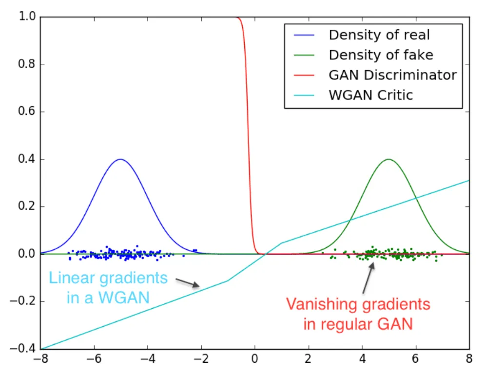
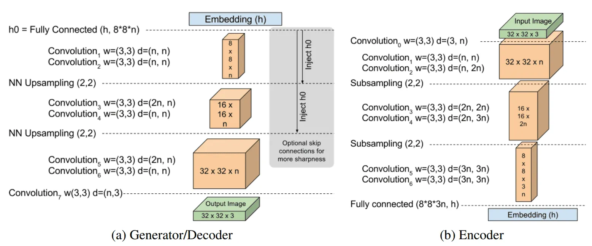
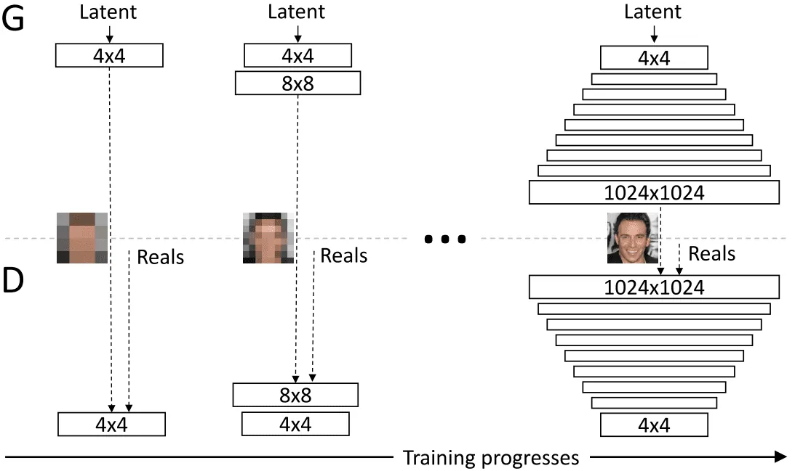
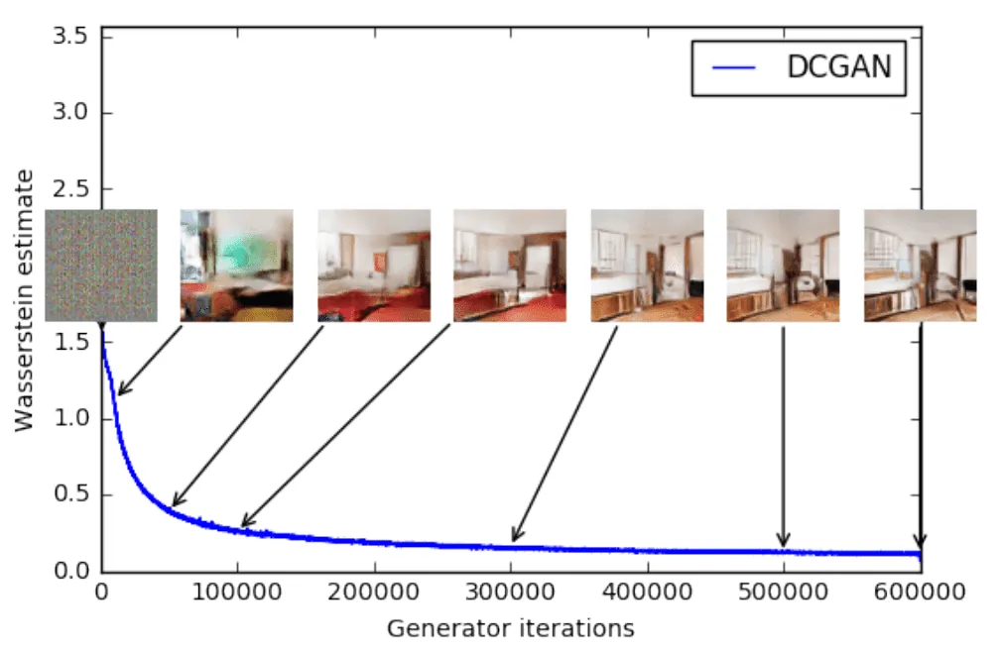
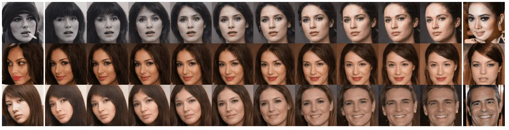
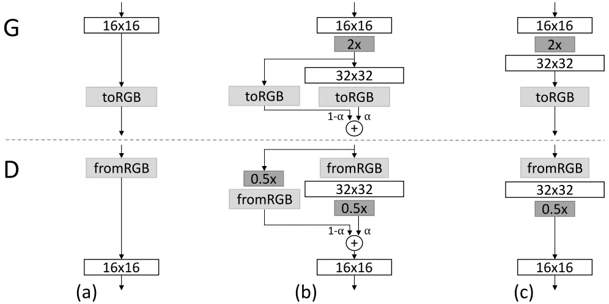
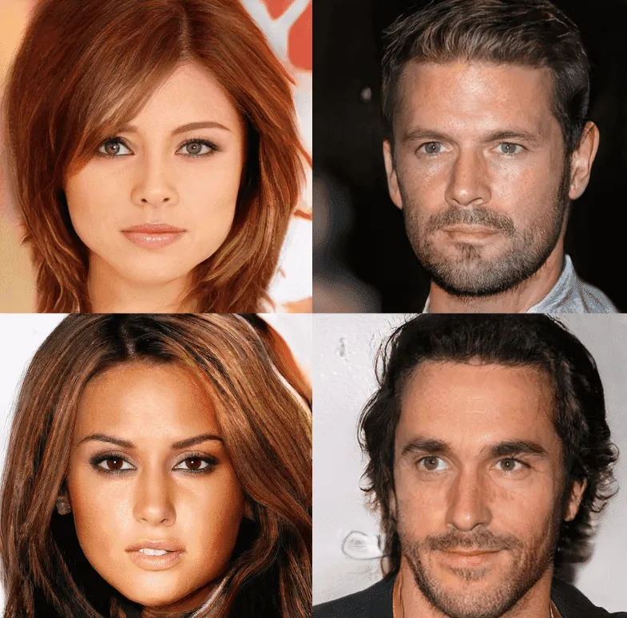

# GANs in Computer Vision: Improved Training with Wasserstein Distance, Game Theory Control, and Progressively Growing Schemes

**Source**: `raw/gan-computer-vision-incremental-training/full-article.md` (389 KB), `raw/gan-computer-vision-incremental-training/full-article.md` (markdown view)  
**URL**: https://theaisummer.com/gan-computer-vision-incremental-training/  
**Author**: Nikolas Adaloglou (AI Summer), 2020-04-22  
**Ingested**: 2026-06-06  
**Tags**: #summary

## Summary

Part 3 of Nikolas Adaloglou's AI Summer GAN series follows [[GANs in Computer Vision: Conditional Image Synthesis and 3D Object Generation]] with foundational training advances that address [[Mode Collapse]] and instability when scaling beyond MNIST/CIFAR/CelebA. The article frames GAN training as finding equilibrium in a two-player game and surveys three landmark 2017 methods.

**[[Wasserstein GAN]]** (Arjovsky et al., 2017) replaces the Jensen–Shannon objective with the Wasserstein (Earth Mover) distance between real and generated distributions. The critic estimates \(W(P_r, P_\theta) = \sup_{\|f\|_L \leq 1} [\mathbb{E}_{x\sim P_r}[f(x)] - \mathbb{E}_{x\sim P_\theta}[f(x)]]\) over K-Lipschitz functions. Weight clipping to \([-0.01, 0.01]\) enforces the Lipschitz constraint; D trains to optimality without saturating (unlike JS divergence), yielding cleaner gradients and reduced mode collapse. Train D for \(n_{\text{critic}}=5\) steps per G update. WGAN-GP (Gulrajani et al., 2017) replaces clipping with a gradient penalty on interpolated samples—code included but not fully surveyed.

Trade-offs: WGAN unstable with Adam/momentum and high learning rates; RMSProp preferred for non-stationary critic loss. No longer requires careful G/D capacity balancing.

**[[BEGAN]]** (Berthelot et al., 2017) uses an autoencoder discriminator outputting reconstructions (not scalars), optimizing Wasserstein distance between **reconstruction-error distributions** rather than sample distributions—avoiding explicit K-Lipschitz constraints on D. Balance ratio \(\gamma = \mathbb{E}[L(G(z))] / \mathbb{E}[L(x)]\) controls diversity vs quality; adaptive \(k_t\) updated each step via closed-loop feedback maintains equilibrium. Architecture: U-shaped encoder–decoder with ELU, sub-sampling conv down, nearest-neighbor up, FC bottleneck. Stable with Adam, no pretraining; 128×128 interpolations show smooth latent walks.

**[[Progressive GAN]]** (Karras et al., 2017) grows G and D from low to high resolution, learning global structure before fine details. New layers capture high-frequency content; smooth transitions blend old and new resolution paths via residual skip weight \(\alpha\) ramping 0→1. toRGB/fromRGB 1×1 convs project features to images at each scale. Real images are downscaled to match current resolution; during transitions, interpolated resolutions mimic GAN-like learning. Most iterations run at low resolution (2–6× speedup); first work to reach **1024×1024** megapixel faces. Stabilization: per-layer weight normalization, pixel feature normalization in G, normal init.

## Key Claims

- GAN training instability makes hyperparameter tuning from loss curves unreliable; foundational distance metrics and training schemes matter before chasing latest architectures.
- Wasserstein distance provides continuous, differentiable critic loss that does not saturate; enables training D to optimality and better G gradients.
- Weight clipping approximates K-Lipschitz constraint; WGAN-GP gradient penalty is the improved alternative.
- WGAN reduces need to balance G/D capacity and is more robust to architecture choices; prefers RMSProp over Adam.
- BEGAN: autoencoder D matches error distributions; \(\gamma\) hyperparameter trades diversity for quality; \(k_t\) feedback control stabilizes G/D balance.
- BEGAN converges when reconstruction loss \(L(x)\) is minimized and \(|\gamma L(x) - L(G(z))|\) is small.
- Progressive GAN: incremental resolution growth learns coarse-to-fine; smooth \(\alpha\) transitions stabilize layer additions.
- Progressive GAN enables megapixel generation; weight norm + feature norm mitigate escalating error magnitudes at high resolution.
- Mode collapse persists in progressive training due to unhealthy G/D competition; part 4 covers 2018+ advances.

## Figures

| Figure | Caption | Page |
|--------|---------|------|
|  | WGAN critic gradients remain informative across parameter space (vs saturated standard GAN) | — |
|  | WGAN training: stable decreasing loss and improving DCGAN samples | — |
|  | BEGAN U-shaped autoencoder discriminator/generator architecture | — |
|  | BEGAN 128×128 latent interpolations (γ controls diversity vs artifacts) | — |
|  | Progressive GAN incremental architecture growth | — |
|  | Progressive GAN smooth transition between resolutions (α-blended skip) | — |
|  | Progressive GAN 1024×1024 megapixel face results | — |

## Entities

- [[AI Summer]] — hosts part 3 of the GAN-in-CV series (2020).
- [[Nikolas Adaloglou]] — author.
- [[Wasserstein GAN]] — Earth Mover distance critic; weight clipping; n_critic training.
- [[BEGAN]] — boundary equilibrium GAN with autoencoder D and adaptive \(k_t\) control.
- [[Progressive GAN]] — coarse-to-fine resolution growing; first megapixel GAN faces.
- [[Mode Collapse]] — primary target of WGAN and progressive training tricks.
- [[Generative Adversarial Networks]] — overarching framework.
- [[DCGAN]] — generator used in WGAN results demo.

## Questions & Gaps

- WGAN-GP mentioned with code but not fully derived; clipping limitations noted briefly.
- BEGAN high-resolution results deferred ("what happens at really high resolutions" leads into Progressive GAN).
- Progressive GAN transition scheduling (when to add layers) acknowledged as underspecified in the paper.
- Daskalakis optimism and game-theoretic GAN training cited but not covered.
- See [[GANs in Computer Vision: 2K Image and Video Synthesis, and Large-Scale Class-Conditional Image Generation]] for Pix2PixHD, vid2vid, and BigGAN (part 4).

## Related

- [[GANs in Computer Vision: Introduction to Generative Learning]] — series part 1: vanilla GAN, mode collapse, Improved GAN tricks.
- [[GANs in Computer Vision: Conditional Image Synthesis and 3D Object Generation]] — series part 2: Pix2Pix, CycleGAN, 3D-GAN.
- [[GANs in Computer Vision: 2K Image and Video Synthesis, and Large-Scale Class-Conditional Image Generation]] — series part 4: Pix2PixHD, vid2vid, BigGAN.
- [[Papers Explained Review 05 - Generative Adversarial Networks]] — wiki survey including WGAN entry.
- [[Computer Vision]] — image generation topic hub.
- [[Deep Learning]] — directed generative nets (§20.10).
