# GANs in Computer Vision: Conditional Image Synthesis and 3D Object Generation

**Source**: `raw/gan-computer-vision-object-generation/full-article.html` (399 KB), `raw/gan-computer-vision-object-generation/full-article.md` (markdown view)  
**URL**: https://theaisummer.com/gan-computer-vision-object-generation/  
**Author**: Nikolas Adaloglou (AI Summer), 2020-04-16  
**Ingested**: 2026-06-06  
**Tags**: #summary

## Summary

Part 2 of Nikolas Adaloglou's AI Summer GAN series builds on [[GANs in Computer Vision: Introduction to Generative Learning]] toward higher-resolution conditional synthesis, 3D shape generation, and image-to-image translation. The article argues that understanding GAN progress in vision requires studying paired and unpaired translation—the design principles of these early successes still inform modern models.

**[[AC-GAN]]** (Odena et al., 2017) extends conditional GANs with an auxiliary classifier head on D that reconstructs class labels (reconstruction loss), stabilizing training and improving 128×128 ImageNet-class synthesis. An ensemble of 100 AC-GANs (10 classes each) yields 1000 realistic classes. Diversity is measured with multi-scale SSIM (MS-SSIM): lower same-class similarity implies higher diversity; generated samples trail real data but move in the right direction. Latent-space walks show noise controls structure while class conditions control category-specific attributes.

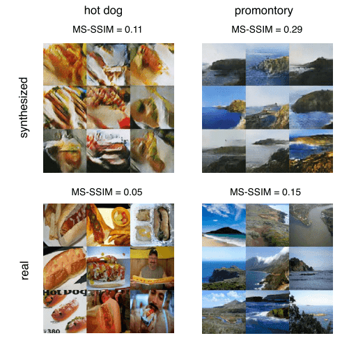

**[[3D-GAN]]** (Wu et al., 2016) applies volumetric convolutions (DCGAN-style, no pooling) to 64³ voxel grids. Training balances G and D via lower D learning rate, batch size 100, and updating D only when its last-batch accuracy ≤ 80%. **3D-VAE-GAN** adds a 2D image encoder projecting RGB to latent \(z\), combining adversarial loss with VAE KL and MSE reconstruction for single-image 3D reconstruction from paired 2D–3D data. Latent interpolation and vector arithmetic in \(z\) produce semantically meaningful 3D shape edits.

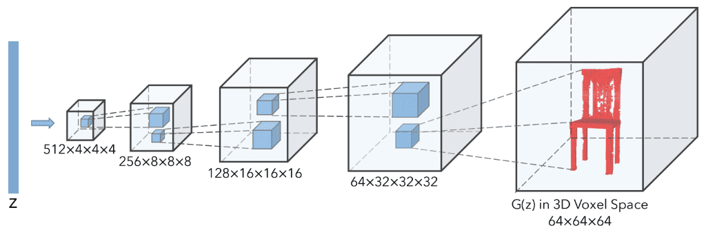

**[[PacGAN]]** (Lin et al., 2018) addresses [[Mode Collapse]] by packing \(n\) independent samples (real or fake, not mixed) into D's input channels—extending minibatch discrimination with binary hypothesis testing on product distributions. PacDCGAN improves diversity and sharpness over DCGAN with similar parameter count.

**[[Pix2Pix]]** (Isola et al., 2017) performs **paired** image-to-image translation: condition is an input image, output is a target image; noise is removed (deterministic mapping with dropout/BN at test time). Generator uses U-Net skip connections (shared low-level structure). **PatchGAN** discriminator classifies local patches and averages scores, focusing D on high-frequency details while L1 loss captures low frequencies (edges). Combined L1 + adversarial loss reduces blur vs L2-only reconstruction.

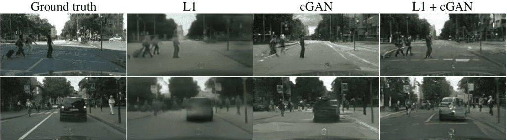

**[[CycleGAN]]** (Zhu et al., 2017) enables **unpaired** domain translation \(G: X \to Y\) and \(F: Y \to X\) with cycle-consistency loss \(F(G(x)) \approx x\) and \(G(F(y)) \approx y\). Two GANs (four networks) train jointly; optional identity loss preserves color when domains share structure. Results are impressive for style transfer but blurrier than Pix2Pix; struggles with large geometric changes and learns global domain characteristics before local detail.

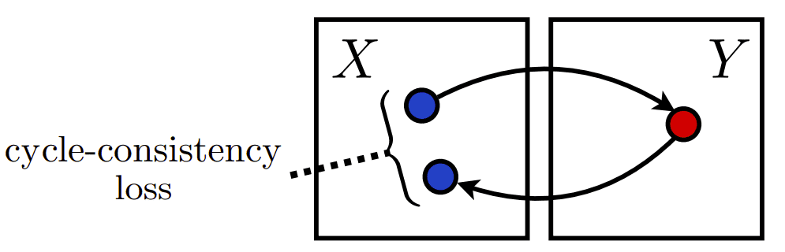

## Key Claims

- AC-GAN auxiliary classifier reconstruction loss stabilizes training and improves 128×128 class-conditional ImageNet synthesis; 100-model ensemble scales to 1000 classes.
- Higher resolution (up to 128×128) increases inception-score discriminability; MS-SSIM tracks intra-class diversity (lower = more diverse).
- Restricting AC-GAN training from 1000 to 10 classes improves quality; single-class GANs remain unstable (mode collapse).
- 3D voxel generation is far higher-dimensional than 2D (64³ ≈ 262K voxels vs 64² = 4K pixels); volumetric DCGAN with training tricks balances G/D.
- 3D-VAE-GAN: 2D encoder → latent \(z\) → 3D generator; KL + MSE + adversarial loss; supports generation, classification, and single-view 3D reconstruction.
- Latent-space arithmetic in 3D GANs generalizes InfoGAN-style disentanglement to additive/subtractive shape semantics.
- PacGAN packs multiple samples into D input to detect mode collapse via lack of diversity across packed sets.
- Pix2Pix: paired translation, U-Net G, PatchGAN D, L1 + adversarial loss splits low/high frequency modeling.
- CycleGAN: unpaired domains via bidirectional mappings + cycle-consistency; competitive with but generally below paired Pix2Pix quality.
- Unpaired translation fails on tasks needing large geometric changes; captures global domain statistics first.

## Figures

| Figure | Caption | Page |
|--------|---------|------|
|  | AC-GAN: MS-SSIM similarity of generated vs real same-class images | — |
| 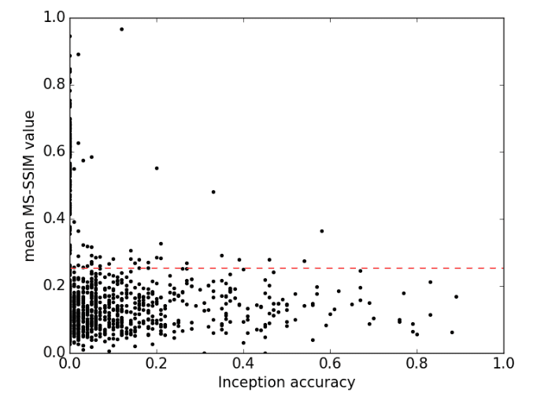 | AC-GAN: MS-SSIM vs inception accuracy scatter (red = real-data diversity) | — |
| 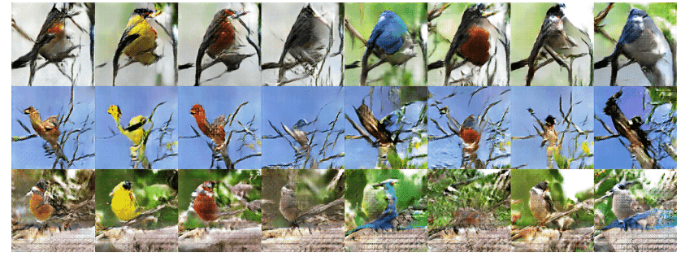 | AC-GAN latent walks: rows = same noise, different class; columns = same class, different noise | — |
|  | 3D-GAN generator: 4×4×4 conv3d blocks doubling spatial dims | — |
| 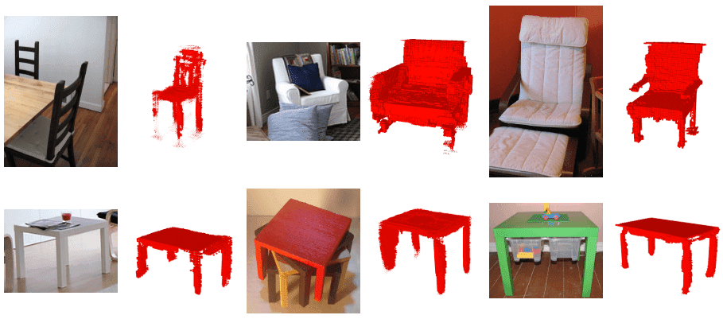 | 3D-VAE-GAN single RGB image → voxelized 3D reconstruction | — |
| 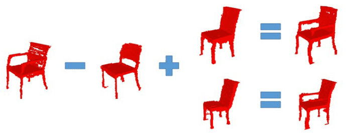 | 3D-VAE-GAN latent vector arithmetic producing semantic shape edits | — |
| 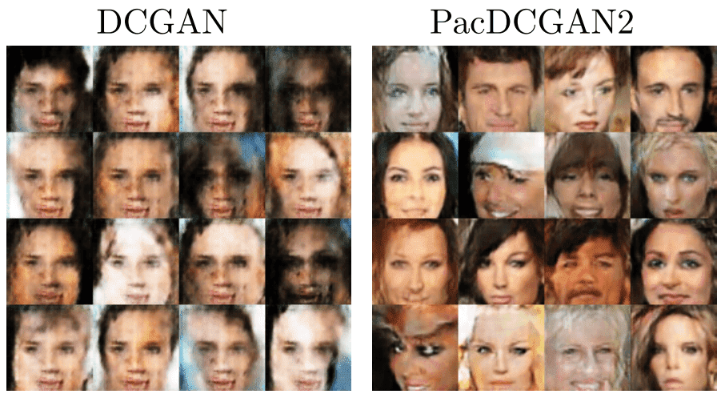 | PacGAN: packed-sample discriminator improves diversity over DCGAN | — |
|  | Pix2Pix PatchGAN results: L1 + adversarial vs ablations | — |
|  | CycleGAN cycle consistency diagram: F(G(x)) ≈ x | — |
| 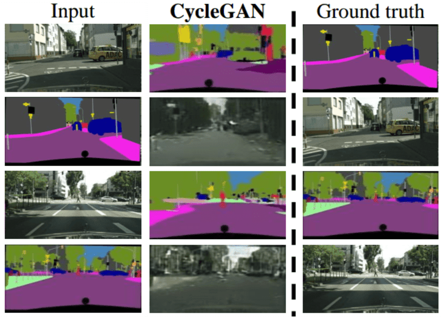 | CycleGAN unpaired translation results (both directions) | — |
| 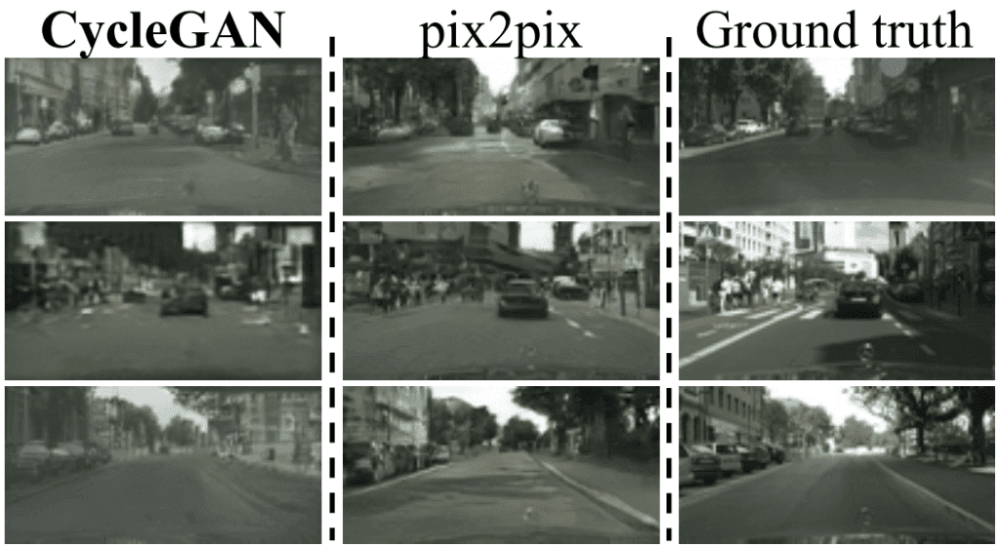 | CycleGAN vs Pix2Pix comparison on paired task (unfair but competitive) | — |

## Entities

- [[AI Summer]] — hosts part 2 of the GAN-in-CV series (2020).
- [[Nikolas Adaloglou]] — author.
- [[AC-GAN]] — auxiliary classifier GAN for large-scale class-conditional synthesis.
- [[3D-GAN]] — volumetric GAN and 3D-VAE-GAN for shape generation and single-view reconstruction.
- [[PacGAN]] — packed-sample discriminator for mode-collapse mitigation.
- [[Pix2Pix]] — paired image-to-image translation with U-Net and PatchGAN.
- [[CycleGAN]] — unpaired domain translation via cycle consistency.
- [[Mode Collapse]] — revisited via PacGAN and single-class training instability.
- [[Inception Score]] — discriminability metric for AC-GAN evaluation.
- [[Feature Matching]] — related Improved-GAN trick from part 1; PacGAN extends minibatch discrimination.
- [[Variational Autoencoders]] — 3D-VAE-GAN combines VAE encoder with adversarial 3D generator.
- [[Generative Adversarial Networks]] — overarching framework.

## Questions & Gaps

- See [[GANs in Computer Vision: Improved Training with Wasserstein Distance, Game Theory Control, and Progressively Growing Schemes]] for WGAN, BEGAN, and Progressive GAN (part 3).
- 3D-VAE-GAN requires paired 2D–3D supervision; no discussion of NeRF-era implicit representations.
- CycleGAN identity loss and hyperparameter \(\lambda\) mentioned but not deeply analyzed.
- Pix2Pix variability limited by removing noise; no follow-up to stochastic variants in this article.
- MS-SSIM as diversity proxy is experimental; FID and precision/recall metrics not discussed.

## Related

- [[GANs in Computer Vision: Introduction to Generative Learning]] — series part 1: vanilla GAN, DCGAN, InfoGAN, Improved GAN tricks.
- [[GANs in Computer Vision: Improved Training with Wasserstein Distance, Game Theory Control, and Progressively Growing Schemes]] — series part 3: WGAN, BEGAN, Progressive GAN, megapixel synthesis.
- [[Papers Explained Review 05 - Generative Adversarial Networks]] — wiki survey including CycleGAN entry.
- [[How to Generate Images using Autoencoders]] — VAE generative baseline contrasted with GAN sharpness.
- [[Computer Vision]] — topic hub for image synthesis and translation.
- [[Deep Learning]] — directed generative nets and GAN foundations.
