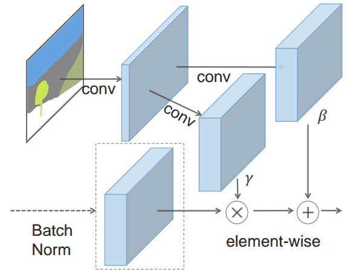
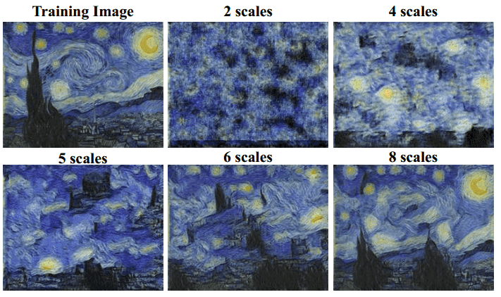
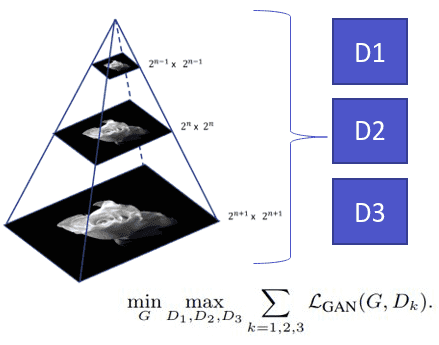
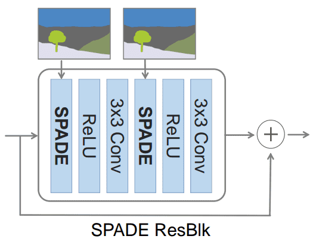
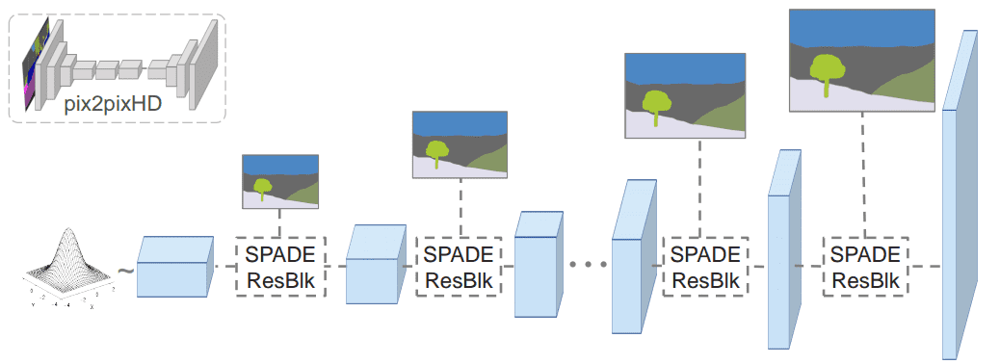
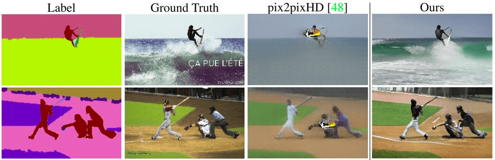
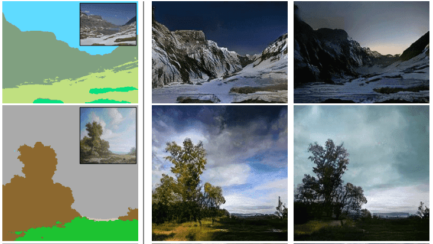
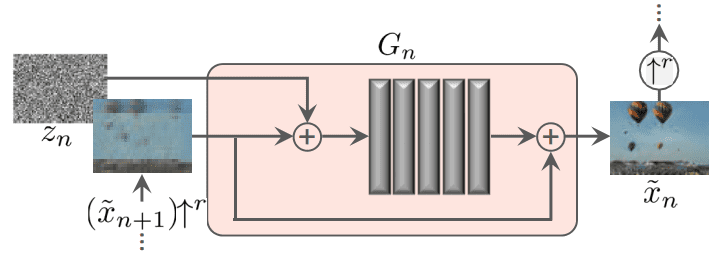
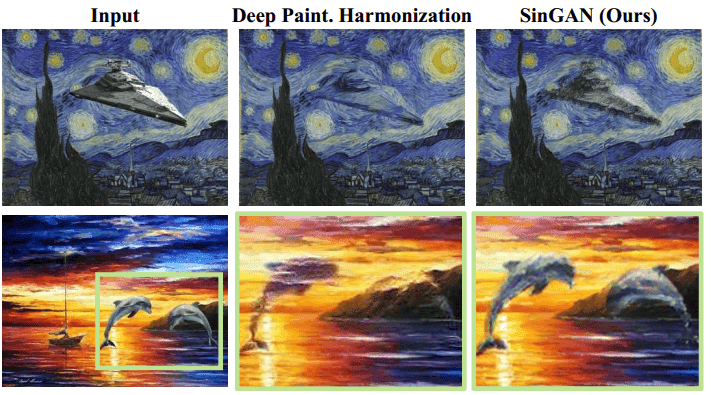

# GANs in Computer Vision: Semantic Image Synthesis and Learning a Generative Model from a Single Image

**Source**: `raw/gan-computer-vision-semantic-synthesis/full-article.html` (379 KB), `raw/gan-computer-vision-semantic-synthesis/full-article.md` (markdown view)  
**URL**: https://theaisummer.com/gan-computer-vision-semantic-synthesis/  
**Author**: Nikolas Adaloglou (AI Summer), 2020-05-26  
**Ingested**: 2026-06-06  
**Tags**: #summary

## Summary

Part 6 (series finale) of Nikolas Adaloglou's AI Summer GAN survey covers two 2019 ICCV-era works: **GauGAN** (semantic image synthesis with [[SPADE]]) and **[[SinGAN]]** (generative modeling from a single natural image). The article emphasizes design intuition over benchmark numbers.

**GauGAN** (Park et al., 2019) generates photorealistic images from segmentation maps, optionally conditioned on a reference image for multi-modal synthesis. It reuses [[Pix2PixHD]]'s multi-scale image-pyramid PatchGAN discriminators but replaces the generator: [[Adaptive Instance Normalization]] discards semantic layout because it applies uniform per-channel scaling across spatial locations. **SPADE** (Spatially-Adaptive Normalization) normalizes activations then applies \(\gamma_{c,y,x}, \beta_{c,y,x}\) predicted by convolutions on the segmentation mask—preserving label layout in 3D modulation tensors. SPADE ResNet blocks replace batch norm; the generator has no encoder (mask injected only via SPADE), reducing parameters vs Pix2PixHD. Downsampling mask matches each resolution. Optional image encoder + noise vector enables VAE-style multi-modal synthesis (style in latent, semantics in SPADE). Baseline **pix2pixHD++** ablates all improvements except SPADE; SPADE-G still wins with fewer parameters. DeepLab v2 infers segmentation at test time.

**SinGAN** (Shaham et al., 2019, ICCV 2019 best paper) trains a **pyramid of patch-GANs** on one image's multi-scale downsampled versions. Fully convolutional G/D per scale; coarse scales train first then freeze; WGAN-GP stabilizes training. Generator block: 5 conv layers + BN + ReLU, noise injection, additive skip from upsampled input. Limited receptive field per scale prevents memorizing the single training image. Reconstruction loss with zero noise (and fixed \(z_{\text{fixed}}\) at finest scale) anchors the distribution. Applications: random diverse samples preserving patch statistics, super-resolution, paint-to-image, **image harmonization** (paste foreign object, SinGAN adjusts texture), editing, single-image animation via latent walks.

## Key Claims

- Semantic image synthesis should disentangle style (latent/reference) from layout (segmentation); global AdaIN destroys spatial semantic structure.
- SPADE: discard prior-layer stats, channel-normalize, then apply mask-predicted spatially varying γ/β tensors.
- SPADE generator needs no encoder; segmentation enters only through SPADE blocks at each resolution.
- GauGAN enables diverse indoor/outdoor/landscape synthesis; online demo available; photorealistic vs real image comparison shown.
- SinGAN: internal patch statistics of one image suffice to train a generative hierarchy.
- SinGAN uses progressive coarse-to-fine training with frozen scales, per-scale noise, small receptive fields, and WGAN-GP.
- Reconstruction with zero noise calibrates noise std per scale; enables harmonization by matching patch distribution of training image.
- Series concludes here; free e-book consolidates all six parts.

## Figures

| Figure | Caption | Page |
|--------|---------|------|
|  | GauGAN multi-scale Pix2PixHD-style discriminator image pyramid | — |
|  | SPADE normalization block architecture | — |
|  | SPADE ResNet block (two SPADE layers before activations) | — |
|  | SPADE-based generator with downsampled mask per resolution | — |
|  | GauGAN vs top methods comparison | — |
|  | GauGAN synthesis vs original natural images | — |
|  | SinGAN output at different scales (coarse to fine) | — |
|  | SinGAN single-scale generator building block | — |
|  | SinGAN image harmonization: pasted object texture adaptation | — |

## Entities

- [[AI Summer]] — hosts part 6 / series finale of GAN-in-CV survey (2020).
- [[Nikolas Adaloglou]] — author (co-authored series e-book with Sergios Karagiannakos).
- [[GauGAN]] — NVIDIA semantic synthesis GAN with SPADE generator.
- [[SPADE]] — spatially-adaptive normalization for layout-preserving synthesis.
- [[SinGAN]] — single-image multi-scale patch-GAN hierarchy (ICCV 2019 best paper).
- [[Pix2PixHD]] — multi-scale D baseline reused by GauGAN.
- [[Adaptive Instance Normalization]] — contrasted with SPADE (loses spatial semantics).
- [[Wasserstein GAN]] — WGAN-GP used in SinGAN training.
- [[Progressive GAN]] — coarse-to-fine analogy for SinGAN scale training.
- [[Variational Autoencoders]] — GauGAN multi-modal encoder+G likened to VAE.

## Questions & Gaps

- Citation block in source article incorrectly points to normalization article URL (metadata error in original post).
- SinGAN applications listed but not deeply benchmarked; super-resolution/editing shown qualitatively.
- No coverage of later diffusion-based semantic synthesis (e.g. ControlNet era).
- Odena 2019 open questions linked but not summarized.

## Related

- [[GANs in Computer Vision: Self-Supervised Adversarial Training and High-Resolution Image Synthesis with Style Incorporation]] — series part 5: StyleGAN, AdaIN primer.
- [[GANs in Computer Vision: 2K Image and Video Synthesis, and Large-Scale Class-Conditional Image Generation]] — Pix2PixHD foundation (part 4).
- [[In-layer Normalization Techniques for Training Very Deep Neural Networks]] — SPADE covered in normalization survey.
- [[Papers Explained 253 - SPADE]] — paper-level wiki entry.
- [[Generative Adversarial Networks]] — series-spanning concept hub.
- [[Computer Vision]] — semantic segmentation and synthesis topic hub.
