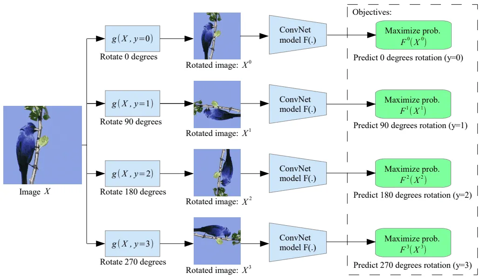
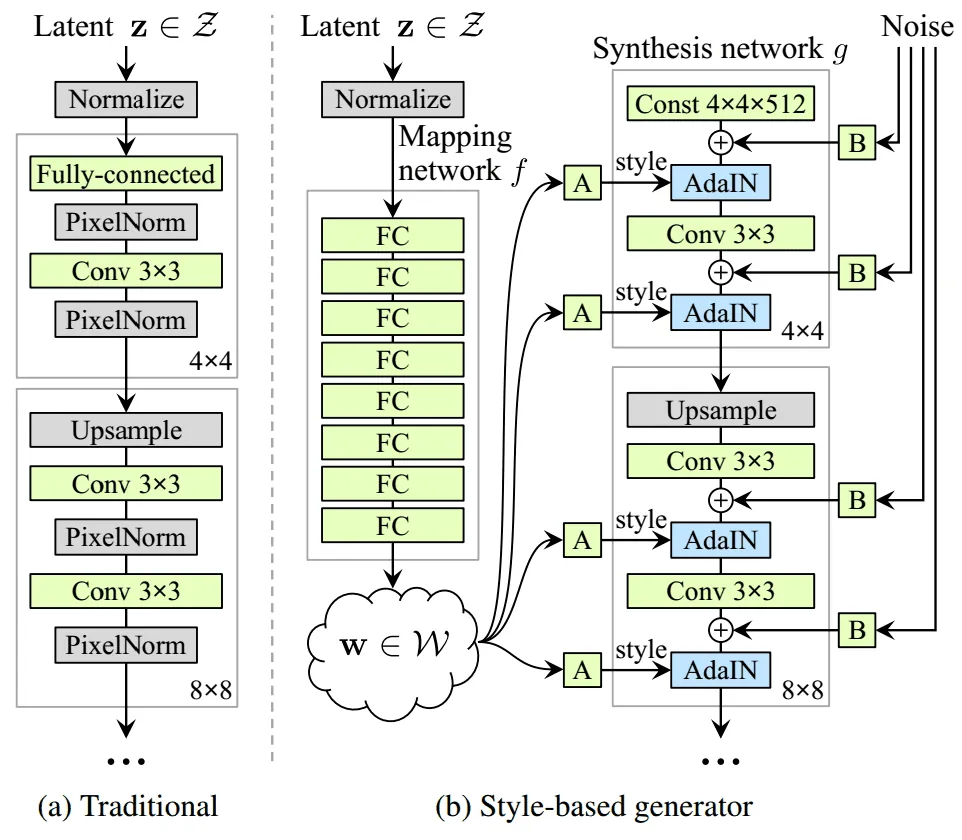
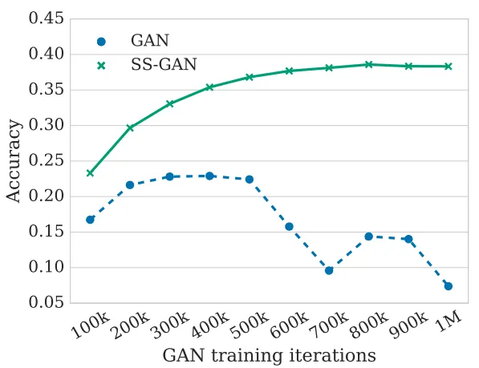
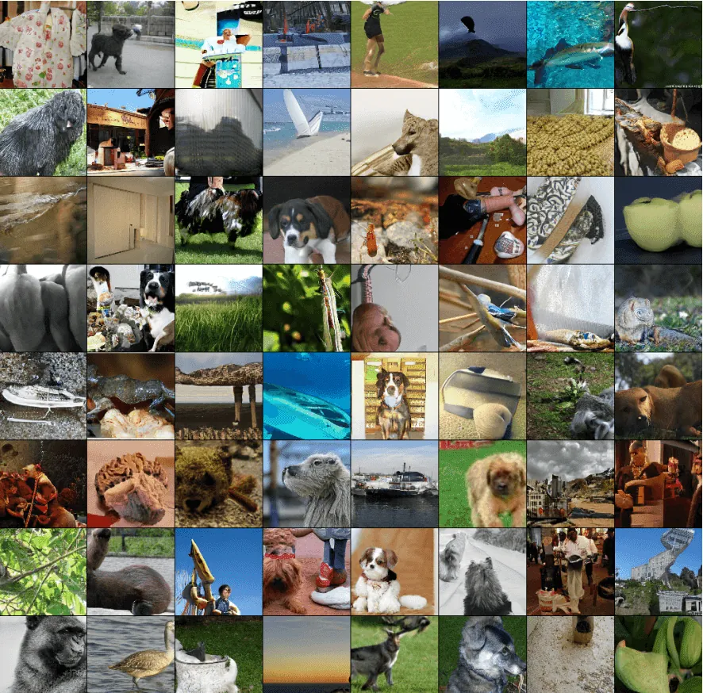
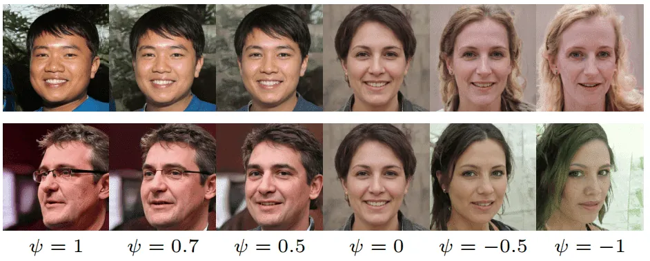
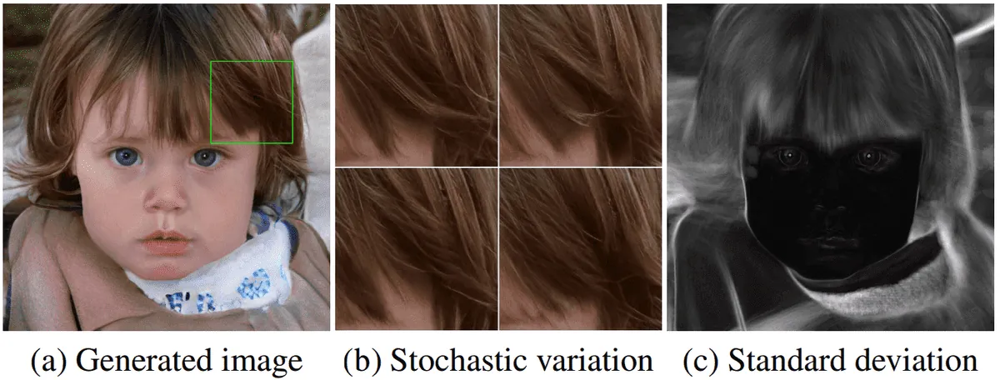
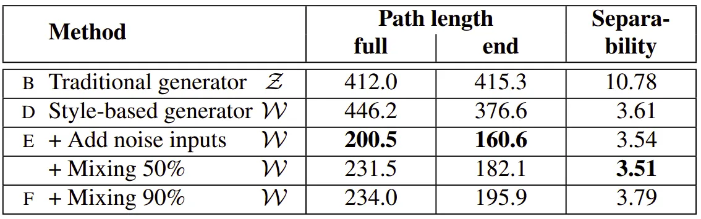

# GANs in Computer Vision: Self-Supervised Adversarial Training and High-Resolution Image Synthesis with Style Incorporation

**Source**: `raw/gan-computer-vision-style-gan/full-article.md`, `raw/gan-computer-vision-style-gan/full-article.md` (markdown view)  
**URL**: https://theaisummer.com/gan-computer-vision-style-gan/  
**Author**: Nikolas Adaloglou (AI Summer), 2020-05-10  
**Ingested**: 2026-06-06  
**Tags**: #summary

## Summary

Part 5 of Nikolas Adaloglou's AI Summer GAN series follows [[GANs in Computer Vision: 2K Image and Video Synthesis, and Large-Scale Class-Conditional Image Generation]] with two 2018–2019 advances: self-supervised auxiliary losses for unconditional ImageNet GANs, and [[StyleGAN]]'s style-based generator with [[Adaptive Instance Normalization]].

**Self-supervised GANs** (Chen et al., 2019) address discriminator **forgetting** in unconditional training: as \(P_G\) shifts non-stationarily, D loses class-discriminative features (measured by offline logistic regression on D's last-layer features). The fix is **collaborative adversarial training** with a rotation pretext task (Gidaris et al.): D has heads \(P_D\) (real/fake) and \(Q_D\) (rotation angle among {0°, 90°, 180°, 270°}); only real images update \(Q_D\), while G is encouraged to produce rotation-detectable fakes via auxiliary loss with \(\alpha\) annealed to 0. On ImageNet 128×128 (batch 2048, TPU), self-supervised GAN closes the gap between unconditional and conditional synthesis quality without labels.

**[[StyleGAN]]** (Karras et al., 2019) builds on [[Progressive GAN]] progressive synthesis and AdaIN-style control. Latent \(z\) passes through mapping network \(f\) to intermediate space \(W\) (less entangled than \(Z\)). Style vectors \(w\) split into per-layer AdaIN scale/shift (A blocks); per-pixel noise images (B blocks) add stochastic detail. Synthesis network \(g\) starts from constant 4×4×512 tensor, upsamples 4×4→1024×1024 with AdaIN after each conv. **Truncation** in \(W\): \(w' = E(w) + \psi(w - E(w))\). **Style mixing**: apply \(w_1\) before crossover, \(w_2\) after (90% of images). Style controls global attributes (pose, lighting); noise controls local stochastic variation. Metrics: perceptual path length (VGG embedding distance along slerp) and linear separability (SVM on latent codes vs classifier labels on CelebA attributes).

Normalization primer: [[Batch Normalization]] mixes batch statistics (good for classification); instance normalization (IN) normalizes per-sample spatial stats—affine \(\gamma,\beta\) encode style. AdaIN aligns content feature statistics to a style reference: \(\text{AdaIN}(x,y) = \sigma(y)\frac{x-\mu(x)}{\sigma(x)} + \mu(y)\).

## Key Claims

- Self-supervised learning produces cheap, accurate pseudo-labels from unlabeled data to guide representation learning.
- Unconditional GAN training is non-stationary; D forgets discriminative features over iterations (observed on ImageNet/CIFAR-10).
- Collaborative rotation loss on D stabilizes representations; \(\alpha\) annealed so adversarial objective dominates at convergence.
- Self-supervised GAN matches conditional GAN image quality on ImageNet without class labels; rotation-only training degrades representations.
- StyleGAN mapping network \(f\) unwraps \(Z\) into disentangled \(W\); AdaIN injects style per conv layer; noise inputs model local stochasticity.
- Style effects are localized (each AdaIN overrides previous); noise effects are per-pixel localized.
- Truncation and style mixing are regularizers improving sample quality and disentanglement.
- Perceptual path length and linear separability quantify latent-space disentanglement; \(W\) scores better than \(Z\) on both.

## Figures

| Figure | Caption | Page |
|--------|---------|------|
|  | Self-supervised rotation baseline: 4 rotations per image (Gidaris et al.) | — |
|  | D forgetting: unconditional GAN classifier accuracy drops after 500k iters | — |
|  | Self-supervised GAN ImageNet 128×128 samples | — |
|  | AdaIN encoder–decoder style transfer architecture and results | — |
|  | StyleGAN style-based generator overview | — |
|  | StyleGAN truncation in W space: attribute flips at ψ→0 | — |
|  | Localized noise injection: regional std-dev maps | — |
|  | Linear separability metric: StyleGAN W vs Z vs Progressive GAN | — |

## Entities

- [[AI Summer]] — hosts part 5 of the GAN-in-CV series (2020).
- [[Nikolas Adaloglou]] — author.
- [[StyleGAN]] — style-based generator with mapping network, AdaIN, noise (Karras et al. 2019).
- [[Self-Supervised GAN]] — auxiliary rotation loss for unconditional ImageNet GANs (Chen et al. 2019).
- [[Adaptive Instance Normalization]] — feature-space style transfer via aligned channel statistics.
- [[Progressive GAN]] — progressive synthesis baseline for StyleGAN.
- [[BigGAN]] — truncation trick predecessor in Z space; StyleGAN truncates in W.
- [[InfoGAN]] — prior disentanglement work; StyleGAN quantifies disentanglement metrics.
- [[Batch Normalization]] — batch-wide normalization contrasted with instance/AdaIN.
- [[Unsupervised Learning]] — self-supervised as label-free supervision within GAN training.

## Questions & Gaps

- See [[GANs in Computer Vision: Semantic Image Synthesis and Learning a Generative Model from a Single Image]] for GauGAN/SPADE and SinGAN (part 6, series finale).
- Spectral normalization cited in references but not deeply covered here.
- StyleGAN2/3 improvements not discussed (article is 2020 survey of 2018–2019 work).
- Self-supervised GAN at 128×128 only; scaling to megapixel unconditional generation deferred to StyleGAN.

## Related

- [[GANs in Computer Vision: 2K Image and Video Synthesis, and Large-Scale Class-Conditional Image Generation]] — series part 4: Pix2PixHD, BigGAN.
- [[GANs in Computer Vision: Improved Training with Wasserstein Distance, Game Theory Control, and Progressively Growing Schemes]] — Progressive GAN foundation (part 3).
- [[GANs in Computer Vision: Introduction to Generative Learning]] — InfoGAN disentanglement (part 1).
- [[Computer Vision]] — generative modeling topic hub.
