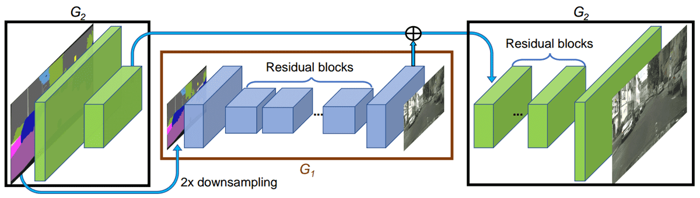
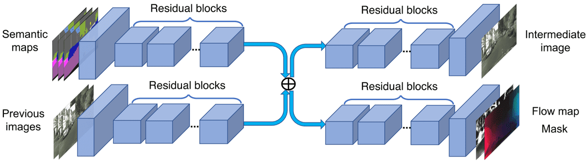
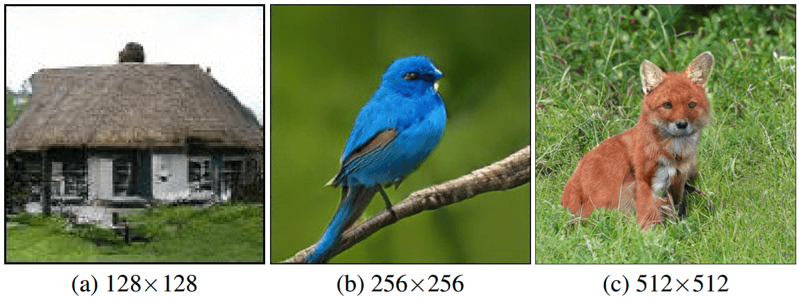
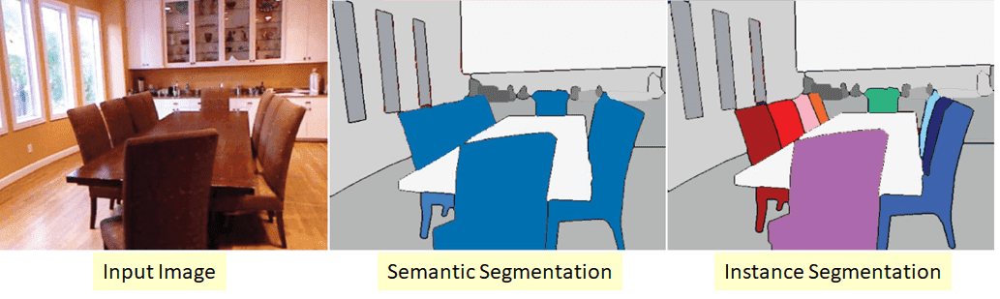
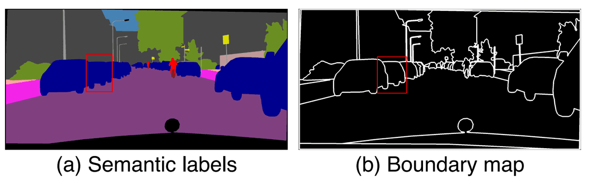
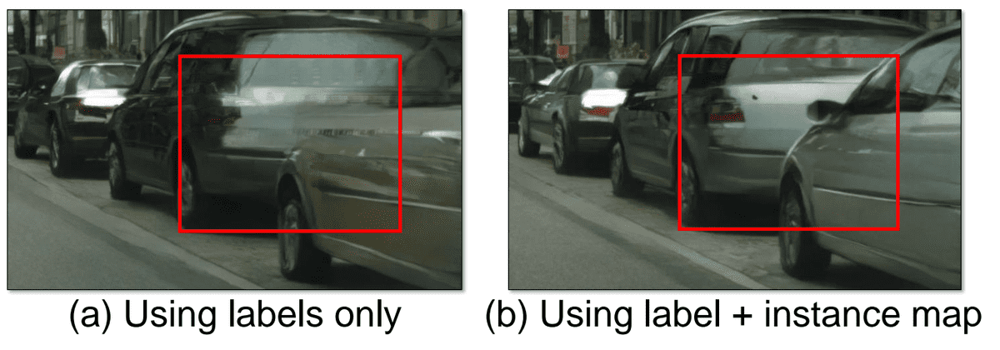
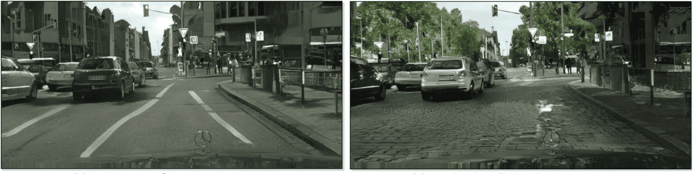
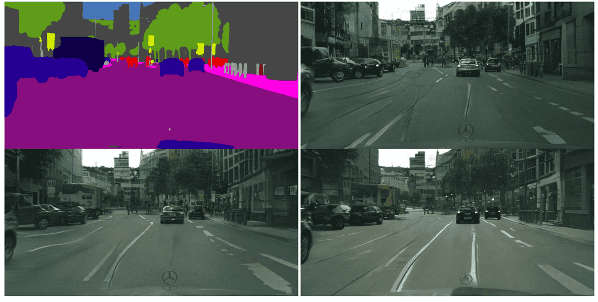
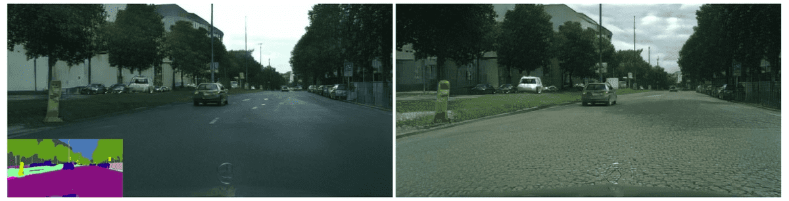

# GANs in Computer Vision: 2K Image and Video Synthesis, and Large-Scale Class-Conditional Image Generation

**Source**: `raw/gan-computer-vision-video-synthesis/full-article.html` (358 KB), `raw/gan-computer-vision-video-synthesis/full-article.md` (markdown view)  
**URL**: https://theaisummer.com/gan-computer-vision-video-synthesis/  
**Author**: Nikolas Adaloglou (AI Summer), 2020-05-03  
**Ingested**: 2026-06-06  
**Tags**: #summary

## Summary

Part 4 of Nikolas Adaloglou's AI Summer GAN series follows [[GANs in Computer Vision: Improved Training with Wasserstein Distance, Game Theory Control, and Progressively Growing Schemes]] into 2018 NVIDIA-led advances: 2K semantic image synthesis, temporally coherent video generation, and ImageNet-scale class-conditional generation. The article exploits rich vision labels (semantic/instance segmentation, optical flow) and pretrained models to maximize visual quality.

**[[Pix2PixHD]]** (Wang et al., 2017) extends [[Pix2Pix]] to 2048×1024 via a two-part generator: global network G1 (front conv → residual blocks → transposed conv back-end) produces 1024×512 structure; local enhancer G2 at 2048×1024 refines high frequencies by summing G2_front features with G1_back output before residual processing. Three identical PatchGAN discriminators operate on an image pyramid (2048×1024, 1024×512, 512×256) for global vs local consistency. Multi-scale [[Feature Matching]] loss matches intermediate D activations at each scale. Instance boundary maps (4-neighbor ID differences) and learned instance feature embeddings (encoder E + instance-wise average pooling + per-category K-means clusters) add diversity and object-boundary fidelity beyond plain semantic maps.

**[[Video-to-Video Synthesis]]** (vid2vid, Wang et al., 2018) conditions frame generation on past segmentations \((s_1,s_2,s_3)\) and past frames \((x_1,x_2)\) under a Markov factorization. Generator \(F\) blends optical-flow-warped previous frame \(w(x_2)\) with hallucinated occluded regions \(h\): \(x_3 = m' \cdot w(x_2) + m \cdot h\), using pretrained FlowNet2 (W) and Mask R-CNN soft masks (M). Dual discriminators: image PatchGAN \(D_I\) on single-frame pairs; video PatchGAN \(D_V\) on \(k\)-frame sequences with optical flow for temporal coherence. Foreground/background split improves flow estimation (background as global transform). Instance feature embeddings from Pix2PixHD enable multimodal per-instance diversity at test time.

**[[BigGAN]]** (Brock et al., 2018) scales class-conditional ImageNet GANs via SA-GAN backbone with spectral normalization, hinge loss, conditional batch norm with shared class embedding, orthogonal init, 2 D-steps per G-step, skip-z latent injections, and the **truncation trick** (resample \(z\) if norm exceeds threshold at inference—quality↑ diversity↓). Engineering scale-ups: batch size 2048 (+46% score), 50% more channels (+21%), skip-z depth (+4%, 18% faster training). Stability requires balanced G/D interaction; class leakage and texture-vs-structure generation difficulty vary by ImageNet class.

## Key Claims

- Pix2PixHD: multi-scale G (global + local enhancer) and multi-scale D (image pyramid) enable 2K semantic synthesis; without multi-scale D, repeated patterns appear.
- Instance boundary maps from instance segmentation disambiguate same-class objects; learned embeddings + K-means per category enable style control at inference.
- Per-frame Pix2PixHD stacking lacks temporal coherence; video synthesis requires explicit spatio-temporal modeling.
- Vid2vid: Markov conditioning on 2 past frames + segmentations; optical flow warping handles non-occluded pixels; generator H fills occlusions.
- Foreground/background semantic prior improves optical-flow quality for video synthesis.
- BigGAN: large-batch distributed training, width/depth scaling, spectral norm, hinge loss, conditional batch norm, skip-z, truncation trick achieve SOTA class-conditional ImageNet generation.
- Truncation trick trades diversity for sample quality; orthogonal regularization helps G stay smooth across latent space.
- Texture-heavy classes (dogs) generate more easily than structure-heavy rare classes (crowds).

## Figures

| Figure | Caption | Page |
|--------|---------|------|
|  | Pix2PixHD generator: global G1 + local enhancer G2 with feature fusion | — |
|  | Semantic vs instance segmentation (Silberman et al. ECCV 2014) | — |
|  | Instance boundary map from 4-neighbor class-ID differences | — |
|  | Hand-crafted instance boundary maps improve synthesis | — |
|  | Instance-level feature embeddings: road/car style control | — |
|  | Vid2vid generator: FlowNet2 warping + Mask R-CNN blending + hallucinator H | — |
|  | Vid2vid: foreground/background prior improves results | — |
|  | Vid2vid instance feature embedding: per-instance road style change | — |
|  | BigGAN ImageNet class-conditional generation results | — |

## Entities

- [[AI Summer]] — hosts part 4 of the GAN-in-CV series (2020).
- [[Nikolas Adaloglou]] — author.
- [[Pix2PixHD]] — 2K multi-scale semantic image synthesis (NVIDIA).
- [[Video-to-Video Synthesis]] — temporally coherent 2K video GAN (vid2vid).
- [[BigGAN]] — large-scale class-conditional ImageNet GAN.
- [[Pix2Pix]] — paired translation baseline extended by Pix2PixHD.
- [[Progressive GAN]] — prior megapixel work; Pix2PixHD uses related coarse-to-fine G design.
- [[Feature Matching]] — multi-scale discriminator feature loss in Pix2PixHD/vid2vid.
- [[Generative Adversarial Networks]] — overarching framework.
- [[Computer Vision]] — segmentation, optical flow, instance detection as conditioning signals.

## Questions & Gaps

- Spectral normalization cited for BigGAN but not derived; deferred to external reading.
- StarGAN mentioned in conclusion but not covered.
- See [[GANs in Computer Vision: Self-Supervised Adversarial Training and High-Resolution Image Synthesis with Style Incorporation]] for self-supervised GANs and StyleGAN (part 5).
- BigGAN requires multi-GPU distributed training; not practical on single GPU.
- Vid2vid relies on pretrained FlowNet2 and Mask R-CNN; end-to-end training assumptions underspecified.

## Related

- [[GANs in Computer Vision: Conditional Image Synthesis and 3D Object Generation]] — Pix2Pix baseline (part 2).
- [[GANs in Computer Vision: Improved Training with Wasserstein Distance, Game Theory Control, and Progressively Growing Schemes]] — Progressive GAN precursor (part 3).
- [[Papers Explained Review 05 - Generative Adversarial Networks]] — wiki GAN survey.
- [[GANs in Computer Vision: Self-Supervised Adversarial Training and High-Resolution Image Synthesis with Style Incorporation]] — series part 5: self-supervised GAN, StyleGAN, AdaIN.
- [[Computer Vision]] — segmentation and video synthesis topic hub.
