# GANs in Computer Vision: Introduction to Generative Learning

**Source**: `raw/gan-computer-vision/full-article.html` (376 KB), `raw/gan-computer-vision/full-article.md` (markdown view)  
**URL**: https://theaisummer.com/gan-computer-vision/  
**Author**: Nikolas Adaloglou (AI Summer), 2020-04-10  
**Ingested**: 2026-06-06  
**Tags**: #summary

## Summary

Nikolas Adaloglou opens a multi-part AI Summer series on [[Generative Adversarial Networks]] for [[Computer Vision]]. Generative learning splits broadly into [[Variational Autoencoders]] and GANs; the article argues that pixel-wise MSE/L1 autoencoder training yields blurry, averaged outputs and cannot produce diverse samples the way adversarial training can. The GAN framing inverts [[Adversarial Training]]: instead of hardening a classifier against perturbations, a **generator** learns to synthesize realistic data while a **discriminator** learns to distinguish real from fake—a two-player minimax game whose Nash equilibrium is indistinguishable fakes (D output ≈ 0.5).

The vanilla GAN (Goodfellow et al., 2014) samples latent noise \(z\), maps it through G to an image, and trains D on real vs generated batches. G is updated **indirectly**—to fool D (target label 1 on fakes)—not to match a specific real image. The minimax objective and alternating gradient-ascent (D) / gradient-descent (G) updates are derived with PyTorch training loops. MNIST demos show progressive digit formation across epochs.

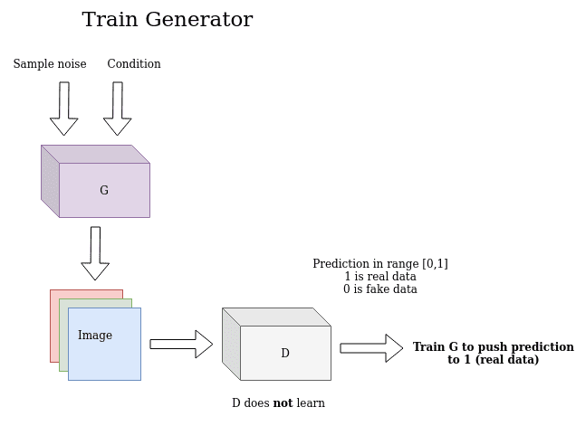

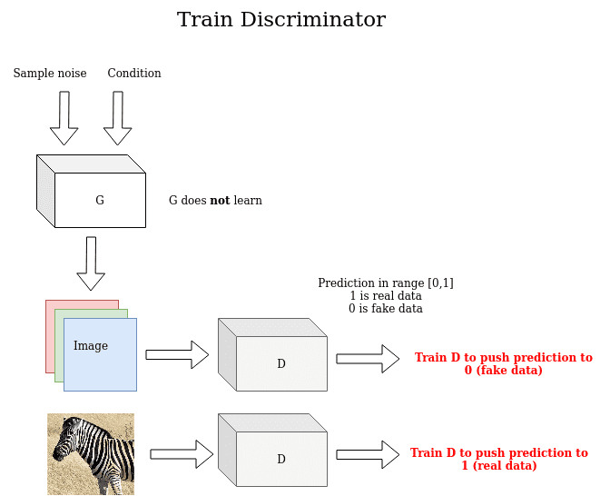

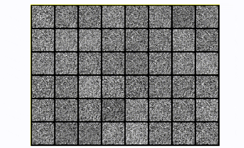

A central pathology is **[[Mode Collapse]]**: G collapses to a few modes (or a single point), producing identical outputs; D then easily rejects them and gradients become unstable. Conditional GANs (Mirza & Osindero, 2014) inject auxiliary labels/tags into both G and D via concatenation for guided synthesis. **[[DCGAN]]** (Radford et al., 2015) replaces pooling with strided convolutions in D, uses transpose convolutions in G, batch normalization, no FC hidden layers, ReLU in G and LeakyReLU in D—becoming the convolutional GAN baseline with sharper MNIST/CIFAR-10 results but still vulnerable to collapse on single-class CIFAR.

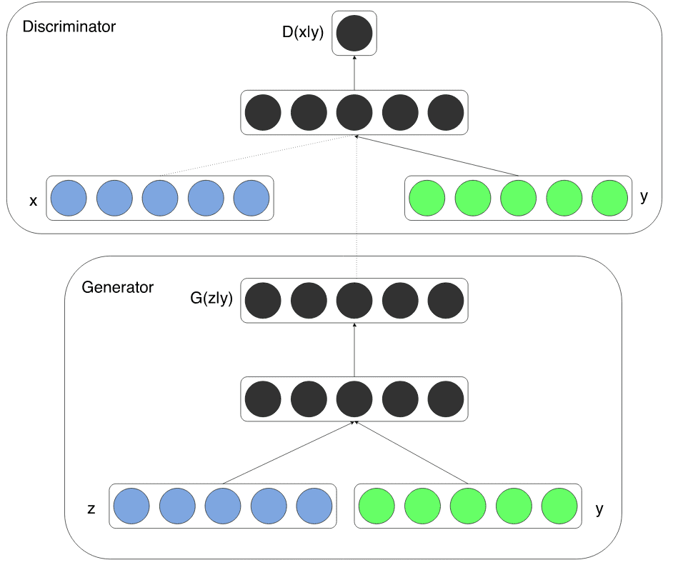

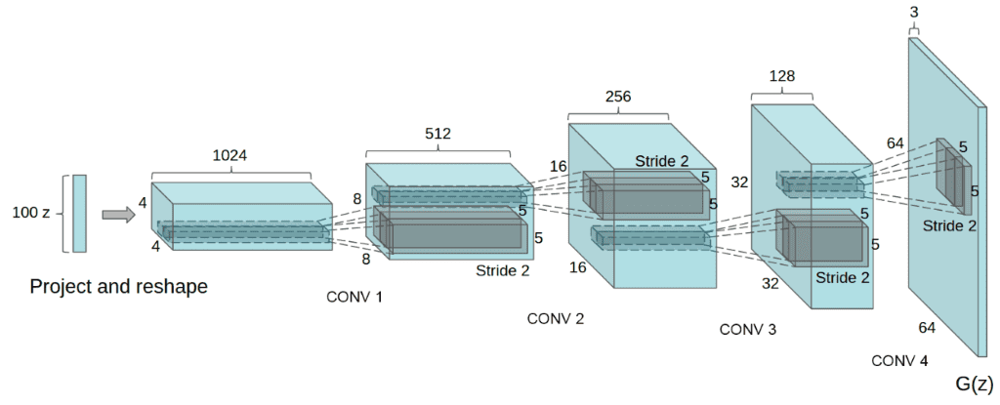

**[[InfoGAN]]** (Chen et al., 2016) adds unsupervised latent codes \(c\) with mutual-information maximization so G cannot ignore them; an auxiliary head on D estimates \(P(c|x)\), yielding disentangled controls (digit rotation, stroke thickness). Salimans et al. (2016) "Improved GAN" collects stabilization tricks: **[[Feature Matching]]** (match D intermediate feature statistics), minibatch discrimination (pairwise sample similarity in D), historical weight averaging, one-sided label smoothing, virtual batch normalization, the **[[Inception Score]]** metric, and semi-supervised learning with generated samples.

## Key Claims

- Generative learning divides into VAEs and GANs; MSE/L1 autoencoder reconstruction averages pixels and produces blurry, low-diversity images.
- Adversarial learning for generation replaces hand-crafted perturbations with a learned generator that produces visually realistic training-distribution samples.
- Vanilla GAN: G maps stochastic latent noise to images; D outputs scalar real/fake probability; training is a 2-player minimax game with indirect G supervision through D.
- G trains to maximize \(\log D(G(z))\) (fool D); D trains on \(\log D(x) + \log(1-D(G(z)))\); alternating updates approximate Nash equilibrium at D ≈ 0.5.
- Mode collapse: G emits limited or identical modes; D distinguishes them easily; gradients explode or oscillate; can also arise if D is stuck in a weak local minimum.
- cGAN: condition on labels, tags, demographics, or segmentation maps via concatenation into G and D.
- DCGAN design rules: strided conv in D, transpose conv in G, batch norm, no FC hidden layers, ReLU (G) / LeakyReLU (D), tanh output in \([-1,1]\).
- DCGAN improves sharpness over vanilla GAN on MNIST; single-class CIFAR-10 training visibly demonstrates mode collapse (repeating patterns).
- InfoGAN: maximize mutual information \(I(c; G(z,c))\) via auxiliary Q network (D + classification head); learns interpretable latent factors without labels.
- Improved GAN tricks stabilize training and enable semi-supervised classification; feature matching matches D intermediate activations (L2); inception score uses pretrained classifier entropy/KL.
- High-dimensional image generation searches a low-dimensional manifold in \(\mathbb{R}^{n}\) pixels; Nash-equilibrium gradient descent is fragile on non-convex objectives.

## Figures

| Figure | Caption | Page |
|--------|---------|------|
|  | Generator training scheme: G produces fakes, D labels them as real (target 1) | — |
|  | Discriminator training: real→1, fake→0; G frozen | — |
|  | Vanilla GAN MNIST samples across epochs | — |
|  | Conditional GAN: auxiliary condition concatenated into G and D (cGAN paper) | — |
|  | DCGAN unconditional generator architecture | — |
| 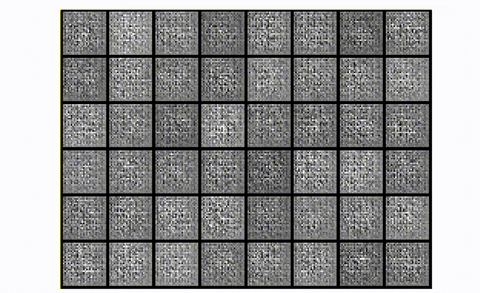 | DCGAN MNIST: crisper digits vs vanilla GAN | — |
| 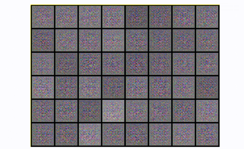 | Mode collapse in DCGAN trained on single-class CIFAR-10 | — |
| 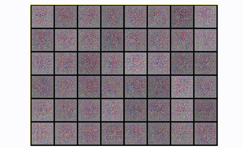 | DCGAN on full CIFAR-10 (all classes) | — |
| 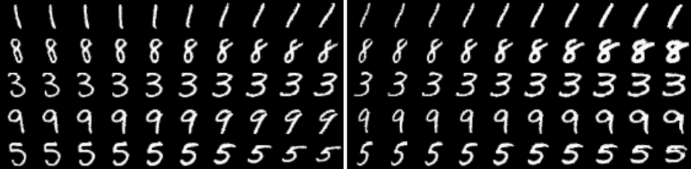 | InfoGAN: varying continuous latent codes controls rotation and stroke thickness | — |
| 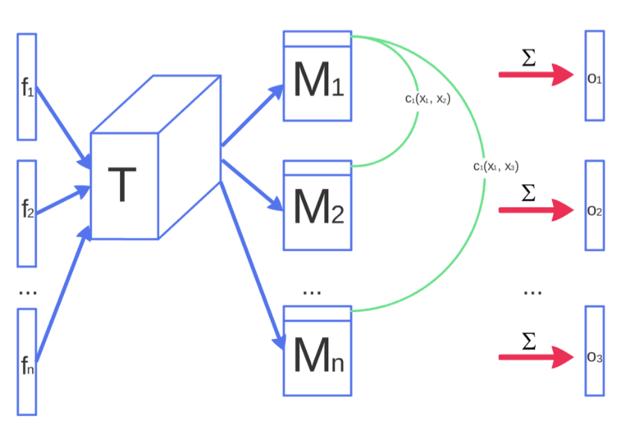 | Minibatch discrimination: pairwise similarity features concatenated to D intermediate activations | — |
| 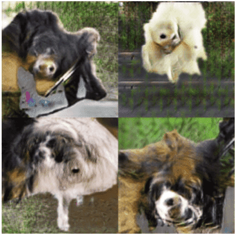 | Improved GAN results: animal parts (eyes, noses) emerge though anatomy not fully coherent | — |

## Entities

- [[AI Summer]] — educational blog; hosts this GAN-in-CV series opener.
- [[Nikolas Adaloglou]] — author; first installment of the GAN computer-vision survey (2020).
- [[Ian Goodfellow]] — lead author of the original GAN paper (2014).
- [[Generative Adversarial Networks]] — minimax generator–discriminator framework for sample synthesis.
- [[Variational Autoencoders]] — alternative generative path (explicit latent + reconstruction/KL).
- [[Autoencoders]] — reconstruction-based baseline contrasted with GAN sharpness.
- [[Mode Collapse]] — GAN failure mode where generator diversity collapses.
- [[DCGAN]] — convolutional GAN architecture guidelines (2015).
- [[InfoGAN]] — mutual-information regularization for disentangled latent codes.
- [[Feature Matching]] — Improved GAN trick matching D intermediate feature statistics.
- [[Inception Score]] — automated GAN image-quality metric via pretrained classifier.
- [[Adversarial Training]] — related but distinct: robustness via adversarial examples vs generative synthesis.
- [[Computer Vision]] — application domain for conditional synthesis, 3D objects, video (later series parts).

## Questions & Gaps

- Part 1 only covers through Improved GAN (2016); see [[GANs in Computer Vision: Conditional Image Synthesis and 3D Object Generation]] (part 2) and [[GANs in Computer Vision: Improved Training with Wasserstein Distance, Game Theory Control, and Progressively Growing Schemes]] (part 3).
- Inception score described qualitatively; no formula or known limitations (sensitivity to classifier, lack of diversity measure).
- Minibatch discrimination noted as computationally expensive; no complexity analysis or modern alternatives (e.g. contrastive D losses).
- DCGAN G-vs-D capacity tradeoff acknowledged as task-dependent without prescriptive guidance.
- Article predates diffusion-model dominance; no comparison to modern score-based or flow generators.

## Related

- [[GANs in Computer Vision: Conditional Image Synthesis and 3D Object Generation]] — series part 2: AC-GAN, 3D-VAE-GAN, PacGAN, Pix2Pix, CycleGAN.
- [[GANs in Computer Vision: Semantic Image Synthesis and Learning a Generative Model from a Single Image]] — series part 6 (finale): GauGAN, SinGAN.
- [[Papers Explained Review 05 - Generative Adversarial Networks]] — wiki paper survey covering GAN through Wasserstein GAN and CycleGAN.
- [[How to Generate Images using Autoencoders]] — complementary VAE/autoencoder generative primer from AI Summer.
- [[The Theory behind Latent Variable Models: Formulating a Variational Autoencoder]] — probabilistic generative alternative to adversarial training.
- [[How Diffusion Models Work: The Math from Scratch]] — modern generative modeling successor path in the same blog.
- [[Deep Learning]] — Goodfellow textbook treatment of directed generative nets and GANs (§20.10).
- [[Unsupervised Learning]] — broader paradigm including both VAEs and GANs.
