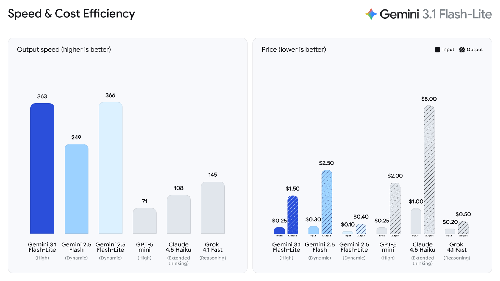
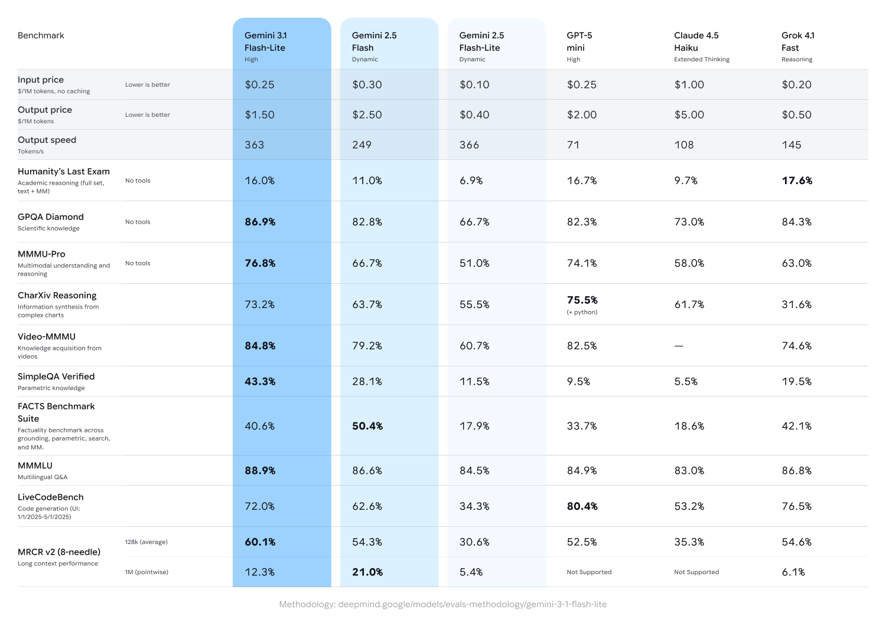

# Gemini 3.1 Flash Lite

**Source**: `raw/gemini-3-1-flash-lite/full-article.html` (397 KB)  
**URL**: https://blog.google/innovation-and-ai/models-and-research/gemini-models/gemini-3-1-flash-lite/  
**Ingested**: 2026-06-06  
**Tags**: #summary

## Summary

Google introduces **Gemini 3.1 Flash-Lite** (Mar 3, 2026), the fastest and most cost-efficient model in the Gemini 3 series, built for high-volume developer workloads. Available in preview via the Gemini API in Google AI Studio and **Vertex AI**, it is priced at **$0.25/1M input tokens** and **$1.50/1M output tokens**.

Per Artificial Analysis, 3.1 Flash-Lite is **2.5× faster** on Time to First Answer Token and **45% faster** on output speed versus Gemini 2.5 Flash while maintaining similar or better quality. It achieves **1432 Arena Elo** on the Arena.ai leaderboard, **86.9% on GPQA Diamond**, and **76.8% on MMMU Pro**—surpassing prior-generation larger models like 2.5 Flash. Configurable **thinking levels** in AI Studio and Vertex AI let developers trade reasoning depth against latency for high-frequency tasks.

## Key Claims

- **$0.25/1M input, $1.50/1M output**—cost-efficient tier for translation, moderation, UI generation, and simulations.
- **1432 Elo** on Arena.ai; **86.9% GPQA Diamond**, **76.8% MMMU Pro**—outperforms similar-tier and some prior larger Gemini models.
- **2.5× faster TTFT** and **45% higher output speed** vs. 2.5 Flash (Artificial Analysis) at similar quality.
- Standard **thinking levels** in AI Studio and Vertex AI for adaptive reasoning on high-frequency workloads.
- Preview via Gemini API (AI Studio) and Vertex AI; early testers include Latitude, Cartwheel, and Whering.

## Figures

| Figure | Caption | Page |
|--------|---------|------|
|  | Speed & cost efficiency: output speed and price vs. Gemini 2.5 Flash-Lite, GPT-5 mini, Claude 4.5 Haiku, Grok 4.1 Fast | — |
|  | Benchmark table: reasoning and multimodal scores vs. peer models | — |

## Entities

- [[Large Language Models]] — cost-optimized Gemini 3 tier for scale workloads.
- [[Google DeepMind]] — Gemini 3 series research and release org.
- [[Model Compression and Efficiency]] — latency and price positioning for high-volume inference.

## Questions & Gaps

- Preview only; GA pricing stability and rate limits not detailed.
- Thinking-level API semantics and default settings for production not fully specified.
- Arena Elo and Artificial Analysis speed metrics use third-party eval harnesses; reproducibility details are external.

## Related

- [[Large Language Models]] — topic hub for efficient frontier and mid-tier models.
- [[Google DeepMind]] — Gemini 3 model family context.
- [[Model Compression and Efficiency]] — throughput and cost tradeoffs for scaled deployment.
