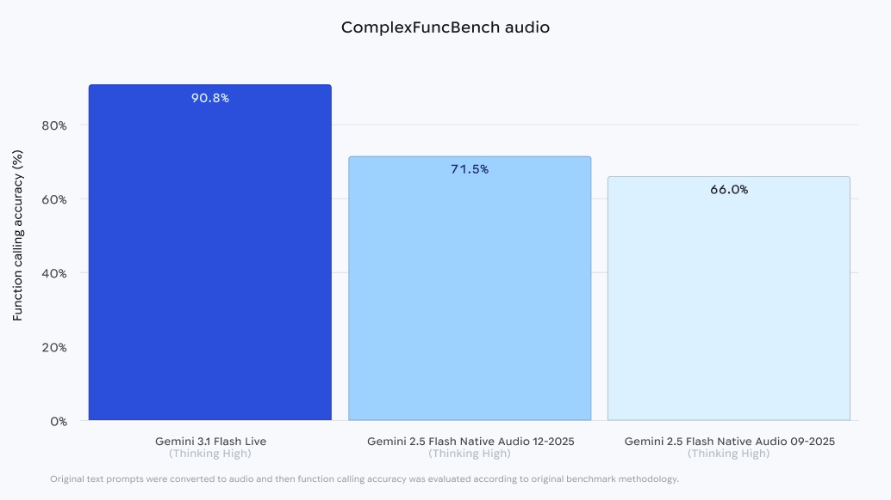
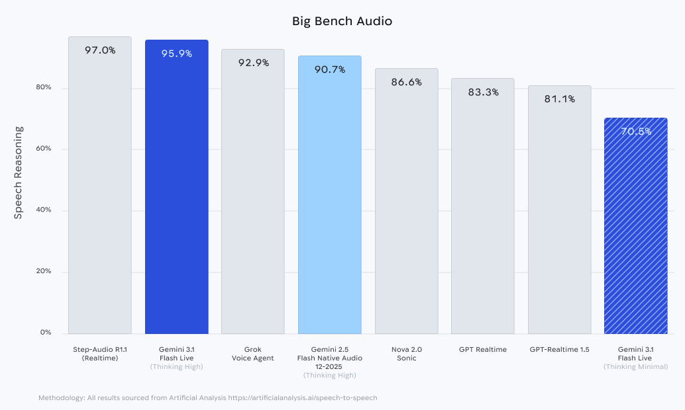
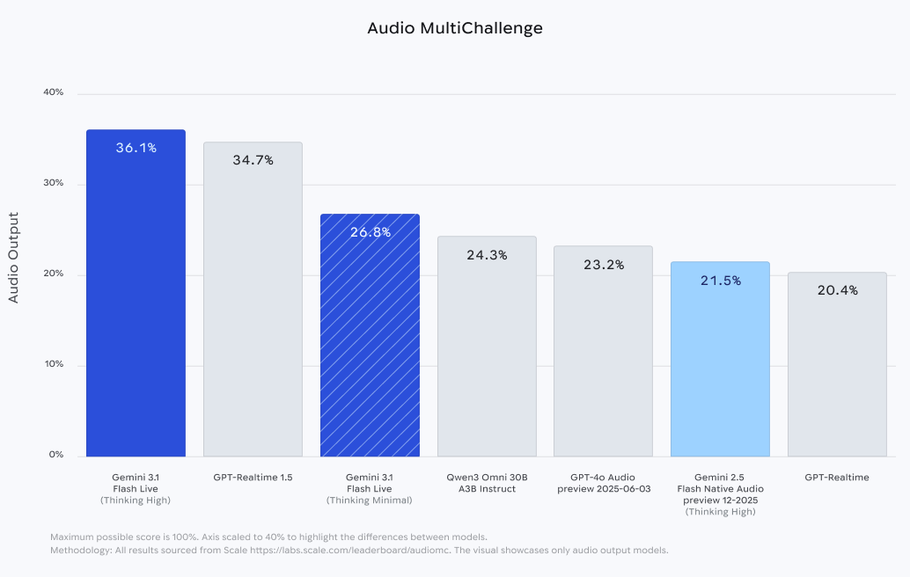

# Gemini 3.1 Flash Live

**Source**: `raw/gemini-3-1-flash-live/full-article.md` (403 KB)  
**URL**: https://blog.google/innovation-and-ai/models-and-research/gemini-models/gemini-3-1-flash-live/  
**Ingested**: 2026-06-06  
**Tags**: #summary

## Summary

Google releases **Gemini 3.1 Flash Live** (Mar 26, 2026), its highest-quality real-time audio and voice model for natural dialogue. It targets voice-first agents with improved precision, lower latency, and better tonal understanding (pitch, pace, frustration/confusion cues). Availability spans the **Gemini Live API** in Google AI Studio (developers), **Gemini Enterprise for Customer Experience** (enterprises), and consumer **Search Live** and **Gemini Live**.

On **ComplexFuncBench Audio**—multi-step function calling with constraints—3.1 Flash Live leads at **90.8%**, a large gain over the prior model. On Scale AI's **Audio MultiChallenge** (instruction following amid real-world interruptions), it scores **36.1%** with thinking enabled. **Search Live** expands to **200+ countries and territories** with multilingual real-time multimodal search. All generated audio is watermarked with **SynthID**.

## Key Claims

- Highest-quality Gemini audio model for real-time, voice-first dialogue with lower latency and improved precision.
- **90.8% on ComplexFuncBench Audio** for multi-step constrained function calling in voice agents.
- **36.1% on Audio MultiChallenge** (thinking on)—leads on complex instruction following with hesitations/interruptions.
- Developer preview via Gemini Live API (AI Studio); enterprise via Gemini Enterprise for Customer Experience.
- **Search Live** and **Gemini Live** in **200+ countries**; 2× longer conversation threading vs. prior model.
- **SynthID** watermark on all generated audio for provenance and misinformation mitigation.

## Figures

| Figure | Caption | Page |
|--------|---------|------|
|  | ComplexFuncBench Audio: multi-step function-calling benchmark scores | — |
|  | BigBenchAudio evaluation bar chart | — |
|  | Audio MultiChallenge: instruction-following under real-world audio conditions | — |

## Entities

- [[Audio Models]] — real-time voice dialogue and live API model release.
- [[Google DeepMind]] — model card and SynthID safety documentation.
- [[Agentic AI]] — voice agents for complex task execution at scale.

## Questions & Gaps

- BigBenchAudio figure shown without a headline numeric score in the post body.
- Enterprise vs. consumer feature parity and regional availability nuances not fully enumerated.
- SynthID detection tooling and third-party verification workflow not covered in the announcement.

## Related

- [[Audio Models]] — speech, voice, and audio-language model hub.
- [[Google DeepMind]] — Gemini audio research and responsible-AI lineage.
- [[Agentic AI]] — voice-first agents and live API integration patterns.
