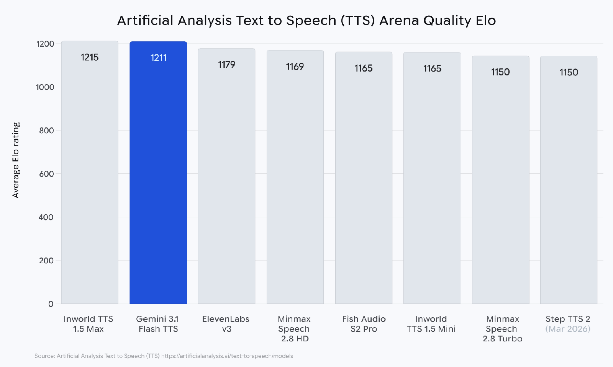

# Gemini 3.1 Flash TTS

**Source**: `raw/gemini-3-1-flash-tts/full-article.md` (410 KB)  
**URL**: https://blog.google/innovation-and-ai/models-and-research/gemini-models/gemini-3-1-flash-tts/  
**Ingested**: 2026-06-06  
**Tags**: #summary

## Summary

Google launches **Gemini 3.1 Flash TTS** (Apr 15, 2026), a text-to-speech model emphasizing controllability, expressivity, and quality. Rolling out in preview via the Gemini API and **Google AI Studio**, **Vertex AI**, and **Google Vids** for Workspace users, it introduces **audio tags**—natural-language commands embedded in text to steer vocal style, pace, tone, and delivery mid-sentence.

On the **Artificial Analysis TTS leaderboard** (blind human preferences), 3.1 Flash TTS achieves **Elo 1211** and sits in the "most attractive quadrant" for quality vs. price. It supports **70+ languages**, native multi-speaker dialogue, scene-direction controls, speaker-level Audio Profiles with Director's Notes, and seamless export to WAV/MP3. All output is watermarked with **SynthID**.

## Key Claims

- **Elo 1211** on Artificial Analysis TTS Arena; positioned in the quality–price "most attractive quadrant."
- **Audio tags** for granular control of style, pace, tone, and accent via inline natural-language commands.
- **70+ languages** with multi-speaker dialogue, scene direction, and speaker-level Audio Profiles.
- Preview via Gemini API (AI Studio speech playground), Vertex AI, and Google Vids.
- **SynthID** watermark interwoven into all generated audio for AI-content detection.
- Developer controls: scene direction, speaker casting, inline transcript tags, WAV/MP3 export.

## Figures

| Figure | Caption | Page |
|--------|---------|------|
|  | Artificial Analysis TTS Arena quality Elo leaderboard | — |

## Entities

- [[Audio Models]] — expressive TTS with controllable delivery and multilingual support.
- [[Google DeepMind]] — model card and SynthID audio watermarking.
- [[Multilingual Models]] — 70+ language speech generation at global scale.

## Questions & Gaps

- Preview pricing and latency benchmarks not disclosed in the announcement.
- Audio tag syntax edge cases and cross-language tag behavior not fully documented in the blog.
- SynthID detection requires Google tooling; open verification pipeline not described.

## Related

- [[Audio Models]] — speech synthesis and audio-language model hub.
- [[Google DeepMind]] — Gemini audio safety and model-card context.
- [[Multilingual Models]] — cross-lingual TTS and localization at scale.
