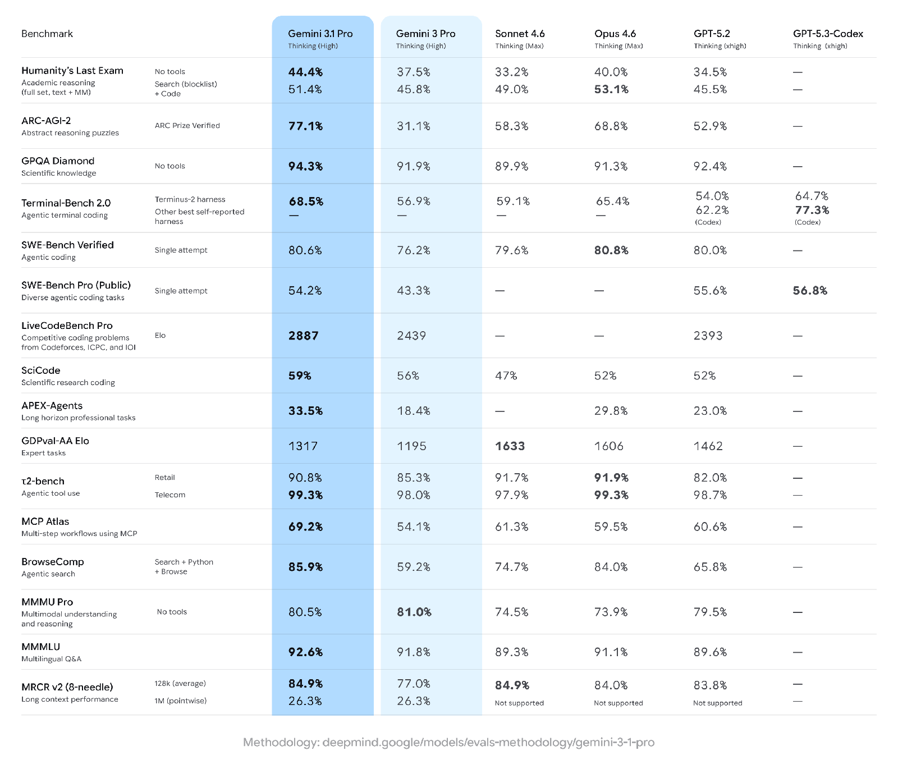

# Gemini 3.1 Pro

**Source**: `raw/gemini-3-1-pro/full-article.html` (379 KB)  
**URL**: https://blog.google/innovation-and-ai/models-and-research/gemini-models/gemini-3-1-pro/  
**Ingested**: 2026-06-06  
**Tags**: #summary

## Summary

Google announces **Gemini 3.1 Pro** (Feb 19, 2026), the upgraded core intelligence behind recent [[Gemini 3 Deep Think]] breakthroughs. Positioned as a smarter baseline for complex problem-solving, 3.1 Pro ships across consumer and developer surfaces: Gemini API preview in Google AI Studio, Gemini CLI, **Google Antigravity**, Android Studio, **Vertex AI**, Gemini Enterprise, the Gemini app, and **NotebookLM** (Pro/Ultra tiers).

On **ARC-AGI-2**—a benchmark for novel logic patterns—3.1 Pro scores a verified **77.1%**, more than doubling the reasoning performance of Gemini 3 Pro. The post emphasizes applied intelligence: animated SVG generation from text, live API dashboards, interactive 3D experiences, and creative coding that reasons through literary tone. Preview release validates updates before general availability.

## Key Claims

- Upgraded core reasoning model in the Gemini 3 series; successor intelligence to Gemini 3 Deep Think advances.
- **77.1% verified on ARC-AGI-2**—more than 2× Gemini 3 Pro reasoning performance on novel logic patterns.
- Preview rollout: Gemini API (AI Studio), Gemini CLI, Antigravity, Android Studio, Vertex AI, Gemini Enterprise.
- Consumer access via Gemini app (higher limits for Google AI Pro/Ultra) and NotebookLM (Pro/Ultra exclusive).
- Demonstrated use cases: code-based SVG animation, complex API synthesis (ISS telemetry dashboard), interactive 3D murmuration, literary-to-UI creative coding.

## Figures

| Figure | Caption | Page |
|--------|---------|------|
|  | Side-by-side benchmark comparison across reasoning and capability evals | — |

## Entities

- [[Large Language Models]] — flagship Gemini 3.1 reasoning release in Google's model lineup.
- [[Google DeepMind]] — research org behind Gemini model cards and safety documentation.
- [[Reasoning Models]] — ARC-AGI-2 and agentic workflow positioning.

## Questions & Gaps

- Blog is a product announcement; full training recipe, data mix, and ablations are not disclosed.
- Preview status; GA timeline and pricing not specified.
- Benchmark GIF aggregates multiple evals; per-benchmark methodology details are in the model card, not the post.

## Related

- [[Large Language Models]] — topic hub for frontier model releases.
- [[Google DeepMind]] — Gemini research and model-card lineage.
- [[Reasoning Models]] — ARC-AGI and complex task-solving context.
