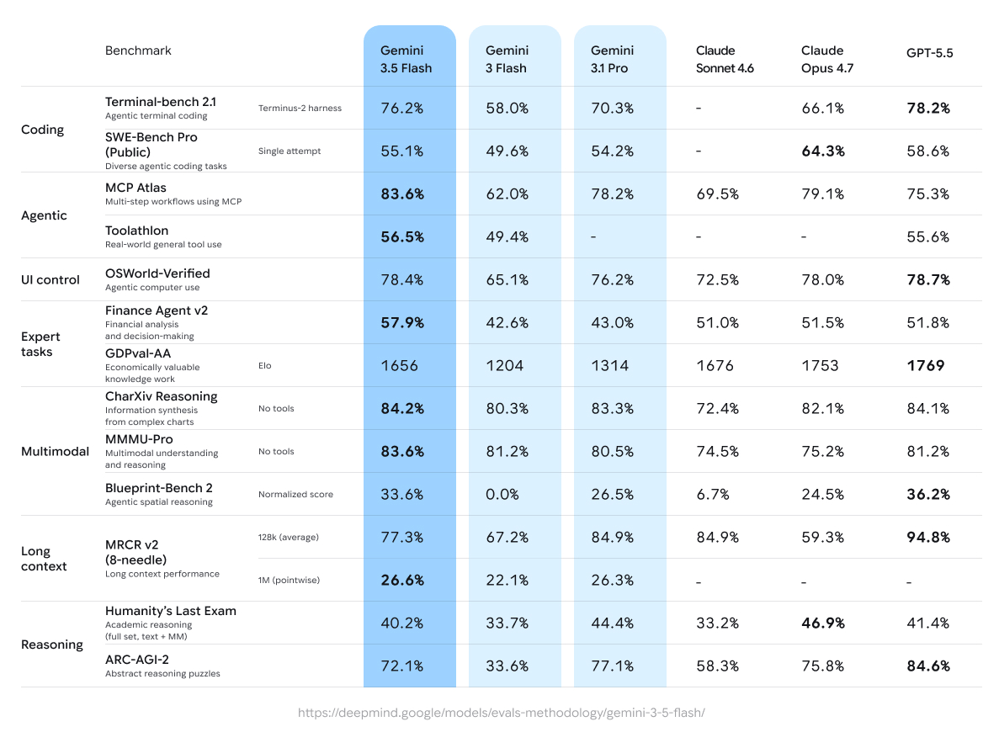
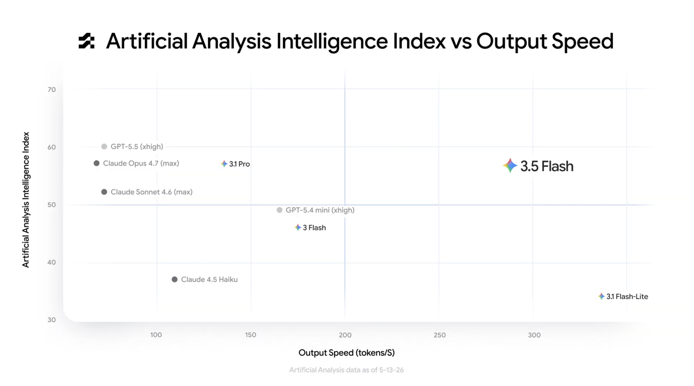

# Gemini 3.5 Flash

**Source**: `raw/gemini-3-5/full-article.html` (434 KB)  
**URL**: https://blog.google/innovation-and-ai/models-and-research/gemini-models/gemini-3-5/  
**Ingested**: 2026-06-06  
**Tags**: #summary

## Summary

At Google I/O 2026 (May 19), Google DeepMind announced **Gemini 3.5**, a model family positioned as combining frontier intelligence with action for agentic workloads. The first release is **Gemini 3.5 Flash**, described as the strongest agentic and coding model in the Gemini line while retaining Flash-series latency. It outperforms Gemini 3.1 Pro on coding and agent benchmarks and lands in the top-right quadrant of the Artificial Analysis intelligence-vs-speed index — frontier quality without the usual latency tradeoff.

3.5 Flash is rolled out globally via the Gemini app, AI Mode in Google Search, Google Antigravity (agent-first dev platform), Gemini API (AI Studio, Android Studio), and Gemini Enterprise. **Gemini 3.5 Pro** is in internal use with a planned rollout the following month. When paired with the updated **Antigravity** harness, 3.5 Flash deploys collaborative **subagents** for long-horizon workflows — codebase migration, multi-step asset organization, parallel enterprise analytics — often at less than half the cost of other frontier models. **Gemini Spark**, a 24/7 personal AI agent powered by 3.5 Flash, begins rollout to trusted testers at I/O with a Beta for Google AI Ultra subscribers in the US the following week.

Safety work follows the Frontier Safety Framework with strengthened cyber and CBRN safeguards, advanced safety training, and interpretability tooling to inspect internal reasoning before responses.

## Key Claims

- Gemini 3.5 Flash rivals large flagship models on multiple dimensions at Flash-series speed; **4× faster** output tokens per second than other frontier models.
- **Terminal-Bench 2.1**: 76.2%; **GDPval-AA**: 1656 Elo; **MCP Atlas**: 83.6%; **CharXiv Reasoning**: 84.2%.
- Outperforms Gemini 3.1 Pro on challenging coding and agentic benchmarks cited above.
- Ideal for long-horizon agentic tasks: app development, codebase maintenance, financial document prep — often **<50% cost** of other frontier models.
- Antigravity + 3.5 Flash enables supervised multi-step workflows and collaborative subagents at scale.
- Default model for Gemini app and AI Mode in Search globally at launch.
- **Gemini Spark** personal agent runs 24/7 on 3.5 Flash; trusted-tester rollout at I/O, US Ultra Beta planned next week.
- Enterprise pilots: Shopify (parallel subagents for growth forecasts), Salesforce Agentforce (multi-subagent tool calling), Macquarie (100+ page document onboarding), Ramp (multimodal invoice OCR), Xero (multi-week tax workflows), Databricks (agentic data science).
- Gemini 3.5 Pro in internal use; public rollout planned next month after 3.5 Flash.

## Figures

| Figure | Caption | Page |
|--------|---------|------|
|  | Benchmark comparison table: Gemini 3.5 Flash vs. Claude and GPT models across coding, agentic, and multimodal tasks | — |
|  | Artificial Analysis Intelligence Index vs. output speed; 3.5 Flash in top-right (frontier intelligence, exceptional speed) | — |

## Entities

- [[DeepMind]] — develops and ships the Gemini 3.5 family.
- [[Agentic AI]] — 3.5 Flash targets long-horizon agentic and coding workloads; Antigravity subagent orchestration.
- [[Code Models]] — strongest Gemini coding model at launch; Terminal-Bench 2.1 leadership.
- [[Model Compression and Efficiency]] — Flash-tier frontier performance at 4× frontier output speed.

## Questions & Gaps

- Blog is a product announcement; full technical report, training recipe, and architecture details for 3.5 Flash are not published here.
- Gemini 3.5 Pro capabilities and benchmarks deferred to a follow-on release.
- Gemini Spark scope, permissions model, and safety guardrails for autonomous 24/7 operation are demonstrated but not fully specified.
- Enterprise case studies are partner demos; independent replication of cited benchmark numbers is not provided in the post.

## Related

- [[Gemini Omni Flash]] — sibling I/O 2026 release: video generation and conversational editing from any input.
- [[DeepMind]] — entity page for Google DeepMind Gemini 3-era releases.
- [[Agentic AI]] — topic hub for tool-using and multi-agent systems.
- [[Code Models]] — coding benchmarks and software-engineering agents.
- [[Papers Explained 547 - Terminal-Bench]] — Terminal-Bench 2.x benchmark context for the 76.2% claim.
- [[Papers Explained 393 - Gemini 2.5]] — prior Gemini generation technical detail.
