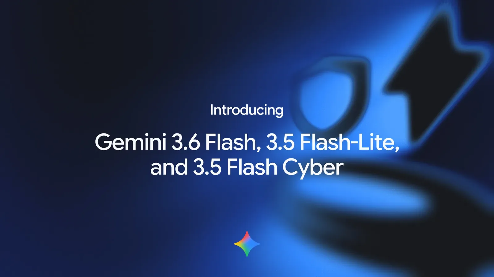
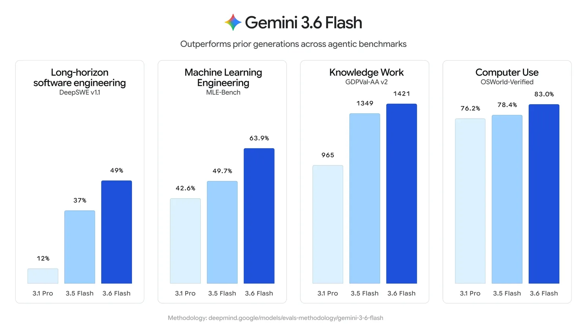
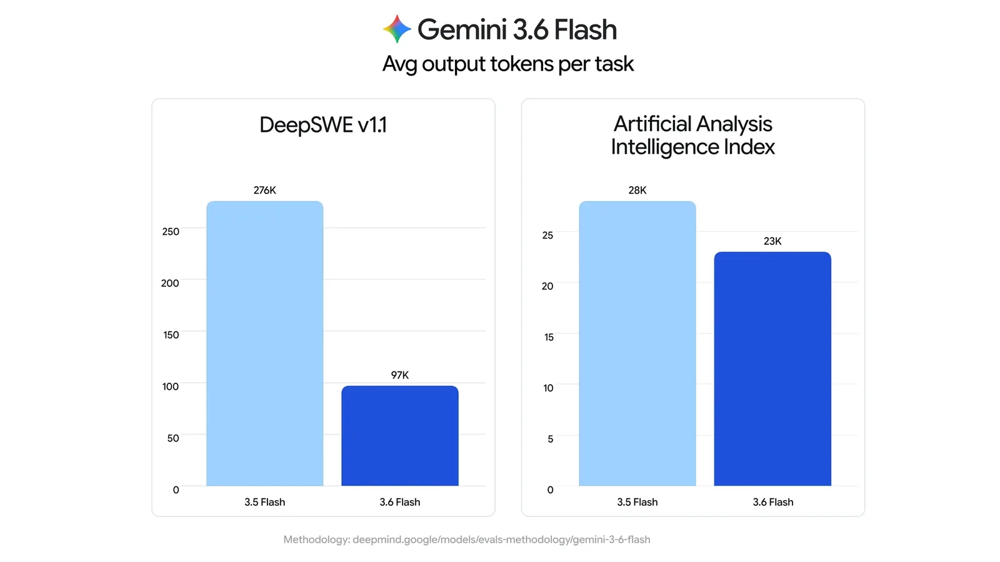
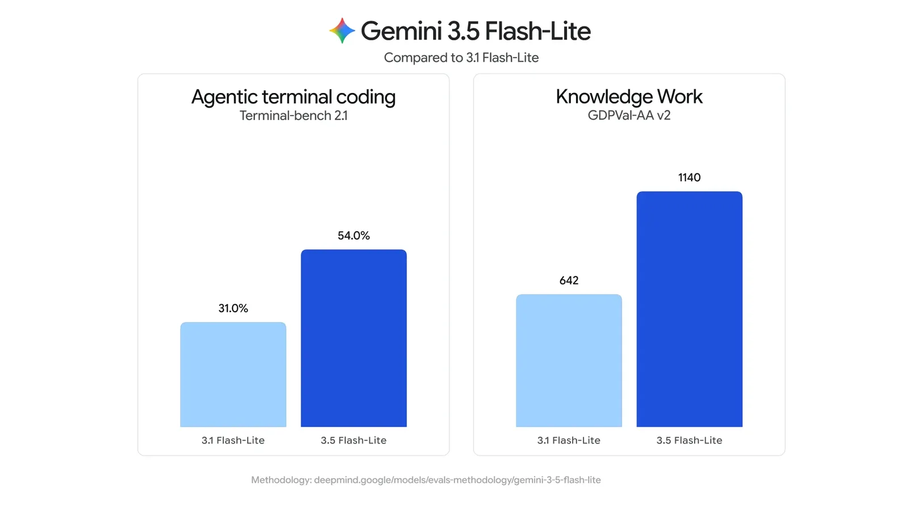
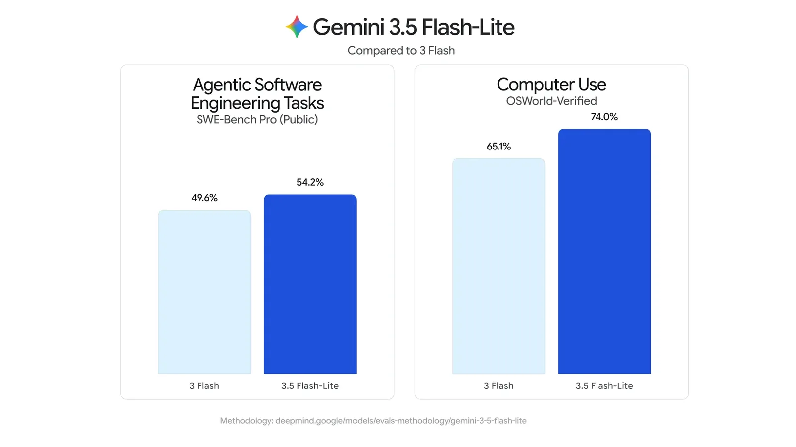
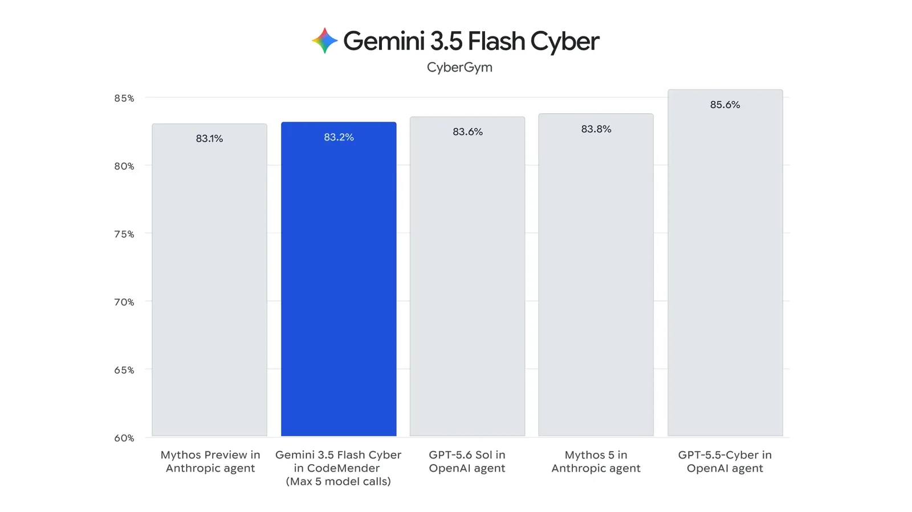

# Introducing Gemini 3.6 Flash, 3.5 Flash-Lite, and 3.5 Flash Cyber

**Source**: `raw/gemini-3-6-flash-3-5-flash-lite-3-5-flash-cyber/full-article.md` (410 KB); `raw/gemini-3-6-flash-3-5-flash-lite-3-5-flash-cyber/full-article.md`  
**URL**: https://blog.google/innovation-and-ai/models-and-research/gemini-models/gemini-3-6-flash-3-5-flash-lite-3-5-flash-cyber/  
**Ingested**: 2026-07-22  
**Tags**: #summary

## Summary

On Jul 21, 2026, Google DeepMind announced three new Gemini Flash models aimed at scaling production AI agents: **Gemini 3.6 Flash** as the workhorse tier, **Gemini 3.5 Flash-Lite** as the fastest and most cost-effective 3.5-class option, and **Gemini 3.5 Flash Cyber** as a cybersecurity specialist deployed inside **CodeMender**. The release builds directly on [[Gemini 3.5 Flash]] feedback, emphasizing token efficiency, lower latency, and more reliable multi-step agentic workflows.

**Gemini 3.6 Flash** improves coding, knowledge work, and multimodal performance while using fewer output tokens than 3.5 Flash — 17% fewer on the Artificial Analysis Index, with up to 65% savings on DeepSWE (Datacurve). It ships at **$1.50/1M input** and **$7.50/1M output** tokens, a lower price than 3.5 Flash. Benchmark gains include DeepSWE (49% vs. 37%), MLE Bench (63.9% vs. 49.7%), OSWorld-Verified (83.0% vs. 78.4%), and GDPval-AA v2 (1421 vs. 1349). Computer use is now a built-in client-side tool via the Gemini API and Gemini Enterprise. Enhanced Frontier Safety safeguards cover CBRN and cyber-offense misuse.

**Gemini 3.5 Flash-Lite** targets high-throughput production traffic — agentic search, document processing, and subagent workloads — at **350 output tokens/s** (Artificial Analysis) and **$0.30/$2.50** per M tokens. It significantly outperforms [[Gemini 3.1 Flash Lite]] on agentic evals (Terminal-Bench 2.1: 54% vs. 31%; GDM-MRCR v2: 72.2% vs. 60.1%; GDPval-AA v2: 1140 vs. 642) and often beats [[Gemini 3 Flash]] on coding and computer-use tasks. Configurable thinking levels and built-in computer use support scaling agentic systems.

**Gemini 3.5 Flash Cyber** is fine-tuned on 3.5 Flash for finding and fixing vulnerabilities inside **CodeMender**, where multiple Cyber agents produce a combined report. It reaches competitive frontier performance on CyberGym at lower per-token cost than larger models. Given dual-use risk, deployment is restricted to a limited-access pilot for governments and trusted partners — not general API availability.

The post also notes **Gemini 3.5 Pro** is testing with partners, and Google has started its most ambitious pre-training run for **Gemini 4**.

## Key Claims

- **3.6 Flash** reduces output token usage by **17%** vs 3.5 Flash (Artificial Analysis Index); up to **65%** on DeepSWE.
- **3.6 Flash pricing**: $1.50/1M input, $7.50/1M output — lower than 3.5 Flash.
- **3.6 Flash benchmarks vs 3.5 Flash**: DeepSWE 49% vs 37%; MLE Bench 63.9% vs 49.7%; OSWorld-Verified 83.0% vs 78.4%; GDPval-AA v2 1421 vs 1349.
- Computer use is a **built-in client-side tool** in Gemini API and Gemini Enterprise.
- **3.5 Flash-Lite**: 350 output tok/s; $0.30/$2.50 per M tokens; Terminal-Bench 2.1 54% vs 31% (3.1 Flash-Lite); SWE-Bench Pro 54.2% vs 49.6% (3 Flash); OSWorld-Verified 74.0% vs 65.1%.
- **3.5 Flash Cyber + CodeMender**: competitive on CyberGym; limited pilot for governments/trusted partners only.
- **Availability (3.6 Flash + 3.5 Flash-Lite)**: Gemini API (AI Studio, Android Studio), Antigravity (3.6), Gemini Enterprise, Gemini app; 3.5 Flash-Lite also in Google Search.
- **Gemini 4** pre-training has begun; 3.5 Pro in partner testing.

## Figures

| Figure | Caption | Page |
|--------|---------|------|
|  | Hero: Gemini 3.6 Flash, 3.5 Flash-Lite, and 3.5 Flash Cyber | — |
|  | Gemini 3.6 Flash benchmark comparison chart | — |
|  | Gemini 3.6 Flash quality and efficiency eval chart | — |
|  | Gemini 3.5 Flash-Lite benchmark comparison chart | — |
|  | Gemini 3.5 Flash-Lite cost and performance eval chart | — |
|  | Gemini 3.5 Flash Cyber on CyberGym via CodeMender | — |

## Entities

- [[DeepMind]] — ships the Gemini 3.6/3.5 Flash family and CodeMender integration.
- [[Gemini 3.5 Flash]] — direct predecessor; 3.6 Flash improves efficiency and benchmarks head-to-head.
- [[Gemini 3.1 Flash Lite]] — prior cost tier; 3.5 Flash-Lite is a new 3.5-class throughput option at higher price.
- [[Gemini 3 Flash]] — baseline for 3.5 Flash-Lite agentic/coding comparisons.
- [[CodeMender]] — Google multi-agent code-security system using 3.5 Flash Cyber.
- [[Agentic AI]] — all three models target scaled agentic workflows and subagent orchestration.
- [[Code Models]] — DeepSWE, Terminal-Bench, SWE-Bench Pro, MLE Bench coding claims.
- [[Computer Use]] — built-in client-side tool; OSWorld-Verified gains for 3.6 Flash and 3.5 Flash-Lite.
- [[GDPval]] — GDPval-AA v2 knowledge-work scores cited for 3.6 Flash and 3.5 Flash-Lite.
- [[Model Compression and Efficiency]] — token-efficiency and throughput positioning across Flash tiers.
- [[Safety and Alignment]] — CBRN/cyber Frontier Safety on 3.6 Flash; restricted deploy for Flash Cyber.

## Questions & Gaps

- Product announcement only; no technical report, architecture, or training recipe for any of the three models.
- Demo workflows (AIS financial analysis, AGY code migration, canvas 3D texture extractor) are embedded as videos in the source, not static figures.
- CodeMender agent architecture, CyberGym methodology, and pilot access criteria are not detailed.
- Gemini 3.5 Pro capabilities deferred; Gemini 4 is a pre-training announcement without benchmarks.
- Customer quote images are low-resolution testimonial cards; benchmark charts are the primary eval artifacts.

## Related

- [[Gemini 3.5 Flash]] — prior workhorse Flash release (May 2026 I/O).
- [[Gemini 3.7 Flash]] — Aug 2026 successor workhorse (based on 3.6 Flash).
- [[Gemini 3.8 Flash and 3.8 Flash Cyber]] — Sep 2026 successor with Fairwind Cyber variant.
- [[Gemini 3.1 Flash Lite]] — prior cost-optimized Flash-Lite tier.
- [[Gemini 3 Flash]] — baseline for 3.5 Flash-Lite comparisons.
- [[DeepMind]] — Gemini 3 era timeline and releases.
- [[Agentic AI]] — topic hub for tool-using and multi-agent systems.
- [[Code Models]] — coding and software-engineering agent benchmarks.
- [[Computer Use]] — GUI control and OSWorld-Verified context.
- [[Papers Explained 547 - Terminal-Bench]] — Terminal-Bench 2.1 benchmark context.
- [[Safety and Alignment]] — Frontier Safety and restricted cyber-model deployment.
