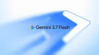
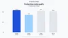
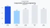
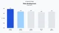
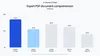
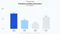
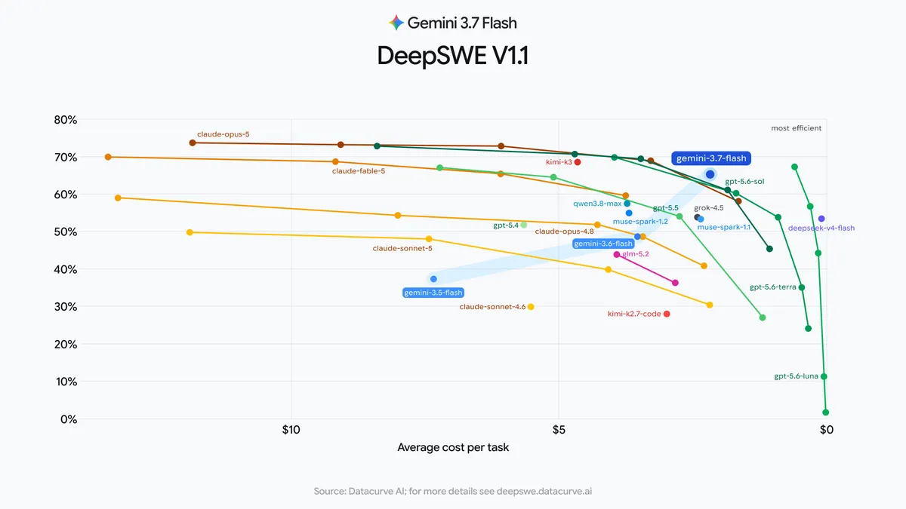

# Gemini 3.7 Flash

**Source**: `raw/introducing-gemini-3-7-flash/full-article.md`, `raw/gemini-3-7-flash-model-card/full-article.md`  
**URL**: https://blog.google/innovation-and-ai/models-and-research/gemini-models/introducing-gemini-3-7-flash/, https://deepmind.google/models/model-cards/gemini-3-7-flash/  
**Ingested**: 2026-09-04  
**Tags**: #summary

## Summary

Google DeepMind announced **Gemini 3.7 Flash** on August 13, 2026 — three weeks after [[Introducing Gemini 3.6 Flash, 3.5 Flash-Lite, and 3.5 Flash Cyber]] — as the new Flash-series workhorse for coding, agents, and knowledge work. Built on **Gemini 3.6 Flash**, 3.7 Flash adds algorithmic reasoning improvements and **agentic video understanding**, with customizable thinking levels and **1M-token input / 64K output** context.

The release emphasizes production agent quality at half the introductory per-token price of 3.6 Flash: **$0.75 / $3.75 per million** input/output tokens through December 31, 2026 (then $1.50 / $7.50). Benchmark gains include **DeepSWE v1.1** 65.3% vs 49.0%, **FrontierCode 1.1** 43.6% vs 34.4%, **WebDev Arena** Elo 1588 vs 1538, **GDP.pdf** 34.0% vs 22.0%, and **AutomationBench** 30.4% vs 17.0%. **Gemini Spark** switches to 3.7 Flash for Google AI Pro/Ultra subscribers in 160+ countries.

3.7 Flash ships with updated Frontier Safety safeguards for CBRN and cyber-offense misuse. Distribution spans Gemini API (AI Studio, Android Studio), Antigravity, Gemini Enterprise, and the Gemini app (via Spark).

## Key Claims

- **Aug 13, 2026** launch; based on Gemini 3.6 Flash.
- **Pricing**: $0.75/$3.75 per M tokens intro through 2026-12-31; doubles Jan 1, 2027.
- **Coding**: DeepSWE v1.1 65.3% (vs 3.6 49.0%); FrontierCode 1.1 43.6% (vs 34.4%); Terminal-Bench 2.1 85.8% (model card).
- **Knowledge work**: GDP.pdf 34.0% vs 22.0%; AutomationBench 30.4% vs 17.0%; Harvey LAB-AA 90.7%.
- **Reasoning**: HLE-Verified 53.6% (model card); Agent's Last Exam 26.3%.
- **Multimodal**: LVBench 85.4%; agentic video understanding support.
- **Gemini Spark** personal agent updated to 3.7 Flash for improved Workspace tool use.
- **Availability**: API, Antigravity, Gemini Enterprise, Gemini app (Spark).

## Figures

| Figure | Caption | Page |
|--------|---------|------|
|  | Gemini 3.7 Flash hero | — |
|  | FrontierCode / production code quality eval | — |
|  | DeepSWE v1.1 long-horizon software engineering | — |
|  | WebDev Arena / code arena eval | — |
|  | GDP.pdf expert document comprehension | — |
|  | AutomationBench enterprise workflow automation | — |
|  | Performance vs cost comparison chart | — |

## Entities

- [[DeepMind]] — develops and ships Gemini 3.7 Flash.
- [[Introducing Gemini 3.6 Flash, 3.5 Flash-Lite, and 3.5 Flash Cyber]] — direct predecessor workhorse tier.
- [[Agentic AI]] — Spark, Antigravity, Terminal-Bench, DeepSWE agent workflows.
- [[Code Models]] — FrontierCode, DeepSWE, WebDev Arena coding benchmarks.
- [[Model Compression and Efficiency]] — Flash-tier cost reduction vs 3.6.

## Questions & Gaps

- Full eval methodology on deepmind.com evals-methodology page not ingested.
- Terminal-Bench 3.0 and OSWorld-2.0 scores on model card trail some frontier competitors.
- Spark availability excludes EEA, Nigeria, Switzerland, UK per Google support docs.

## Related

- [[Gemini 3.8 Flash and 3.8 Flash Cyber]] — September 2026 successor Flash release.
- [[Introducing Gemini 3.6 Flash, 3.5 Flash-Lite, and 3.5 Flash Cyber]] — July 2026 Flash family baseline.
- [[Gemini 3]] — Nov 2025 Gemini 3 Pro generation launch (not a family hub).
- [[Gemini 3.5 Flash]] — May 2026 I/O Flash predecessor.
- [[Agentic AI]] — agent harnesses and long-horizon benchmarks.
- [[Safety and Alignment]] — Frontier Safety safeguards on Flash releases.
