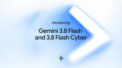
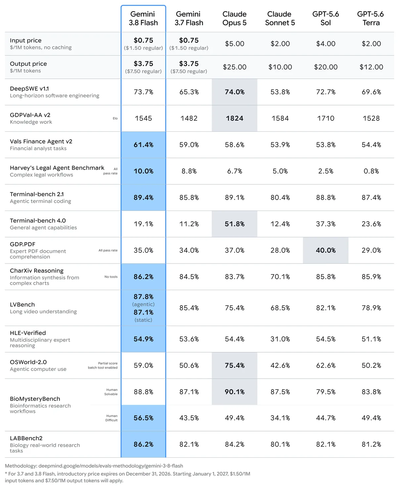
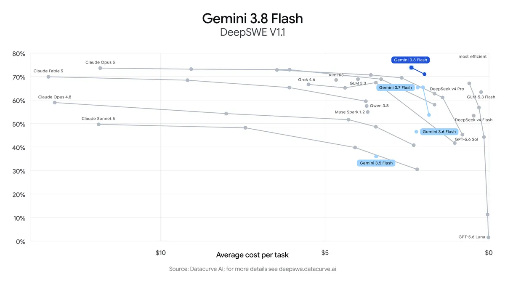
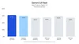
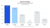
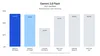
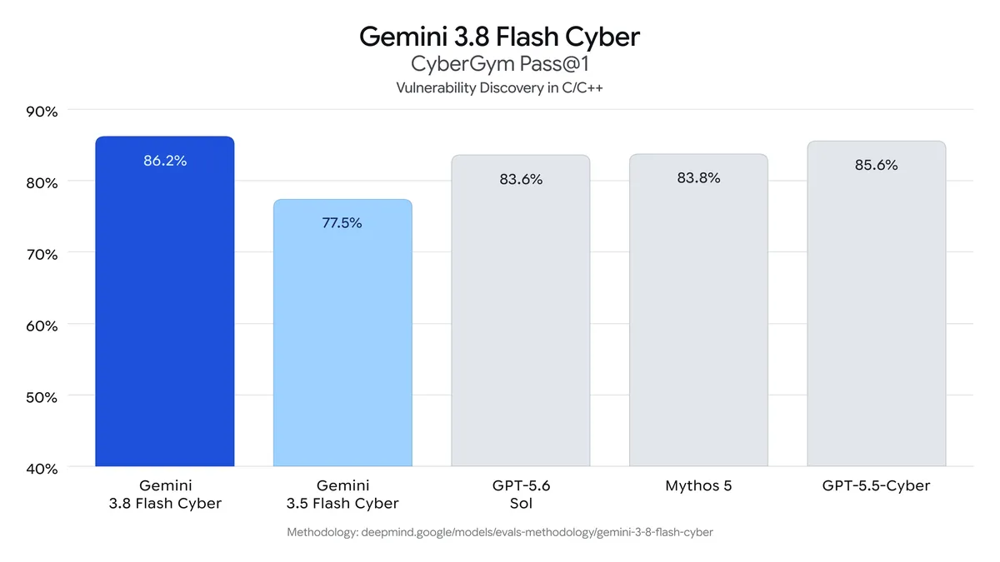
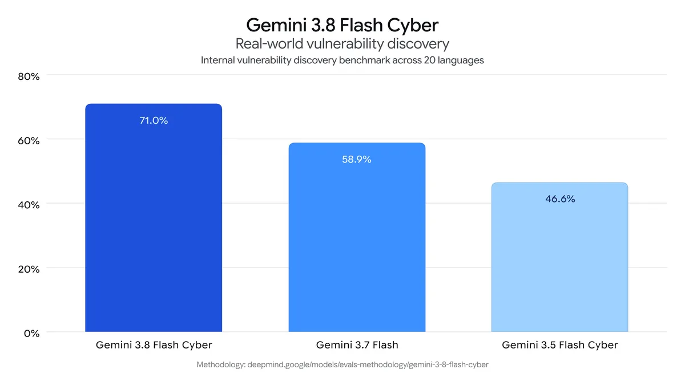

# Gemini 3.8 Flash and 3.8 Flash Cyber

**Source**: `raw/gemini-3-8-flash-and-3-8-flash-cyber/full-article.md`, `raw/gemini-3-8-flash-model-card/full-article.md`  
**URL**: https://blog.google/innovation-and-ai/models-and-research/gemini-models/3-8-flash-and-3-8-flash-cyber/, https://deepmind.google/models/model-cards/gemini-3-8-flash/  
**Ingested**: 2026-09-04  
**Tags**: #summary

## Summary

On September 2, 2026, Google DeepMind announced **Gemini 3.8 Flash** and **Gemini 3.8 Flash Cyber** — the third Flash release in six weeks, building on [[Gemini 3.7 Flash]]. Both variants share the same foundational intelligence, accelerated by long-running agentic loops that recursively evaluate and refine outputs. Cybersecurity training contributed to coding and reasoning gains across the shared core.

**Gemini 3.8 Flash** is positioned as Google's best reasoning-and-coding Flash workhorse yet at the same introductory price as 3.7: **$0.75 / $3.75 per million** tokens through 2026-12-31. It "works harder" on complex tasks — more reasoning steps and tool calls, often using more tokens at high effort — and approaches larger frontier models on DeepSWE v1.1, Vals Finance Agent V2, Harvey's Legal Agent Benchmark, and **HLE-Verified (54.9%)**. Developers can lower effort for efficiency or keep 3.7 Flash for efficiency-first workloads.

**Gemini 3.8 Flash Cyber** is a defender-focused cybersecurity specialist available through the new **[[Fairwind Program]]** (governments, critical infrastructure, software maintainers). It leads on CyberGym vulnerability discovery, exceeds 70% on an internal 20-language vuln benchmark, and reaches **47.2% pass@1 on CWE-Bench** patching near frontier models at lower cost. Google prioritizes patching over exploitation; Chrome Security reports 2.6× more correct patches vs larger commercial models.

## Key Claims

- **Sep 2, 2026** launch; third Flash in six weeks; based on Gemini 3.7 Flash.
- **3.8 Flash pricing**: same intro $0.75/$3.75 per M as 3.7 through 2026-12-31; $1.50/$7.50 from 2027-01-01.
- **3.8 Flash**: DeepSWE v1.1 leads many larger frontier models; HLE-Verified 54.9%; higher token use at high effort by design.
- **3.8 Flash Cyber**: CyberGym frontier-level; >70% internal multi-language vuln discovery; CWE-Bench 47.2% pass@1 vs ~47.8% leading frontier at lower cost.
- **Real-world cyber**: Chrome 2.6× correct patches; Wiz +7.5–9.7% recall at 2.3–5.2× lower cost; Google CVR found critical vuln in <2 hours.
- **Safety**: 3.8 Flash CBRN/cyber-offense safeguards; 3.8 Flash Cyber more permissive mitigations for trusted defenders only; Gray Swan prompt-injection robustness leap.
- **Model card**: knowledge cutoff March 2026 (some domains Jan 2025); multilingual safety +5.4pp worse vs 3.7 (automated eval).
- **Availability**: API, AI Studio, Antigravity, Gemini Enterprise, Gemini app, AI Mode, Sheets; Cyber via Fairwind only.

## Figures

| Figure | Caption | Page |
|--------|---------|------|
|  | Gemini 3.8 Flash and 3.8 Flash Cyber hero | — |
|  | Benchmark comparison table vs frontier models | — |
|  | DeepSWE v1.1 long-horizon software engineering | — |
|  | Vals Finance Agent V2 benchmark | — |
|  | Harvey Legal Agent Benchmark | — |
|  | HLE-Verified multidisciplinary reasoning | — |
|  | CyberGym Pass@1 vulnerability discovery | — |
|  | CWE-Bench patching vs cost (Pareto frontier) | — |

## Entities

- [[DeepMind]] — ships Gemini 3.8 Flash family.
- [[Gemini 3.7 Flash]] — immediate predecessor workhorse.
- [[Fairwind Program]] — trusted-defender access channel for 3.8 Flash Cyber.
- [[CodeMender]] — prior 3.5 Flash Cyber deployment path (Jul 2026 pilot).
- [[Agentic AI]] — long-horizon agentic loops and Antigravity demos.

## Questions & Gaps

- Relationship between Fairwind and CodeMender pilot for enterprise cyber deployment not fully specified.
- Full eval table from model card PDF/image not extracted; blog + card text only.
- Multilingual safety regression (+5.4pp) flagged in card; human red-team scope unclear.

## Related

- [[Gemini 3.7 Flash]] — August 2026 direct predecessor.
- [[Introducing Gemini 3.6 Flash, 3.5 Flash-Lite, and 3.5 Flash Cyber]] — July 2026 Flash/Cyber lineage (3.5 Flash Cyber in CodeMender).
- [[CodeMender]] — earlier Google cyber agent stack with 3.5 Flash Cyber.
- [[Safety and Alignment]] — Frontier Safety Framework, Gray Swan IPI robustness.
- [[Code Models]] — DeepSWE, CWE-Bench, patching benchmarks.
