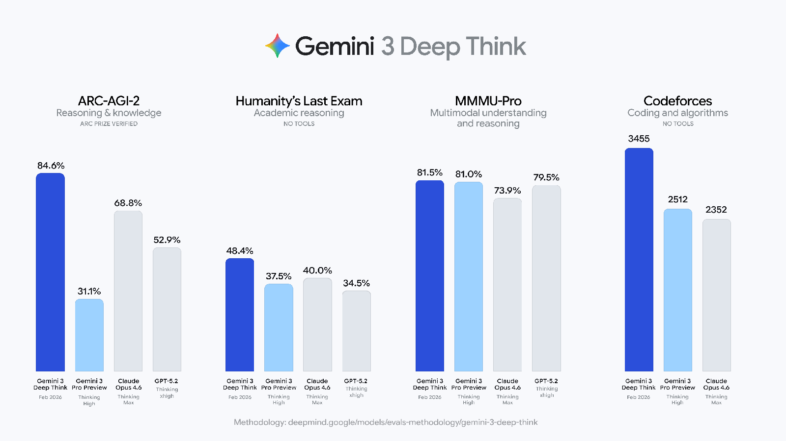
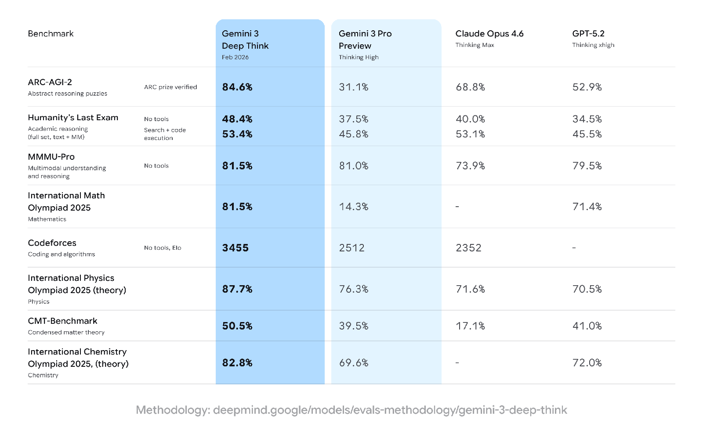

# Gemini 3 Deep Think

**Source**: `raw/gemini-3-deep-think/full-article.html`; Also: `raw/gemini-3-deep-think-app/`  
**URL**: https://blog.google/innovation-and-ai/models-and-research/gemini-models/gemini-3-deep-think/  
**Ingested**: 2026-06-06  
**Tags**: #summary

## Summary

**Gemini 3 Deep Think** is Google's specialized reasoning mode within the Gemini 3 family, designed for complex math, science, logic, and engineering problems. It first shipped to **Google AI Ultra** subscribers in the Gemini app shortly after the Nov 18, 2025 Gemini 3 launch (initial benchmarks: 41.0% HLE without tools, 45.1% ARC-AGI-2 with code execution), using **parallel reasoning** to explore multiple hypotheses simultaneously. A major upgrade released **February 12, 2026** refocused Deep Think on science, research, and engineering challenges where data is messy and solutions lack clear guardrails.

The updated mode sets new records on rigorous benchmarks: **48.4% on Humanity's Last Exam** (no tools), **84.6% on ARC-AGI-2** (ARC Prize Foundation verified), **3455 Elo on Codeforces**, and gold-medal-level performance on IMO 2025. Beyond competitive math and coding, Deep Think achieves gold-medal written-section results on the 2025 International Physics and Chemistry Olympiads and 50.5% on CMT-Benchmark for theoretical physics. Google co-developed the upgrade with scientists and researchers; access expanded to select researchers and enterprises via the Gemini API.

Deep Think builds on Gemini 2.5 Deep Think variants that reached gold-medal standards at the International Mathematical Olympiad and ICPC World Finals. The mode is distinct from standard Gemini 3 Pro "Thinking"—it allocates more compute to extended, parallel reasoning chains for problems requiring mathematical and algorithmic rigor or domain-specific scientific inference.

## Key Claims

- Specialized reasoning mode; initial Ultra app rollout Nov 2025; major science/engineering upgrade Feb 12, 2026.
- **Parallel reasoning**: explores multiple hypotheses simultaneously vs. single-chain thinking.
- Updated benchmarks: **48.4% HLE** (no tools); **84.6% ARC-AGI-2**; **3455 Codeforces Elo**; IMO 2025 gold-medal level.
- Science: gold-medal written sections on 2025 Physics and Chemistry Olympiads; 50.5% CMT-Benchmark (theoretical physics).
- Initial launch (app post): 41.0% HLE, 45.1% ARC-AGI-2 with code execution—superseded by Feb 2026 upgrade.
- Available to Google AI Ultra subscribers in Gemini app; early API access for researchers and enterprises.
- Co-developed with domain scientists for real-world research and engineering workflows.

## Figures

| Figure | Caption | Page |
|--------|---------|------|
|  | Gemini 3 Deep Think evaluation charts across reasoning benchmarks | — |
|  | Gemini 3 Deep Think evaluation benchmark table | — |

## Entities

- [[Reasoning Models]] — Parallel test-time reasoning for math, science, and engineering.
- [[Large Language Models]] — Gemini 3 family specialized reasoning tier.
- [[Agentic AI]] — Extended tool use and code execution on ARC-AGI-2 and engineering tasks.
- [[Google DeepMind]] — Deep Think research lineage from IMO/ICPC gold-medal variants.

## Questions & Gaps

- Compute budget and latency per Deep Think query not disclosed; likely significantly higher than Pro Thinking mode.
- API access initially limited to select researchers/enterprises; general availability timeline unclear.
- Feb 2026 upgrade supersedes Nov 2025 app-launch numbers; users should reference latest evals.
- **Safety Evaluation Controversy**: In [[Implications of Large-Scale Test-Time Compute]], [[Noam Brown]] and AI safety commentators like [[Zvi Mowshowitz]] noted that Deep Think launched without a dedicated safety model card. Google maintained that Deep Think was a runtime improvement posing no new intrinsic risk. Brown argued that while Deep Think is likely a scaffold of Gemini 3 Pro that external actors could replicate with sufficient inference spend, the real omission was that the base [[Gemini 3]] system card failed to evaluate capabilities across test-time compute curves.

## Related

- [[Gemini 3]] — Parent launch; Deep Think introduced alongside Gemini 3 Pro.
- [[Gemini 3 Flash]] — Speed-optimized tier at opposite cost/latency point.
- [[Gemini Deep Research]] — Autonomous research agent using Gemini 3 Pro (complementary agentic use case).
- [[Implications of Large-Scale Test-Time Compute]] — [[Noam Brown]]'s essay analyzing Deep Think's runtime scaffolding and safety governance.
- [[Test-Time Compute]] — underlying parallel reasoning mechanism.
- [[Inference-Budget Safety Evaluation]] — proposed safety framework for runtime scaffolding.
- [[Zvi Mowshowitz]] — commentator on Deep Think's safety card omission.
- [[Reasoning Models]] — Parallel reasoning, HLE, ARC-AGI, and olympiad benchmarks.
- [[Large Language Models]] — Gemini 3 model family context.
- [[Agentic AI]] — Code execution and tool-augmented reasoning on hard benchmarks.
- [[Google DeepMind]] — IMO/ICPC gold-medal Deep Think lineage and science partnerships.
