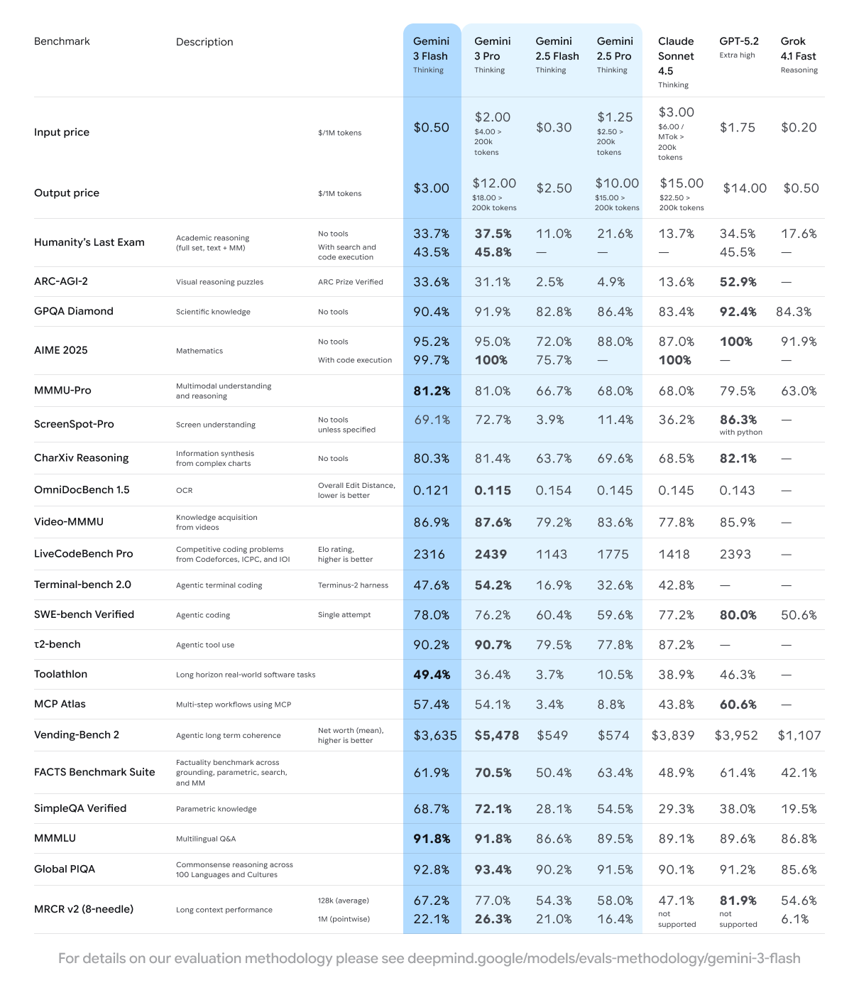
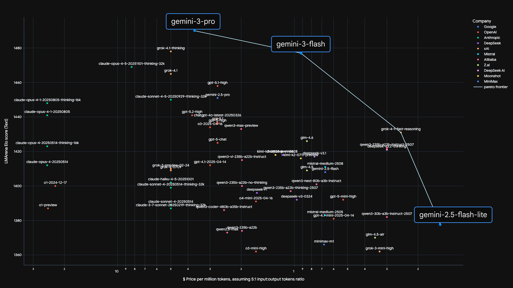

# Gemini 3 Flash

**Source**: `raw/gemini-3-flash/full-article.html`; Also: `raw/build-with-gemini-3-flash/`, `raw/gemini-3-flash-gemini-app/`, `raw/google-ai-mode-update-gemini-3-flash/`  
**URL**: https://blog.google/products-and-platforms/products/gemini/gemini-3-flash/  
**Ingested**: 2026-06-06  
**Tags**: #summary

## Summary

Google released **Gemini 3 Flash** on December 17, 2025 as the speed-optimized member of the Gemini 3 family, delivering **frontier intelligence at Flash speed** at roughly one-quarter the cost of Gemini 3 Pro. The model targets the Pareto frontier of quality vs. cost and speed: it rivals larger frontier models on PhD-level benchmarks (90.4% GPQA Diamond, 33.7% HLE without tools, 81.2% MMMU-Pro) while using 30% fewer tokens than Gemini 2.5 Pro on typical traffic and running **3× faster** than 2.5 Pro per Artificial Analysis.

Pricing is **$0.50/1M input tokens** and **$3/1M output tokens** (audio input $1/1M). On **SWE-bench Verified**, Gemini 3 Flash scores **78%**—outperforming both the 2.5 series and Gemini 3 Pro—making it well suited for agentic coding, production systems, and high-frequency developer workflows. It inherits Gemini 3's multimodal, spatial-reasoning, and code-execution capabilities (including [[Agentic Vision in Gemini 3 Flash]]).

Gemini 3 Flash became the **default model** in the Gemini app (Fast/Thinking modes) and rolled out globally in **Google Search AI Mode**, replacing slower trade-offs between capability and latency. Developers access it via Gemini API in AI Studio and Vertex AI with higher rate limits than 3 Pro.

## Key Claims

- Dec 17, 2025 launch; frontier intelligence at Flash speed and fraction of Pro cost.
- Benchmarks: 90.4% GPQA Diamond; 33.7% HLE (no tools); 81.2% MMMU-Pro; outperforms Gemini 2.5 Pro broadly.
- **SWE-bench Verified: 78%** — beats Gemini 3 Pro and all 2.5 models for coding agents.
- Pricing: $0.50/1M input, $3/1M output; 3× faster than 2.5 Pro; 30% fewer tokens on typical traffic.
- Default in **Gemini app** and **Search AI Mode** globally; Pro remains for advanced math/code.
- Advanced visual/spatial reasoning and code execution for zoom, count, and edit on visual inputs.
- Available in AI Studio, Vertex AI, and third-party platforms (Cursor, JetBrains, Replit, etc.).

## Figures

| Figure | Caption | Page |
|--------|---------|------|
|  | Gemini 3 Flash benchmark comparison table vs. 2.5 Pro and frontier models | — |
|  | Pareto frontier scatter: LMArena Elo vs. price per million tokens (3 Pro, 3 Flash, Flash Lite) | — |

## Entities

- [[Large Language Models]] — Gemini 3 Flash as Google's cost-efficient frontier tier.
- [[Reasoning Models]] — PhD-level GPQA/HLE scores with adjustable thinking levels.
- [[Agentic AI]] — SWE-bench 78%, agentic coding, and code execution on visual inputs.
- [[Vision Language Models]] — MMMU-Pro performance and spatial/visual reasoning.
- [[Google DeepMind]] — Gemini 3 family research and evaluation methodology.

## Questions & Gaps

- Exact parameter count and architecture not disclosed.
- "Thinking level" modulation behavior and latency trade-offs vary by task; blog cites typical traffic, not worst-case.
- Relationship to Gemini 3 Flash Lite (announced alongside) not fully detailed in primary launch post.

## Related

- [[Gemini 3]] — Nov 2025 Pro launch; parent family and Antigravity platform.
- [[Agentic Vision in Gemini 3 Flash]] — Think-Act-Observe vision loop with code execution.
- [[Gemini 3 Deep Think]] — Specialized reasoning mode at the opposite end of the cost/latency spectrum.
- [[Large Language Models]] — Topic hub for Gemini releases.
- [[Reasoning Models]] — Adjustable thinking and benchmark performance.
- [[Agentic AI]] — Coding agents and SWE-bench evaluation.
- [[Vision Language Models]] — Multimodal Flash capabilities.
- [[Google DeepMind]] — Model research and eval methodology.
