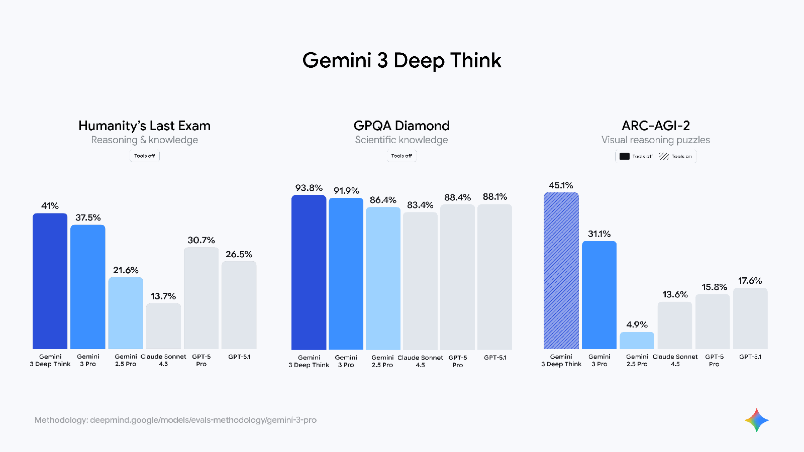
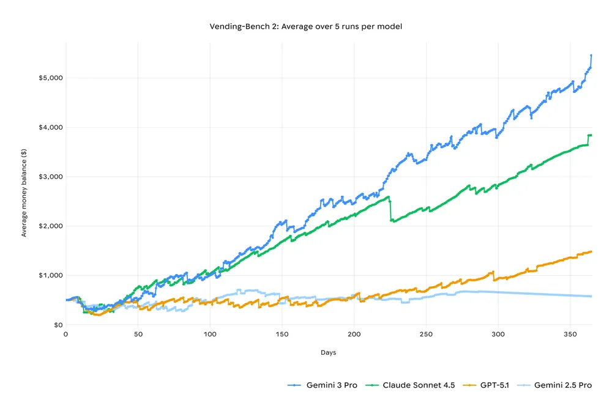

# Gemini 3

**Source**: `raw/gemini-3/full-article.md`, `raw/gemini-3/full-article.md`; Also: `raw/gemini-3-collection/`, `raw/gemini-3-developers/`, `raw/gemini-3-gemini-app/`, `raw/gemini-3-search-ai-mode/`, `raw/gemini-3-pro-vision/`, `raw/gemini-3-deep-think-app/`, `raw/gemini-3-ai-mode-more-countries/`  
**URL**: https://blog.google/products-and-platforms/products/gemini/gemini-3/  
**Ingested**: 2026-06-06  
**Tags**: #summary

## Summary

Google launched **Gemini 3** on November 18, 2025, positioning it as the most intelligent model in the Gemini family and the first Gemini generation shipped to Search on day one. **Gemini 3 Pro** leads on reasoning, multimodal understanding, and agentic coding: 1501 Elo on LMArena, 37.5% on Humanity's Last Exam (HLE, no tools), 91.9% on GPQA Diamond, 81% on MMMU-Pro, 87.6% on Video-MMMU, and 76.2% on SWE-bench Verified. It supports a **1 million-token context window** for synthesizing text, images, video, audio, and code in a single workflow.

Product rollout spans consumer and developer surfaces. The **Gemini app** adds generative interfaces (Visual Layout, Dynamic View) and **Gemini Agent** for multi-step tasks (Gmail, Calendar, web browsing) for Google AI Ultra subscribers. **AI Mode in Search** uses Gemini 3 for generative UI—immersive layouts, interactive tools, and on-the-fly simulations. For developers, Gemini 3 Pro is available in AI Studio, Vertex AI, Gemini CLI, and **Google Antigravity**, a new agent-first IDE where agents autonomously plan, code, and validate via editor, terminal, and browser.

**Gemini 3 Deep Think** is an enhanced reasoning mode (41.0% HLE, 45.1% ARC-AGI-2 with code execution at launch) using parallel hypothesis exploration; it rolled out to Google AI Ultra subscribers in the Gemini app shortly after launch, with a major science-focused upgrade in February 2026 ([[Gemini 3 Deep Think]]). Google Antigravity couples Gemini 3 Pro with Gemini 2.5 Computer Use and Nano Banana for end-to-end agentic development workflows.

## Key Claims

- Nov 18, 2025 launch; Gemini 3 Pro in preview across Gemini app, Search AI Mode, AI Studio, Vertex AI, and Antigravity.
- State-of-the-art reasoning: 1501 LMArena Elo; 37.5% HLE (no tools); 91.9% GPQA Diamond; 23.4% MathArena Apex; 72.1% SimpleQA Verified.
- Multimodal: 81% MMMU-Pro, 87.6% Video-MMMU; 1M-token context for cross-modal synthesis.
- Agentic coding: 1487 WebDev Arena Elo; 54.2% Terminal-Bench 2.0; 76.2% SWE-bench Verified; tops Vending-Bench 2 for long-horizon planning.
- **Google Antigravity**: agent-first dev platform with autonomous plan/code/validate loops; integrates Computer Use and image editing.
- **Generative UI** in Search and Gemini app: dynamic layouts, interactive simulations, and real-time coded interfaces.
- **Gemini 3 Deep Think**: enhanced reasoning mode; initial Ultra rollout, later upgraded for science/engineering (see [[Gemini 3 Deep Think]]).
- Most comprehensive safety evaluations of any Google AI model to date.

## Figures

| Figure | Caption | Page |
|--------|---------|------|
|  | Gemini 3 Pro benchmark evaluation table vs. frontier models (HLE, GPQA, MMMU, coding) | — |
|  | Gemini 3 Deep Think mode benchmark evaluation chart | — |
|  | Vending-Bench 2: Gemini 3 Pro long-horizon planning vs. other frontier models | — |

## Entities

- [[Large Language Models]] — Gemini 3 Pro as Google's Nov 2025 frontier release in the model family.
- [[Reasoning Models]] — Deep Think mode and PhD-level benchmark performance on HLE and GPQA.
- [[Agentic AI]] — Gemini Agent, Antigravity, Terminal-Bench, SWE-bench, and Vending-Bench agent capabilities.
- [[Vision Language Models]] — MMMU-Pro, Video-MMMU, and multimodal learning/building workflows.
- [[Google DeepMind]] — Demis Hassabis and Koray Kavukcuoglu lead the Gemini 3 technical announcement.

## Questions & Gaps

- Deep Think at launch required extra safety evaluation before Ultra access; the Feb 2026 science upgrade ([[Gemini 3 Deep Think]]) supersedes initial benchmark numbers.
- Generative UI and Gemini Agent availability varies by region and subscription tier.
- Full training recipe, data mix, and parameter count not disclosed in blog posts.

## Related

- [[Gemini 3 Flash]] — Dec 2025 speed-optimized sibling; default in Gemini app and Search.
- [[Gemini 3 Deep Think]] — Specialized reasoning mode with science/engineering focus and parallel reasoning.
- [[Gemini Deep Research]] — Autonomous research agent built on Gemini 3 Pro via Interactions API.
- [[Agentic Vision in Gemini 3 Flash]] — Code-execution vision loop in the Flash tier.
- [[Large Language Models]] — Topic hub for Gemini model releases.
- [[Reasoning Models]] — Test-time reasoning and Deep Think lineage.
- [[Agentic AI]] — Antigravity, Gemini Agent, and agentic coding benchmarks.
- [[Vision Language Models]] — Multimodal reasoning and generative UI.
- [[Google DeepMind]] — Research org behind Gemini model development.
