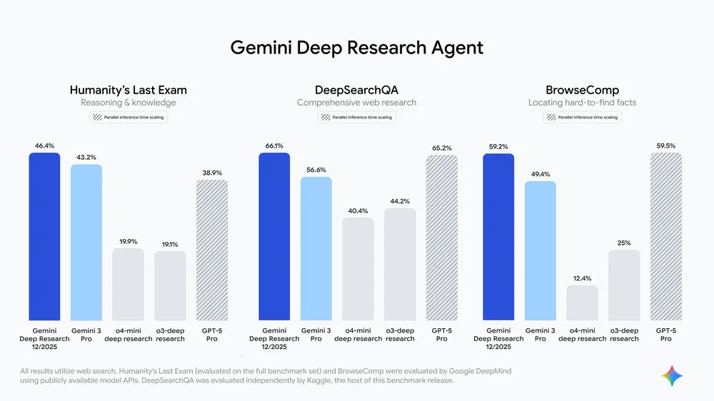
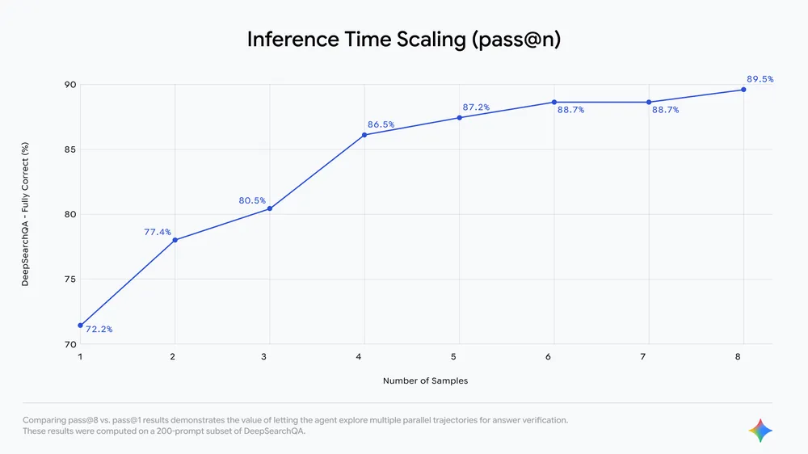

# Gemini Deep Research

**Source**: `raw/deep-research-agent-gemini-api/full-article.md`  
**URL**: https://blog.google/innovation-and-ai/technology/developers-tools/deep-research-agent-gemini-api/  
**Ingested**: 2026-06-06  
**Tags**: #summary

## Summary

Google released a significantly upgraded **Gemini Deep Research** agent on December 11, 2025, making its autonomous research capabilities available to developers through the new **Interactions API**. The agent is optimized for long-running context gathering and synthesis: its reasoning core uses **Gemini 3 Pro** (Google's most factual model at launch) and is specifically tuned for multi-step web research, document analysis, and report generation with granular citations.

Benchmark results position Deep Research as a leading autonomous research system: **46.4% on the full Humanity's Last Exam (HLE)**, **66.1% on DeepSearchQA**, and **59.2% on BrowseComp**. Google also open-sourced **DeepSearchQA**, a benchmark of 900 hand-crafted "causal chain" tasks across 17 fields where each step depends on prior analysis. Unlike fact-retrieval tests, DeepSearchQA measures comprehensiveness—agents must produce exhaustive answer sets, testing both precision and recall.

Developers can embed the agent via Gemini API keys from Google AI Studio. Features include unified synthesis across uploaded documents (PDFs, CSVs) and public web data via File Upload and File Search Tool, prompt-steerable report structure, and detailed citations. Internal evaluations show gains from extended "thinking time" and parallel trajectory exploration (pass@8 vs. pass@1 on DeepSearchQA subsets).

## Key Claims

- Dec 11, 2025 release via **Interactions API**; first developer access to Google's autonomous Deep Research agent.
- Reasoning core: **Gemini 3 Pro**, tuned for factual, long-horizon research synthesis.
- Benchmarks: **46.4% HLE** (full set); **66.1% DeepSearchQA**; **59.2% BrowseComp**.
- **DeepSearchQA** open-sourced: 900 causal-chain tasks, 17 fields; measures comprehensiveness, not single-fact retrieval.
- Extended thinking time and parallel trajectories (pass@8) improve verification on DeepSearchQA subsets.
- Supports File Upload, File Search Tool, large prompt context, steerable report formatting, and granular citations.
- Early adoption in legal, finance, and scientific research workflows cited in blog.

## Figures

| Figure | Caption | Page |
|--------|---------|------|
|  | Benchmark showcase: DeepSearchQA, Humanity's Last Exam, and BrowseComp scores | — |
|  | DeepSearchQA pass@8 vs. pass@1: value of parallel trajectory exploration | — |

## Entities

- [[Agentic AI]] — Autonomous multi-step research agent with web and document tool use.
- [[Large Language Models]] — Built on Gemini 3 Pro as reasoning core.
- [[Reasoning Models]] — Extended thinking time and parallel hypothesis verification.
- [[Google DeepMind]] — DeepSearchQA benchmark and agent development.

## Questions & Gaps

- Full agent architecture (tool loop, stopping criteria, cost per research task) not detailed in blog.
- DeepSearchQA leaderboard and starter Colab linked but reproducibility depends on API access tier.
- How Deep Research differs from consumer Gemini app Deep Research feature not fully specified.

## Related

- [[Gemini 3]] — Gemini 3 Pro reasoning core for the agent.
- [[Agentic AI]] — Autonomous research, tool orchestration, and agent benchmarks.
- [[Reasoning Models]] — Thinking time and multi-trajectory verification.
- [[Large Language Models]] — Foundation model for the agent.
- [[Google DeepMind]] — Benchmark design and research agent development.
