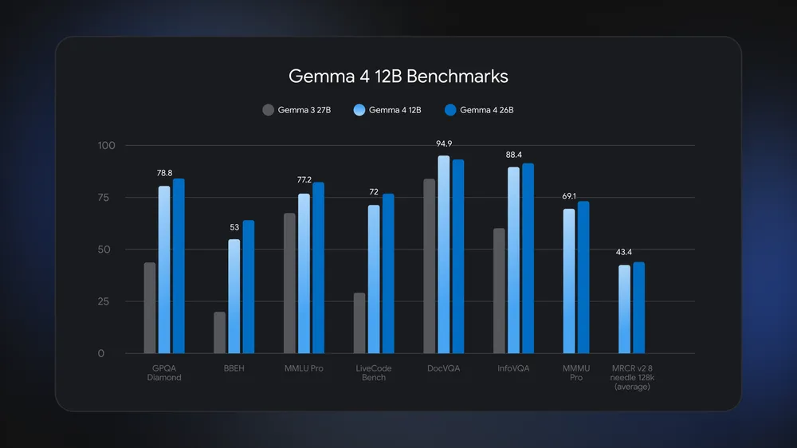
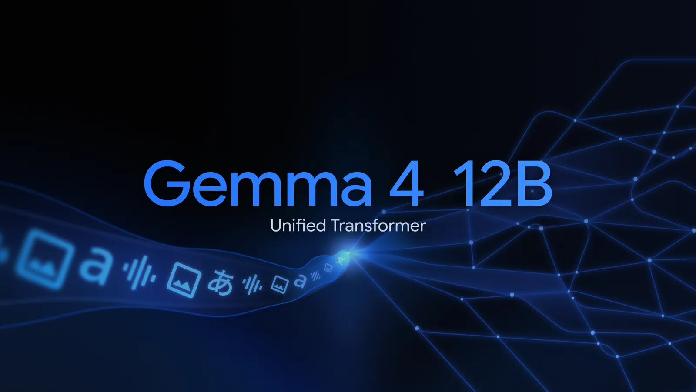

# Gemma 4 12B

**Source**: `raw/gemma-4-12b/full-article.md` (384 KB)  
**URL**: https://blog.google/innovation-and-ai/technology/developers-tools/introducing-gemma-4-12b/  
**Ingested**: 2026-06-06  
**Tags**: #summary

## Summary

Google releases **Gemma 4 12B** (Jun 3, 2026), a mid-size model bridging the edge-friendly **E4B** and the **26B MoE** tier. It targets **agentic multimodal intelligence on laptops** with **16GB VRAM** or unified memory, Apache 2.0 licensing, and bundled **MTP drafters** for lower latency. Gemma 4 downloads had surpassed **150 million** at launch.

The defining architectural choice is an **encoder-free unified multimodal design**: vision and audio flow directly into the LLM backbone without separate encoders. Vision replaces Gemma 4's vision encoder with a lightweight embedding module (matrix multiply, positional embedding, normalizations); audio drops the encoder entirely and projects raw audio into the text token embedding space. Benchmark performance **nears the 26B MoE model** at **less than half the memory footprint**. Gemma 4 12B is also the first mid-sized Gemma with **native audio inputs**.

## Key Claims

- 12B encoder-free multimodal model; Apache 2.0; runs locally on **16GB VRAM**/unified memory.
- Benchmark performance approaching **26B MoE** at <50% memory footprint.
- Unified architecture: no separate vision/audio encoders; LLM backbone processes modalities natively.
- Vision: single matrix-multiply embedding module replaces vision encoder.
- Audio: raw signal projected directly to token embedding dimension (no audio encoder).
- **MTP drafters** included for speculative decoding speedup.
- Ecosystem day-one: Hugging Face, Kaggle, LM Studio, Ollama, LiteRT-LM, MLX, vLLM, SGLang, Unsloth, Vertex AI, Gemma Skills repository.

## Figures

| Figure | Caption | Page |
|--------|---------|------|
|  | Benchmark performance: Gemma 4 12B vs. 26B MoE at reduced memory | — |
|  | Encoder-free multimodal architecture: vision and audio into LLM backbone | — |

## Entities

- [[Gemma 4]] — parent model family; 12B fills the E4B–26B MoE gap.
- [[Gemma 4 Multi-Token Prediction]] — bundled MTP drafters for this checkpoint.
- [[Large Language Models]] — laptop-deployable open multimodal LLM.
- [[Model Compression and Efficiency]] — encoder-free design reduces latency and memory vs. split encoders.
- [[Google DeepMind]] — Olivier Lacombe, Gus Martins; Google DeepMind product/research team.

## Questions & Gaps

- Per-benchmark numbers are in the figure and developer guide, not tabulated in the blog post.
- Audio processing details (sample rate, frame size) deferred to the Gemma 4 12B Developer Guide.
- Quantized memory footprint for 16GB claim not broken out separately in the post.

## Related

- [[Gemma 4]] — flagship family this model extends.
- [[Gemma 4 Multi-Token Prediction]] — inference acceleration for 12B via bundled drafters.
- [[Gemma 4 Technical Report]] — encoder-free 12B architecture and benchmark tables.
- [[Gemma4 Assistant Docs]] — `-assistant` drafter API for 12B IT checkpoints.
- [[Gemma 4 QAT]] — subsequent QAT release compresses the broader family including edge sizes.
- [[Model Compression and Efficiency]] — encoder-free multimodal design for laptop deployment.
- [[Large Language Models]] — open-weights multimodal release context.
- [[Multilingual Models]] — inherits Gemma 4's 140+ language training (via parent family).
- [[Google DeepMind]] — Gemma product and research org.
