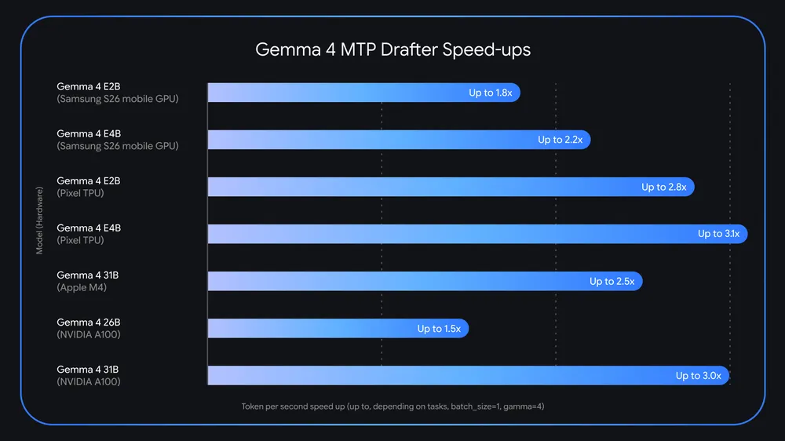
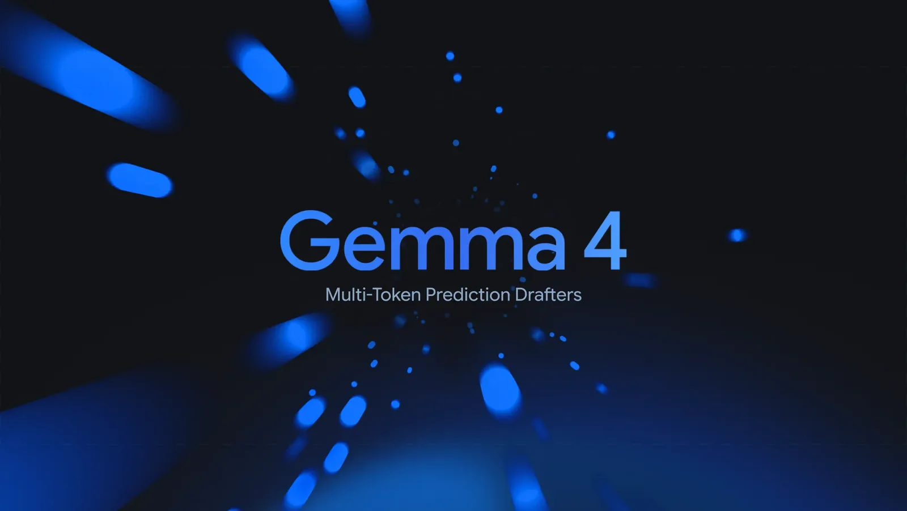

# Gemma 4 Multi-Token Prediction

**Source**: `raw/gemma-4-mtp/full-article.html` (385 KB)  
**URL**: https://blog.google/innovation-and-ai/technology/developers-tools/multi-token-prediction-gemma-4/  
**Ingested**: 2026-06-06  
**Tags**: #summary

## Summary

Google releases **Multi-Token Prediction (MTP) drafters** for the [[Gemma 4]] family (May 5, 2026), applying **speculative decoding** to address memory-bandwidth-bound LLM inference. A lightweight drafter proposes multiple future tokens while the heavy target model (e.g., Gemma 4 31B) verifies them in parallel—yielding up to **3× speedup** with **no degradation** in output quality or reasoning.

MTP drafters reuse the target model's **activations** and **share its KV cache**, avoiding redundant context computation. For E2B/E4B edge models, an efficient **clustering technique in the embedder** accelerates the logit bottleneck. On Apple Silicon, batch sizes of 4–8 unlock up to **~2.2×** additional speedup for the 26B MoE vs. batch size 1; similar gains appear on NVIDIA A100. Drafters ship under Apache 2.0 on Hugging Face, Kaggle, Transformers, MLX, vLLM, SGLang, Ollama, and Google AI Edge Gallery.

## Key Claims

- MTP drafters for all Gemma 4 sizes; up to **3× tokens-per-second** speedup with identical output quality.
- Speculative decoding pairs heavy target with lightweight MTP drafter; target verifies drafted tokens in one forward pass and can emit one additional token.
- Architectural enhancements: shared KV cache, target-activation reuse, efficient embedder clustering on E2B/E4B.
- Drafter parameter counts: E2B **76M**, E4B **77M**, 12B **400M**, 26B-A4B **430M**, 31B **500M** ([[Gemma 4 Technical Report]] §2.6).
- 4-layer drafter (3 local + 1 global attention); hidden dim 256 (E2B/E4B) or 1024 (26B-A4B/31B); cross-attends target KV cache with no drafter prefill.
- 26B MoE on NVIDIA RTX PRO 6000: MTP roughly halves wait time at same output quality (per-post demo).
- Batch-size scaling: ~2.2× local speedup at batch 4–8 on Apple Silicon for 26B MoE; similar on A100.
- Tested across LiteRT-LM, MLX, Hugging Face Transformers, and vLLM backends.

## Figures

| Figure | Caption | Page |
|--------|---------|------|
|  | Tokens-per-second speed increases across Gemma 4 sizes and inference backends | — |
|  | MTP speculative decoding architecture: drafter proposes, target verifies | — |

## Entities

- [[Gemma 4]] — target model family these drafters accelerate.
- [[Multi-Token Prediction]] — training/inference technique for coupled draft heads.
- [[Speculative Decoding]] — verify-and-accept paradigm decoupling draft from target generation.
- [[Model Compression and Efficiency]] — inference latency optimization without quality loss.
- [[Google DeepMind]] — Olivier Lacombe, Maarten Grootendorst; builds on Google speculative-decoding research.

## Questions & Gaps

- Exact acceptance rates and per-model speedup factors vary by hardware; chart aggregates multiple backends.
- RTX PRO 6000 comparison is illustrative; full benchmark matrix not in post.
- X/Twitter "Gemma 4 - Drafter Explained" article linked from post not yet ingested (requires browser export).

## Related

- [[Gemma 4]] — base model family for these MTP drafters.
- [[Gemma 4 Technical Report]] — canonical Section 2.6 drafter architecture and parameter table.
- [[Gemma 4 MTP Overview]] — Google docs on MTP enhancements and MoE batching.
- [[Gemma 4 MTP Transformers Guide]] — Hugging Face `generate(assistant_model=...)` tutorial.
- [[Gemma4 Assistant Docs]] — `Gemma4AssistantForCausalLM` API reference.
- [[A Visual Guide to Gemma 4]] — illustrated MTP architecture walkthrough.
- [[Gemma 4 MTP Explained in 5 Minutes]] — third-party contrast with EAGLE and DeepSeek V3.
- [[Gemma 4 12B]] — ships drafter-ready with bundled MTP support.
- [[Gemma 4 QAT]] — MTP-compatible QAT checkpoints preserve speedup under quantization.
- [[Multi-Token Prediction]] — concept hub for coupled draft-head training.
- [[Speculative Decoding]] — inference acceleration paradigm.
- [[Model Compression and Efficiency]] — bandwidth-bound inference and KV-cache sharing.
- [[Large Language Models]] — open-model inference optimization context.
- [[Google DeepMind]] — Gemma inference research and tooling.
- [[Maarten Grootendorst]] — visual guide author and core contributor.
