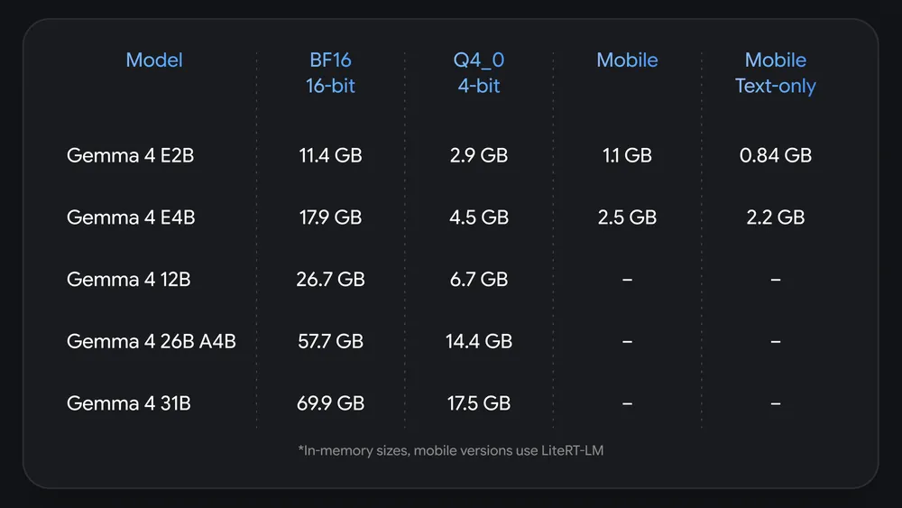
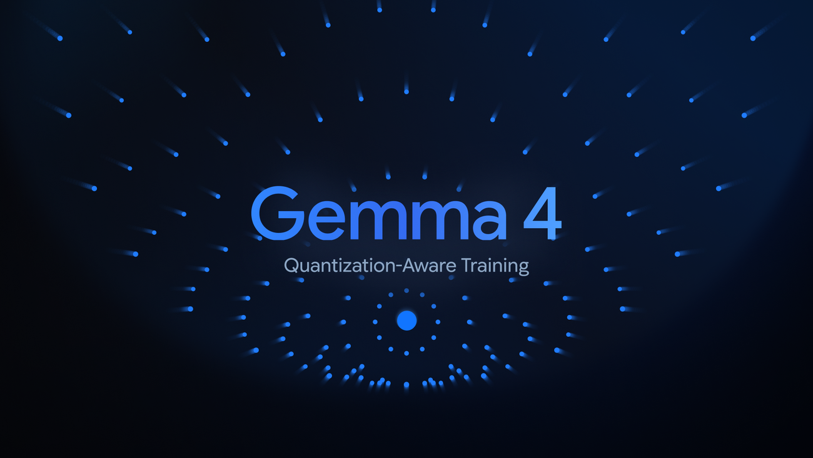

# Gemma 4 QAT

**Source**: `raw/gemma-4-qat/full-article.html` (385 KB)  
**URL**: https://blog.google/innovation-and-ai/technology/developers-tools/quantization-aware-training-gemma-4/  
**Ingested**: 2026-06-06  
**Tags**: #summary

## Summary

Google releases **Quantization-Aware Training (QAT)** checkpoints for the [[Gemma 4]] family (Jun 5, 2026), simulating quantization during training to minimize quality loss at inference. The release includes **Q4_0** QAT weights for all sizes plus a **novel mobile-specialized quantization format** for edge models (E2B, E4B). Using the mobile format, **Gemma 4 E2B drops below 1GB** memory; text-only E2B without per-layer embeddings needs **<1 GB** active memory.

QAT outperforms standard **post-training quantization (PTQ)** baselines on overall quality. The mobile schema uses **static activations** (pre-calculated scales), **channel-wise quantization** aligned to mobile accelerators, **targeted 2-bit quantization** on token-generation layers while keeping reasoning layers higher precision, and compressed **embeddings and KV cache**. Modalities can be stripped (e.g., text-only without vision/audio encoders) for further savings. Ecosystem support spans GGUF (llama.cpp), compressed tensors (vLLM), Ollama, LM Studio, LiteRT-LM, Transformers.js, MLX, SGLang, and **MTP QAT** checkpoints that preserve speculative-decoding speedups.

## Key Claims

- QAT checkpoints for full Gemma 4 family; **Q4_0** format plus custom **mobile quantization** for E2B/E4B.
- **E2B under 1GB** with mobile format; text-only E2B (no per-layer embeddings) **<1 GB** active memory.
- QAT integrates quantization into training; yields **higher quality than PTQ** baselines on reported evals.
- Mobile schema: static activations, channel-wise layout, 2-bit token layers, embedding/KV-cache compression.
- Optional modality stripping (drop vision/audio encoders) further reduces footprint.
- **MTP QAT** checkpoints preserve [[Gemma 4 Multi-Token Prediction]] speedups under quantization.
- Formats: GGUF for llama.cpp, compressed tensors for vLLM, unquantized checkpoints for custom Q4_0 conversion.

## Figures

| Figure | Caption | Page |
|--------|---------|------|
|  | Approximate VRAM/memory requirements for Gemma 4 models (QAT vs. baseline) | — |
|  | QAT compression overview: mobile format and Q4_0 checkpoints | — |

## Entities

- [[Gemma 4]] — base models these QAT checkpoints compress.
- [[Gemma 4 Multi-Token Prediction]] — MTP QAT variants preserve draft speedup under quantization.
- [[Model Compression and Efficiency]] — QAT, Q4_0, mobile quantization, and KV-cache compression.
- [[Large Language Models]] — on-device and consumer-GPU deployment of open models.
- [[Google DeepMind]] — Olivier Lacombe, Omar Sanseviero; edge deployment research.

## Questions & Gaps

- VRAM table is visual (fig-1); exact per-model GB figures not transcribed in post text.
- Mobile format bit-width breakdown per layer type is qualitative; full spec in documentation.
- Quality delta vs. full-precision baselines summarized as "higher than PTQ" without per-benchmark table in post.

## Related

- [[Gemma 4]] — full-precision model family source for QAT checkpoints.
- [[Gemma 4 Multi-Token Prediction]] — MTP QAT preserves speculative decoding under compression.
- [[Gemma 4 Technical Report]] — QAT memory footprint tables (Table 3).
- [[Gemma4 Assistant Docs]] — MTP assistant models compatible with QAT targets.
- [[Gemma 4 12B]] — mid-size variant in the broader Gemma 4 deployment stack.
- [[Model Compression and Efficiency]] — quantization-aware training and mobile deployment.
- [[Large Language Models]] — open-weights on-device inference context.
- [[Multilingual Models]] — compressed checkpoints retain Gemma 4 multilingual capabilities.
- [[Google DeepMind]] — Gemma compression and edge research.
