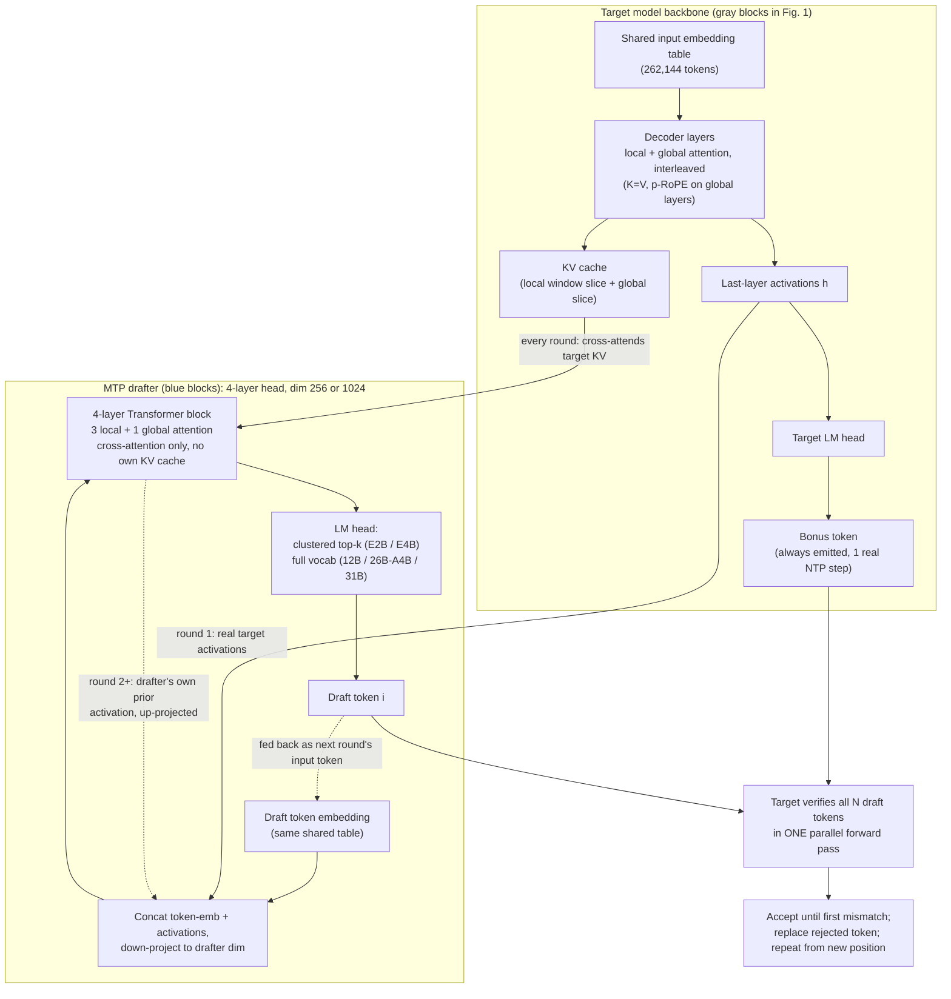

# Gemma 4 Technical Report

**Source**: `raw/gemma-4-technical-report/full-article.html` (251 KB)  
**URL**: https://arxiv.org/abs/2607.02770  
**Ingested**: 2026-07-12  
**Tags**: #summary

## Summary

Google DeepMind's technical report for **Gemma 4** (arXiv:2607.02770): the most capable open Gemma generation, built on Gemini 3 research, released under Apache 2.0. Four public sizes—**E2B** (2.3B effective), **E4B** (4.5B effective), **12B** (encoder-free multimodal), **26B-A4B MoE** (3.8B active), and **31B dense**—cover edge to workstation deployment with native vision/audio (E2B/E4B/12B), **thinking mode**, 128K–256K context, and 140+ languages.

Architectural innovations beyond Gemma 3: **5:1 local-to-global attention** (4:1 on E2B) with last layer always global; **K=V** on global layers; **p-RoPE** (p=0.25) reducing global KV cache by 37.5%; KV cache sharing on edge models; **encoder-free 12B** projecting raw audio chunks and image patches directly into LLM embeddings; **QAT** checkpoints (mobile + Q4_0 formats); and an autoregressive **MTP drafter head** (Section 2.6) for speculative decoding.

The MTP drafter is a **4-layer Transformer** (3 local + 1 global) with dim **256** (E2B/E4B) or **1024** (26B-A4B/31B) that cross-attends to the main model's KV cache, fed by last-layer activations + token embeddings. E2B/E4B drafters use **clustered LM heads** (262k vocab → 4096 cluster matmul). Drafter params: E2B 76M, E4B 77M, 12B 400M, 26B-A4B 430M, 31B 500M.

## Key Claims

- Gemma 4 31B ranks #3 and 26B-A4B #6 on Arena.ai open-model text leaderboard (Jun 2026).
- Thinking mode: reasoning traces before response improve math/coding benchmarks.
- Long-context: p-RoPE + K=V + KV sharing cut global KV footprint up to 37.5%.
- 12B encoder-free: 35M vision matmul replaces 550M ViT; raw audio projected without USM encoder.
- QAT: E2B mobile quant **<1 GB** weights; Q4_0 for larger sizes.
- MTP drafter (§2.6): 4-layer cross-attending block, no MTP prefill, arbitrary draft length; clustered head on E2B/E4B preserves acceptance rate at lower logit cost.
- Pre-training cutoff January 2025; 262k SentencePiece tokenizer.

## Figures

| Figure | Caption | Page |
|--------|---------|------|
| fig-1 (not extractable — see diagram below) | Autoregressive MTP drafter (blue) fed activations and KV cache from main model (gray) | 4 |

The paper's Figure 1 is a raster image (`x1.png`) embedded in the arXiv HTML render and could not be cleanly extracted as a standalone asset. Reconstructed from the Section 2.6 text and caption:

## Entities

- [[Gemma 4]] — launch blog summary of this report.
- [[Google DeepMind]] — research org (Maarten Grootendorst, Olivier Lacombe among contributors).
- [[Maarten Grootendorst]] — core contributor; author of visual guide.
- [[Mixture of Experts]] — 26B-A4B variant (128 experts, 8 active + shared expert).
- [[Model Compression and Efficiency]] — QAT, MoE, MTP drafters.
- [[Multi-Token Prediction]] — MTP drafter training and architecture.
- [[Papers Explained 329 - Gemma 3]] — prior generation.

## Questions & Gaps

- Figure 1 (MTP drafter diagram) ships as a raster image in the arXiv HTML render, not a cleanly extractable article asset; reconstructed as a mermaid diagram in the Figures section above instead.
- Full per-benchmark tables are in report body; blog summaries remain higher-level.
- 12B encoder-free audio details (sample rate, frame size) in developer guide, not fully tabulated here.
- Thinking-mode formatting and function-calling syntax in Appendix Table 11; not reproduced in wiki summary.

## Related

- [[Gemma 4]] — launch announcement.
- [[A Visual Guide to Gemma 4]] — illustrated architecture companion.
- [[Gemma 4 Multi-Token Prediction]] — MTP drafter release and benchmarks.
- [[Gemma 4 MTP Overview]] — inference-focused MTP doc.
- [[Gemma 4 QAT]] — quantization release building on this report's QAT section.
- [[Gemma 4 12B]] — mid-size encoder-free variant.
- [[Mixture of Experts]] — 26B-A4B architecture.
- [[Google DeepMind]] — research lineage.
