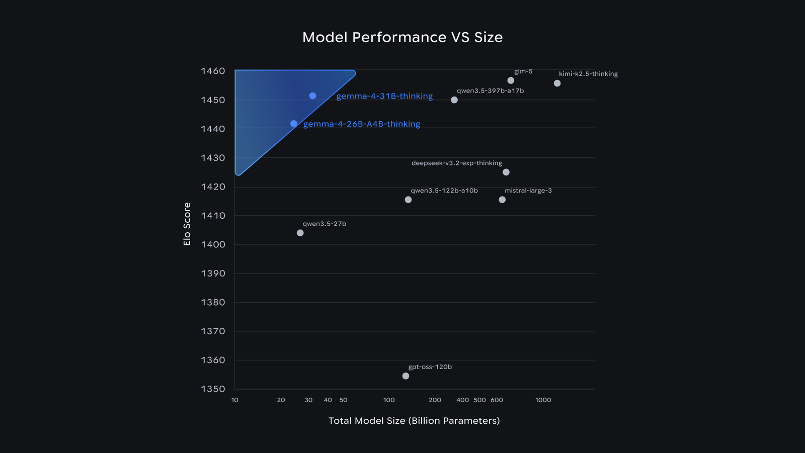
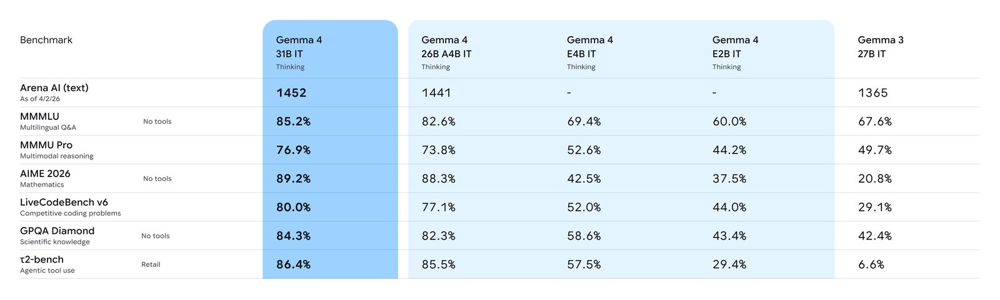

# Gemma 4

**Source**: `raw/gemma-4/full-article.html` (392 KB)  
**URL**: https://blog.google/innovation-and-ai/technology/developers-tools/gemma-4/  
**Ingested**: 2026-06-06  
**Tags**: #summary

## Summary

Google introduces **Gemma 4** (Apr 2, 2026)—the most capable open Gemma family to date—built from the same research stack as **Gemini 3** and released under **Apache 2.0**. Four sizes target different hardware: **Effective 2B (E2B)**, **Effective 4B (E4B)**, **26B Mixture of Experts (MoE)**, and **31B Dense**. The family is purpose-built for advanced reasoning, agentic workflows, code generation, and multimodal understanding rather than simple chat.

Larger models rank highly on Arena.ai: **31B is #3** and **26B MoE is #6** among open models on the text leaderboard, outcompeting models up to **20× their size**. Edge models prioritize multimodal utility, low latency, and ecosystem integration. All variants natively process **vision and audio** (E2B/E4B add native audio input); support **function calling**, structured JSON, and system instructions; offer **128K** (edge) or **256K** (large) context; and are trained on **140+ languages**. The 26B MoE activates only **3.8B** parameters per token for latency; unquantized bfloat16 weights fit on a single **80GB H100**.

## Key Claims

- Four model sizes: E2B, E4B, 26B MoE (3.8B active), 31B Dense; Apache 2.0 with full weight downloads on Hugging Face, Kaggle, and Ollama.
- Built on Gemini 3 technology; 31B ranks #3 and 26B MoE #6 on Arena.ai open-model text leaderboard (as of Apr 1, 2026).
- Agentic: native function calling, JSON output, system instructions; strong math and instruction-following benchmarks.
- Multimodal: native vision (variable resolution, OCR, charts) and audio on all models; E2B/E4B add native audio input.
- 140+ languages natively trained; 128K context (E2B/E4B) and 256K (26B/31B).
- 400M+ cumulative Gemma downloads; 100,000+ community variants in the "Gemmaverse."
- Day-one ecosystem: Hugging Face, LiteRT-LM, vLLM, llama.cpp, MLX, Ollama, NVIDIA NIM, Vertex AI, Android AICore, Pixel/Qualcomm/MediaTek edge deployment.

## Figures

| Figure | Caption | Page |
|--------|---------|------|
|  | Open-model performance vs. size on Arena.ai chat arena (Elo score) | — |
|  | Benchmark comparison table across text-generation evals and Arena rankings | — |

## Entities

- [[Google DeepMind]] — research org behind Gemma 4 (Clement Farabet, Olivier Lacombe).
- [[Maarten Grootendorst]] — core contributor; author of [[A Visual Guide to Gemma 4]].
- [[Large Language Models]] — open-weights frontier family built on Gemini 3 stack.
- [[Multilingual Models]] — 140+ language native training coverage.
- [[Mixture of Experts]] — 26B MoE variant with 3.8B active parameters per token.
- [[Agentic AI]] — function calling, JSON, and multi-step workflow support.
- [[Papers Explained 329 - Gemma 3]] — prior Gemma generation; Gemma 4 extends multimodal and agentic scope.

## Questions & Gaps

- Blog is a launch announcement; deeper architecture (attention patterns, PLE, vision/audio, MTP) is in [[Gemma 4 Technical Report]] and [[A Visual Guide to Gemma 4]].
- Quantized consumer-GPU memory requirements for 26B/31B are mentioned but not tabulated in the post.
- Relationship to Gemini Nano 4 on Android is forward-compatibility via AICore preview, not a full technical spec.

## Related

- [[Gemma 4 Technical Report]] — formal architecture, benchmarks, and MTP drafter spec (arXiv:2607.02770).
- [[A Visual Guide to Gemma 4]] — illustrated architecture walkthrough by [[Maarten Grootendorst]].
- [[Gemma 4 Multi-Token Prediction]] — MTP drafters for up to 3× inference speedup on this family.
- [[Gemma 4 MTP Overview]] — Google docs on MTP architecture and MoE batching.
- [[DiffusionGemma]] — experimental text-diffusion variant on the 26B-A4B backbone; parallel 256-token canvas decode (up to 4× faster locally) with lower output quality than autoregressive Gemma 4.
- [[Gemma 4 12B]] — mid-size encoder-free multimodal variant bridging E4B and 26B MoE.
- [[Gemma 4 QAT]] — quantization-aware training checkpoints for mobile and laptop deployment.
- [[Model Compression and Efficiency]] — MoE sparse activation and edge-optimized E2B/E4B sizing.
- [[Large Language Models]] — topic hub for open-weights model releases.
- [[Multilingual Models]] — 140+ language coverage.
- [[Google DeepMind]] — Gemma research lineage and Gemini 3 technology transfer.
