# Best Graph Neural Network Architectures: GCN, GAT, MPNN and More

**Source**: `raw/gnn-architectures/full-article.html` (markdown view: `raw/gnn-architectures/full-article.md`)  
**URL**: https://theaisummer.com/gnn-architectures/  
**Author**: Sergios Karagiannakos (AI Summer), 2021-09-23  
**Ingested**: 2026-06-06  
**Tags**: #summary

## Summary

Sergios Karagiannakos's AI Summer survey maps the major **[[Graph Neural Networks]]** architecture families from spectral graph convolution through spatial message passing, attention, sampling, and dynamic graphs. The article opens with notation (\(h_i\) node features, \(e_{ij}\) edge features) and three prediction heads: node classification \(Z_i = f(h_i)\), edge classification \(Z_{ij} = f(h_i, h_j, e_{ij})\), and graph classification via permutation-invariant aggregation \(Z_G = f(\sum_i h_i)\).

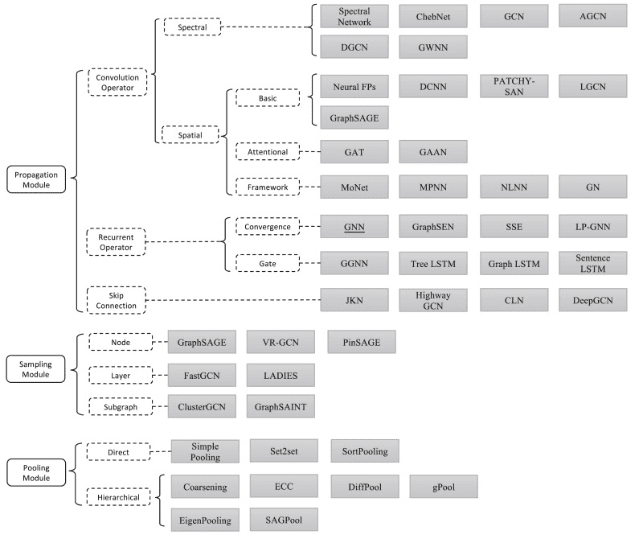

It clarifies **inductive vs transductive** learning in GNN context (note: the article's worked example labels semi-supervised training on the full graph as "inductive" and self-supervised pseudo-labeling as "transductive" — differs from the prior AI Summer GCN tutorial's framing; see [[How Graph Neural Networks (GNN) Work: Introduction to Graph Convolutions from Scratch]]).

**Spectral lineage**: graph Fourier transform on the **[[Graph Laplacian]]** → Spectral Networks (global filters, expensive) → ChebNets (K-hop Chebyshev polynomials) → **[[Graph Convolutional Networks]]** (Kipf & Welling: K=1, self-loops, renormalized \(\tilde{D}^{-1/2}\tilde{A}\tilde{D}^{-1/2}\); most cited and widely deployed; no edge features or explicit messages).

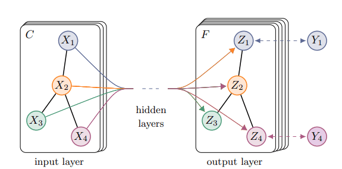

**Spatial lineage**: **[[Message Passing Neural Networks]]** (Gilmer et al.: \(m_{ij} = f_e(h_i,h_j,e_{ij})\), aggregate, \(h_i = f_v(h_i, \sum m_{ji})\); generic but edge-message storage limits scale) → **[[Graph Attention Networks]]** (Veličković et al.: replace fixed GCN coefficients with learned softmax attention over neighbors; multi-head; structure-agnostic attention scores).

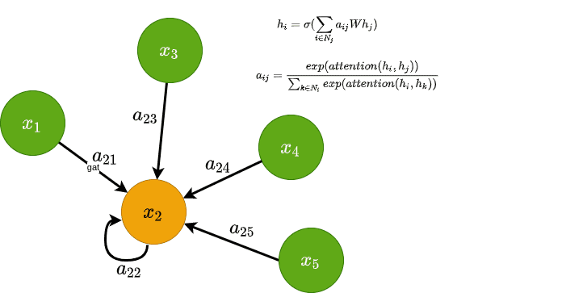

**Sampling**: **[[GraphSAGE]]** (uniform neighborhood sampling + learnable aggregators; inductive large-graph training) → PinSAGE (Pinterest 3B-node recommender: random-walk neighborhoods, importance sampling). **Dynamic graphs**: Temporal Graph Networks (Twitter: GAT encoder + RNN node memory for edge prediction on evolving tweet graphs).

## Key Claims

- GNN is an umbrella term for many architectures, not one model; graph convolution generalizes CNN locality to irregular topologies.
- Node, edge, and graph tasks share latent node embeddings \(h_i\) but differ in readout: per-node \(f\), pairwise \((h_i, h_j, e_{ij})\), or permutation-invariant graph pooling.
- Spectral convolution = multiply graph signal by filter in eigenbasis of \(L\); Spectral Networks lack locality and scale poorly; ChebNets localize to K hops via Chebyshev polynomials without full eigendecomposition.
- GCN (Kipf & Welling 2017) simplifies ChebNets to 1-hop with self-loops and renormalized adjacency; node update \(h_i = \sigma(\sum_{j \in N_i} c_{ij} W h_j)\), \(c_{ij} = 1/\sqrt{|N_i||N_j|}\); limitations: no edge features, no explicit edge messages.
- MPNN unifies spatial GNNs: messages along edges, permutation-invariant aggregation, MLP update; powerful but memory-heavy for large graphs.
- GAT learns attention coefficients \(a_{ij}\) from node features (Bahdanau-style additive attention in paper); softmax over neighbors; multi-head concatenation; scalable and edge-feature-extensible.
- GraphSAGE samples neighbor subsets per layer (growing K-hop receptive field), trains learnable aggregators (mean/LSTM/max-pool); supports unsupervised contrastive or supervised node/graph learning; inductive by design.
- PinSAGE scales GraphSAGE to billions of nodes via random-walk importance neighborhoods; TGN handles dynamic graphs with temporal neighborhoods + per-timestamp node memory updated by messages.

## Figures

| Figure | Caption | Page |
|--------|---------|------|
| 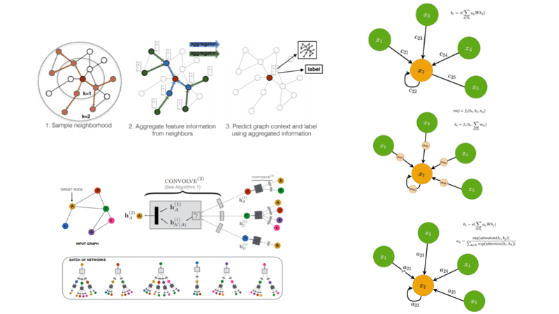 | Article preview / social card | — |
|  | GNN paper timeline (Zhou et al. review) | — |
| 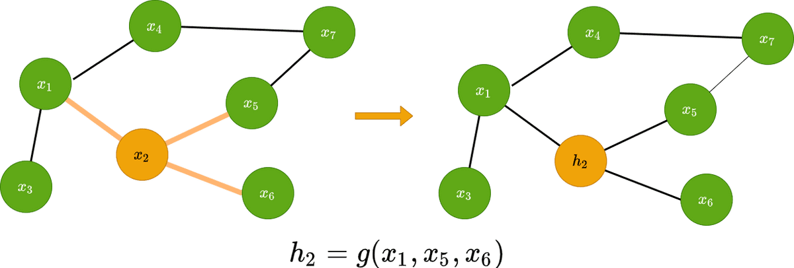 | Graph convolution: neighbors aggregate into latent \(h_i\) | — |
| 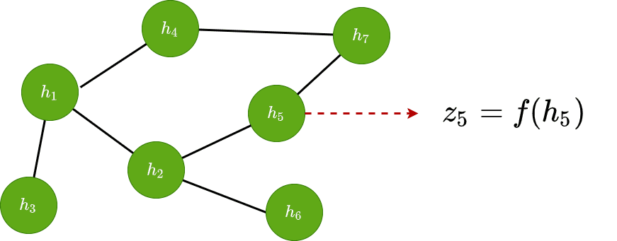 | Node classification readout \(Z_i = f(h_i)\) | — |
| 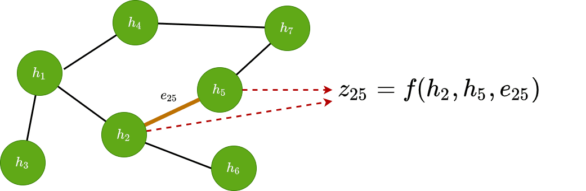 | Edge classification readout \(Z_{ij} = f(h_i, h_j, e_{ij})\) | — |
| 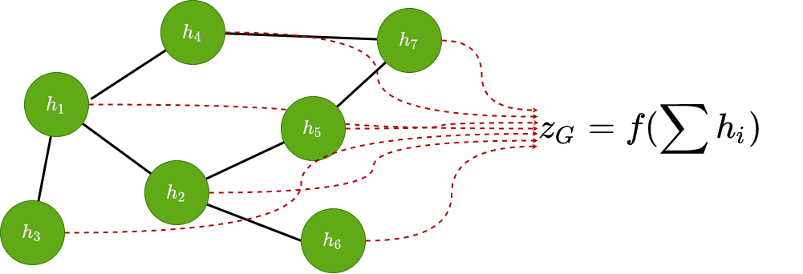 | Graph classification via permutation-invariant aggregation | — |
| 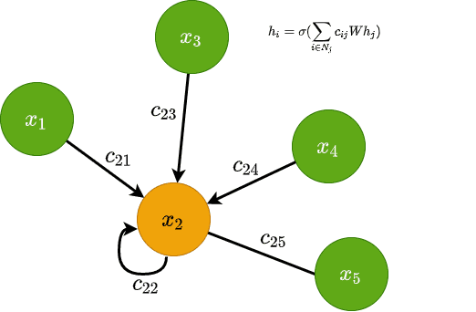 | GCN layer update rule schematic | — |
|  | Graph Convolutional Network architecture (Kipf & Welling) | — |
| 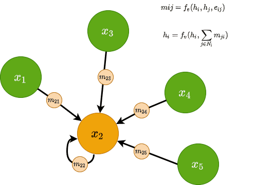 | Message Passing Neural Network message/aggregate/update | — |
| 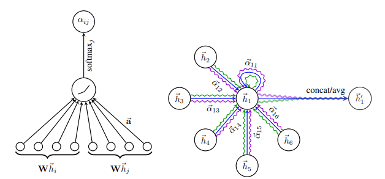 | GAT attention mechanism detail | — |
|  | GAT: single-head attention (left) and multi-head (right) | — |
| 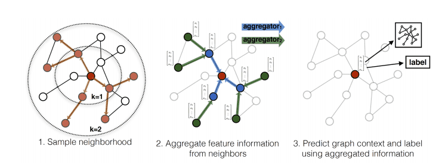 | GraphSAGE sampling and aggregation pipeline | — |
| 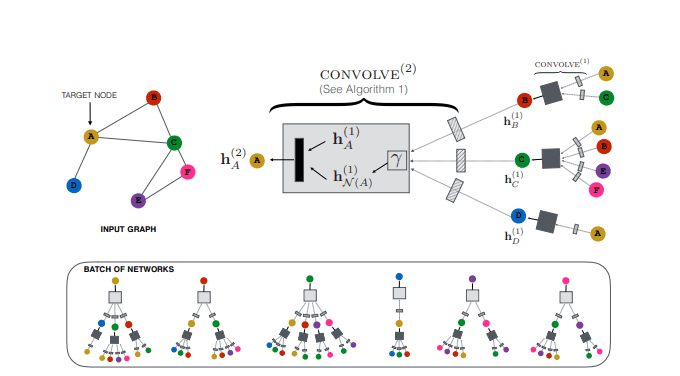 | PinSAGE web-scale recommender overview | — |
| 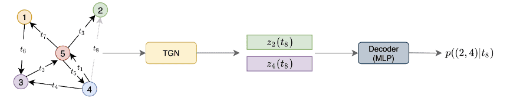 | Temporal Graph Network dynamic graph example | — |
| 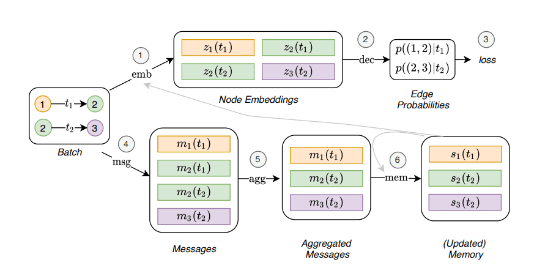 | TGN encoder: GAT + node memory module | — |

MPNNs explicitly model messages \(m_{ij}\) on edges, aggregate at each node, and update features via \(f_v\) — the general spatial GNN template.

Neighbor sampling makes GNN training tractable on large graphs; learnable aggregators are trained jointly with projection weights.

## Entities

- [[AI Summer]] — published this GNN architecture survey (2021).
- [[Sergios Karagiannakos]] — author.
- [[Graph Neural Networks]] — umbrella for spectral, spatial, sampling, and dynamic graph architectures.
- [[Graph Convolutional Networks]] — Kipf-Welling 1-hop spectral simplification; most cited GNN paper.
- [[Message Passing Neural Networks]] — Gilmer et al. message/aggregate/update framework.
- [[Graph Attention Networks]] — Veličković et al. learned neighbor attention.
- [[GraphSAGE]] — Hamilton et al. inductive neighbor-sampling GNN.
- [[Graph Laplacian]] — spectral-domain operator underlying GCN/ChebNets.
- [[Attention Mechanism]] — GAT applies Bahdanau-style attention to graph neighbors.
- [[Convolutional Neural Networks]] — motivating analogy for graph convolution.

## Questions & Gaps

- Article's inductive/transductive example contradicts common GNN literature (and the prior AI Summer GCN tutorial); treat as pedagogical simplification, not canonical definitions.
- PinSAGE and TGN covered at survey depth only; engineering details omitted.
- No PyTorch Geometric code in this article (promised in follow-up); no GIN or RGCN coverage despite being common in comparison tables elsewhere.
- GCN limitations (no edge features) partially addressed by MPNN/GAT but architecture selection guidance is brief.

## Related

- [[Graph Neural Networks — An Overview]] — earliest series article (2020): RNN/message-passing intuition before spectral/spatial taxonomy.
- [[How Graph Neural Networks (GNN) Work: Introduction to Graph Convolutions from Scratch]] — prerequisite tutorial: Laplacian math, Chebyshev theory, PyTorch 1-hop GCN, MUTAG demo.
- [[Graph Convolutional Networks]] — detailed GCN layer from the intro article; this survey places GCN in spectral lineage.
- [[Graph Laplacian]] — shared mathematical foundation.
- [[Self-Attention]] — GAT connects graph convolutions to attention over neighbors.
- [[Computer Vision]] — graphs generalize grid-structured CNN inputs.
