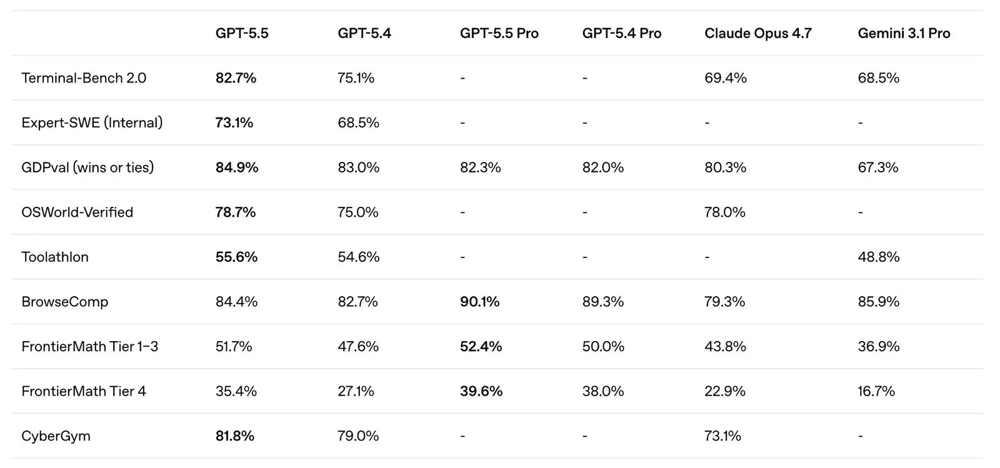
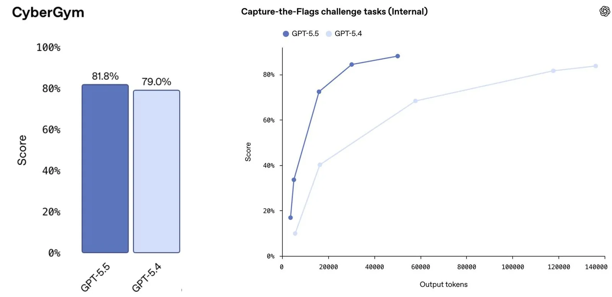

# GPT-5.5

**Source**: `raw/gpt-5-5/full-article.md`, `raw/gpt-5-5-system-card/full-article.md`, `raw/gpt-5-5-instant/full-article.md`, `raw/gpt-5-5-instant-system-card/full-article.md`
**Ingested**: 2026-07-10
**Tags**: #summary

## Summary

OpenAI released GPT-5.5 on April 23, 2026 to Plus, Pro, Business, and Enterprise users in ChatGPT and Codex, with GPT-5.5 Pro following for Pro, Business, and Enterprise, and API access arriving a day later. A notable engineering claim in the announcement is that GPT-5.5 matches GPT-5.4's per-token serving latency despite being a larger, more capable model, and uses fewer tokens than GPT-5.4 to finish the same Codex tasks. The model was co-designed for, trained with, and served on NVIDIA GB200 and GB300 NVL72 systems; OpenAI reports Codex itself was used to analyze production traffic patterns and write custom heuristics for dynamic GPU-core load partitioning, lifting token generation speed by more than 20%.

On agentic coding, GPT-5.5 reaches 82.7% on Terminal-Bench 2.0 and 58.6% on SWE-Bench Pro, and outperforms GPT-5.4 on Expert-SWE, an internal long-horizon coding evaluation with a median estimated human completion time of 20 hours, while using fewer tokens across all three evals. Cursor's CEO is quoted saying the model "stays on task for significantly longer without stopping early." On knowledge work, GPT-5.5 improves on document, spreadsheet, and slide generation in Codex and on operating computer interfaces through Codex's computer-use skills; OpenAI reports more than 85% of its own staff use Codex weekly, with cited internal examples including reviewing 24,771 K-1 tax forms roughly two weeks faster than the prior year and saving 5 to 10 hours per week on business reporting. On [[GDPval]], GPT-5.5 reaches 84.9% wins or ties, up from 83.0% for GPT-5.4. In science, GPT-5.5 improves on GeneBench and leads published scores on BixBench, both genetics and bioinformatics data-analysis evaluations, and an internal version with a custom harness found a new proof of a longstanding asymptotic fact about off-diagonal Ramsey numbers, later verified in the Lean proof assistant.

OpenAI classifies GPT-5.5's biological and chemical capability, and separately its cybersecurity capability, as High under the Preparedness Framework. It did not reach Critical cybersecurity capability, but testing showed a capability step up over GPT-5.4. In response, OpenAI is deploying stricter cyber-risk classifiers than it used for GPT-5.2 or GPT-5.4, expanding Trusted Access for Cyber starting with Codex, and continuing to offer more permissive, cyber-focused models such as GPT-5.4-Cyber to organizations defending critical infrastructure under strict security requirements. The GPT-5.5 system card describes this as OpenAI's strongest set of safeguards to date, following the full Preparedness Framework process plus targeted red-teaming for advanced cybersecurity and biology capabilities and feedback from nearly 200 early-access partners.

GPT-5.5 Instant followed on May 5, 2026 as the new default ChatGPT model, with a June 9 update extending its personalization features to Go and Free tiers. It produced 52.5% fewer hallucinated claims than GPT-5.3 Instant on high-stakes prompts spanning medicine, law, and finance, and 37.3% fewer inaccurate claims on conversations users had flagged as containing factual errors. OpenAI introduced memory sources across all ChatGPT models alongside this release: visibility into what saved memories or past chats shaped a given response, with controls to delete or correct them. The GPT-5.5 Instant system card marks it as the first Instant-tier model treated as High capability in both the Cybersecurity and Biological and Chemical Preparedness categories, a designation previously reserved for the larger Thinking-tier models in this family.

## Key Claims

- GPT-5.5 matches GPT-5.4's per-token serving latency while using fewer tokens on Codex tasks, despite being described as larger and more capable; co-designed for and served on NVIDIA GB200/GB300 NVL72 systems.
- Terminal-Bench 2.0: 82.7% (GPT-5.5) vs 75.1% (GPT-5.4); SWE-Bench Pro (public): 58.6% vs 57.7%; GPT-5.5 outperforms GPT-5.4 on the long-horizon Expert-SWE internal eval while using fewer tokens on all three.
- GDPval wins or ties: 84.9% (GPT-5.5) vs 83.0% (GPT-5.4); more than 85% of OpenAI staff use Codex weekly.
- GeneBench and BixBench (genetics/bioinformatics analysis) both improve over GPT-5.4, with GPT-5.5 leading published BixBench scores.
- An internal GPT-5.5 variant with a custom harness produced a new proof of an asymptotic fact about off-diagonal Ramsey numbers, later verified in Lean.
- OpenAI classifies GPT-5.5 as High capability in both Biological/Chemical risk and Cybersecurity under the Preparedness Framework; it does not reach Critical cybersecurity capability but shows a measured capability step up over GPT-5.4.
- GPT-5.5 Instant cuts hallucinated claims by 52.5% on high-stakes prompts and 37.3% on user-flagged factual-error conversations, versus GPT-5.3 Instant.
- GPT-5.5 Instant is the first Instant-tier model rated High capability in both Cybersecurity and Biological/Chemical risk, a designation earlier limited to Thinking-tier models.
- OpenAI introduced memory sources across ChatGPT: transparency into which saved memories or past chats informed a response, with user controls to delete or correct them.
- Pricing: `gpt-5.5` at $5 input / $30 output per 1M tokens (1M context window); `gpt-5.5-pro` at $30 input / $180 output. Codex Fast mode runs 1.5x faster at 2.5x the token cost.

## Benchmarks

### Coding
| Eval | GPT-5.5 | GPT-5.4 | GPT-5.5 Pro | GPT-5.4 Pro | Claude Opus 4.7 | Gemini 3.1 Pro |
| --- | --- | --- | --- | --- | --- | --- |
| SWE-Bench Pro (Public) | 58.6% | 57.7% | - | - | 64.3% | 54.2% |
| Terminal-Bench 2.0 | 82.7% | 75.1% | - | - | 69.4% | 68.5% |
| Expert-SWE (Internal) | 73.1% | 68.5% | - | - | - | - |

### Professional
| Eval | GPT-5.5 | GPT-5.4 | GPT-5.5 Pro | GPT-5.4 Pro | Claude Opus 4.7 | Gemini 3.1 Pro |
| --- | --- | --- | --- | --- | --- | --- |
| GDPval (wins or ties) | 84.9% | 83.0% | 82.3% | 82.0% | 80.3% | 67.3% |
| Investment Banking Modeling Tasks | 88.5% | 87.3% | 88.6% | 83.6% | - | - |

### Cybersecurity and academic
| Eval | GPT-5.5 | GPT-5.4 | GPT-5.5 Pro | GPT-5.4 Pro | Claude Opus 4.7 | Gemini 3.1 Pro |
| --- | --- | --- | --- | --- | --- | --- |
| Capture-the-Flags challenge tasks (Internal) | 88.1% | 83.7% | - | - | - | - |
| CyberGym | 81.8% | 79.0% | - | - | 73.1% | - |
| FrontierMath Tier 4 | 35.4% | 27.1% | 39.6% | 38.0% | 22.9% | 16.7% |
| GPQA Diamond | 93.6% | 92.8% | - | 94.4% | 94.2% | 94.3% |

### Long context
| Eval | GPT-5.5 | GPT-5.4 |
| --- | --- | --- |
| OpenAI MRCR v2 8-needle 512K-1M | 74.0% | 36.6% |
| Graphwalks BFS 1mil f1 | 45.4% | 9.4% |

## Preparedness Framework / Safety

GPT-5.5 carries High Preparedness Framework designations in both Biological and Chemical risk and Cybersecurity. It did not cross the Critical cybersecurity threshold, but OpenAI's testing found a clear capability step up over GPT-5.4, which it addresses with stricter cyber-risk classifiers than were used for GPT-5.2 or GPT-5.4, an expanded Trusted Access for Cyber program starting with Codex, and continued availability of more permissive cyber-focused variants like GPT-5.4-Cyber for organizations with strict security requirements defending critical infrastructure. The system card describes this as OpenAI's strongest safeguard set to date, built on the full Preparedness Framework process, targeted red-teaming for advanced cybersecurity and biology capabilities, and pre-release feedback from close to 200 early-access partners. Safety results for GPT-5.5 Thinking are generally treated as a strong proxy for GPT-5.5 Pro, the same underlying model with parallel test-time compute, except where that setting could materially change risk, in which case Pro is evaluated separately.

The GPT-5.5 Instant system card notes that it is the first Instant-tier (fast, default-chat) model rated High capability in both Cybersecurity and Biological/Chemical risk, categories that had previously been reserved for the larger Thinking-tier models in the GPT-5 family. Because there is no model named GPT-5.4 Instant, the card's primary baseline for comparison is GPT-5.3 Instant.

## Figures

No direct figures were extracted in the initial OpenAI announcement due to download restrictions. However, [[Noam Brown]]'s subsequent analysis in [[Implications of Large-Scale Test-Time Compute]] provides the canonical benchmark grid and token-scaling comparison figures for GPT-5.5 vs GPT-5.4:

| Figure | Caption | Page |
|---|---|---|
|  | Classic "benchmark grid" comparing GPT-5.5 and GPT-5.4 across Terminal-Bench 2.0, Expert-SWE, GDPval, OSWorld-Verified, Toolathlon, BrowseComp, FrontierMath, and CyberGym | [[Implications of Large-Scale Test-Time Compute]] |
|  | Left: CyberGym scalar comparison vs Right: CTF challenges plotted against output tokens showing GPT-5.5's massive capability step-change when controlling for inference compute | [[Implications of Large-Scale Test-Time Compute]] |

## Entities

- [[OpenAI]] — publisher of GPT-5.5, its system card, GPT-5.5 Instant, and its system card.
- [[NVIDIA]] — GB200/GB300 NVL72 systems that GPT-5.5 was co-designed for, trained with, and served on.
- [[Noam Brown]] — OpenAI researcher who published the token-scaling and inference-budget analysis of GPT-5.5.

## Questions & Gaps

- The GPT-5.5 system card (a short document in this source set) does not itself state the numeric cybersecurity or biology evaluation scores behind the High designation; those appear in the main announcement's benchmark tables instead.
- "GPT-5.4-Cyber" is named as a continuing offering for critical-infrastructure defenders but is not otherwise documented in these sources; it appears to be a permissive-access variant rather than a separate general release.
- Regional rollout timing for GPT-5.5 Instant's memory-sources feature is described only in general terms (web before mobile, Plus/Pro before Free/Go/Business/Enterprise), without specific dates for most tiers.

## Related

- [[OpenAI]]
- [[GPT-5.4]]
- [[GPT-5.6]]
- [[Implications of Large-Scale Test-Time Compute]] — [[Noam Brown]]'s essay analyzing why GPT-5.5's benchmark grid was deceptive and how token-scaled plots reveal its true step-change.
- [[Test-Time Compute]]
- [[Inference-Budget Safety Evaluation]]
- [[Large Language Models]]
- [[Reasoning Models]]
- [[Code Models]]
- [[Agentic AI]]
- [[Long Context]]
- [[GDPval]]
- [[Instruction Hierarchy]]
- [[Preparedness Framework]]
