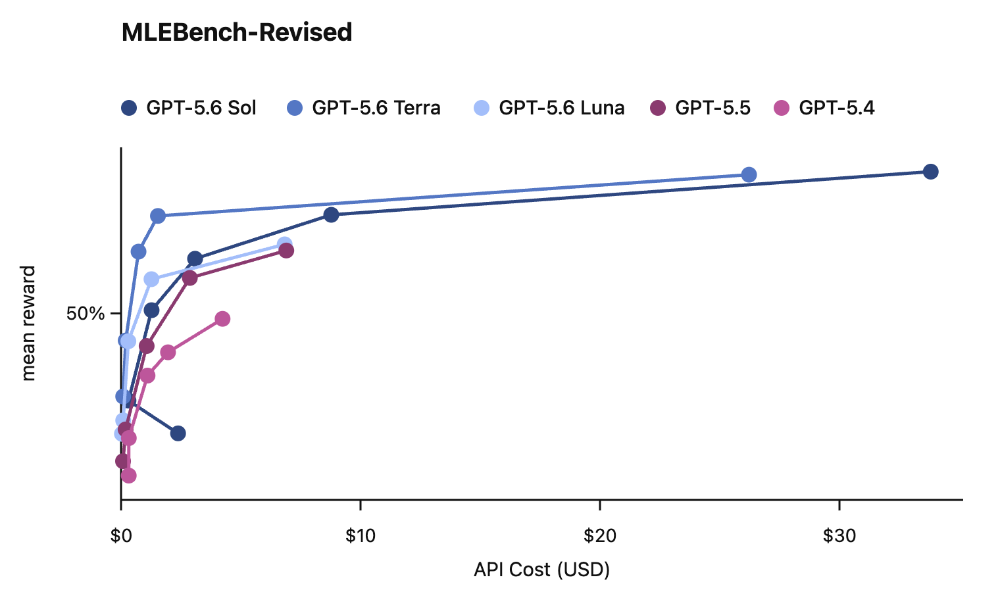
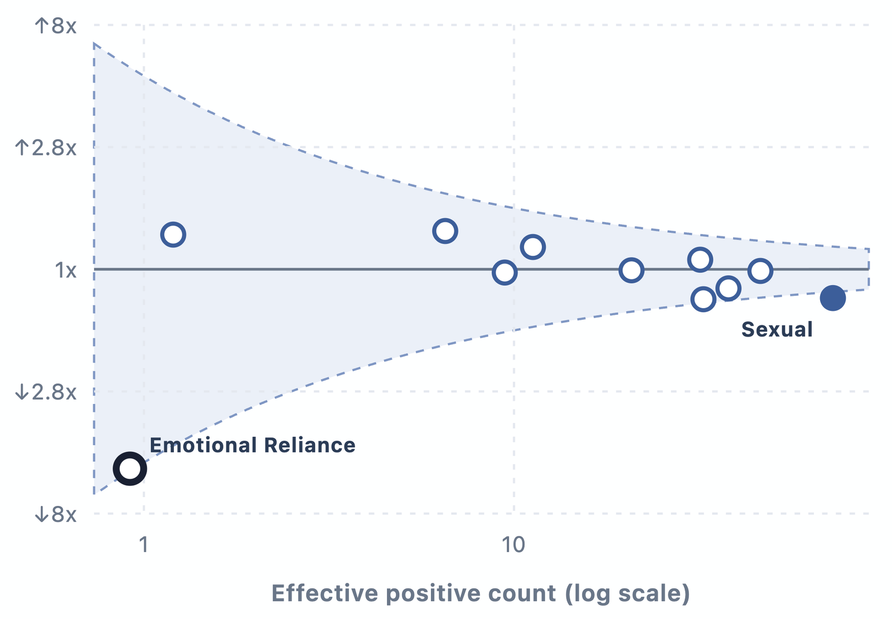
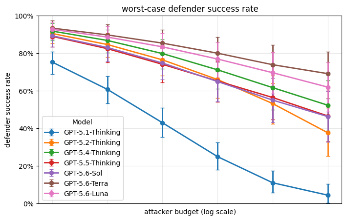
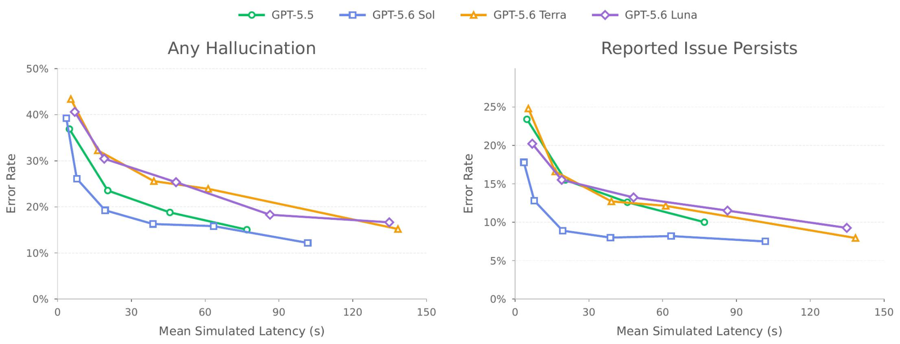

# GPT-5.6

**Source**: `raw/previewing-gpt-5-6-sol/full-article.md`, `raw/gpt-5-6-preview-deploymentsafety/full-article.md`, `raw/gpt-5-6/full-article.md`, `raw/gpt-5-6-deploymentsafety/full-article.html`, `raw/gpt-5-6-deploymentsafety/full-article.md`  
**Ingested**: 2026-07-31 (updated from 2026-07-10 preview ingest)  
**Tags**: #summary

## Summary

GPT-5.6 is OpenAI's July 2026 model family of three durable capability tiers: **Sol** (flagship), **Terra** (balanced, everyday work), and **Luna** (fast, affordable). The version number marks the generation; Sol, Terra, and Luna are tiers that can advance on independent cadences. The family launched in a **limited preview on June 26, 2026** (government-coordinated access for trusted partners) and reached **general availability on July 9, 2026** across ChatGPT, Codex, and the OpenAI API, with a **July 30 price cut** for Terra (−20%) and Luna (−80%).

GPT-5.6 Sol sets new state-of-the-art results across coding, knowledge work, cybersecurity, and science while using fewer tokens than prior and competing frontier models. New product **ChatGPT Work** combines ChatGPT and Codex for non-coding knowledge work. API additions include **Programmatic Tool Calling** and **multi-agent** beta in the [[Responses API]], plus `max` reasoning effort and `ultra` mode (four parallel subagents by default). OpenAI describes GPT-5.6 as carrying its most robust safety stack yet, with ~700,000 A100-equivalent GPU hours of automated red-teaming before GA and cyber safeguards that block roughly **10× more** potentially harmful activity than prior models.

All three models are rated **High** in Biological/Chemical risk and **High** in Cybersecurity under the [[Preparedness Framework]], and below High in AI Self-Improvement—the first release where smaller family members reach High alongside the flagship. None crosses the Cyber Critical threshold. A separate [[How Two Settings Tripled Our ARC-AGI-3 Scores]] post shows official-harness ARC-AGI-3 scores understate GPT-5.6 Sol when reasoning is discarded between turns.

## Release timeline

| Date | Milestone |
| --- | --- |
| 2026-06-26 | Limited preview to trusted partners; government-coordinated access at U.S. request |
| 2026-07-09 | General availability; ChatGPT Work launch; GA system card published |
| 2026-07-30 | Luna price −80% ($0.20/$1.20 per M tokens); Terra −20% ($2.00/$12.00) |

## Key Claims

### Family and products
- Three tiers: Sol (flagship), Terra (GPT-5.5-competitive at lower cost), Luna (fastest, most affordable).
- ChatGPT Work: ChatGPT + Codex for documents, spreadsheets, presentations, web apps; unified plugins for Slack, Gmail, Google Drive, calendars, CRMs.
- `max` reasoning effort and `ultra` mode (parallel subagents) for demanding tasks.
- Responses API: Programmatic Tool Calling (ZDR-compatible in-memory tool coordination); multi-agent beta.

### Preview (June 2026)
- Government-coordinated limited preview; OpenAI states this access process should not become permanent.
- Terra ~2× cheaper than GPT-5.5 at competitive performance; Luna at OpenAI's lowest price point.
- Terminal-Bench 2.1 SOTA; GeneBench v1 gains over GPT-5.5 with fewer tokens.
- 700,000+ A100-equivalent GPU hours automated red-teaming; strongest universal jailbreak mitigated from 83.0% to 0%.

### GA benchmarks (July 2026)
- Agents' Last Exam: Sol **53.6%** (max), **52.7%** (table); beats Fable 5 by 13.1 points at max.
- AA Coding Agent Index v1.1: Sol **80** (max); Terminal-Bench 2.1 **88.8%** (Sol), **91.9%** (Sol Ultra).
- BrowseComp **92.2%** (Sol Ultra); OSWorld 2.0 **62.6%** (85% fewer tokens vs Opus 4.8).
- ExploitBench **73.5%** vs GPT-5.5 **47.9%**; ExploitGym **33.7%** (6h) vs **15.1%** (2h).
- GeneBench Pro **28.7%** vs GPT-5.5 **12%**; RSI Index **57.9%** vs **41.7%**.
- ARC-AGI-3 (official harness): Sol **7.78%**, Terra **0.8%**, Luna **0.18%**.

### Safety (GA system card)
- High Bio/Chem + Cyber for Sol, Terra, Luna; below High AI Self-Improvement.
- Cyber safeguards block ~**10× more** potentially harmful activity vs prior models.
- Retry-on-lower-capability-model option when safeguards create friction.
- Reasoning-effort **curves** reported instead of single scores.
- Deployment simulation forecasts disallowed-content rates similar to GPT-5.5 overall.
- Greater tendency than GPT-5.5 to go beyond user intent in agentic coding (low absolute rates).
- CoT controllability higher than GPT-5.5; Apollo found no materially higher scheming risk.

## Pricing

| Model | Launch (Jul 9) | After Jul 30 cut | Notes |
| --- | --- | --- | --- |
| Sol | $5 / $30 per M tokens | unchanged | Flagship |
| Terra | $2.50 / $15 | **$2.00 / $12.00** | ~GPT-5.5 competitive |
| Luna | $1 / $6 | **$0.20 / $1.20** | High-volume workloads |

Prompt caching: explicit cache breakpoints, 30-minute minimum cache life; cache writes at 1.25× uncached input for GPT-5.6+.

## Benchmarks

### Professional and coding (GA announcement)

| Eval | Sol | Terra | Luna | GPT-5.5 |
| --- | --- | --- | --- | --- |
| Agents' Last Exam | 52.7% | 50.4% | 50.3% | 46.9% |
| AA Intelligence Index v4.1 | 58.9 | 55 | 51.2 | 54.8 |
| AA Coding Agent Index v1.1 | 80 | 77.4 | 74.6 | 76.4 |
| Terminal-Bench 2.1 | 88.8% | 87.4% | 84.7% | 85.6% |
| SWE-Bench Pro | 64.6% | 63.4% | 62.7% | 59.4% |

### Cybersecurity

| Eval | Sol | Terra | Luna | GPT-5.5 |
| --- | --- | --- | --- | --- |
| Capture-the-Flag | 96.7% | 91.8% | 85.2% | 88.1% |
| SEC-Bench Pro | 71.2% | 57.7% | 48.9% | 45.8% |
| ExploitBench | 73.5% | 52.9% | 33.2% | 47.9% |
| ExploitGym (6h) | 33.7% | 23.2% | 12.4% | 15.1% |

### Science and computer use

| Eval | Sol | GPT-5.5 |
| --- | --- | --- |
| GeneBench Pro | 28.7% | 12% |
| BrowseComp | 90.4% | 84.4% |
| OSWorld 2.0 | 62.6% | 47.5% |
| HealthBench Professional | 60.5% | 49.5% |

In open mathematical research, [[Sebastien Bubeck]] documented that GPT-5.6-pro autonomously one-shot proved the $2^n$ lower bound (80 minutes of test-time compute) and a $2.31\dots^n$ upper bound (88 minutes of test-time compute) for the length of [[Self-Contracted Curves]] in [[Gradient Flow on Convex Functions]], significantly outperforming the 35-year published mathematical SOTA ($n^{O(n)}$ upper bound; see [[A Single Question to Track Progress from o3 to GPT-5.6 and Beyond]]).

External evaluator highlights (preview card, largely consistent in GA):

| Evaluator | Finding |
| --- | --- |
| SecureBio | Sol/railfree 68.3% World-Class Bio (+9 vs GPT-5.5); 85% ReproBAIT |
| Irregular | 19/197 FrontierCyber (incl. 2 zero-days); 7/11 CyScenarioBench |
| METR | High eval-environment exploitation rate; would not enable fully automated AI R&D |
| Apollo | No higher scheming risk; 16% evaluation-awareness vs 43% (GPT-5.5 checkpoint) |

## Preparedness Framework / Safety

All three GPT-5.6 models are rated High in Biological/Chemical and Cybersecurity and below High in AI Self-Improvement. In biology, wet-lab troubleshooting evals exceed High thresholds while Critical protein/DNA design evals are not exceeded. In cybersecurity, all three exceed internal CTF High threshold (Sol saturates 96.7%) but none produces functional critical-severity exploits against hardened widely deployed software.

GA-specific safety stack additions vs preview:
- **~10× more** cyber safeguard blocking vs prior models; conservative iterative deployment with retry option.
- **Activation classifiers** on Sol/Terra intervene mid-generation in sensitive domains.
- **Two-tier monitoring**: topical classifier + safety reasoner (shared design with [[gpt-oss-safeguard]]).
- **Deployment simulations** forecast disallowed-content rates; GPT-5.6 Sol similar to GPT-5.5 overall with isolated significant shifts (sexual content +40% relative, mental health −40% relative; absolute rates remain low).
- **Trusted Access** programs for biology research and cyber defenders.

## Figures

| Figure | Caption | Source |
| --- | --- | --- |
|  | Deployment simulation: predicted disallowed-content change GPT-5.6 Sol vs GPT-5.5 | GA system card |
|  | Simulation quality funnel for deployment forecasting | GA system card |
|  | Jailbreak robustness evaluation | GA system card |
|  | Hallucination rates in user-flagged cases | GA system card |

GA announcement charts (benchmark curves, deck comparisons, ultra multi-agent) not extractable: openai.com blocks curl; WebFetch unavailable. Numbers preserved in tables above.

## Entities

- [[OpenAI]] — publisher; GA rollout July 9, 2026.
- [[Sebastien Bubeck]] — AI researcher evaluating mathematical proof capabilities on self-contracted gradient flows.
- [[gpt-oss-safeguard]] — safety-reasoner design shared with two-tier monitoring.
- [[How Two Settings Tripled Our ARC-AGI-3 Scores]] — harness analysis for ARC-AGI-3 scores.
- [[Responses API]] — Programmatic Tool Calling, multi-agent, retained reasoning, compaction.

## Questions & Gaps

- Preview government-coordinated access process may not reflect long-term release policy.
- ARC-AGI-3 official harness (7.78%) vs Responses API configuration (38.3%) are not comparable without harness attribution; see dedicated summary.
- "Mythos Preview," "Fable 5," "Claude Opus 4.8" are competitor references in GA benchmarks; not fully documented in wiki.
- Whether Terra/Luna will always track Sol's Preparedness designations as tiers evolve independently is unclear.

## Related

- [[A Single Question to Track Progress from o3 to GPT-5.6 and Beyond]]
- [[Self-Contracted Curves]]
- [[Gradient Flow on Convex Functions]]
- [[Sebastien Bubeck]]
- [[OpenAI]]
- [[GPT-5.5]]
- [[How Two Settings Tripled Our ARC-AGI-3 Scores]]
- [[ARC-AGI-3]]
- [[Large Language Models]]
- [[Reasoning Models]]
- [[Code Models]]
- [[Agentic AI]]
- [[Evaluation and Benchmarks]]
- [[Safety and Alignment]]
- [[Preparedness Framework]]
- [[Chain of Thought Controllability]]
- [[Controlling Reasoning Effort in LLMs]]
- [[Reasoning Effort]]
- [[Responses API]]
