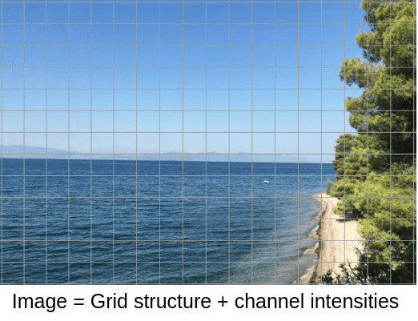
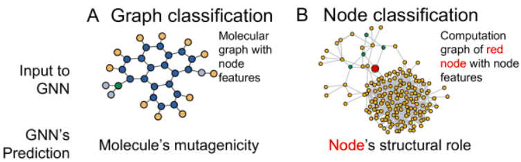
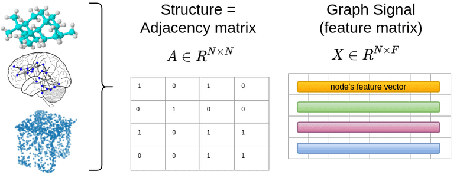
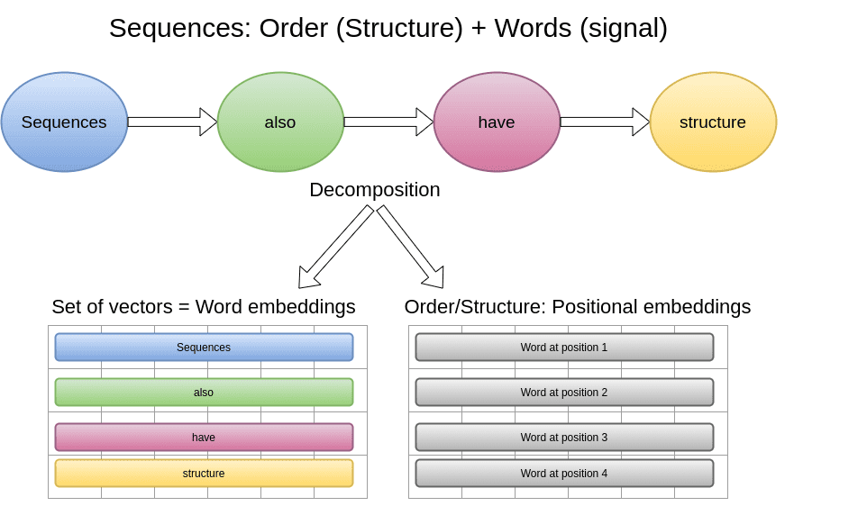
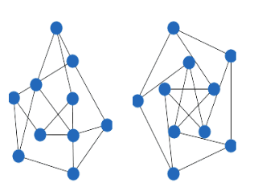
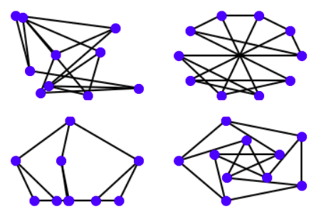
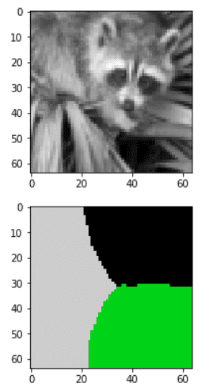
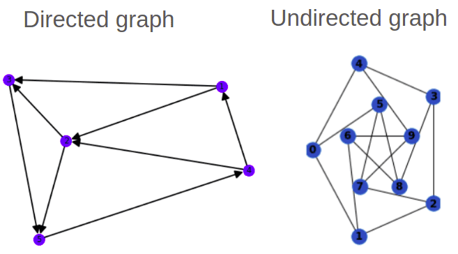
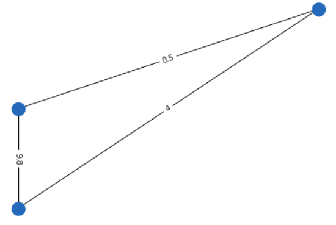
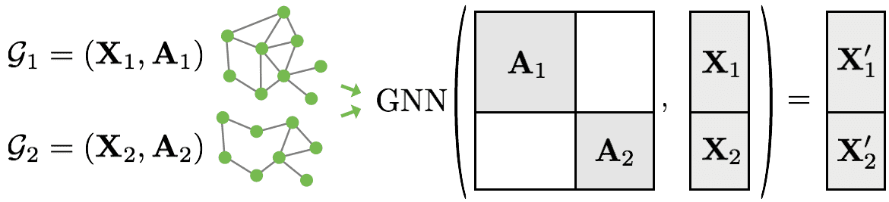

# How Graph Neural Networks (GNN) Work: Introduction to Graph Convolutions from Scratch

**Source**: `raw/graph-convolutional-networks/full-article.html` (markdown view: `raw/graph-convolutional-networks/full-article.md`)  
**URL**: https://theaisummer.com/graph-convolutional-networks/  
**Author**: Nikolas Adaloglou (AI Summer), 2021-04-08  
**Ingested**: 2026-06-06  
**Tags**: #summary

## Summary

Nikolas Adaloglou's AI Summer tutorial introduces **[[Graph Neural Networks]]** by decomposing data into **structure** (connectivity) and **signal** (node features). Images are the intuitive entry point: pixels live on a grid with strong locality, so convolutions aggregate neighborhood information. Graphs generalize this idea — any domain where you can define an adjacency matrix \(A \in \mathbb{R}^{N \times N}\) and node features \(X \in \mathbb{R}^{N \times F}\) (social networks, molecules, point clouds, brain graphs) becomes graph-structured data.

The article builds the mathematical toolkit: degree matrix \(D\), (normalized) **[[Graph Laplacian]]** \(L = D - A\) and \(L_{\text{norm}} = D^{-1/2}(A+I)D^{-1/2}\), Laplacian eigenvalues (connected-component multiplicity, spectral segmentation), directed/weighted graphs, and COO sparse storage. Two core task types are distinguished: **graph classification** (inductive — one label per graph, like image classification) and **node classification** (transductive/semi-supervised — few labeled nodes on one large graph, like segmentation).

**[[Graph Convolutional Networks]]** arise from the principle that vertex-domain convolution equals multiplication in the graph spectral domain. The simplest layer is \(Y = L_{\text{norm}} X W\); multiplying a graph operator by a signal performs a weighted neighborhood sum. Higher powers of \(L\) expand the receptive field (K-hop neighbors), analogous to larger CNN kernels. Defferrard et al.'s spectral filters use Chebyshev polynomial expansions of the rescaled Laplacian to avoid costly eigendecomposition while controlling K-hop aggregation.

The tutorial implements a batched 1-hop GCN in PyTorch (`GCN_AISUMMER`), trains a 3-layer GNN on the MUTAG molecular graph dataset (mean readout + linear classifier), and reaches ~82% validation accuracy. Practical issues covered: block-diagonal adjacency for batching variable-size graphs (PyTorch Geometric), readout aggregation (mean/max over node embeddings), and noisier training curves than image CNNs.

## Key Claims

- Graphs unify images, sequences, and irregular relational data by separating **structure** (adjacency \(A\)) from **signal** (features \(X\)); pixels and word embeddings are special cases.
- The **graph Laplacian** \(L = D - A\) encodes local connectivity; its normalized form with self-loops \(L_{\text{norm}}^{\text{mod}} = D^{-1/2}(A+I)D^{-1/2}\) stabilizes gradient-based training across varying node degrees (ties to [[In-layer Normalization Techniques for Training Very Deep Neural Networks]]).
- The multiplicity of the zero eigenvalue of \(L\) equals the number of connected components; smallest non-zero eigenvalues enable spectral image segmentation (unsupervised clustering via `sklearn.cluster.spectral_clustering`).
- **Graph classification** is inductive supervised learning; **node classification** is transductive semi-supervised — the full graph is fed forward but loss applies only to labeled nodes.
- A minimal GCN layer: neighborhood aggregation via normalized Laplacian, then linear transform — \(Y = L_{\text{norm}} X W\) (Kipf & Welling 2016 / arXiv:1609.02907).
- Spectral graph convolution (Defferrard et al.) approximates \(g_\theta(L)X\) via recurrent Chebyshev polynomials \(T_p(\tilde{L}_h)\), concatenating orders \(p \in [0, K-1]\) to capture K-hop relationships without explicit \(L^K\) matrix powers.
- Batching graphs uses a block-diagonal adjacency matrix treating each graph as a disconnected component of a larger graph; readout layers (mean/max) collapse node embeddings to graph-level predictions.
- MUTAG benchmark: 3-layer GCN with mean readout reaches ~81.6% best validation accuracy (SOTA >90% with 10-fold CV); article recommends PyTorch Geometric for further study.

## Figures

| Figure | Caption | Page |
|--------|---------|------|
|  | Article preview: graph structure and signal decomposition | — |
|  | Image pixel grid: structure (layout) and signal (channel intensities) | — |
|  | NLP decomposition: word embeddings as signal, positional order as structure | — |
|  | General graph: adjacency matrix \(A\) and node feature matrix \(X\) | — |
|  | Two disconnected subgraphs → two zero Laplacian eigenvalues | — |
|  | Connected Petersen graph in multiple NetworkX layouts | — |
|  | Spectral image segmentation into 3 clusters via graph Laplacian eigenvectors | — |
|  | Directed vs undirected graphs; hop distance on undirected graph | — |
|  | Weighted undirected graph with non-binary adjacency values | — |
|  | Graph classification (inductive) vs node classification (transductive) | — |
|  | 1D convolution as neighborhood aggregation analogy for graph operators | — |
|  | Block-diagonal adjacency for batching two graphs (PyTorch Geometric) | — |

Any relational data with defined connectivity \(A\) and per-node features \(X\) can be modeled as a graph — from molecules to social networks to point clouds.

Converting a grayscale image to a graph and clustering via Laplacian eigenvectors performs unsupervised spectral segmentation (does not scale to large \(N \times N\) adjacency matrices).

## Entities

- [[AI Summer]] — published this GNN/GCN primer (2021).
- [[Nikolas Adaloglou]] — author.
- [[Graph Neural Networks]] — neural networks operating on graph-structured data via neighborhood aggregation.
- [[Graph Convolutional Networks]] — spectral/vertex-domain convolution layers using the normalized graph Laplacian.
- [[Graph Laplacian]] — \(L = D - A\); core graph operator for spectral methods and GCN normalization.
- [[Convolutional Neural Networks]] — motivating analogy: image grids as graphs with regular local structure.
- [[Self-Attention]] — prior article's sequence decomposition parallels graph structure/signal split.
- [[In-layer Normalization Techniques for Training Very Deep Neural Networks]] — cited for why degree normalization matters in GCNs.

## Questions & Gaps

- Follow-up [[Best Graph Neural Network Architectures: GCN, GAT, MPNN and More]] covers GAT, MPNN, GraphSAGE, etc.; note that article's inductive/transductive definitions differ from this tutorial's framing (see that page's Questions section).
- MUTAG training uses batch size 1 to avoid batching complexity; production use requires PyTorch Geometric block-diagonal batching.
- Spectral segmentation is \(O(N^2)\) in pixels; not practical at image resolution without sparsification.

## Related

- [[Graph Neural Networks — An Overview]] — earliest series article: RNN-on-graphs intuition before Laplacian formalism.
- [[Best Graph Neural Network Architectures: GCN, GAT, MPNN and More]] — architecture survey sequel covering MPNN, GAT, GraphSAGE, PinSAGE, TGN.
- [[Understanding the Receptive Field of Deep Convolutional Networks]] — CNN locality analogy for K-hop graph receptive fields.
- [[How Transformers Work in Deep Learning and NLP: An Intuitive Introduction]] — sequence structure/signal decomposition referenced in the article.
- [[In-layer Normalization Techniques for Training Very Deep Neural Networks]] — degree normalization motivation for stable GCN training.
- [[Convolutional Neural Networks]] — images as the special case of regular graphs.
- [[Computer Vision]] — spectral image segmentation connects graphs to vision preprocessing.
