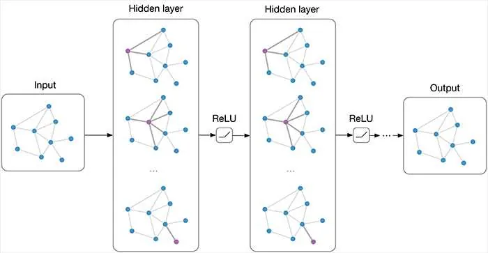
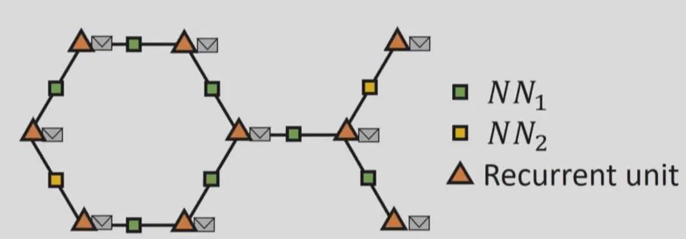

# Graph Neural Networks — An Overview

**Source**: `raw/graph-neural-networks-overview/full-article.md` (markdown view: `raw/graph-neural-networks-overview/full-article.md`)  
**URL**: https://theaisummer.com/Graph_Neural_Networks/  
**Author**: Sergios Karagiannakos (AI Summer), 2020-02-01  
**Ingested**: 2026-06-06  
**Tags**: #summary

## Summary

Sergios Karagiannakos's short AI Summer primer (2020) introduces **[[Graph Neural Networks]]** before the later math-heavy tutorials in the series. While CNNs and RNNs excel on grid- and sequence-structured (Euclidean) data, many real-world datasets — social networks, molecules, maps, transportation — are naturally **graphs**. The core problem is learning a function \(F(\text{Graph}) = \text{embedding}\) that maps an entire graph to a numeric representation usable for classification, regression, or clustering (e.g. predicting drug viability from molecular graphs).

The article's key pedagogical move is linking GNNs to familiar **[[Recurrent Neural Networks]]**: an RNN on a time series is already a GNN on a **chained graph** (nodes = timestamps, edges = temporal links). Embeddings pass along the chain like messages; recurrence prevents information loss. Generalizing to arbitrary graphs: replace each node with an RNN cell, replace each edge with a small neural network encoding edge weights, and let **envelope-shaped embeddings** propagate across the topology (slide from Microsoft Research's GNN talk).

**Learning dynamics**: at each synchronous time step, every node sums neighbor embeddings, concatenates with its own, and feeds the result through its RNN to produce an updated embedding. After \(t\) steps, embeddings contain information from \(t\)-hop neighborhoods; iterating until each node has incorporated information from **all** other nodes yields a full-graph receptive field. The final **readout** sums all node embeddings into one graph vector — an early permutation-invariant pooling scheme. Downstream models consume this embedding for any supervised task.

This conceptual frame predates the spectral/spatial formalism in [[How Graph Neural Networks (GNN) Work: Introduction to Graph Convolutions from Scratch]] and the architecture catalog in [[Best Graph Neural Network Architectures: GCN, GAT, MPNN and More]], but the message-passing and readout ideas align with modern **[[Message Passing Neural Networks]]**. Recommended libraries: DeepMind `graph_nets` (TensorFlow) and PyTorch Geometric.

## Key Claims

- GNNs (popular since ~2015) model inter-node relationships and produce numeric graph embeddings; applicable wherever data is graph-structured.
- Core task framing: \(F(\text{Graph}) \rightarrow\) embedding/label — e.g. molecular graphs → drug-likelihood scores.
- **RNNs are GNNs on chained graphs**: time series = line graphs; recurrence preserves messages traveling node-to-node.
- General GNN recipe: node = RNN unit; edge = neural network on edge features; embeddings propagate synchronously across the graph.
- Per-step update: node embedding ← RNN(node embedding, sum of neighbor embeddings); repeated until global information mixing.
- Graph readout: sum all final node embeddings → single graph representation (permutation-invariant aggregation).
- Practical entry points: PyTorch Geometric (preferred documentation) or DeepMind Graph Nets.

## Figures

| Figure | Caption | Page |
|--------|---------|------|
|  | Article preview / GNN overview hero image | — |
|  | Supplementary GNN illustration | — |
|  | GNN variations: nodes as RNN units, envelopes as embeddings, edges as neural nets (Microsoft Research talk) | — |

Each node aggregates neighbor embeddings through an RNN; edge networks encode edge weights; synchronous steps spread information until full-graph coverage.

## Entities

- [[AI Summer]] — published this early GNN overview (2020).
- [[Sergios Karagiannakos]] — author.
- [[Graph Neural Networks]] — graph-to-embedding models via iterative neighbor aggregation.
- [[Recurrent Neural Networks]] — special case on chained (sequential) graphs.
- [[Message Passing Neural Networks]] — modern formalization of the embedding-propagation idea described here.
- [[Unsupervised Learning]] — article tagged under this AI Summer topic (though example tasks are supervised graph classification).

## Questions & Gaps

- Article uses full-graph synchronous propagation until global mixing — impractical on large graphs; later series articles replace this with localized K-hop convolutions (GCN) and sampling (GraphSAGE).
- No adjacency-matrix notation, Laplacian, or PyTorch code — see [[How Graph Neural Networks (GNN) Work: Introduction to Graph Convolutions from Scratch]].
- No architecture comparison — see [[Best Graph Neural Network Architectures: GCN, GAT, MPNN and More]].
- Sum readout is one pooling choice; modern GNNs also use mean, max, or attention-based readout.

## Related

- [[How Graph Neural Networks (GNN) Work: Introduction to Graph Convolutions from Scratch]] — mathematical follow-up: Laplacian, spectral GCN, PyTorch implementation.
- [[Best Graph Neural Network Architectures: GCN, GAT, MPNN and More]] — architecture survey sequel.
- [[Recurrent Neural Networks: Building a Custom LSTM Cell]] — RNN mechanics underlying the chained-graph analogy.
- [[How Attention Works in Deep Learning: Understanding the Attention Mechanism in Sequence Models]] — another sequence-modeling path to graph attention (GAT).
