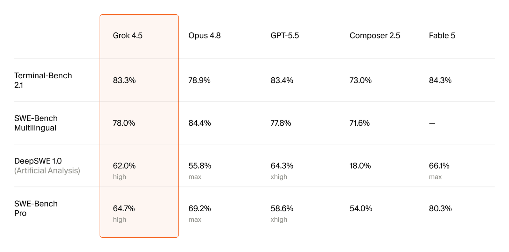

# Grok Models

**Source**: 17 x.ai news posts in `raw/grok/`, `raw/grok-os/`, `raw/grok-1.5/`, `raw/grok-1.5v/`, `raw/grok-2/`, `raw/grok-image-generation-release/`, `raw/grok-3/`, `raw/grok-4/`, `raw/grok-code-fast-1/`, `raw/grok-4-fast/`, `raw/grok-4-1/`, `raw/grok-4-1-fast/`, `raw/grok-voice-agent-api/`, `raw/grok-imagine-api/`, `raw/grok-stt-and-tts-apis/`, `raw/grok-voice-think-fast-1/`, `raw/grok-imagine-1-5/` (HTML + markdown sibling per slug; bodies captured via WebFetch — x.ai blocks direct curl); plus `raw/grok-4-5/` (SpaceXAI announcement) and `raw/grok-4-5-cursor/` (Cursor co-training post) ingested 2026-07-10  
**Ingested**: 2026-06-11 (updated 2026-07-10)  
**Tags**: #summary

## Summary

**Grok** is xAI's assistant family, launched Nov 2023 on 𝕏 with real-time platform knowledge, wit, and a Hitchhiker's Guide–inspired persona. The lineage runs from **Grok-0** (33B prototype) and **Grok-1** through open-weight **Grok-1** (314B MoE, Mar 2024), long-context **Grok-1.5** (128K), multimodal **Grok-1.5V**, frontier **Grok-2** / **Grok-2 mini**, image gen (**Aurora**), reasoning-centric **Grok 3** (Think mode, DeepSearch, 1M context on [[Colossus]]), RL-scaled **Grok 4** / **Grok 4 Heavy**, cost-efficient **Grok 4 Fast** (2M context, unified think/non-think), usability-focused **Grok 4.1**, and API-specialized **Grok 4.1 Fast** with the Agent Tools API. By 2026 the stack extends to **grok-code-fast-1**, voice (Grok Voice Agent API, STT/TTS, **grok-voice-think-fast-1**), video/image (**Grok Imagine API**, **Imagine 1.5** preview), and **Grok 4.5** — a MoE frontier model co-trained with [[Cursor]] for coding, agentic tasks, and broader knowledge work.

Training infrastructure is a recurring theme: JAX + Rust + Kubernetes from day one; **Colossus** (200K GPUs) powers Grok 3–4 RL at unprecedented scale. Product surfaces span 𝕏 Premium tiers, grok.com, mobile apps, Tesla voice, Starlink support, and the xAI API (text, voice, imagine, agent tools). Official x.ai posts are the **primary** source here; [[Papers Explained 186 - Grok]] is complementary Medium coverage.

## Timeline

| Release | Date | Key models | Highlights |
|---------|------|------------|------------|
| Announcing Grok | Nov 2023 | Grok-0, Grok-1 | 𝕏 real-time knowledge; Grok-1 73% MMLU, 63.2% HumanEval; JAX/Rust/Kubernetes stack |
| Open Release of Grok-1 | Mar 2024 | Grok-1 base | 314B MoE, 25% active/token; Apache 2.0 weights (slug: `grok-os`) |
| Grok-1.5 | Mar 2024 | Grok-1.5 | 128K context; 50.6% MATH, 90% GSM8K, 74.1% HumanEval |
| Grok-1.5V | Apr 2024 | Grok-1.5V | First multimodal Grok; RealWorldQA benchmark (68.7%) |
| Grok-2 Beta | Aug 2024 | Grok-2, Grok-2 mini | LMSYS "sus-column-r" beats Claude 3.5 Sonnet / GPT-4-Turbo; enterprise API |
| Aurora image gen | Dec 2024 | Aurora | Autoregressive MoE image model on 𝕏; FLUX.1 experiments |
| Grok 3 Beta | Feb 2025 | Grok 3, Grok 3 mini, Think | Colossus 10× compute; Think RL; 1M context; DeepSearch agent; 1402 Arena Elo |
| Grok 4 | Jul 2025 | Grok 4, Grok 4 Heavy | RL at pretraining scale on 200K GPUs; native tool use; 50.7% HLE text subset; voice + camera |
| Grok Code Fast 1 | Aug 2025 | grok-code-fast-1 | Agentic coding; 70.8% SWE-Bench-Verified; $0.20/$1.50 per M tokens |
| Grok 4 Fast | Sep 2025 | grok-4-fast-reasoning / -non-reasoning | 2M context; 40% fewer thinking tokens vs Grok 4; unified think/non-think |
| Grok 4.1 | Nov 2025 | Grok 4.1 Thinking / non-reasoning | #1 Arena Elo (1483 quasarflux); personality + lower hallucinations |
| Grok 4.1 Fast + Agent Tools | Nov 2025 | grok-4-1-fast-* | Agent Tools API (X/web search, code exec, MCP); τ²-bench Telecom SOTA |
| Grok Voice Agent API | Dec 2025 | Voice agents | #1 Big Bench Audio; $0.05/min; Tesla integration |
| Grok Imagine API | Jan 2026 | Imagine | T2V/I2V + editing; AA rank #1 T2V price/latency tradeoff |
| Grok STT & TTS APIs | Apr 2026 | STT, TTS | Standalone audio endpoints; 25+ languages; $0.10–0.20/hr STT |
| Grok Voice Think Fast 1 | Apr 2026 | grok-voice-think-fast-1.0 | #1 τ-voice Bench; Starlink 70% resolution / 20% sales conversion |
| Grok Imagine 1.5 | Jun 2026 | grok-imagine-video-1.5-preview | Image-to-video preview API; up to 720p, 10s clips |
| Grok 4.5 | Jul 2026 | grok-4.5 | MoE model co-trained with Cursor; GB300 RL at scale; default in Grok Build + Cursor; $2/$6 per M tokens |

## Grok 1 Era (2023–2024)

### Announcing Grok (Nov 2023)

**Source**: `raw/grok/full-article.html`

xAI launches **Grok** as a witty, rebellious assistant with real-time 𝕏 knowledge. **Grok-0** (33B) approaches LLaMA 2 70B efficiency; **Grok-1** reaches 73% MMLU and 63.2% HumanEval — leading its compute class vs GPT-3.5. Hungarian national math exam (May 2023, hand-graded): Grok-1 **59%** (C). Engineering stack: Kubernetes, Rust, JAX; focus on MFU and fault-tolerant distributed training. Research directions: scalable oversight, formal verification, long-context retrieval, adversarial robustness, multimodal.

### Open Release of Grok-1 (Mar 2024)

**Source**: `raw/grok-os/full-article.html` · URL slug `grok-os`

xAI releases **Grok-1 base checkpoint** (pre-training concluded Oct 2023): **314B parameter MoE**, **25% active weights per token**, Apache 2.0, not fine-tuned for dialogue. Weights on GitHub (`xai-org/grok`). This is where the 314B MoE figure originates — the Nov 2023 announcement focused on Grok-1 benchmark results without publishing the full MoE scale.

### Grok-1.5 (Mar 2024)

**Source**: `raw/grok-1.5/full-article.html`

**Grok-1.5** adds **128K context** (16× prior length) with perfect NIAH retrieval to 128K. Reasoning jumps: **81.3% MMLU**, **50.6% MATH**, **90% GSM8K**, **74.1% HumanEval**. Same JAX/Rust/Kubernetes training orchestrator with automatic bad-node ejection.

### Grok-1.5V (Apr 2024)

**Source**: `raw/grok-1.5v/full-article.html`

First multimodal **Grok-1.5V**: documents, diagrams, charts, screenshots, photos. Introduces **RealWorldQA** (700+ images, CC BY-ND 4.0) for spatial understanding — Grok-1.5V **68.7%** vs GPT-4V 61.4%. Competitive on MMMU, MathVista, DocVQA, ChartQA.

## Grok 2 Era (2024)

### Grok-2 Beta (Aug 2024)

**Source**: `raw/grok-2/full-article.html`

**Grok-2** and **Grok-2 mini** ship on 𝕏 (tested as LMSYS `sus-column-r`), beating Claude 3.5 Sonnet and GPT-4-Turbo on Chatbot Arena. Grok-2: **87.5% MMLU**, **76.1% MATH**, **88.4% HumanEval**, strong DocVQA/MathVista. Redesigned 𝕏 Grok UI; FLUX.1 image experiments with Black Forest Labs. Enterprise API with multi-region inference, MFA, management API.

### Aurora Image Generation (Dec 2024)

**Source**: `raw/grok-image-generation-release/full-article.html`

**Aurora**: autoregressive MoE trained on interleaved text+image tokens; photorealistic rendering and text-in-image. Image editing (style transfer, inpainting) coming to 𝕏. Compared favorably vs Imagen 3, Flux.1 Pro, Ideogram 2.0, DALL-E 3 on entity/text/meme/portrait tasks.

## Grok 3 Era (2025)

### Grok 3 Beta (Feb 2025)

**Source**: `raw/grok-3/full-article.html`

**Grok 3** trained on **Colossus** at **10×** prior compute. **Grok 3 (Think)** / **Grok 3 mini (Think)**: RL-refined chain-of-thought; **93.3% AIME'25** (cons@64), **84.6% GPQA**, **79.4% LiveCodeBench**. Non-reasoning Grok 3: **79.9% MMLU-Pro**, **83.3% LOFT (128k)**. **1M token context** (8× prior). Early `chocolate` build: **1402** Chatbot Arena Elo.

**DeepSearch** agent: internet + code interpreter; synthesizes research reports. API rollout planned for Grok 3, mini, and DeepSearch for enterprise.

## Grok 4 Era (2025–2026)

### Grok 4 (Jul 2025)

**Source**: `raw/grok-4/full-article.html`

**Grok 4** scales RL on **Colossus 200K GPUs** — **6×** training efficiency vs Grok 3 Reasoning; verifiable data expanded beyond math/code. **Grok 4 Heavy**: parallel test-time compute; first **50%** on Humanity's Last Exam (full set with tools); **50.7%** HLE text subset. Benchmarks: **15.9% ARC-AGI-2**, **61.9% USAMO'25** (Heavy), Vending-Bench agentic dominance.

**Native tool use** via RL: code interpreter, web/X search with autonomous query planning. **Grok 4 Voice Mode**: in-house RL + speech compression; live camera understanding in voice chat. API: 256K context, live search, SOC 2 Type 2. SuperGrok Heavy tier for Grok 4 Heavy.

### Grok Code Fast 1 (Aug 2025)

**Source**: `raw/grok-code-fast-1/full-article.html`

**grok-code-fast-1** (`sonic` codename): purpose-built for agentic coding in Cursor, GitHub Copilot, Windsurf, etc. **70.8% SWE-Bench-Verified** (internal harness). Pricing: **$0.20** input / **$1.50** output / **$0.02** cached per M tokens. >90% prompt cache hit rates with partners. Multimodal + parallel tool-calling variant in training.

### Grok 4 Fast (Sep 2025)

**Source**: `raw/grok-4-fast/full-article.html`

**Grok 4 Fast**: **2M context**; unified **reasoning + non-reasoning** in one weight set (system-prompt steered). **40% fewer thinking tokens** vs Grok 4 → **98%** cost reduction for same benchmark performance. **85.7% GPQA**, **92% AIME'25** (no tools). SOTA agentic search (BrowseComp 44.9%, X Browse 58%). API: `grok-4-fast-reasoning` / `grok-4-fast-non-reasoning`; tiered pricing above 128K tokens. Free users get Grok 4 Fast in Auto mode.

### Grok 4.1 (Nov 2025)

**Source**: `raw/grok-4-1/full-article.html`

**Grok 4.1** optimizes personality, empathy, and alignment via RL with frontier models as reward judges. Silent rollout Nov 1–14: **64.78%** blind preference vs prior production Grok. **Grok 4.1 Thinking** (`quasarflux`): **#1** LMArena at **1483 Elo** (+31 over highest non-xAI). **Grok 4.1** non-reasoning (`tensor`): **#2** at **1465 Elo** — beats all rivals' full-reasoning configs. Lower hallucination rate on info-seeking + FActScore vs Grok 4 Fast.

### Grok 4.1 Fast and Agent Tools API (Nov 2025)

**Source**: `raw/grok-4-1-fast/full-article.html`

**grok-4-1-fast-reasoning** / **-non-reasoning**: 2M context; SOTA on Berkeley Function Calling v4 and τ²-bench Telecom. **Agent Tools API**: server-side web_search, x_search, code_execution, collections_search, MCP — no separate API keys for tools. Research-Eval Reka: **63.9** score at **$0.046** avg cost. Tool calls from **$5 / 1000** successful invocations.

## Multimodal, Voice & API Platform (2025–2026)

### Grok Voice Agent API (Dec 2025)

**Source**: `raw/grok-voice-agent-api/full-article.html`

In-house VAD, tokenizer, audio models. **#1 Big Bench Audio**; **<1s** time-to-first-audio (~5× faster than competitors). **$0.05/min** flat pricing. Voices: Ara, Eve, Leo, Rex, Sal. Dozens of languages; OpenAI Realtime API–compatible. Powers Tesla in-vehicle Grok with nav/vehicle tools.

### Grok Imagine API (Jan 2026)

**Source**: `raw/grok-imagine-api/full-article.html`

Unified **video generation + editing** API. AA Text-to-Video **#1** on price/latency tradeoff (Jan 2026). Video editing beats Kling o1 / Runway Aleph on IVEBench human evals. Partners: fal.ai, ComfyUI, HeyGen.

### Grok STT and TTS APIs (Apr 2026)

**Source**: `raw/grok-stt-and-tts-apis/full-article.html`

Standalone **Grok Speech to Text** and **Grok Text to Speech** (same stack as Grok Voice / Tesla / Starlink). STT: **$0.10/hr** batch, **$0.20/hr** streaming; word timestamps, diarization, multichannel, inverse text normalization. **6.9%** overall WER vs competitors. TTS: **$15/M characters**; speech tags `[whisper]`, `[laugh]`, `[sigh]`.

### Grok Voice Think Fast 1.0 (Apr 2026)

**Source**: `raw/grok-voice-think-fast-1/full-article.html`

**grok-voice-think-fast-1.0**: flagship voice agent for complex multi-tool workflows. **#1 τ-voice Bench** (retail, airline, telecom). Background reasoning with zero added latency. Starlink: **70%** support resolution, **20%** phone sales conversion, **28** tools; powers **+1 (888) GO STARLINK**.

### Grok Imagine 1.5 Preview (Jun 2026)

**Source**: `raw/grok-imagine-1-5/full-article.html`

**grok-imagine-video-1.5-preview**: image-to-video API; natural-language camera/motion/sound prompts; up to **720p**, **10s** duration; chainable sequences for longer scenes.

### Grok 4.5 (Jul 2026)

**Sources**: `raw/grok-4-5/full-article.html`, `raw/grok-4-5/full-article.md` ([SpaceXAI](https://x.ai/news/grok-4-5)); `raw/grok-4-5-cursor/full-article.html`, `raw/grok-4-5-cursor/full-article.md` ([Cursor](https://cursor.com/blog/grok-4-5))

On Jul 8, 2026, SpaceXAI (branding used on the x.ai post; see [[xAI]]) and [[Cursor]] jointly released **Grok 4.5**, a **mixture-of-experts** model co-trained for long-horizon agentic work across software engineering, data science, finance, legal tasks, and other knowledge work — Cursor's first model built for more than software engineering alone. Training drew on trillions of tokens of Cursor developer and agent-interaction data (codebases, tool use, harness behavior) plus a deliberately broader mix than [[Introducing Composer 2.5|Composer 2.5]]: high-quality STEM tasks, research papers, and knowledge work. SpaceXAI trained across **tens of thousands of NVIDIA GB300 GPUs** with heavy data curation (deduplication, quality scoring, domain-focused selection) and **hundreds of thousands of RL tasks** in highly asynchronous runs where agentic rollouts can last many hours. Cursor contributed RL environments built by a **distributed agent system**: engineers specify a problem and verifier, and agent groups construct, test, and refine each environment at scale.

**Benchmarks** (Cursor chart; third-party scores self-reported unless noted):

| Eval | Grok 4.5 | Opus 4.8 | GPT-5.5 | Composer 2.5 | Fable 5 |
| --- | --- | --- | --- | --- | --- |
| Terminal-Bench 2.1 | 83.3% | 78.9% | 83.4% | 73.0% | 84.3% |
| SWE-Bench Multilingual | 78.0% | 84.4% | 77.8%¹ | 71.6% | — |
| DeepSWE 1.0 (Artificial Analysis) | 62.0% | 55.8% | 64.3% | 18.0% | 66.1% |
| SWE-Bench Pro | 64.7% | 69.2% | 58.6% | 54.0% | 80.3% |

¹ GPT-5.5 multilingual score from Cursor internal run.

SpaceXAI separately reports **66.1%** pass@1 on **DeepSWE 1.1** (vs Fable max 64.31%, GPT 5.5 xhigh 62.0%), **80 TPS** serving, and **4.2×** fewer output tokens than Opus 4.8 (max) on SWE-Bench Pro tasks. Cursor **excludes [[CursorBench]]** from the public chart: an earlier Cursor codebase snapshot was accidentally included in training; impact unclear; removed for future models; CursorBench update in progress.

**Product & pricing**: Default model in **Grok Build** (Excel/PowerPoint/Word plugins for complex models, diagrams, and prose). Available in Cursor (desktop, web, iOS, CLI, SDK) with double usage the first week and new cybersecurity safeguards. API id `grok-4.5` at **$2/M input, $6/M output**; Cursor also offers a fast variant at **$4/M in, $18/M out**. Limited-time free usage in Grok Build and Cursor. Not available in the EU until mid-July 2026. **Grok 4.5** and **Composer 2.5** coexist as different weight classes.

## Key Claims

- **Grok-1**: 314B MoE (25% active); Apache 2.0 base weights Mar 2024; Grok-0 was 33B prototype (Nov 2023).
- Context growth: **128K** (1.5) → **1M** (Grok 3) → **2M** (Grok 4 Fast / 4.1 Fast).
- **Colossus**: 200K GPU cluster; 10× Grok 3 pretraining vs prior SOTA; Grok 4 RL at pretraining scale.
- Reasoning: Grok 3 Think (93.3% AIME'25); Grok 4 Heavy (50% HLE); Grok 4 Fast unified think/non-think with 98% cost reduction vs Grok 4 on benchmarks.
- Agentic: DeepSearch (Grok 3); native tool RL (Grok 4+); Agent Tools API (Nov 2025); grok-code-fast-1 for IDE agents.
- Arena leadership: Grok 3 **1402** Elo; Grok 4.1 Thinking **1483** Elo (#1, Nov 2025).
- Voice: Big Bench Audio #1; τ-voice Bench #1 (Voice Think Fast); $0.05/min Voice Agent API.
- Imagine: AA T2V #1 price/latency (Jan 2026); Imagine 1.5 I2V preview (Jun 2026).
- **Grok 4.5** (Jul 2026): MoE co-trained with Cursor; GB300 async RL; 83.3% Terminal-Bench 2.1, 64.7% SWE-Bench Pro, 78.0% SWE-Bench Multilingual; 80 TPS; 4.2× fewer SWE-Bench Pro tokens vs Opus 4.8 max; $2/$6 API pricing; default in Grok Build.

## Figures

Prior Grok x.ai posts: no static figures — x.ai returns 403 to curl; WebFetch captures text only (interactive charts not archived).

**Grok 4.5** (Jul 2026): Cursor benchmark chart extracted to `wiki/assets/grok-4-5-cursor/` (`fig-1.png` light, `fig-1-dark.png` dark). x.ai interactive charts (DeepSWE, token efficiency) not archived as static assets.

## Entities

- [[xAI]] — org behind Grok, Colossus, and the xAI API platform (Jul 2026 Grok 4.5 post uses **SpaceXAI** branding).
- [[Cursor]] — co-trainer and deployer of Grok 4.5 in the agent product.
- [[Colossus]] — xAI GPU training supercluster (Grok 3–4 on 200K GPUs; Grok 4.5 on GB300 scale).
- [[Large Language Models]] — Grok frontier model family on 𝕏 and API.
- [[Reasoning Models]] — Think mode, Grok 4 RL reasoning, Grok 4 Fast blended modes.
- [[Mixture of Experts]] — Grok-1 314B MoE; Aurora image MoE.
- [[Agentic AI]] — DeepSearch, native tool use, Agent Tools API, Voice Agent API.
- [[Papers Explained 186 - Grok]] — Medium explainer (secondary source; covers through Grok 4.1).

## Questions & Gaps

- Slug `grok-os` hosts **Open Release of Grok-1**, not a consumer OS — naming is historical.
- Nov 2023 `grok` post does not disclose 314B MoE; that appears in Mar 2024 open release — reconcile with [[Papers Explained 186 - Grok]] which leads with 314B.
- Benchmark numbers are date- and tool-configuration-sensitive (e.g., HLE with/without Python+Internet; Grok 4.1 silent rollout Nov 2025).
- No static figures ingested; interactive Arena/HLE charts on x.ai pages not archived.
- grok-code-fast-1 free partner access was time-limited at launch; current pricing on xAI API.
- Grok 4.5 **CursorBench** training-data contamination: exact impact unknown; excluded from Cursor's public benchmark chart.
- DeepSWE 1.0 vs 1.1 scores differ across SpaceXAI and Cursor charts; harness and eval version matter.
- SpaceXAI vs xAI branding on Jul 2026 announcement — treat as same org unless clarified.

## Related

- [[Large Language Models]] — Grok as a major commercial frontier family alongside Claude, Gemini, GPT.
- [[Reasoning Models]] — Grok 3 Think through Grok 4.1 Thinking RL lineage.
- [[Code Models]] — grok-code-fast-1 agentic coding model and SWE-Bench claims.
- [[Audio Models]] — Voice Agent API, STT/TTS APIs, Voice Think Fast, Grok 4 voice mode.
- [[Vision Language Models]] — Grok-1.5V, Imagine API / Imagine 1.5 video.
- [[Agentic AI]] — DeepSearch, tool-use RL, Agent Tools API.
- [[Long Context]] — 128K → 1M → 2M context milestones.
- [[Mixture of Experts]] — Grok-1 and Aurora MoE architectures.
- [[Papers Explained 186 - Grok]] — complementary Medium timeline through Grok 4.1.
- [[Introducing Composer 2.5]] — teased SpaceXAI co-training that shipped as Grok 4.5.
- [[CursorBench]] — accidental training-data inclusion disclosed in Cursor Grok 4.5 post.
- [[GPT-5.5]] — benchmark competitor on Terminal-Bench and SWE-Bench Pro.
- [[Agent Harness]] — Cursor interaction data and RL environments used in Grok 4.5 training.
