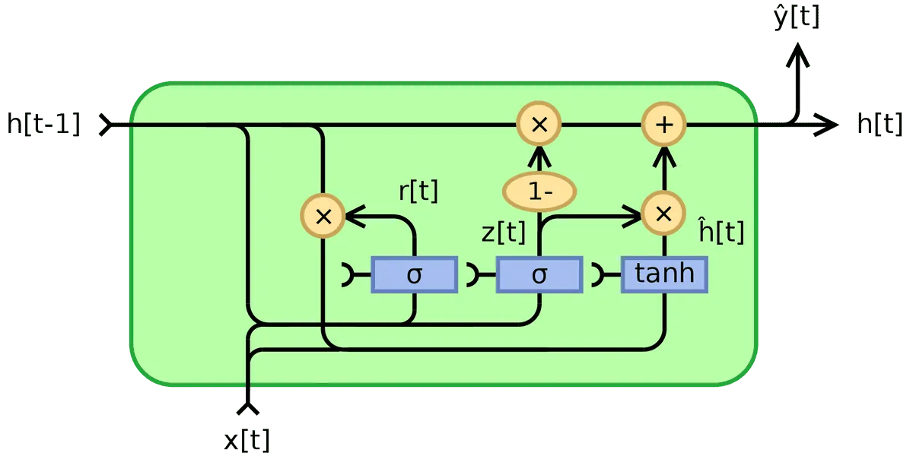

# Recurrent Neural Networks: Building GRU Cells VS LSTM Cells in PyTorch

**Source**: `raw/gru/full-article.md` (361 KB), `raw/gru/full-article.md` (markdown view)  
**URL**: https://theaisummer.com/gru/  
**Author**: Nikolas Adaloglou (AI Summer), 2020-09-17  
**Ingested**: 2026-06-06  
**Tags**: #summary

## Summary

This AI Summer sequel to [[Recurrent Neural Networks: Building a Custom LSTM Cell]] introduces the [[GRU]] as a compact gated alternative to [[LSTM]]. Nikolas Adaloglou opens by defending RNN literacy despite transformer dominance: RNNs remain strong when sequences are very long, tasks need real-time control without future timesteps, datasets are too small for transformer transfer learning, or weakly supervised video (e.g. action recognition with Connectionist Temporal Classification loss) is the target. Hybrid RNN+GAN medical time-series models are cited as another niche.

GRU motivation is **parameter and operation reduction** while preserving the same high-level goal: model long sequences with gated memory in the hidden state (no separate cell vector). Equations: reset gate \(r_t = \sigma(W_{ir}x_t + b_{ir} + W_{hr}h_{t-1} + b_{hr})\); update gate \(z_t = \sigma(W_{iz}x_t + b_{iz} + W_{hz}h_{t-1} + b_{hz})\) (merging LSTM input and output gates); candidate \(n_t = \tanh(W_{in}x_t + b_{in} + r_t \odot (W_{hn}h_{t-1} + b_{hn}))\); hidden \(h_t = (1-z_t) \odot n_t + z_t \odot h_{t-1}\). The reset gate acts like an LSTM forget gate applied directly to hidden state; update gate \(z\) balances new content \(n_t\) vs previous \(h_{t-1}\) (when \(z \to 1\), input is ignored; when \(z \to 0\), prior state is mostly dropped). Stacking, bidirectional processing, and time unrolling mirror LSTM.

The LSTM-vs-GRU section is explicitly empirical: Greff et al. (2016) and Chung et al. (2014) show comparable performance on many tasks; hyperparameter tuning often matters more than cell choice. GRU wins on speed/compactness (fewer gates, no cell state); LSTM may excel on large data and very long-range dependencies (three gradient paths vs GRU's simpler flow). **No universal winner** — train both. Yin et al. (2017) is recommended for NLP-focused comparison.

## Key Claims

- Transformers dominate NLP, but RNNs still suit: very long sequences, real-time/online control, small datasets, weakly supervised action recognition (RNN + CTC).
- GRU and LSTM share principles: arbitrary timesteps, gated memory, hidden state initialized to zero at \(t=0\).
- GRU has two gates (reset, update) vs LSTM's three (forget, input, output); no separate cell state \(c_t\).
- Reset gate \(r_t\): analogous to LSTM forget gate; element-wise filters what prior hidden info enters candidate \(n_t\).
- Update gate \(z_t\): fuses LSTM input and output gates; \(h_t = (1-z_t)\odot n_t + z_t \odot h_{t-1}\).
- GRU exposes full hidden memory without a controlled cell buffer — task-dependent whether that helps or hurts.
- Both architectures address [[Vanishing Gradients]]; LSTM's three gate paths may yield more gradient variability than GRU.
- GRU: fewer parameters → faster training; often preferred on small data / shorter sequences.
- LSTM: greater expressive power; theoretically better very long-range memory on large datasets.
- Greff et al. (2016): many LSTM variants ≈ standard LSTM; comparable to GRU on many benchmarks.
- Practical advice: structure projects to swap LSTM/GRU cells and compare on your data.

## Figures

| Figure | Caption | Page |
|--------|---------|------|
|  | GRU cell structure: reset gate, update gate, candidate hidden, and hidden state flow (Wikipedia diagram) | — |

Standard GRU block diagram; author notes diagrams can mislead if read as scalars rather than vector-matrix operations.

## Entities

- [[AI Summer]] — educational blog publishing this GRU/LSTM comparison (2020).
- [[Nikolas Adaloglou]] — author; sequel to the LSTM cell tutorial.
- [[GRU]] — primary concept derived gate-by-gate.
- [[LSTM]] — baseline architecture for comparison.
- [[Recurrent Neural Networks]] — parent family; when RNNs still beat transformers.
- [[Vanishing Gradients]] — problem both gated cells were designed to mitigate.
- [[Deep Learning]] — textbook GRU/LSTM treatment in Chapter 10.

## Questions & Gaps

- Custom PyTorch GRU cell code referenced but not reproduced inline in the fetched article body (notebook linked externally).
- Sine-wave validation mentioned in conclusion without figures in the article HTML.
- CTC loss cited for action recognition but not explained in depth.
- Transformer discussion is high-level; no benchmark numbers.
- Yin et al. (2017) and Chung et al. (2014) cited but not summarized in detail.

## Related

- [[Recurrent Neural Networks: Building a Custom LSTM Cell]] — direct prequel with LSTM equations and custom PyTorch implementation.
- [[GRU]] — expanded concept page from this source.
- [[LSTM]] — comparison baseline.
- [[Backpropagation Through Time]] — shared training mechanism for both cells.
- [[Bidirectional RNN]] — same stacking pattern as LSTM tutorial.
- [[Large Language Models]] — transformers largely supersede RNN stacks for NLP at scale.
