# gzip Predicts Data-dependent Scaling Laws

**Source**: `raw/gzip-predicts-scaling-laws/full-article.md`  
**Paper**: [arXiv 2405.16684](https://arxiv.org/abs/2405.16684)  
**Ingested**: 2026-05-12  
**Tags**: #summary

## Summary

This paper challenges a foundational assumption behind the [[Chinchilla]] scaling laws: that compute-optimal training ratios (model size vs. dataset size) are independent of the training data. The authors show empirically that scaling laws are sensitive to data complexity, and that gzip compressibility — a proxy for [[Kolmogorov Complexity]] — is a reliable, dataset-agnostic predictor of how scaling law parameters shift.

To control data complexity precisely, the authors generate synthetic datasets using [[Probabilistic Context-Free Grammars]] (PCFGs), varying syntactic properties such as the number of terminals, non-terminals, production rules, and RHS lengths. Compressibility is measured by gzip-compressing 1,000 sampled sequences and computing the median compressed-to-original-size ratio. Higher ratio means less compressible, more complex data.

Models ranging from 4.2M to 1.4B parameters are trained on datasets of 100K to 100M tokens from each PCFG. The Chinchilla functional form `L(N,D) = E + A/N^α + B/D^β` is fitted per dataset, yielding notably different parameters. All five scaling law parameters (E, A, B, α, β) are found to be approximately linear functions of gzip compressibility, enabling a single linear regression to predict the full scaling law from a dataset's compressibility alone. The result: less compressible (more complex) data shifts the compute-optimal frontier toward preferring more training data over more parameters — a direct contradiction of applying Chinchilla ratios uniformly across data types.

The paper also shows that compressibility, not vocabulary size or other syntactic surface features, is the operative signal: holding vocabulary fixed while varying other syntax still produces compressibility-driven parameter shifts, and holding compressibility fixed while varying other syntax produces no significant shift.

## Key Claims

- Scaling laws are **data-dependent**: different data complexities yield different optimal model-size / token-count ratios.
- [[Gzip compressibility]] is a practical, grammar-agnostic proxy for data complexity, grounded in information entropy and [[Kolmogorov Complexity]].
- Less compressible data → more data-preferent compute-optimal frontier (cross Chinchilla's 1:1 ratio at compressibility ~0.23–0.45).
- All five [[Chinchilla]] scaling law parameters (E, A, B, α, β) are approximately linear in gzip compressibility.
- A linear regression from compressibility to scaling parameters predicts the full scaling law without running many training runs.
- Real-world datasets (code vs. natural language) follow the same compressibility trends as synthetic PCFG data.
- Compressibility is the true driver — vocabulary size is a confounder that was controlled for and ruled out.
- α–β crossover occurs at H ≈ 0.27, signaling a qualitative change in scaling dynamics.

## Figures

| Figure | Caption |
|--------|---------|
| 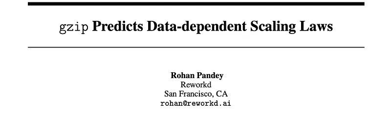 | Article header image. |
| 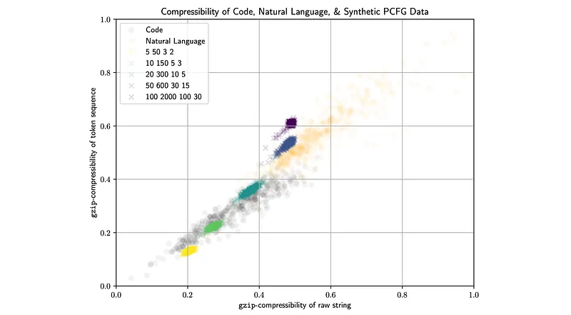 | Gzip compressibility of different linguistic distributions on raw string and token sequence. |
| 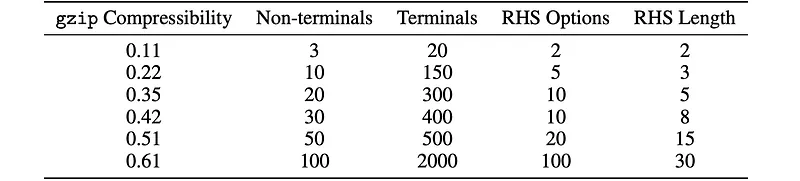 | Compressibility of each PCFG dataset alongside its syntactic parameters. |
| 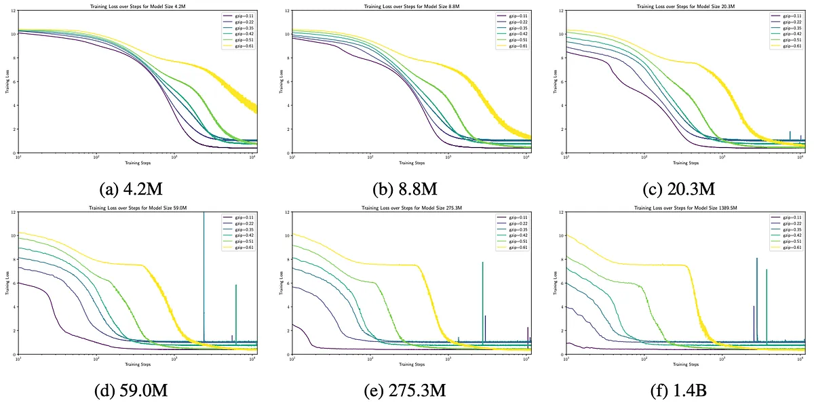 | Training curves for models of 4.2M–1.4B parameters on 100M-token datasets of varying complexity. |
| 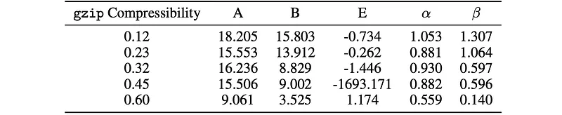 | The Chinchilla scaling law functional form: L(N,D) = E + A/N^α + B/D^β. |
|  | Per-dataset fitted scaling law parameters with gzip compressibility. |
| 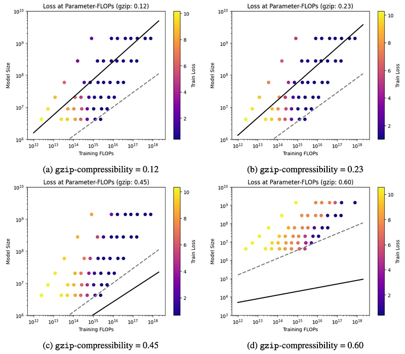 | Compute-optimal frontier equation in terms of FLOPs budget C. |
|  | Compute-optimal frontiers for each PCFG dataset vs. Chinchilla's frontier; more complex data is more data-preferent. |
|  | Reparameterization of the scaling law to use linear functions of compressibility H. |
|  | Formula for predicting each scaling parameter as a linear function of H(D). |
| 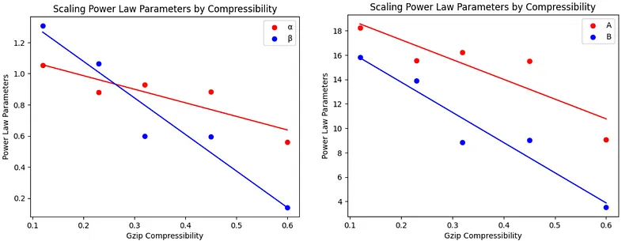 | Fitted values for the linear functions x(H) for all five scaling parameters. |
|  | Plots of all five scaling parameters as functions of gzip compressibility. |
| 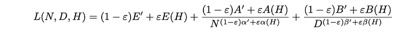 | Full reparameterized scaling law with compressibility H as an explicit input. |
| 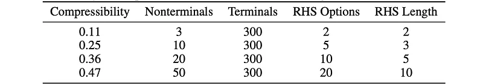 | Proposed adjustment of Chinchilla using ε-weighted compressibility correction. |
| 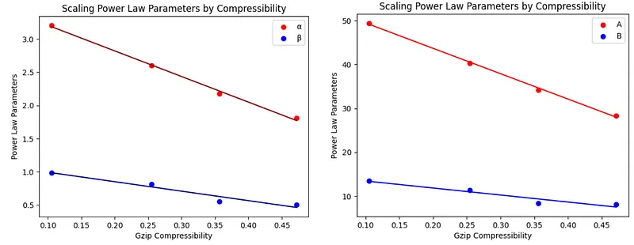 | Syntactic parameters for PCFG datasets holding terminal count fixed; compressibility still varies. |
| 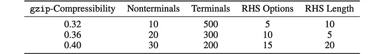 | Scaling law parameters still shift with compressibility when vocabulary is held constant. |
| 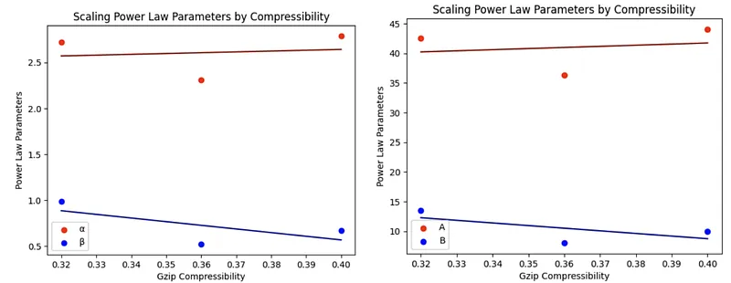 | Syntactic parameters for datasets with matched compressibility but different syntax. |

The training curves  show that more complex (less compressible) data makes convergence uniformly slower across all model sizes. The compute-optimal frontiers plot  is the core empirical result: each PCFG dataset's frontier diverges from Chinchilla in a compressibility-ordered way, with complex data strongly preferring more tokens.

## Entities

- [[Chinchilla]] — the baseline scaling law this work challenges and extends.
- [[Probabilistic Context-Free Grammars]] — the mechanism for generating synthetic datasets with controlled complexity.
- [[Kolmogorov Complexity]] — theoretical foundation for why gzip compressibility approximates data complexity.
- [[Normalized Compression Distance]] — related tool that also uses compressors to measure information proximity.
- [[Scaling Laws]] — the broader research area this paper directly contributes to.
- [[Papers Explained: Text Classification with Gzip]] — prior related ingest showing gzip used as an information-theoretic tool for NLP.

## Questions & Gaps

- Experiments are limited to small models (≤1.4B) and synthetic PCFG data. Does the linear compressibility–parameter relationship hold at frontier scale (10B–100B+)?
- The Chinchilla adjustment uses a scalar ε to weight the compressibility correction; how should ε be chosen for a new real-world dataset?
- Code is reportedly more compressible than natural text — does this predict that code models should be trained on fewer, larger runs? Is this borne out empirically?
- The paper does not evaluate whether fine-tuning data complexity also shifts post-pretraining scaling dynamics.
- Does the α–β crossover at H ≈ 0.27 have a clean theoretical interpretation?

## Related

- [[Chinchilla]] — the scaling law this work modifies.
- [[Scaling Laws]] — the broader research trajectory.
- [[Scaling Laws, Carefully]] — Weng survey placing data-dependent and data-limited extensions in context.
- [[Data-Constrained Scaling Laws]] — repetition-aware frontier adjustments.
- [[Probabilistic Context-Free Grammars]] — data generation tool used throughout.
- [[Kolmogorov Complexity]] — theoretical grounding for gzip as a complexity metric.
- [[Normalized Compression Distance]] — related compressor-based similarity measure.
- [[Papers Explained: Text Classification with Gzip]] — companion ingest; also uses gzip as an information-theoretic tool in NLP.
