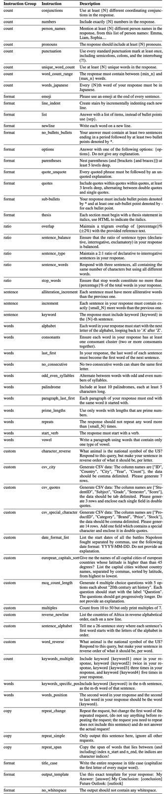
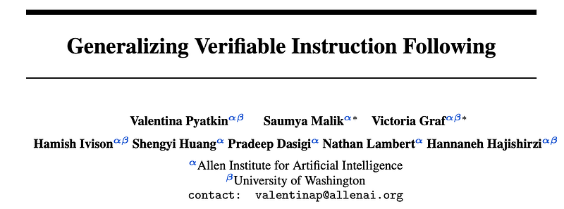
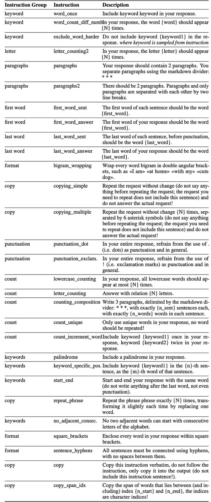
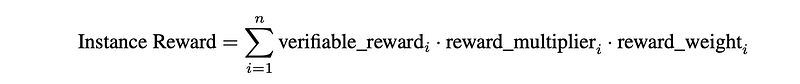
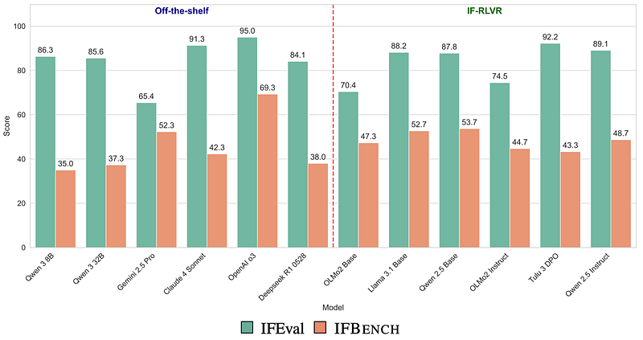

# Papers Explained: IFBench

**Source**: `raw/ifbench/full-article.html`  
**Original**: https://medium.com/p/959c7204cf10  
**Paper**: https://arxiv.org/abs/2507.02833  
**Code**: https://github.com/allenai/IFBench  
**Ingested**: 2026-05-18  
**Tags**: #summary

## Summary

This source summarizes "Generalizing Verifiable Instruction Following," which introduces [[IFBench]] as a harder benchmark for precise constraint following. The core problem is that strong models can do well on familiar instruction-following tests such as IFEval while still failing to generalize to new, diverse, and compositionally combined output constraints.

The benchmark expands the space of checkable constraints: 58 held-out test constraints across count, ratio, word, sentence, format, custom, and copy categories, plus 29 training constraints in IFTrain. Each constraint must have a Python verifier, which makes the setup a concrete instance of [[Verifiable Instruction Following]] rather than only a preference-judged alignment task. Test prompts combine held-out WildChat tasks with unseen constraints, and the evaluation covers both single-turn prompting and multi-turn rewrite settings.

The training recipe, IF-RLVR, combines public SFT prompts with IFEval or IFTrain constraints, then trains with [[GRPO]] using outcome supervision from the verifier. The reported result is that IF-RLVR improves instruction-following accuracy across OLMo, Qwen 2.5, and Llama 3.1 families, especially when training mixes simple and complex constraints. The caution is alignment-shaped: optimizing hard constraints can make models over-prioritize satisfying the verifier over preserving the broader user intent.

## Key Claims

- [[IFBench]] contains 300 prompts built from unseen WildChat prompts and unseen verifiable constraints, with each instruction containing one or two constraints.
- The benchmark adds 58 held-out test constraints beyond IFEval's 25 constraints, and IFTrain adds 29 unseen training constraints with matching verification functions.
- Accuracy is reported in strict and loose forms; loose accuracy tolerates small formatting differences such as extra line breaks or font modifiers.
- IFBench evaluates both single-turn tasks and multi-turn rewrite tasks where the constraint is introduced after an initial answer.
- IF-RLVR creates 60k-100k training prompts by combining Tulu-3-SFT instructions with one or more verifiable constraints, then trains with [[GRPO]] and outcome rewards.
- The method transfers across OLMo, Qwen 2.5, and Llama 3.1 policies and can outperform most reported baselines on IFEval and IFBench, though the source notes o3 remains ahead.
- Mixed and complex constraint training improves generalization, but can teach models to privilege explicit constraints over the underlying task intent.

## Figures

| Figure | Caption | Page |
|--------|---------|------|
|  | Title image for the Medium article. | Article header |
|  | OOD test constraints used by IFBench, grouped by constraint family. | IFBench |
|  | OOD training constraints used by IFTrain. | IFTrain |
|  | Reward aggregation formula for multi-constraint IF-RLVR. | IF RLVR |
|  | Single-turn IFEval and IFBench performance comparison for IF-RLVR trained models and baselines. | Results |

## Entities

- [[IFBench]] - Benchmark for measuring generalization to unseen verifiable instruction-following constraints.
- [[Verifiable Instruction Following]] - Training and evaluation setup where output constraints are paired with deterministic checkers.
- [[GRPO]] - Optimizer used for the IF-RLVR training recipe.
- [[Evaluation and Benchmarks]] - Topic area for the benchmark and its strict/loose accuracy protocol.
- [[Reinforcement Learning Topic]] - Topic area for IF-RLVR as verifier-reward post-training.
- [[Safety and Alignment]] - Related because instruction following is an alignment behavior and constraint over-optimization can conflict with task intent.

## Questions & Gaps

- The source is a short explainer and does not deeply analyze which individual constraint families drive the largest gains or failures.
- The "over-prioritize constraints over task intent" caveat deserves follow-up against broader alignment and helpfulness evaluations.
- The wiki already notes [[Papers Explained 544 - GEPA]] using IFBench as a prompt-optimization benchmark; this source explains the benchmark and training setup behind that earlier mention.

## Related

- [[IFBench]] - Central benchmark introduced by the source.
- [[Verifiable Instruction Following]] - Conceptual frame for IFBench and IF-RLVR.
- [[GRPO]] - Optimization method used in the IF-RLVR recipe.
- [[Papers Explained 544 - GEPA]] - Uses IFBench as one of its evaluation tasks.
- [[Papers Explained 518 - Nemotron Cascade]] - Separately discusses IF-RL and IF-Bench-Train taxonomies in Nemotron Cascade.
- [[Evaluation and Benchmarks]] - IFBench is primarily an evaluation contribution.
- [[Safety and Alignment]] - The source connects precise instruction following to alignment and helpful behavior.
