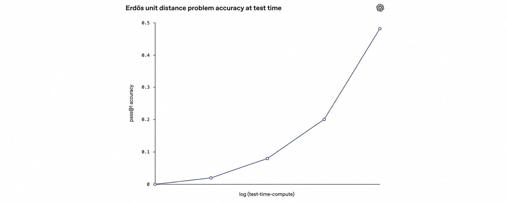
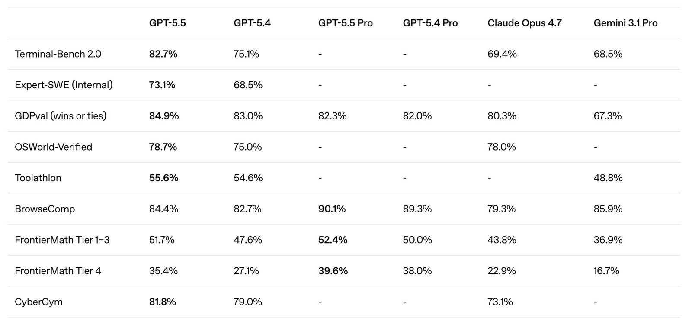
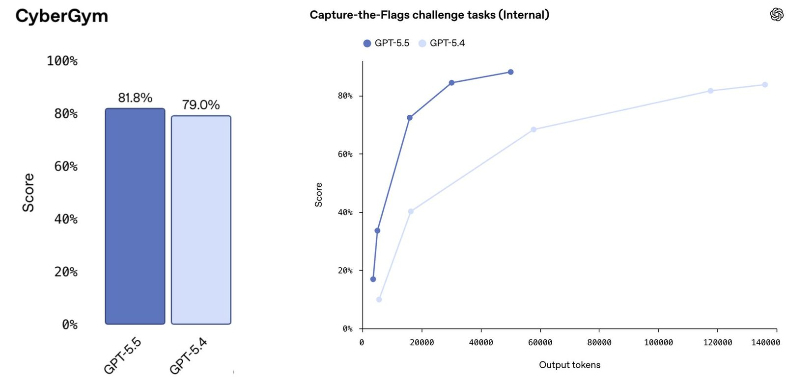
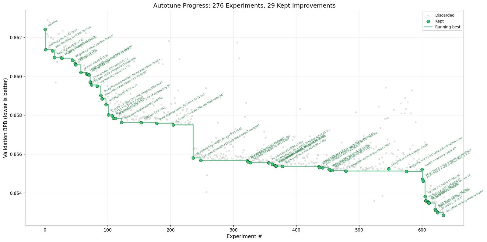
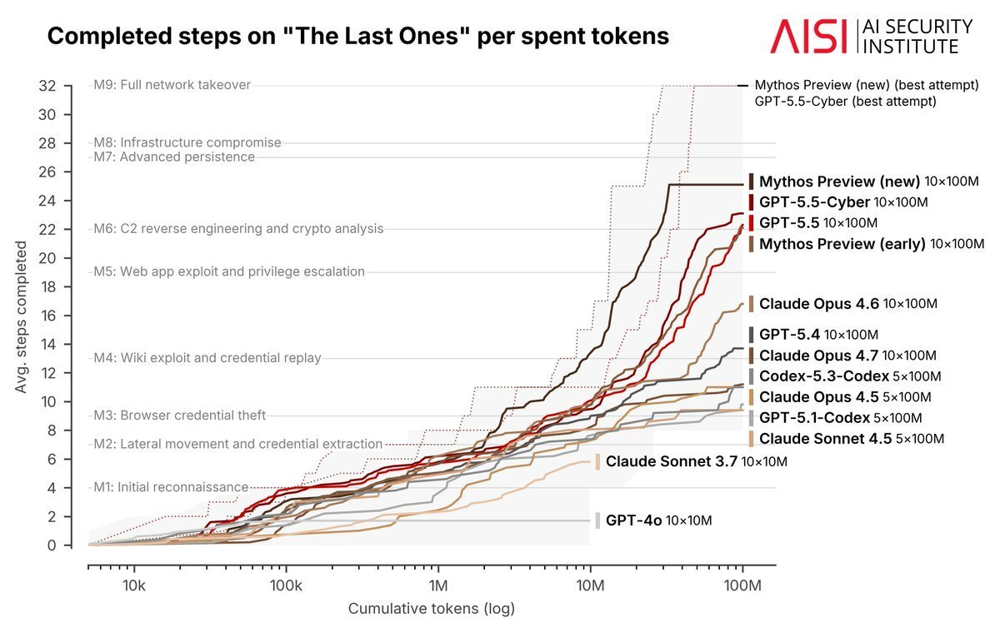
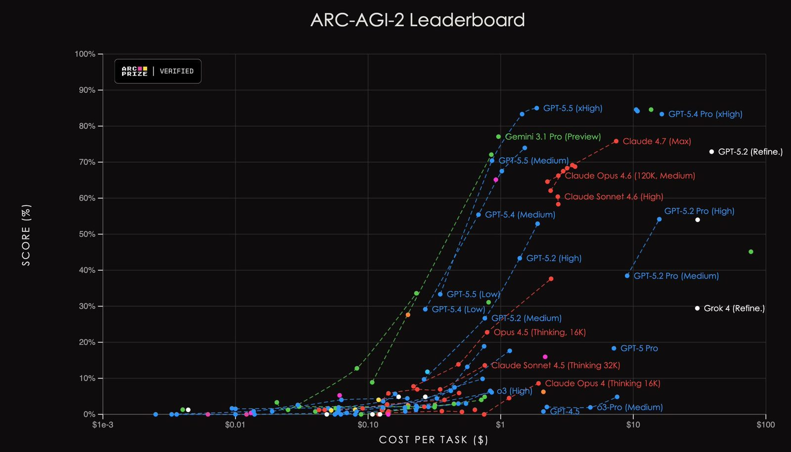
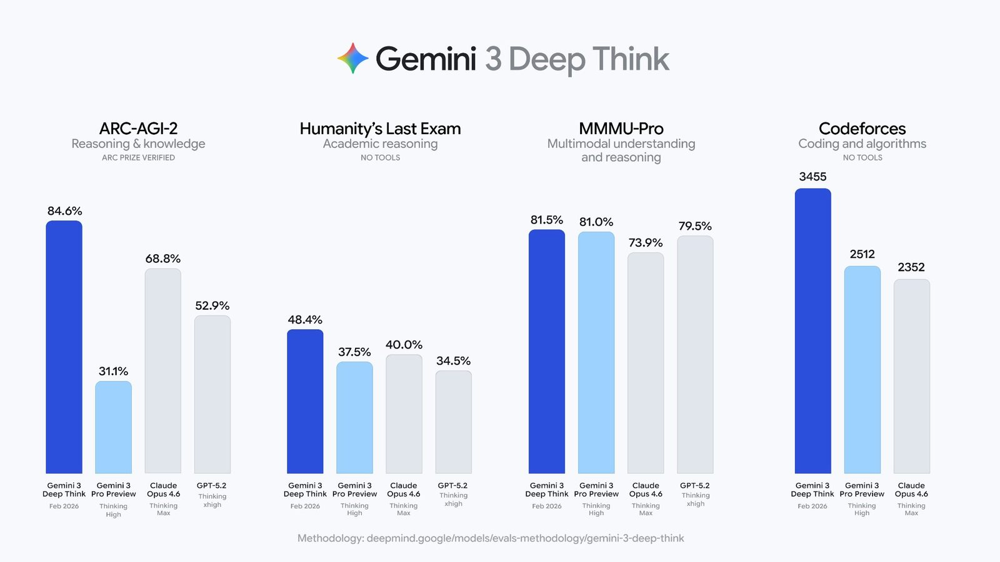
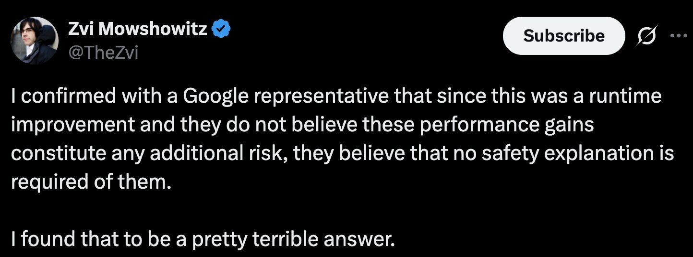
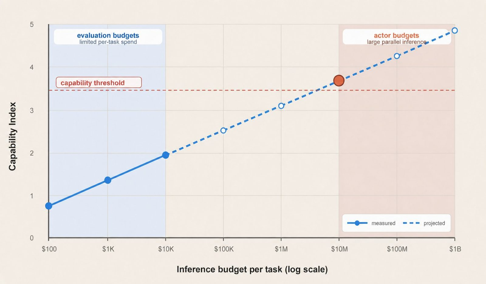

# Implications of Large-Scale Test-Time Compute

**Source**: `raw/noam-brown-implications-of-large-scale-test-time-compute/full-article.html`, `raw/noam-brown-implications-of-large-scale-test-time-compute/full-article.md`  
**Ingested**: 2026-08-23  
**Tags**: #summary

## Summary

In this June 2026 X essay, OpenAI researcher [[Noam Brown]] argues that as large language models grow more capable, benchmark performance becomes primarily a function of [[Test-Time Compute]] rather than fixed model weights. Because capability ceilings for modern frontier reasoning models are empirically pushed far into long horizons and high compute regimes, single-number scalar benchmarks have become misleading. Brown illustrates this dynamic through the initial reception of [[GPT-5.5]]: standard benchmark grids showed only modest incremental gains over [[GPT-5.4]], yet user experience revealed a qualitative step-change because GPT-5.5 achieved comparable or superior accuracy using substantially fewer tokens, lower cost, and lower latency. When evaluations control for inference spend, stronger models demonstrate dramatically steeper capability scaling curves.

Brown demonstrates that performance plateaus are pushed exceptionally far out in practice, citing Andrej Karpathy's autoresearch experiments (which continued finding validation improvements after hundreds of autotuning runs) and the [[AI Security Institute]]'s cyber evaluation on "The Last Ones" (where frontier models like Mythos and GPT-5.5-Cyber continued rapid progress up to 100M cumulative tokens). Consequently, evaluations must transition from scalar metrics to 2D capability curves plotting performance against tokens, dollar spend, or wall-clock latency, or establish explicit, communicated resource budgets (analogous to timed human competitions like the SAT or IMO).

Crucially, Brown extends this insight to frontier safety policy, critiquing current implementations of the [[Preparedness Framework]] and [[Responsible Scaling Policy]]. Evaluating misuse risks (cyber warfare, biological threat design, autonomous replication) without specifying inference spend creates dangerous blind spots: an adversary or well-resourced state actor can allocate upwards of $10 million in parallel inference compute to a single target task, whereas pre-deployment safety evaluations run at modest per-task budgets ($100–$10k). Using the controversy surrounding the release of [[Gemini 3 Deep Think]] as a case study, Brown argues that criticizing Google [[DeepMind]] for releasing Deep Think without a separate model card missed the fundamental issue: Deep Think was likely a scaffold of underlying models whose capabilities were already accessible to anyone willing to spend comparable inference compute. The true oversight was that the original [[Gemini 3]] system card failed to report capability as a function of inference budget.

To reconcile the computational impossibility of running millions of safety rollouts at state-actor scale, Brown proposes an evaluation framework combining empirical measurement at lower budgets with principled extrapolation (incorporating explicit uncertainty bands) to high-budget regimes. However, he warns of an emerging structural dilemma for long-horizon evaluation: as agent operating lifetimes extend to multi-month or annual horizons, verifying alignment over an agent's full operational lifespan may exceed the rapid development cycle of newer model generations.

## Key Claims

- **Scalar Benchmarks Obscure Model Step-Changes**: Single-number benchmark tables fail to capture capability gains in reasoning models; [[GPT-5.5]] appeared incrementally better than [[GPT-5.4]] on scalar grids but showed massive capability advantages when controlling for tokens, dollar cost, or latency.
- **Absence of Near-Term Performance Plateaus**: Modern frontier models do not plateau at small inference budgets; empirical evaluations like Karpathy's autoresearch (276+ experiments) and AISI's "The Last Ones" cyber benchmark show continuous scaling even beyond 100M cumulative tokens.
- **2D Evaluation Curves as the Proper Benchmark Paradigm**: Model capabilities should be reported as curves over test-time compute (tokens, cost, or wall-clock time) or evaluated under explicit, communicated resource budgets.
- **Inference Budget Disparity in Safety Assessments**: Pre-deployment safety evaluations operate under limited compute budgets ($100–$10k per rollout), while dedicated state actors can deploy $10M+ in inference compute on high-stakes attacks; safety thresholds must account for this compute gap via projection curves with stated uncertainty.
- **Deep Think Scaffolding and System Card Omissions**: [[Gemini 3 Deep Think]] represented runtime scaffolding of existing models; the safety gap was not the absence of a Deep Think model card, but rather the absence of test-time compute scaling curves in the base [[Gemini 3]] system card.
- **Evaluation Horizon vs. Model Cycle Dilemma**: Long-horizon agent verification (e.g. testing for 1-year misalignment) threatens to exceed the cadence of model development, creating a structural bottleneck for frontier model releases.
- **Three Concrete Recommendations**:
  1. AI labs must publish benchmark performance curves against tokens, cost, or time (or report inference budgets for scalar numbers).
  2. Benchmark leaderboards should track inference compute or enforce explicit token/cost/time budgets.
  3. Preparedness Frameworks and RSPs must explicitly condition capability thresholds on inference compute and project risks to high-budget regimes with stated uncertainty.

## Figures

| Figure | Caption | Source Context |
|--------|---------|----------------|
|  | Accuracy on Erdös unit distance problem scaling monotonically with log test-time compute | Header cover chart |
|  | Classic "benchmark grid" comparing GPT-5.5, GPT-5.4, GPT-5.5 Pro, GPT-5.4 Pro, Claude Opus 4.7, and Gemini 3.1 Pro across 9 benchmarks | §1: Initial skepticism |
|  | Left: CyberGym scalar comparison showing modest delta. Right: Capture-the-Flags challenges plotted against output tokens showing GPT-5.5's massive efficiency advantage | §1: Controlling for test-time compute |
|  | Andrej Karpathy's autoresearch experiment autotuning nanoGPT across 276+ experiments without plateauing | §2: Pushing the plateau out |
|  | AISI evaluation on "The Last Ones" milestones (M1–M9) per spent tokens up to 100M cumulative tokens | §2: Long-horizon cyber scaling |
|  | ARC-AGI-2 Leaderboard (ARC Prize Verified) showing benchmark accuracy vs cost per task ($1e-3 to $100+) | §3: Cost-budgeted evaluations |
|  | DeepMind's Gemini 3 Deep Think benchmark release graphic (84.6% ARC-AGI-2, 48.4% HLE, 81.5% MMMU-Pro, 3455 Codeforces) | §4: Safety evaluations and Deep Think |
|  | Zvi Mowshowitz (@TheZvi) tweet criticizing Google DeepMind's claim that Deep Think runtime gains required no safety explanation | §4: Safety community reaction |
|  | Proposed safety evaluation framework: Capability Index vs Inference budget per task ($100 to $1B) showing measured vs projected uncertainty curves crossing capability thresholds | §5: Projected safety framework |

> In the article, Figure 1 illustrates that even pure mathematical problems scale continuously with test-time compute:
> 
>
> Figure 2 and Figure 3 highlight how the traditional benchmark grid masks compute efficiency:
> 
> 
>
> Figure 4 and Figure 5 prove that frontier reasoning models and agent scaffolds continue scaling across hundreds of experiments and 100M+ tokens:
> 
> 
>
> Figure 6 demonstrates cost-budgeted evaluation on ARC-AGI-2:
> 
>
> Figures 7 and 8 frame the Gemini 3 Deep Think controversy:
> 
> 
>
> Figure 9 presents Brown's vision for future model system cards:
> 

## Entities

- [[Noam Brown]] — OpenAI researcher and author of the article; pioneer in search, game theory, and test-time compute scaling.
- [[OpenAI]] — author's affiliation; creator of o1, o3, GPT-5.4, GPT-5.5, and GPT-5.6.
- [[Google DeepMind]] — creator of [[Gemini 3]] and [[Gemini 3 Deep Think]], cited in the runtime safety governance discussion.
- [[AI Security Institute]] — UK AISI, creator of "The Last Ones" long-horizon cybersecurity benchmark.
- [[Zvi Mowshowitz]] — AI safety analyst and writer quoted on the governance response to Gemini 3 Deep Think.
- [[Andrej Karpathy]] — AI researcher whose autoresearch experiments demonstrate indefinite empirical scaling of autonomous search.

## Questions & Gaps

- **Extrapolation Reliability Across Modalities**: How reliably do logarithmic or power-law test-time compute scaling curves hold when transitioning from structured search (math/code) to creative, social, or multi-modal domains?
- **Standardizing Multi-Agent Wall-Clock Latency**: Wall-clock time can be decoupled from token count via parallel subagent rollouts (best-of-N, tree search); standardizing a combined metric for latency-critical vs offline settings remains an open benchmark challenge.
- **Resolving the Horizon Bottleneck**: The article identifies that testing 1-year misalignment takes 1 year—outlasting model training cycles—but leaves open what proxy methods could compress multi-year alignment verification into weeks.

## Related

- [[Test-Time Compute]] — foundational concept of allocating inference-time computation for reasoning and search.
- [[Inference-Budget Safety Evaluation]] — framework for projecting model misuse capabilities across low to state-actor compute budgets.
- [[Reasoning Effort]] — user- and system-level mechanisms for controlling test-time token budgets.
- [[GPT-5.5]] — frontier release evaluated in the article's case study.
- [[Gemini 3 Deep Think]] — Google DeepMind's parallel reasoning mode discussed regarding runtime safety evaluation.
- [[Preparedness Framework]] — OpenAI's pre-deployment risk framework, which Brown argues must incorporate test-time compute scaling.
- [[Responsible Scaling Policy]] — industry-wide safety commitment protocols requiring compute-conditioned thresholds.
- [[Evaluation and Benchmarks]] — topic page covering the shift toward compute-aware leaderboards.
- [[Reasoning Models]] — model class defined by test-time search and extended thinking traces.
- [[Safety and Alignment]] — overarching topic encompassing misuse risk thresholds and long-horizon agent safety.
