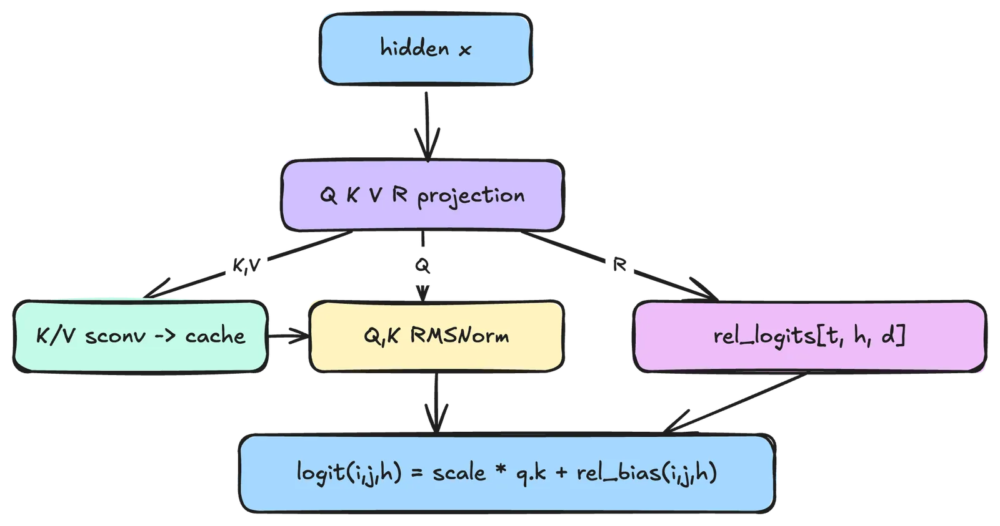
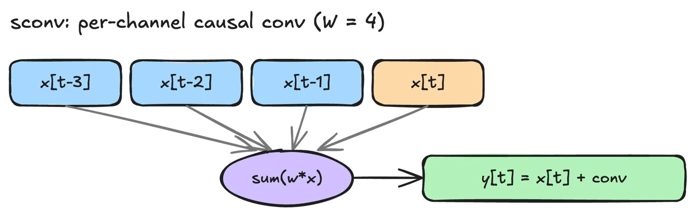
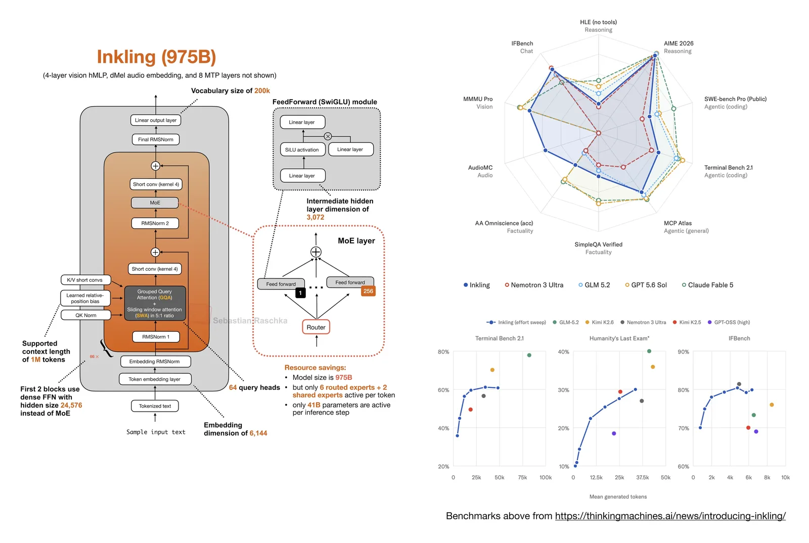
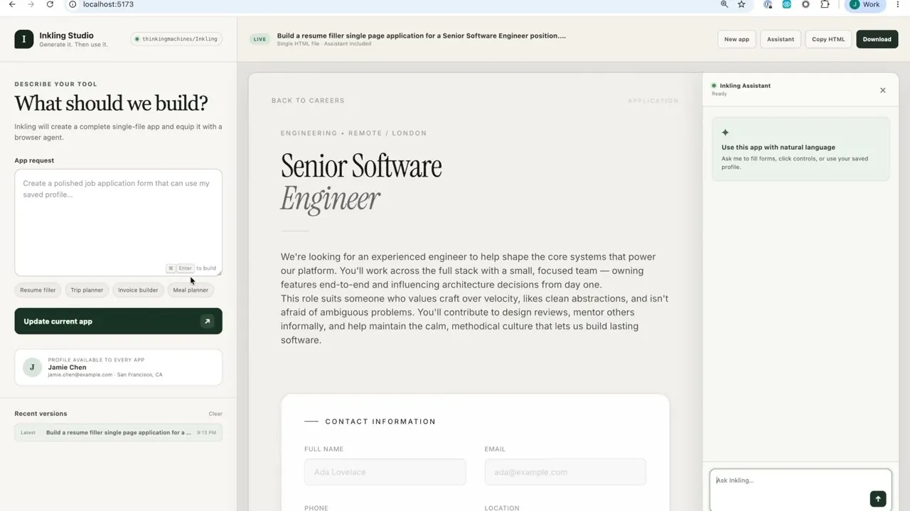
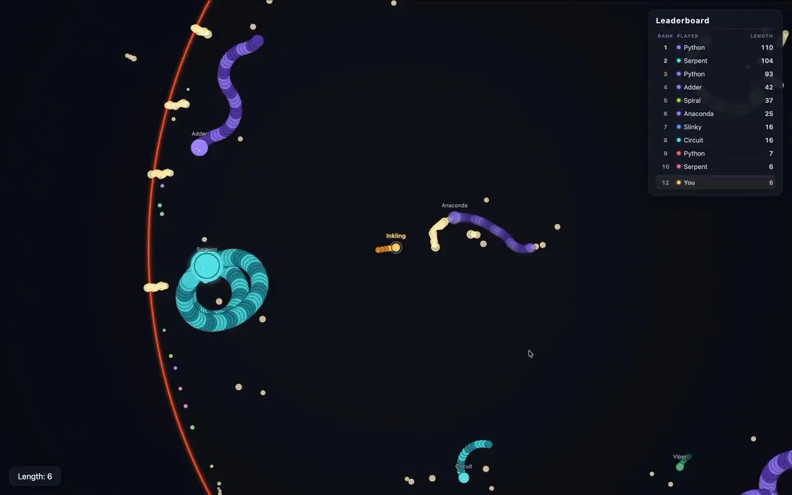
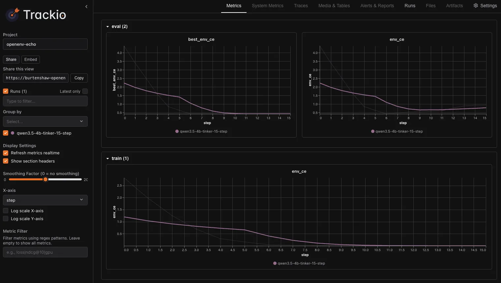

# Inkling

**Source**: `raw/introducing-inkling/full-article.md`, `raw/thinkingmachines-inkling/full-article.md`, `raw/inkling-architecture-benchmark-notes/full-article.md` (markdown siblings in each directory)  
**URLs**: https://thinkingmachines.ai/news/introducing-inkling/ · https://huggingface.co/blog/thinkingmachines-inkling · https://sebastianraschka.com/blog/2026/inkling-architecture-benchmark-notes.html  
**Ingested**: 2026-07-31  
**Tags**: #summary

## Summary

Inkling is [[Thinking Machines Lab]]'s first open-weights foundation model, released July 15, 2026. It is a decoder-only sparse [[Mixture of Experts]] with **975B total / 41B active** parameters, a **1M-token** context window, and native multimodal reasoning over text, images, and audio. The model was pretrained on **45 trillion tokens** spanning text, images, audio, and video, then post-trained across math, agentic coding, multimodal, chat, epistemics, and safety domains.

Thinking Machines positions Inkling not as the strongest overall model available today, but as a **customization-first open base**: broad generalist coverage, [[Controllable Thinking Effort]], encoder-free multimodal inputs, and day-one availability on [[Tinker]] for fine-tuning. Full weights ship on Hugging Face (`thinkingmachines/Inkling`, `thinkingmachines/Inkling-NVFP4`) with ecosystem support in Transformers 5.14+, SGLang, vLLM, and llama.cpp.

The architecture departs from the common DeepSeek-V3-style recipe in several ways documented by the HF blog and [[Sebastian Raschka]]'s third-party notes: **[[Relative Attention]]** instead of RoPE, a **5:1 sliding-window-to-global** attention hybrid (66 layers; 512-token local window), **kernel-4 short convolutions** (SConv) after K/V projections and on attention/MLP branch outputs, an extra **post-embedding RMSNorm**, and a simple encoder-free multimodal stack (40×40 hMLP image patches + discretized dMel audio bins). MoE routing follows DeepSeek-V3: 256 routed experts, top-6 plus 2 always-on shared experts, sigmoid router with auxiliary-loss-free load balancing.

Post-training relied heavily on large-scale asynchronous RL (30M+ rollouts) with effort controlled via system messages and per-token cost shaping. Epistemics training combined rubric + claims graders, forecasting calibration via proper scoring rules, and censorship-resistance evaluation. Safety testing covered CBRN, cyber, loss-of-control, and human-AI threat vectors with external red teams.

## Key Claims

- Inkling is a 975B/41B-active sparse MoE with 1M context, trained from scratch on 45T multimodal tokens on NVIDIA GB300 NVL72 systems.
- Relative positional embeddings outperform RoPE for Inkling's long-context and hybrid-attention design; 55 of 66 layers use 512-token sliding windows.
- MoE: 256 experts, 6 routed + 2 shared active per token; sigmoid router; DeepSeek-V3-style load balancing without auxiliary loss.
- Multimodal inputs are encoder-free: 40×40 hMLP image patchifier, dMel discretized mel spectrogram bins for 100 ms audio chunks; joint token stream with text.
- [[Controllable Thinking Effort]] via `reasoning_effort` (none/minimal/low/medium/high/xhigh/max) trades tokens for performance; Inkling can match Nemotron 3 Ultra on Terminal-Bench 2.1 at roughly one-third the tokens.
- Strong release benchmarks (effort=0.99): IFBench **79.8%**, SimpleQA Verified **43.9%**, VoiceBench **91.4%**, MMAU **77.2%**, FORTRESS adversarial **78.0%**, StrongREJECT **98.6%**.
- Weaker vs some peers: HLE text-only **29.7%** (GLM 5.2: 40.1%), Terminal-Bench 2.1 **63.8%** (GLM 5.2: 82.7%), SWE-Bench Pro public **54.3%** (GLM 5.2: 62.1%).
- Raschka: 4.2% active sparsity (less sparse than Kimi K2.5's 3.2%); regular Transformer decoder, not a Mamba hybrid; mixed benchmark profile suggests less benchmark specialization.
- Deployment: BF16 ~2 TB VRAM; NVFP4 ~600 GB on Blackwell; MTP speculative-decoding layers included; Inference Providers, Together, Fireworks, Modal, Databricks, Baseten APIs.

## Architecture

| Component | Detail |
|-----------|--------|
| Backbone | Decoder-only sparse MoE Transformer, 66 layers |
| Attention | 5:1 SWA (512 window) : global; 8 GQA KV heads; [[Relative Attention]] |
| Convolutions | Kernel-4 SConv after K/V projections and on attn/MLP branch outputs |
| Normalization | Post-embedding RMSNorm + per-block pre-attention RMSNorm |
| MoE | 256 routed + 2 shared experts; top-6 routed active; sigmoid router |
| Vision | 4-layer hMLP on 40×40 pixel patches (video via temporal dimension) |
| Audio | dMel discretized mel bins per 100 ms chunk, embedded and summed |
| Pretraining | Muon for large matrices + Adam elsewhere; modular-manifold-inspired schedules |
| Post-training | SFT bootstrap on synthetic data, then large-scale async RL across domains |

## Capabilities

**Agentic coding and tool use.** Inkling scores competitively on agentic benchmarks and was trained with randomized tool sets/schemas to reduce harness sensitivity. Demos include one-shot web apps, Design Arena agentic web dev (Elo 1257 among open weights), multi-page PDF generation, and long-horizon game refinement loops.

**Multimodality.** Among the strongest open-weights audio models on VoiceBench/MMAU/AudioMC; strong chart/diagram/math visual reasoning with optional Python tool use for zoom/crop.

**Epistemics.** ForecastBench and Prophet Arena calibration; rubric + claims graders with agentic web search for claim verification; censorship-resistance on Cognition's Propaganda and Censorship Eval.

**Safety.** Strongest built-in FORTRESS safeguards among compared open models; >98% StrongREJECT; external testing on dangerous capabilities and human-AI threats.

## Benchmarks (effort=0.99)

| Category | Benchmark | Inkling |
|----------|-----------|---------|
| Reasoning | HLE (text only) | 29.7% |
| Reasoning | HLE (with tools) | 46.0% |
| Reasoning | GPQA Diamond | 87.2% |
| Reasoning | AIME 2026 | 97.1% |
| Agentic coding | SWE-Bench Verified | 77.6% |
| Agentic coding | SWE-Bench Pro (public) | 54.3% |
| Agentic coding | Terminal-Bench 2.1 | 63.8% |
| Agentic general | GDPval-AA v2 | 1238 |
| Agentic general | MCP Atlas | 76.0% |
| Factuality | SimpleQA Verified | 43.9% |
| Chat | IFBench | 79.8% |
| Vision | MMMU Pro (Standard 10) | 73.5% |
| Vision | CharXiv RQ (with python) | 82.0% |
| Audio | VoiceBench | 91.4% |
| Audio | MMAU | 77.2% |
| Safety | FORTRESS (adversarial) | 78.0% |
| Safety | StrongREJECT | 98.6% |

Benchmark rows mix internally run and externally reported scores (Artificial Analysis, Scale AI, etc.); small deltas across providers should not be over-interpreted.

## Figures

| Figure | Caption | Source |
|--------|---------|--------|
|  | Social cover / release announcement | introducing-inkling |
|  | Agentic web-dev demo (job application app + browser-use agent) | introducing-inkling |
|  | Multiplayer snake game from long refinement loop | introducing-inkling |
|  | Relative attention architecture | thinkingmachines-inkling |
|  | Short convolution (SConv) architecture | thinkingmachines-inkling |
|  | Visual reasoning demo | thinkingmachines-inkling |
|  | Post-training metrics (Trackio) | thinkingmachines-inkling |
|  | Architecture diagram and benchmark panels vs GLM-5.2, Kimi K2.5, etc. | Raschka notes |

TML announcement charts (spider plots, effort-sweep curves) are interactive SVG/canvas in the HTML source and were not extracted as static images.

## Entities

- [[Thinking Machines Lab]] — trained and released Inkling; provides Tinker fine-tuning platform.
- [[Tinker]] — fine-tuning, Playground chat, and cookbook for Inkling customization.
- [[Sebastian Raschka]] — third-party architecture and benchmark analysis.
- [[IFBench]] — instruction-following benchmark where Inkling scores 79.8%.
- [[Hugging Face]] — hosts weights, HF blog deployment guide, and Inference Endpoints.

## Questions & Gaps

- Independent apples-to-apples throughput benchmarks are not yet available; Raschka notes GQA (not MLA) and 41B active footprint may limit raw decode speed vs Kimi K2.5.
- Out-of-the-box video performance is expected to improve with fine-tuning but was not evaluated at release.
- How fine-tuning on Tinker affects safety behavior remains an open research area for Thinking Machines.
- Relative-attention and post-embed RMSNorm ablations are not published.
- SWE-Bench Verified and Terminal-Bench numbers use TML-specific harnesses; cross-provider comparison requires caution.

## Related

- [[Inkling-Small]] — efficient 276B/12B-active family member; surpasses Inkling on several reasoning/agentic benchmarks.
- [[On-Policy Distillation]] — used to distill Inkling into Inkling-Small.
- [[Mixture of Experts]] — Inkling's sparse MoE routing design.
- [[Relative Attention]] — learned position bias replacing RoPE.
- [[Controllable Thinking Effort]] — test-time compute knob shared across the family.
- [[A Visual Guide to Attention Variants in Modern LLMs]] — SWA/global hybrids and attention efficiency context.
- [[LoRA Without Regret]] — prior Thinking Machines research on efficient fine-tuning.
- [[Reasoning Models]] · [[Vision Language Models]] · [[Audio Models]] · [[Code Models]] · [[Evaluation and Benchmarks]]
