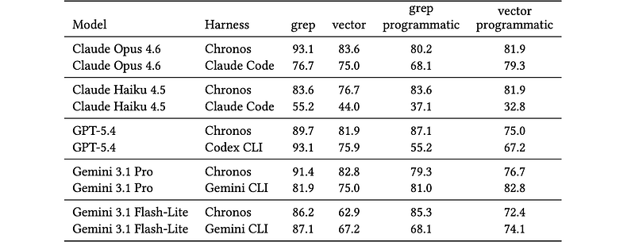
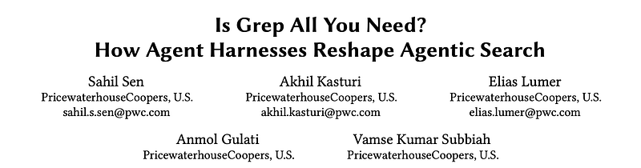
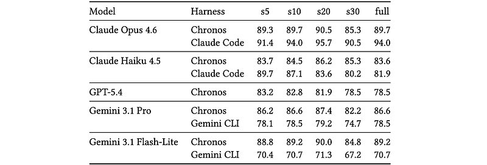
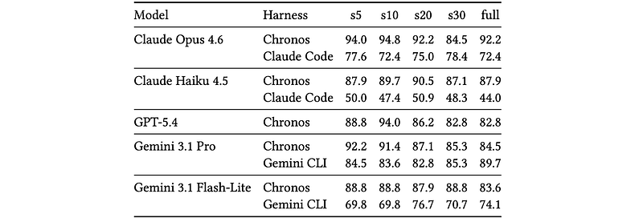

# Papers Explained: Is Grep All You Need

**Source**: `raw/is-grep-all-you-need/full-article.html`  
**Original**: https://medium.com/p/5b10a6e92f77  
**Paper**: https://arxiv.org/abs/2605.15184  
**Ingested**: 2026-05-18  
**Tags**: #summary

## Summary

This source summarizes "Is Grep All You Need? How Agent Harnesses Reshape Agentic Search," an empirical study of [[Agentic Search]] over multi-session memory tasks. The study uses a 116-question subset of [[LongMemEval]] and compares [[Lexical Search]] with [[Dense Retrieval]] across a custom [[Agent Harness]] called Chronos and provider-native CLI harnesses for Claude Code, Codex, and Gemini CLI.

The central result is deliberately uncomfortable for simple "semantic search beats keyword search" stories: inline grep generally outperforms inline vector retrieval, but the size and even direction of the effect depend strongly on the harness and the tool-result delivery format. When search results are written to files and the agent must inspect them programmatically, vector search beats grep in half of the reported harness-model pairs. That means retrieval quality is entangled with context management, tool ergonomics, and the model's ability to refine queries and read returned evidence.

The context-scaling experiment adds another wrinkle. As more distractor sessions are added, grep and vector retrieval do not degrade monotonically or in parallel. Some harness-model combinations prefer grep, some prefer vector retrieval, and some show crossover behavior as the session budget changes. This extends existing wiki themes around [[Dynamic Context]], [[Long Context]], and [[Context Rot]]: adding more searchable history is not enough if the harness cannot shape the retrieval channel into something the model can use reliably.

## Key Claims

- A 116-question [[LongMemEval]] subset was used to evaluate memory retrieval over multi-session conversations with oracle sessions and distractor sessions.
- Inline [[Lexical Search]] outperformed inline [[Dense Retrieval]] across all reported harness-model pairs, with margins ranging from narrow to very large.
- Harness choice can matter as much as retrieval method: Claude Opus 4.6 scored 93.1% under Chronos but 76.7% under Claude Code in the reported inline grep setting.
- File-based, programmatic tool-result delivery changes the ranking: programmatic vector retrieval outperformed programmatic grep in 5 of 10 harness-model pairs.
- Lexical and dense retrieval fail differently: grep is precise but vocabulary-sensitive, while vector retrieval can surface paraphrases but may introduce semantically similar distractors.
- Retrieval robustness under additional context noise is non-monotonic and model/harness-specific, so conclusions about "best" retrieval are conditional on the whole agent stack.

## Figures

| Figure | Caption | Page |
|--------|---------|------|
|  | Title image for the Medium article. | Article header |
|  | Overall accuracy on the 116-question LongMemEval-S subset across retrieval modes, harnesses, and models. | Experiment 1 |
|  | Overall accuracy for grep-only retrieval as the session limit increases. | Experiment 2 |
|  | Overall accuracy for vector-only retrieval as the session limit increases. | Experiment 2 |

## Entities

- [[LongMemEval]] - Benchmark used to test multi-session conversational memory under oracle and distractor sessions.
- [[Agent Harness]] - The experiment shows that harness design materially changes retrieval performance.
- [[Lexical Search]] - Grep-style regex search baseline that often beat vector retrieval in inline settings.
- [[Dense Retrieval]] - Embedding-based retrieval mode that improved under some file-based tool-result settings.
- [[Agentic Search]] - The broader task family where an agent actively uses search tools to answer a question.

## Questions & Gaps

- The writeup says intermediate Codex results were still pending for part of the context-scaling experiment, so vendor-complete scaling conclusions remain provisional.
- The summary does not deeply isolate whether differences come from model capability, CLI/tool implementation, prompt design, tokenization, or logging conventions.
- The LongMemEval subset is only 116 questions, so the findings are best read as a targeted harness study rather than a final ranking of retrieval methods.

## Related

- [[Agent Harness]] - Harness-level differences are one of the source's main explanatory variables.
- [[Dynamic Context]] - Search results act as dynamic context retrieved during the agent episode.
- [[Long Context]] - The context-scaling experiment probes robustness as more distracting sessions are added.
- [[Embedding and Retrieval]] - The page directly compares lexical and vector retrieval.
- [[Evaluation and Benchmarks]] - LongMemEval and GPT-4o judging define the evaluation frame.
- [[Continually Improving Our Agent Harness]] - Prior wiki source arguing that harnesses reshape model behavior and measured quality.
