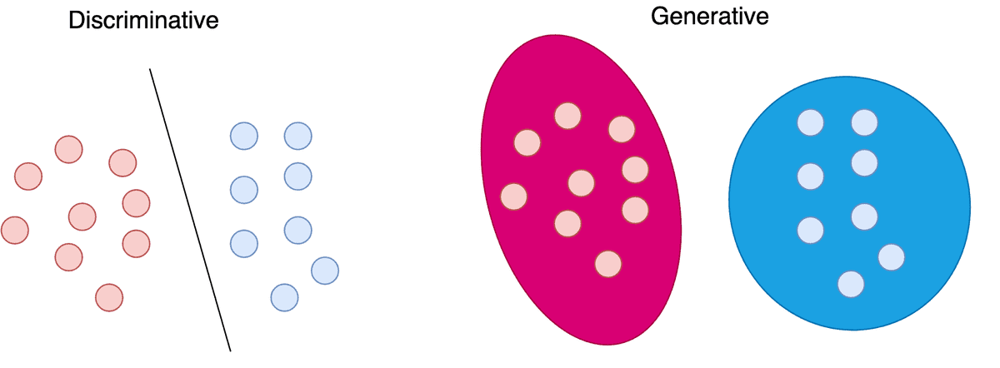
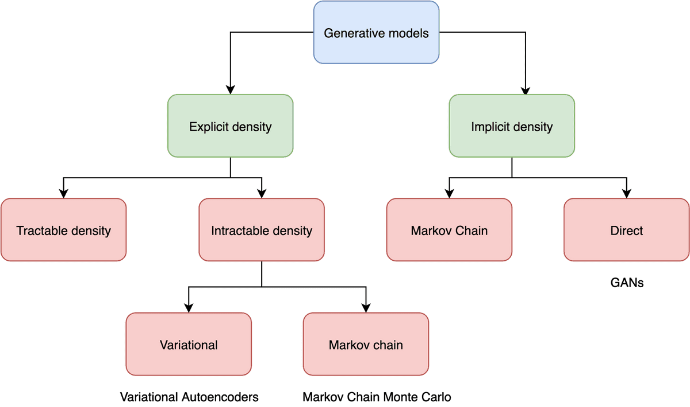
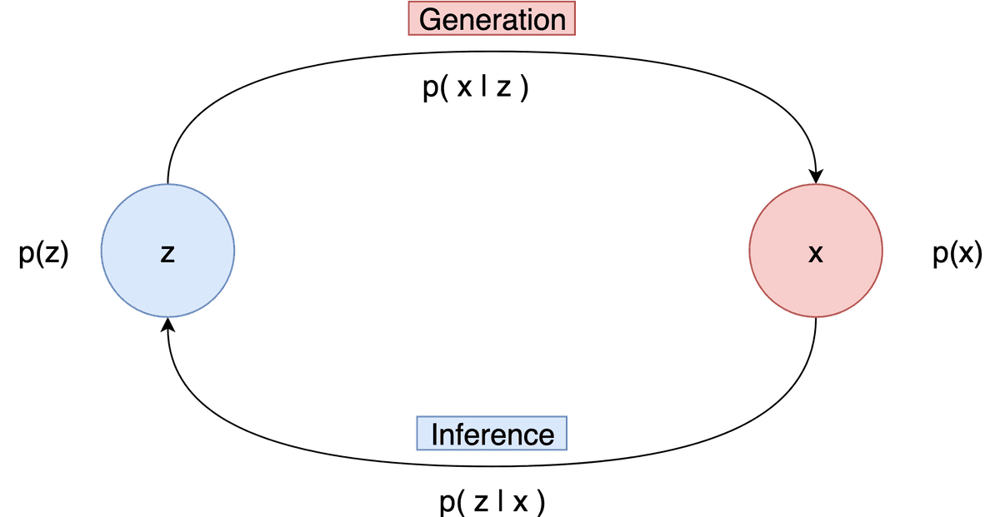
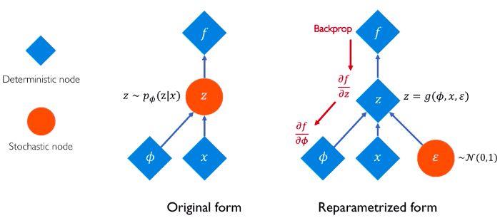
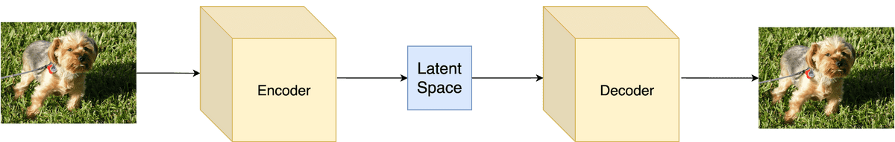

# The Theory behind Latent Variable Models: Formulating a Variational Autoencoder

**Source**: `raw/latent-variable-models/full-article.html` (464 KB), `raw/latent-variable-models/full-article.md` (markdown view)  
**URL**: https://theaisummer.com/latent-variable-models/  
**Author**: Sergios Karagiannakos (AI Summer), 2021-02-04  
**Ingested**: 2026-06-06  
**Tags**: #summary

## Summary

Sergios Karagiannakos provides a full probabilistic derivation of [[Variational Autoencoders]] from first principles. The article opens by contrasting **discriminative** models \(p(y|x)\), **generative** models \(p(x)\), and **conditional generative** models \(p(x|y)\), noting they interconnect via Bayes' rule. Generative models aim to learn a density matching \(p_{data}(x)\); VAEs sit in the **explicit approximate density** branch of a taxonomy that also includes exact density models and **implicit** samplers such as GANs.

**Latent variable models** introduce unobserved variables \(z\) that "explain" data in a lower-dimensional space. Five distributions govern the setup: prior \(p(z)\), likelihood \(p(x|z)\), joint \(p(x,z)=p(x|z)p(z)\), marginal \(p(x)\) (the training objective), and posterior \(p(z|x)\). **Generation** samples \(z \sim p(z)\) then \(x \sim p(x|z)\); **inference** is the inverse. Training uses **maximum likelihood** on \(\log p_\theta(x)\), but the marginal log-likelihood gradient requires the intractable posterior—motivating approximate inference.

**[[Variational Inference]]** replaces the true posterior with a tractable variational distribution \(q_\phi(z|x)\) and maximizes the **ELBO** (Evidence Lower Bound):

\[L_{\theta,\phi}(x) = \mathbb{E}_{q_\phi}[\log \tfrac{p_\theta(x,z)}{q_\phi(z|x)}] \leq \log p_\theta(x)\]

Equivalently, ELBO = \(\log p_\theta(x) - \mathrm{KL}(q_\phi(z|x) \| p_\theta(z|x))\); the KL gap measures approximation quality. **Amortized inference** trains a neural network to output \(\phi\) for any datapoint rather than optimizing per-example variational parameters.

Gradients w.r.t. model parameters \(\theta\) use Monte Carlo samples from \(q_\phi\). Gradients w.r.t. \(\phi\) require the **reparameterization trick** (\(z = \mu + \sigma\epsilon\), \(\epsilon \sim \mathcal{N}(0,1)\)) to backprop through stochastic latents.

The VAE instantiation uses conv encoder/decoder networks on MNIST (TensorFlow/Keras). With a standard normal prior, the ELBO decomposes into **negative reconstruction error** plus **KL to prior**:

\[L = \mathbb{E}_{q_\phi(z|x)}[\log p_\theta(x|z)] - \mathrm{KL}(q_\phi(z|x) \| p(z))\]

The article cites Kingma & Welling (2013), the [[Deep Learning]] textbook, and Lilian Weng's Beta-VAE post, and points readers to the earlier [[How to Generate Images using Autoencoders]] intuitive primer.

## Key Claims

- Discriminative models learn \(p(y|x)\); generative models learn \(p(x)\); conditional generative models learn \(p(x|y)\).
- Generative models split into explicit density (compute/approximate \(p(x)\)) and implicit density (sample without computing \(p(x)\)).
- VAEs are latent-variable models that approximate explicit density via variational inference.
- Latent variables \(z\) compress data; five key distributions: prior, likelihood, joint, marginal, posterior.
- Generation: \(z \sim p(z)\), \(x \sim p(x|z)\); inference: \(x \sim p(x)\), \(z \sim p(z|x)\).
- Maximum-likelihood training requires the posterior \(p(z|x)\), which is usually intractable.
- Variational inference approximates the posterior with \(q_\phi(z|x)\) by maximizing ELBO.
- ELBO = \(\log p_\theta(x) - \mathrm{KL}(q_\phi \| p_\theta(z|x))\); maximizing ELBO tightens the bound and improves the model.
- Amortized VI uses a neural inference network shared across datapoints.
- Reparameterization enables backprop through Gaussian latents: \(z = \mu + \sigma\epsilon\).
- VAE loss = reconstruction term − KL(\(q_\phi(z|x)\) ‖ \(p(z)\)) with standard normal prior.
- Gaussian encoder/decoder assumptions are justified when the prior is \(\mathcal{N}(0,I)\).

## Figures

| Figure | Caption | Page |
|--------|---------|------|
|  | Discriminative vs generative vs conditional generative models and their probabilistic formulations | — |
|  | Generative model taxonomy: explicit vs implicit density; VAEs as approximate explicit / latent-variable models | — |
|  | Latent variable model: generation (prior → likelihood) vs inference (marginal → posterior) | — |
|  | Reparameterization trick for backprop through stochastic latents (MIT 6.S191) | — |
|  | VAE architecture with encoder, reparameterized latent sampling, and decoder | — |

## Entities

- [[AI Summer]] — educational blog publishing this 2021 VAE theory article.
- [[Sergios Karagiannakos]] — author; probabilistic derivation of VAEs from latent-variable foundations.
- [[Variational Autoencoders]] — primary subject; full ELBO formulation and TensorFlow implementation.
- [[Variational Inference]] — approximate posterior inference framework underlying VAEs.
- [[KL Divergence]] — variational gap in ELBO decomposition.
- [[Autoencoders]] — deterministic precursor; linked intuitive primer.
- [[Bayesian Statistics]] — Bayes' rule connects discriminative, generative, and conditional models.
- [[Deep Learning]] — textbook reference (Goodfellow et al.).
- [[Representation Learning]] — latent variables as compressed data explanations.

## Questions & Gaps

- Prose briefly swaps encoder/decoder labels when naming \(q_\phi(z|x)\) vs \(p_\theta(x|z)\); the TensorFlow code follows standard convention (encoder → \(q\), decoder → \(p(x|z)\)).
- Bayes rule in the article is written as \(p(x|y) = \frac{p(y|x)}{p(y)} p(x)\) — missing the correct numerator \(p(y|x)p(x)\) form (likely a typo in source).
- Only Gaussian prior/posterior assumption covered; Beta-VAE and other priors referenced externally (Lilian Weng) but not derived.
- MCMC and tractable models (linear-Gaussian, normalizing flows) mentioned but not developed.
- TensorFlow 2 implementation only; the 2018 companion article is conceptual.

## Related

- [[How to Generate Images using Autoencoders]] — earlier intuitive VAE primer on MNIST.
- [[ELBO]] — evidence lower bound derived and used as the VAE training objective.
- [[Latent Variable Models]] — concept page for the probabilistic framework.
- [[Papers Explained Review 11 - Auto Encoders]] — wiki survey of autoencoder variants.
- [[Latent Diffusion Models]] — modern generative models that also operate in latent space.
- [[How Diffusion Models Work: The Math from Scratch]] — diffusion training also framed via ELBO, paralleling VAE variational inference.
