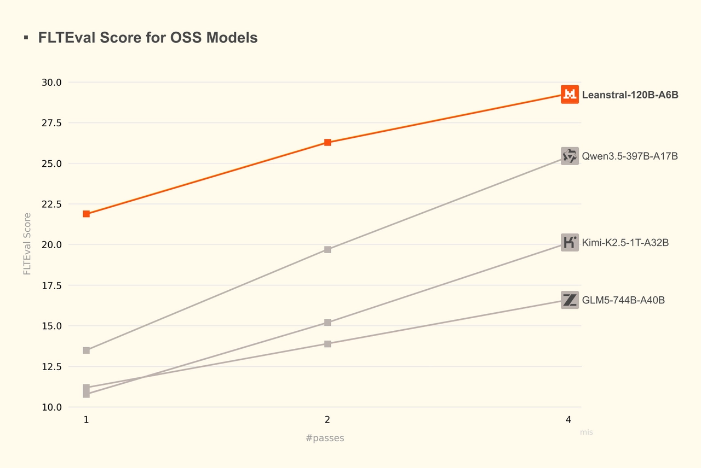

# Leanstral: Open-Source foundation for trustworthy vibe-coding

**Source**: `raw/leanstral/full-article.html` (234 KB), `raw/leanstral/full-article.md` (markdown view)  
**URL**: https://mistral.ai/news/leanstral/  
**Ingested**: 2026-06-06  
**Tags**: #summary

## Summary

Mistral AI releases **Leanstral**, the first open-source code agent built for **Lean 4** formal proof engineering. The model targets a bottleneck in high-stakes coding: human review of machine-generated logic. Leanstral is designed to both implement code and **formally prove** implementations against specifications, using Lean as a perfect verifier with parallel inference.

**Leanstral-120B-A6B** uses a sparse architecture with **6B active parameters** (120B total). Weights are **Apache 2.0**; access via Mistral Vibe (`/leanstall`, `vibe --agent lean`), and a free/near-free API endpoint **`labs-leanstral-2603`**. A tech report and new **FLTEval** benchmark suite (beyond competition math) are promised.

On **FLTEval** (completing formal proofs and defining concepts across FLT project PRs), Leanstral pass@2 scores **26.3** at **$36** cost—beating Claude Sonnet (23.7, $549) and scaling to **31.9** at pass@16 ($290) vs. Sonnet's 23.7. Claude Opus 4.6 leads on quality (39.6) but costs **$1,650** (92× Leanstral pass@2). Among OSS peers, Leanstral outperforms GLM5, Kimi-K2.5, and Qwen3.5 at lower pass counts and cost. MCP support includes **lean-lsp-mcp** optimization.

Case studies cover Lean 4.29 migration debugging (def vs. abbrev for rw tactics) and Rocq→Lean translation with custom notation and proof generation.

## Key Claims

- First open-source Lean 4 code agent; sparse 120B-A6B (6B active); Apache 2.0 weights.
- FLTEval benchmarks realistic proof-engineering PRs, not isolated competition problems.
- pass@2: 26.3 FLTEval at $36—beats Sonnet (23.7, $549); pass@16: 31.9 at $290.
- Outperforms larger OSS models (GLM5 744B-A40B, Kimi-K2.5 1T-A32B, Qwen3.5 397B-A17B) on cost-normalized FLTEval.
- Integrated into Mistral Vibe; MCP-upgradable (lean-lsp-mcp); free API endpoint for feedback period.
- Case studies: Stack Exchange Lean migration fix; Software Foundations Imp language Rocq→Lean translation with proofs.

## Figures

| Figure | Caption | Page |
|--------|---------|------|
|  | Normalized model cost vs. FLTEval score (Leanstral vs. OSS models) | — |

## Entities

- [[Agentic AI]] — formal-proof coding agent in Mistral Vibe with MCP tooling.
- [[Reasoning Models]] — multi-step formal reasoning and proof generation in Lean 4.
- [[Large Language Models]] — sparse 120B-A6B open model for proof engineering.
- [[Model Compression and Efficiency]] — 6B active parameters vs. trillion-parameter OSS competitors.

## Questions & Gaps

- Tech report and FLTEval suite not yet released at blog publish time; benchmark methodology details pending.
- Claude comparison table uses Mistral Vibe scaffold without model-specific tuning—fairness caveats noted but not fully specified.
- Training data mix (Lean repos, Mathlib coverage) not described in the blog.

## Related

- [[devstral-2-vibe-cli]] — Mistral Vibe CLI platform Leanstral integrates with.
- [[mistral-small-4]] — broader Mistral agentic coding model family.
- [[Reasoning Models]] — formal verification and multi-step logical reasoning.
- [[Agentic AI]] — MCP-enabled coding agents and proof assistants.
