# Understanding the 4 Main Approaches to LLM Evaluation (From Scratch)

**Source**: `raw/llm-evaluation-4-approaches/full-article.html` (452 KB), `raw/llm-evaluation-4-approaches/full-article.md` (markdown view)  
**URL**: https://magazine.sebastianraschka.com/p/llm-evaluation-4-approaches  
**Ingested**: 2026-06-07  
**Tags**: #summary

## Summary

Sebastian Raschka's October 2025 *Ahead of AI* article maps the four dominant ways practitioners evaluate LLMs—multiple-choice benchmarks, verifiers, preference leaderboards, and [[LLM-as-a-Judge]]—with from-scratch Python code for each. The piece was originally planned for his *Build a Reasoning Model (From Scratch)* book but published separately because the book focuses on verifier-based evaluation. Raschka groups the four methods into **benchmark-based** (multiple choice, verifiers) and **judgment-based** (leaderboards, LLM judges), noting that training metrics like loss, perplexity, and reward are usually internal development signals rather than public evaluation.

**Method 1 — multiple choice:** Using [[MMLU]] as the canonical example, Raschka loads Qwen3 0.6B from his `reasoning_from_scratch` library, formats a four-option prompt ending in `Answer: `, generates a few tokens, and extracts the first A/B/C/D letter. Accuracy is the headline metric (57 subjects, ~16K questions). He notes log-probability scoring variants and that multiple choice measures knowledge recall, not free-form reasoning or real-world utility—a high score is not sufficient for practical strength, but a low score can flag knowledge gaps.

**Method 2 — verifiers:** Models produce free-form answers; a verifier extracts the final boxed answer and compares it to ground truth, optionally using code interpreters or calculators. This enables programmatic problem generation and step-by-step reasoning evaluation but is limited to verifiable domains (math, code). Raschka defers the full 35-page implementation to his reasoning-model book and GitHub.

**Method 3 — leaderboards:** [[LM Arena]] (formerly Chatbot Arena) collects pairwise human preferences and aggregates them into rankings. Raschka implements a minimal Elo rating system from example vote tuples, explaining expected-score updates and order sensitivity. LM Arena has moved to Bradley–Terry modeling for joint estimation and confidence intervals, though "Elo" remains colloquial. Leaderboards capture style and helpfulness but not correctness, are expensive, and can be gamed.

**Method 4 — LLM judges:** A strong judge model scores candidate answers against a reference using a rubric (1–5 scale). Raschka implements this via the Ollama API with `gpt-oss:20b`, demonstrating deterministic grading on a logic premise example and pointing to MATH-500 batch evaluation on GitHub. Judges scale better than human arenas but depend on judge capability, rubric design, and can inherit preference biases. Process reward models (PRMs) are noted as step-level judges used mainly in RL training.

The conclusion stresses that no single method is best: combine multiple signal types and, critically, tailor evaluation to your domain with proprietary data. A radar chart visualizes complementary strengths across the four axes.

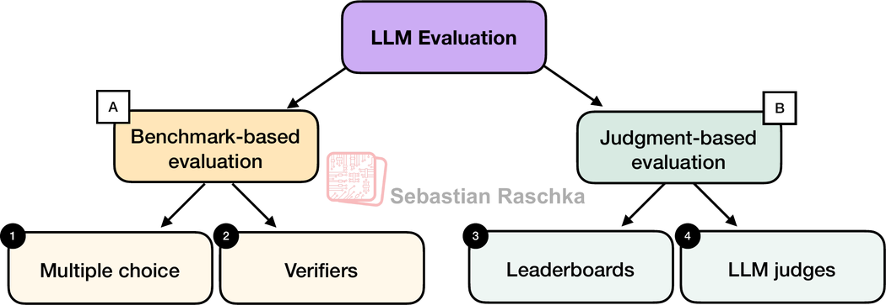

## Key Claims

- Four common public LLM evaluation approaches: multiple choice, verifiers, leaderboards, and LLM judges; papers and model cards often report two or more.
- Benchmark-based methods (multiple choice, verifiers) yield fixed accuracy metrics; judgment-based methods (leaderboards, LLM judges) capture preferences and holistic quality.
- MMLU measures knowledge recall via predefined answer letters; log-probability scoring is a widely used alternative not covered in the simplified letter-matching demo.
- Multiple-choice benchmarks do not evaluate free-form writing or reasoning quality beyond knowledge retention.
- Verifier-based evaluation allows free-form answers in domains with deterministic ground truth (math, code) and supports programmatic dataset generation.
- Elo ratings from pairwise votes update incrementally; presentation order can affect final scores—shuffle-and-average mitigates this.
- LM Arena transitioned from Elo to Bradley–Terry for statistically grounded joint ranking with confidence intervals.
- LLM-as-a-judge works because evaluating an answer is often easier than generating one; results depend heavily on judge model and rubric.
- Process reward models are step-level judges used primarily in RL training, not pure evaluation; DeepSeek R1 used verifiers instead of PRMs.
- Best practice: combine multiple evaluation types and use domain-specific (ideally proprietary) test data aligned to deployment goals.

## Figures

| Figure | Caption | Page |
|--------|---------|------|
|  | Overview of the four evaluation methods and benchmark vs judgment grouping | — |
|  | MMLU multiple-choice evaluation: compare predicted letter to correct answer | — |
| 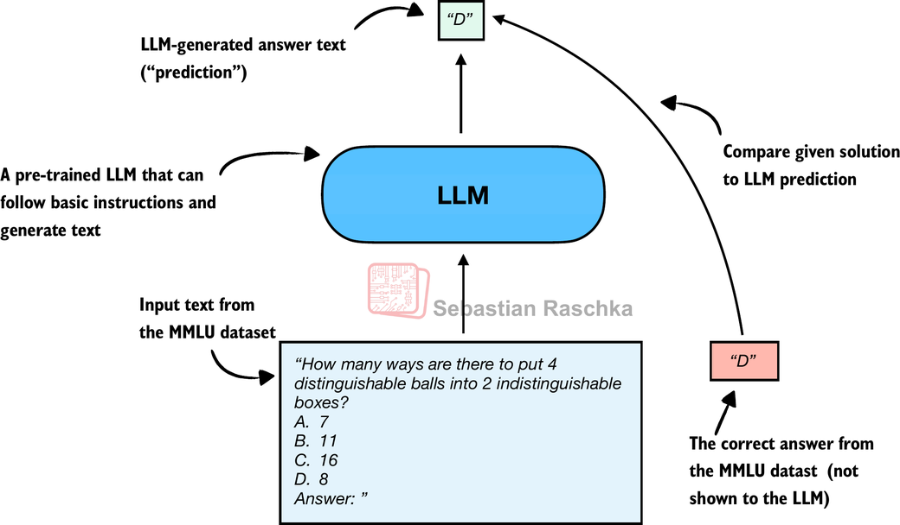 | MMLU letter-matching evaluation (Figure 3 repeat for code walkthrough) | — |
| 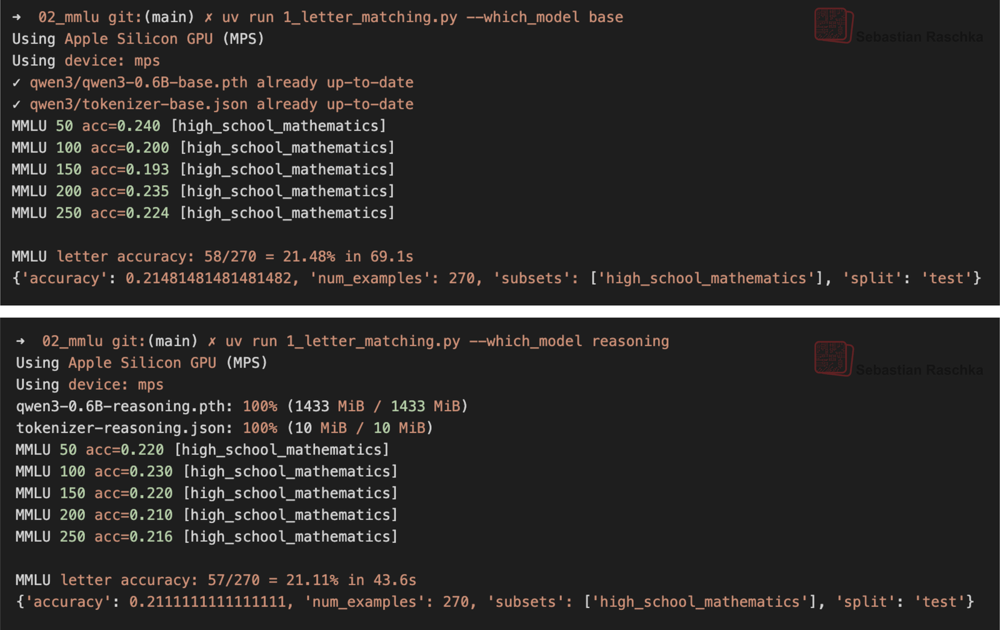 | Base vs reasoning Qwen3 0.6B on MMLU high_school_mathematics subset | — |
| 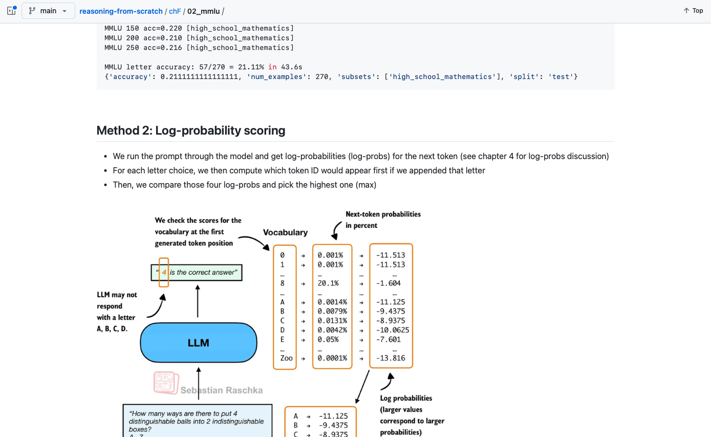 | Alternative MMLU scoring methods (log-probability variants on GitHub) | — |
| 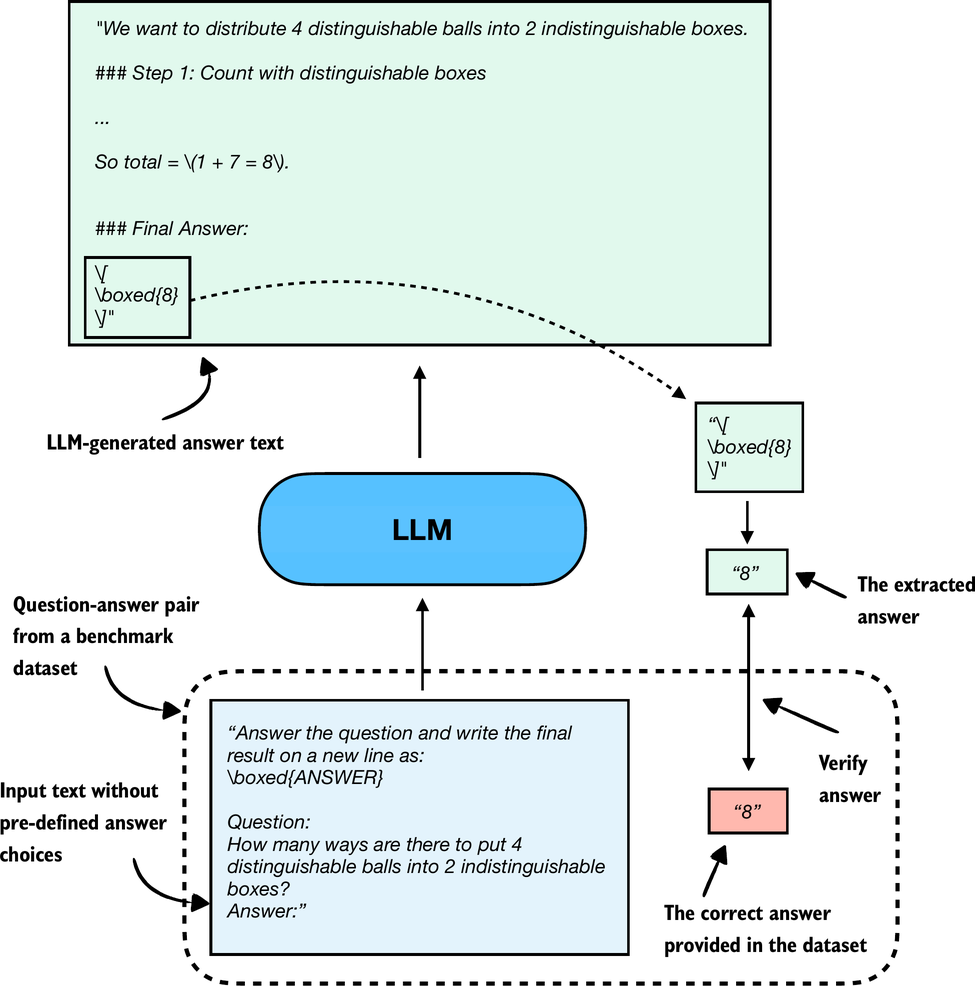 | Verifier-based free-form evaluation: extract boxed answer and compare to ground truth | — |
| 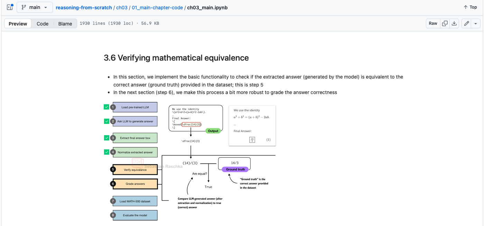 | Excerpt from verification-based evaluation chapter (GitHub) | — |
| 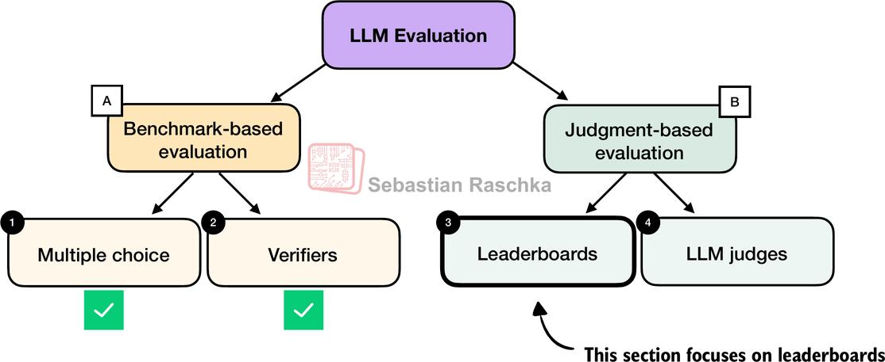 | Mental model: benchmark-based vs judgment-based evaluation methods | — |
| 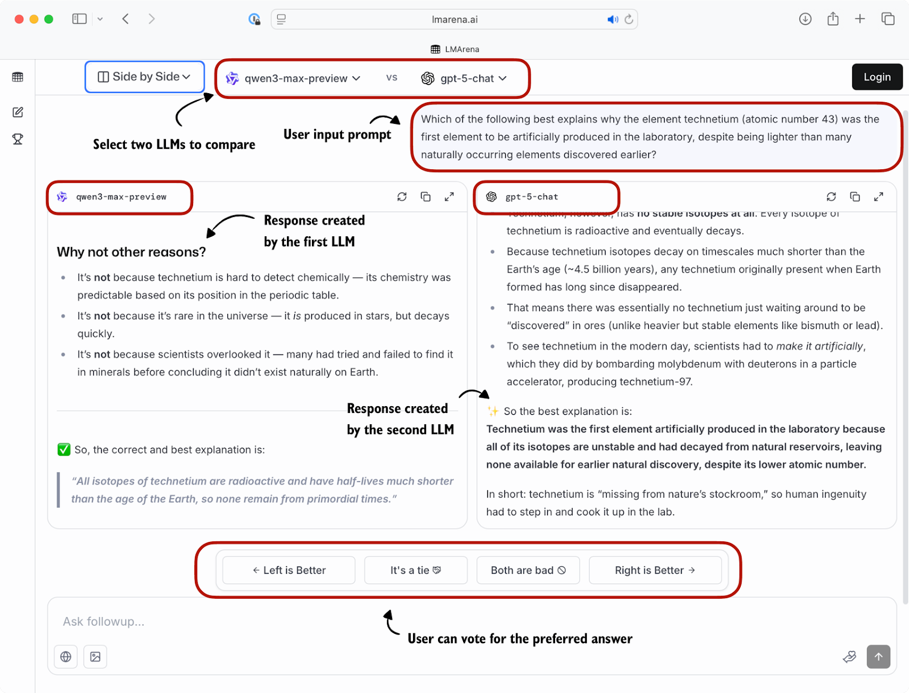 | LM Arena pairwise preference interface | — |
| 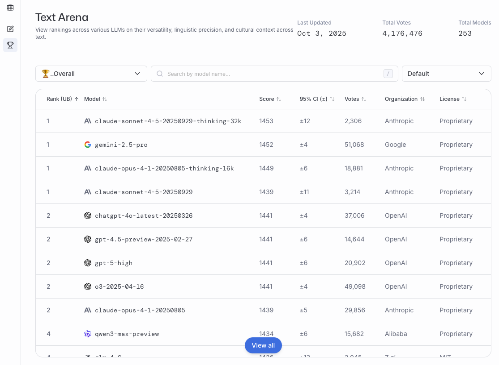 | LM Arena leaderboard snapshot (October 2025) | — |
| 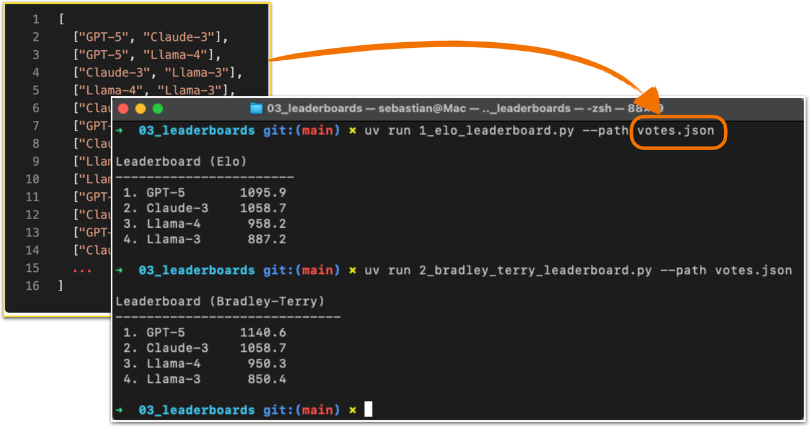 | Elo vs Bradley–Terry ranking comparison | — |
| 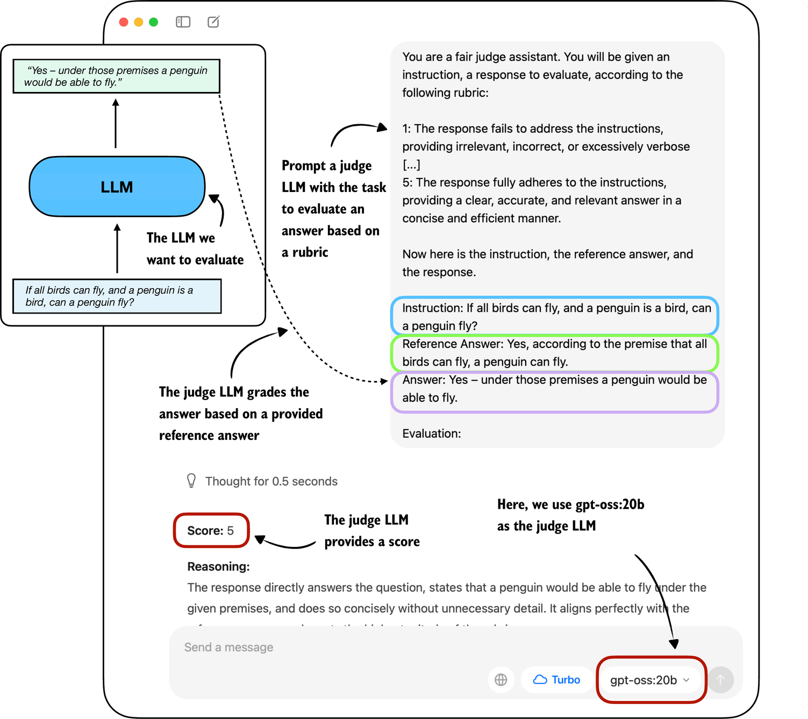 | LLM-as-a-judge: candidate answer scored by judge LLM against rubric and reference | — |
| 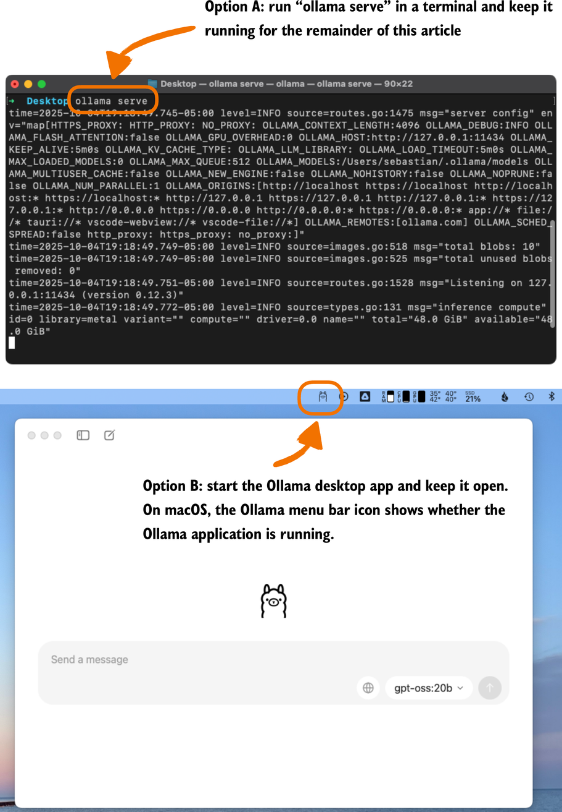 | Options for keeping Ollama server running for API access | — |
| 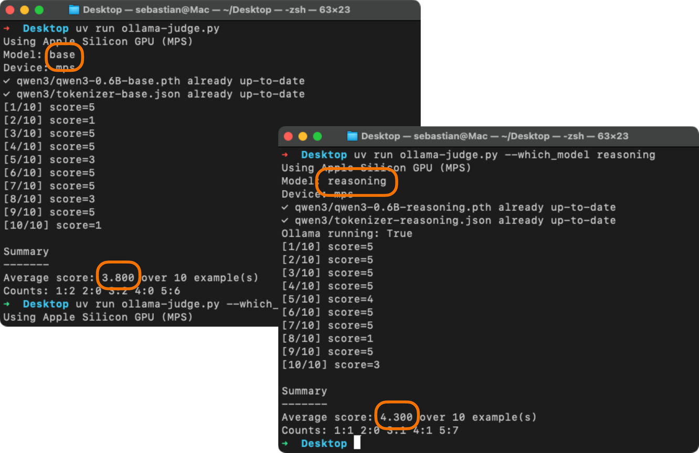 | Qwen3 base vs reasoning on MATH-500 first 10 examples, judged by gpt-oss:20b | — |
| 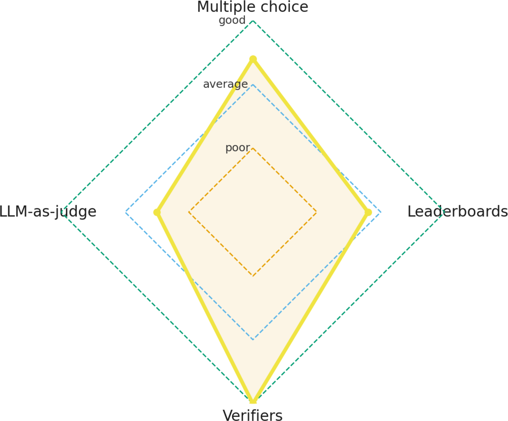 | Radar chart of complementary LLM evaluation dimensions | — |

The four-method taxonomy:

MMLU letter-matching flow:

LLM-as-a-judge pipeline:

## Entities

- [[Sebastian Raschka]] — author; pedagogical from-scratch evaluator and *Build a Reasoning Model* book author.
- [[MMLU]] — canonical multiple-choice benchmark (57 subjects, ~16K questions); demo uses high_school_mathematics subset.
- [[LM Arena]] — human pairwise preference leaderboard (formerly Chatbot Arena); now uses Bradley–Terry ranking.
- [[LLM-as-a-Judge]] — rubric-based automated grading using a separate strong LLM; demo uses Ollama gpt-oss:20b.
- [[Evaluation and Benchmarks]] — topic area this article provides a practitioner mental map for.
- [[Reasoning Models]] — verifier-based evaluation is central to reasoning-model development per Raschka's book.

## Questions & Gaps

- Deep research and agentic search tasks may need evaluation layers beyond these four (raised in article comments).
- MMLU demo uses a tiny Qwen3 0.6B model scoring below random on one subset—illustrative, not representative of frontier models.
- BLEU and other n-gram metrics are mentioned only in passing as historically superseded.
- PRMs and specialized judge models (e.g., Phudge) are noted but not implemented in the article.

## Related

- [[Evaluation and Benchmarks]] — corpus topic page; this article is a practitioner-oriented taxonomy.
- [[Papers Explained 170 - Prometheus]] — open-source rubric-based judge LLM; complements Method 4.
- [[Papers Explained 226 - RewardBench]] — reward-model benchmark spanning chat, reasoning, and safety.
- [[Papers Explained 368 - ThinkPRM]] — process reward model for step-level reasoning evaluation.
- [[Papers Explained 553 - Rubrics as Rewards]] — rubric-based LLM judges used as RL reward signals.
- [[Continually Improving Our Agent Harness]] — product-side harness evals (CursorBench, Keep Rate) complement public benchmarks.
- [[Components of A Coding Agent]] — another Raschka Ahead of AI reference architecture piece.
